# TestAgent

> **面向企业测试方案生产的可控智能生成系统**  
> 让需求文档、Word 模板、项目资料与组织规则进入同一条可审阅的工作流，协助测试工程师生成、确认、审查并交付测试方案。

<p align="center">
  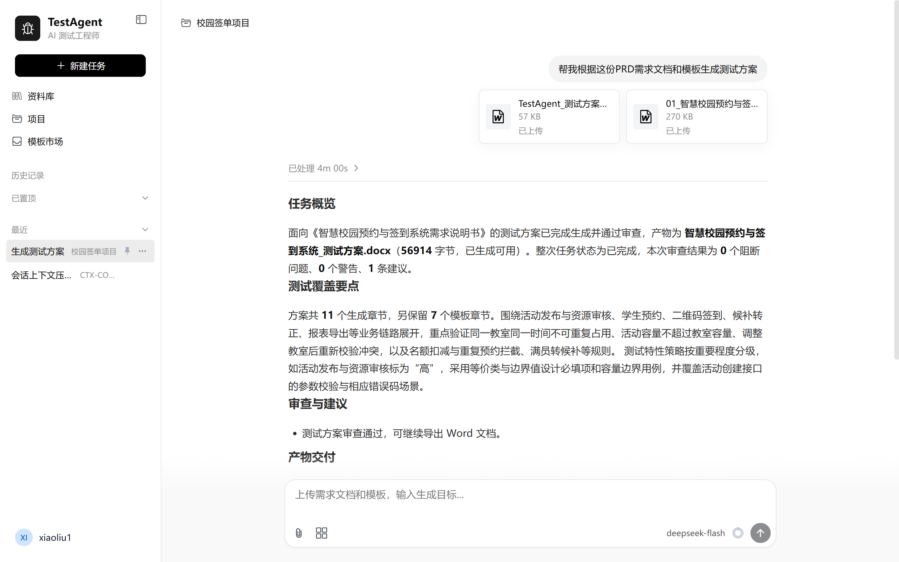
</p>

<p align="center">
  <a href="#当前版本"><strong>当前版本</strong></a> ·
  <a href="#为什么是-testagent"><strong>为什么是 TestAgent</strong></a> ·
  <a href="#产品工作台"><strong>产品工作台</strong></a> ·
  <a href="#测试方案生成"><strong>测试方案生成</strong></a> ·
  <a href="#快速开始"><strong>快速开始</strong></a> ·
  <a href="#许可证"><strong>许可证</strong></a>
</p>

---

## 当前版本

**TestAgent v1.0.0 已完成并验证的端到端核心能力是「测试方案生成」**。用户可以将需求文档和 Word 测试方案模板交给系统，在项目资料、可选组织知识和人工确认的支持下，得到可审查、可下载的 Word 测试方案。

测试用例生成、缺陷分析报告等更多测试资产方向仍在持续开发中。界面中可能展示相关入口或规划，但它们**不属于 v1.0.0 已承诺交付的端到端能力**；当前 README 聚焦已经可用的测试方案工作流与支撑它的产品能力。

| 已可用 | 仍在持续演进 |
| --- | --- |
| 测试方案生成、审查与 Word 导出 | 测试用例、缺陷分析等更多测试资产的端到端工作流 |
| 需求/模板解析、章节处理确认、人机补充 | 更系统的质量评测、Benchmark 与实验工具链 |
| 资料库、项目资料、模板市场、可选公司知识库连接 | 模板保真、局部修复、上下文协同与可观测性的持续提升 |

## 为什么是 TestAgent

企业测试方案不是“输入一句提示词，得到一篇文章”这么简单。它是一份需要能够执行、评审和归档的工程文档：既要覆盖需求，还必须符合企业已有的章节结构、表格、术语、测试流程和交付习惯。

更重要的是，企业往往已经拥有不能由模型随意创造的**事实性约束**。例如，硬件测试可能只能使用指定型号的设备、固定的实验室环境和既定的接口；某些项目必须沿用已批准的准入准出标准、缺陷流转规则或安全验证口径。若这些信息没有在需求中给出，通用模型很容易生成一个“看起来合理”、实际却不存在的设备、指标或流程。这样的内容不仅没有帮助，反而会进入正式文档并增加审查风险。

TestAgent 的设计重点因此不是追求一次性生成更多文字，而是让生成过程具备边界：

| 企业测试方案中的真实问题 | TestAgent 的处理方式 | 对测试工程师的价值 |
| --- | --- | --- |
| 同一类方案需要遵循既有 Word 章节、表格和固定原文 | 解析需求与模板；由用户确认章节处理策略 | 不把模板只当作提示词附件，减少对固定内容的误改风险 |
| 设备、环境、阈值、流程等信息不能凭空编造 | 检索项目资料和可选组织规则；证据不足时标记缺口 | 缺什么先问什么，避免把猜测写成既定事实 |
| 不同部门、产品线使用不同模板 | 通过模板市场上传、保存、搜索和复用模板 | 常用模板可复用，不必在每次任务中重复上传 |
| 项目历史资料分散，新的小任务仍要继承已有约束 | 将资料归入项目，在项目对话中使用项目上下文 | 让任务看到属于本项目的背景，而不是孤立生成 |
| 关键判断不能完全交给 AI | 在需求缺口和章节范围等节点暂停，收集用户补充与选择 | 人机协同地完成决策，用户始终掌握最终边界 |
| 交付物需要进入评审和归档 | 生成结构化内容，审查后回填并导出 Word | 输出面向工程交付，而不是停留在聊天文本 |

换句话说，TestAgent 不试图替代测试工程师的判断；它把需求理解、证据检索、确认决策、章节生成和文档交付组织成一条可见、可追溯的路径，让工程师把精力放在真正需要专业判断的地方。

## 产品工作台

测试方案生成依赖的不只是一次会话。TestAgent 将模板、资料、项目和生成任务组织在同一个工作台中，为不同团队建立可复用的测试资产基础。

### 模板市场：将部门模板变成可复用资产

不同部门、项目类型和交付场景常常需要不同模板：有的偏接口与功能验证，有的保留特定硬件环境章节，有的包含固定的审批、风险或发布要求。每次新任务都上传同一份模板，既低效也容易使用错版本。

模板市场支持浏览、搜索和筛选测试模板，保存常用模板，维护“我的模板”，并上传或下载个人模板。选定模板后可直接带入新的会话使用，让团队将稳定的文档结构沉淀为可复用资产。

<p align="center">
  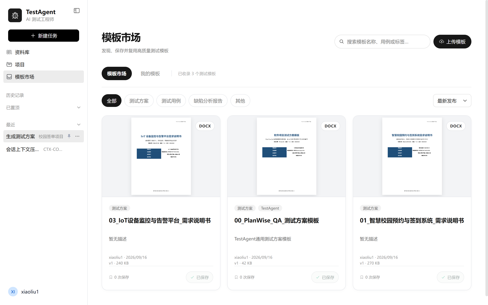
</p>

### 资料库：统一管理文档与生成资产

资料库用于存放需求说明、测试模板和已经生成的测试方案等文件。它支持上传、搜索、按类型筛选、列表/网格视图、文档预览、下载、重命名与最近删除恢复；用户也可以直接围绕某个文件发起对话。

这使输入材料与生成结果不再散落在不同会话和本地目录中：需求文档可作为后续任务的资料来源，生成的方案也可被统一查看和归档。

<p align="center">
  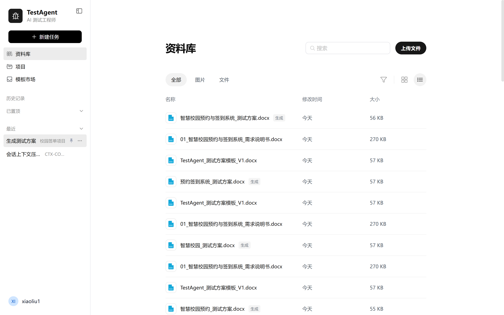
</p>

### 项目：为项目资料和测试资产建立边界

一次测试任务并不总是一个从零开始的项目。测试工程师经常需要参考已有的发布手册、设计说明、验收计划、风险台账或上一轮测试产物。TestAgent 的项目功能提供了项目边界：项目内可以管理对话、项目资料和测试资产，使同一个项目中的任务可以拥有持续而独立的背景信息。

<p align="center">
  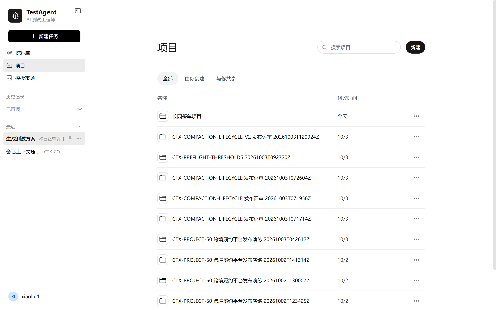
</p>

在项目详情中，用户既可以上传新的项目资料，也可以关联资料库中的已有文件；项目对话共享这些资料与项目设置。完成的测试方案等资产也会归入项目，便于在后续任务中继续查阅和利用。

<p align="center">
  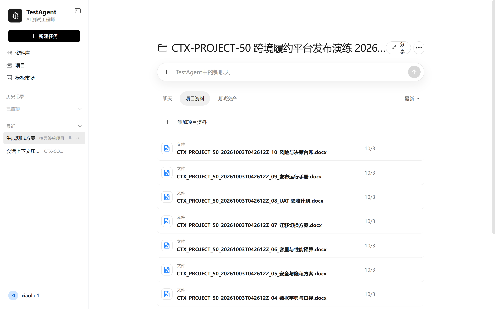
</p>

> 当前版本尚未开放项目协作分享。README 仅描述已经实现的个人项目空间、项目资料与测试资产管理能力。

### 项目资料与组织知识：两类上下文，各司其职

TestAgent 区分项目级资料与组织级知识，避免把两者混为一谈：

- **项目资料**：属于当前项目，例如需求、设计、发布说明、风险台账和既有测试资产。系统在关联项目的会话中检索相关内容，为当前任务补充项目背景。
- **组织知识库（可选）**：用于查询企业的测试规范、流程、写作习惯、固定测试设备或环境约束等组织级规则。它由部署者在设置中配置，不随本仓库提供任何地址、密钥或企业资料。
- **会话与任务上下文**：承载当前用户目标、已确认的补充和已生成的中间结果，使后续步骤知道哪些内容已经明确、哪些仍待确认。

这样的分层让“本项目历史资料”和“公司普遍规则”能够被分别检索和使用；若当前会话未关联项目，项目资料检索会被跳过，而不是错误地从其他项目取材。

## 测试方案生成

### 从需求与模板开始，而不是从空白提示词开始

生成测试方案时，用户提供的需求文档回答“系统要做什么”，Word 模板回答“最终文档应如何组织”。TestAgent 将两者分别解析：需求中的功能、接口、异常场景和非功能目标会成为测试依据；模板中的章节、表格和固定内容则成为交付结构。

例如，一个预约签到系统的需求可以描述“预约、签到、候补转正和报表导出”；而模板可能要求保留组织既定的测试环境、缺陷管理和准入准出章节。单纯让模型“按模板写方案”并不能可靠区分哪些内容可以生成、哪些必须保留。TestAgent 会先让这些输入进入可见的准备步骤，再由用户确认生成范围，避免把所有内容都交给模型自由改写。

<p align="center">
  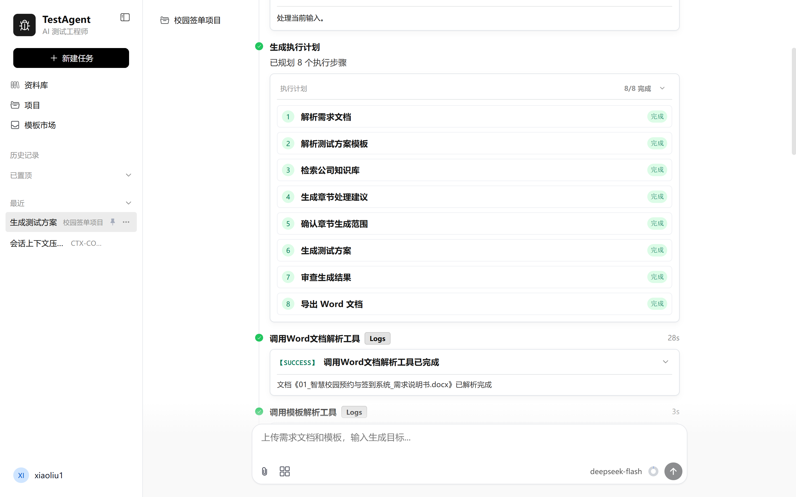
</p>

### 一条可观察、可干预的生成工作流

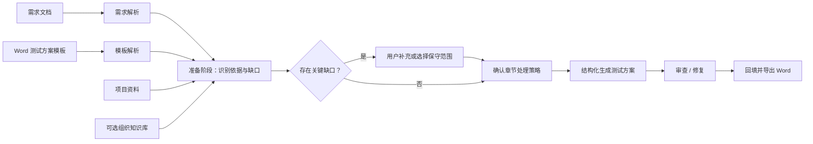

这不是一个完全开放的自主 Agent。主流程负责确定性的业务顺序，局部 Agent 决策负责理解材料、识别缺口和提出建议。这样既保留了模型处理复杂自然语言的能力，也使关键节点能够被检查、确认和恢复。

### 准备阶段：先寻找依据，再决定是否询问

系统会从需求、模板、关联项目资料和可选组织知识中检查测试方案所需依据。它不是为了“尽可能多地检索”，而是围绕影响测试结论的具体问题寻找依据：例如设备和环境是否有指定要求、验收口径是否已定义、接口异常场景是否存在历史约束。

当信息不足以形成可靠结论时，系统会把问题清晰地呈现给用户。用户可以在补充卡片中选择已有选项或输入说明；这些补充随后会进入当前任务的后续判断，而不是由模型静默假设。

<p align="center">
  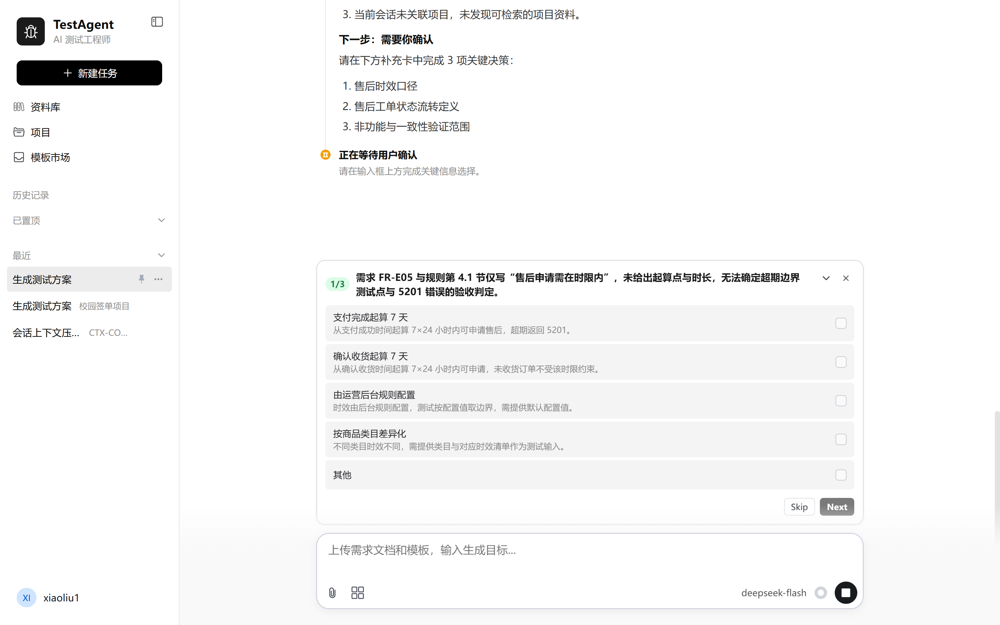
</p>

用户确认后，准备阶段会记录已补充的依据并重新评估任务。例如，用户确认某项售后时效口径、状态流转规则或非功能验证范围后，后续测试方案可以以这些明确内容为基础继续生成。

<p align="center">
  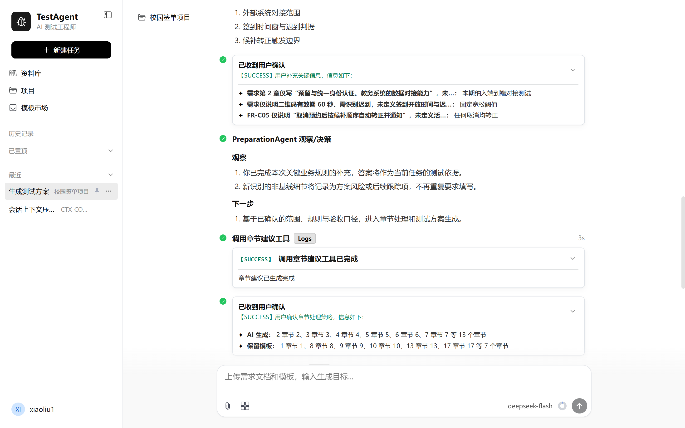
</p>

### 章节级处理：明确 AI 可以写什么

并非模板中的每一章都应该由 AI 重写。TestAgent 会基于需求、模板和已确认信息给出章节处理建议，并把决定权交给用户：需要生成的章节可以交给 AI，固定或已定稿的章节可以保留模板原文。

这一步将“不要改动固定内容”从一句容易被忽略的提示语，转化为明确的处理范围。它尤其适合包含固定测试设备、实验环境、流程规则或审批信息的企业模板。

<p align="center">
  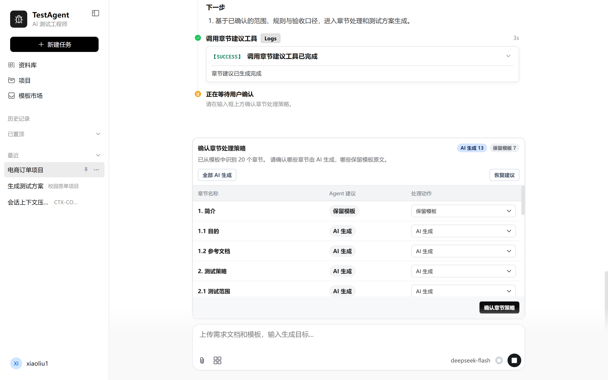
</p>

### 结构化生成、审查与 Word 交付

确认章节范围后，系统生成用于回填的结构化内容，再进行结果审查并导出为 Word 文档。生成过程和结果摘要可在会话中查看；交付物保留在资料库和关联项目中，供下载、预览与后续使用。

<p align="center">
  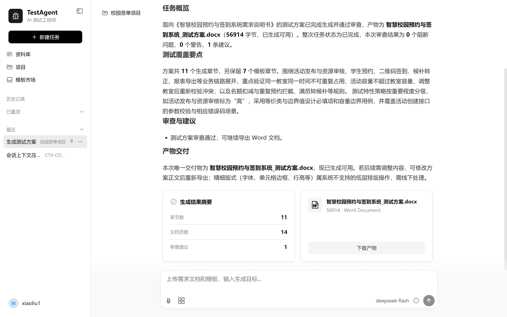
</p>

## 能力总览

| 能力 | 当前可做什么 |
| --- | --- |
| 测试方案任务 | 上传需求与模板，查看分步执行状态，生成、审查并下载 Word 测试方案 |
| 文档与模板 | 解析 Word 文档；以模板章节为基础控制处理范围与最终交付结构 |
| 模板市场 | 搜索、筛选、收藏、上传、下载与复用个人/已收录测试模板 |
| 资料库 | 上传、搜索、预览、下载、重命名、回收站恢复；围绕资料发起会话 |
| 项目空间 | 管理项目对话、项目资料与测试资产；从资料库关联已有文件 |
| 上下文增强 | 在关联项目时使用项目资料；可选配置组织知识库补充测试规则和约束 |
| 人机协同 | 对需求缺口和章节处理范围提供明确的补充与确认节点 |
| 交付与追溯 | 在会话中呈现执行过程、审查结果和可下载的 Word 产物 |

## 架构概览

| 区域 | 主要技术与职责 |
| --- | --- |
| 前端 | Vue 3、TypeScript、Vite；提供任务对话、过程可视化、资料/项目/模板工作台和文档预览/下载界面 |
| 后端 | Python、FastAPI；承载 API、文档处理、任务编排、配置与持久化能力 |
| Agent Runtime | 状态化工作流、工具调用、检查点、结果审查与局部修复 |
| 上下文与检索 | Project、Context Engine、可选组织知识库连接器，按任务边界组织证据 |
| 文档交付 | Word 模板解析、章节处理、结构化内容生成与回填导出 |
| 开发基础设施 | PostgreSQL、Redis、Docker Compose |

## 快速开始

根目录不重复维护前后端的详细启动命令。请按你的开发目标阅读对应组件文档：

| 目标 | 请阅读 |
| --- | --- |
| 启动、调试或开发 FastAPI 后端 | [backend/README.md](backend/README.md) |
| 启动、调试或开发 Vue 前端 | [frontend/README.md](frontend/README.md) |
| 查阅部署、配置与技术资料 | [docs_x/](docs_x/) |

开始前请注意：

- 使用各目录的 `*.env.example` 创建本地 `.env`，不要提交真实密钥、企业文档或生产数据；
- LLM、嵌入模型、重排序、对象存储和组织知识库等外部服务均由部署者自行配置；
- 组织知识库为可选能力；未配置时，测试方案流程仍可基于需求和关联项目资料继续运行。

## 项目结构

```text
TestAgent/
├── backend/       # FastAPI 服务、Agent Runtime、文档处理与数据模型
├── frontend/      # Vue 3 前端应用
├── docker/        # 容器化与部署相关文件
├── docs_x/        # 技术、部署与开发文档，以及 README 使用的界面截图
├── scripts/       # 开发、维护与辅助脚本
└── tests/         # 自动化测试与测试支撑文件
```

## 安全与数据边界

- 本仓库不包含组织知识库地址、API Key、企业文档或生产环境凭据。
- 请将真实配置仅保留在本地或受管控的密钥系统中；仓库仅提交示例配置。
- 在 issue、pull request、日志和截图中，不要粘贴客户资料、内部文档、访问令牌或真实环境信息。
- 安全问题请遵循 [SECURITY.md](SECURITY.md) 的报告方式，不要在公开 issue 中披露敏感细节。

## 路线图

- [x] 需求文档与 Word 测试方案模板解析
- [x] 模板市场、资料库和项目资料管理
- [x] 测试方案生成、人工补充、章节处理确认、审查与 Word 导出
- [x] 项目资料上下文与可选组织知识库连接器
- [ ] 测试用例、缺陷分析等更多测试资产的端到端能力
- [ ] 更完善的评测基准、质量指标与实验工具链
- [ ] 持续提升模板保真、局部修复、上下文协同与可观测性

## 参与贡献

欢迎提交 issue、改进建议和代码贡献。提交前请阅读 [CONTRIBUTING.md](CONTRIBUTING.md)，并确保不包含任何私有资料、密钥或可识别的生产数据。

## 许可证

本项目采用 [PolyForm Noncommercial 1.0.0](LICENSE) 许可证发布，仅允许非商业使用；商业使用须获得版权所有者的单独许可。

该许可证属于 source-available（源代码可获取）许可，**不是** OSI 批准的开源许可证。未被许可证明确授予的权利均由版权所有者保留。
