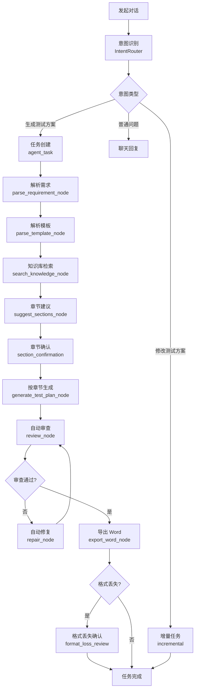

# TestAgent 如何生成测试方案

本节介绍从"发起生成"到"下载 Word"的完整处理链路。理解这个链路能帮助你更好地排查问题和优化生成效果。

## 一句话理解

**测试方案生成 = 多阶段流水线 + 关键节点确认 + 流式反馈。**

## 完整流水线



## 第 1 步：意图识别

**模块**：`IntentRouter`（`backend/app/agent/intent_router.py`）

当你在对话中发送一条消息，系统先做意图分类：

- `test_plan_generation`：生成测试方案。
- `result_modification`：修改现有测试方案。
- `general_chat`：普通聊天。
- `unknown`：无法判断，会要求澄清。
- 等等。

意图识别依赖：

- 用户消息内容。
- 已上传的附件（特别是 `requirement_doc` 和 `test_plan_template`）。
- 当前对话的任务状态。

只有识别为 `test_plan_generation` 时，才会进入完整的生成流水线。

## 第 2 步：任务创建

**模块**：`MessageService` → `agent_task` 表

如果意图是生成测试方案且资料齐全：

- 创建一条 `agent_task` 记录。
- 设置任务类型、状态、关联的对话与文件。
- 触发预确认（pre-confirm）阶段的 SSE 流。

任务 ID（public_id）是 SSE 流的事件订阅键。

## 第 3 步：解析需求

**节点**：`parse_requirement_node`

把需求文档解析为结构化中间结果：

- **范围**：包含什么、不包含什么。
- **角色**：有哪些角色、权限如何。
- **流程**：主流程、分支、异常。
- **规则**：业务规则、约束条件。
- **字段**：核心字段定义。
- **验收标准**：性能、安全、兼容性指标。

解析使用 LLM 调用 + 文档解析工具。

## 第 4 步：解析模板

**节点**：`parse_template_node`

把模板解析为结构：

- **章节列表**：每个章节的标题、层级。
- **表格列表**：表格位置、表头、内容。
- **固定内容**：保留原样的章节与段落。

模板解析依赖 docx 解析能力，识别 Word 标题样式。

## 第 5 步：知识库检索

**节点**：`search_knowledge_node`（可选）

如果项目或账户绑定了知识库：

- 根据需求主题与上下文检索相关文档。
- 返回 top-K 命中片段。
- 作为后续生成的参考。

检索使用 `KnowledgeRetrievalService`，支持向量检索 + 关键词检索。

## 第 6 步：章节建议

**节点**：`suggest_sections_node`

根据模板结构生成章节建议：

- 每个章节建议"由 AI 生成"或"保留原样"。
- 给出建议理由。

这只是建议，最终决定权在你。

## 第 7 步：章节确认（关键节点）

**机制**：`section_confirmation` interrupt

这是一个**用户确认点**。任务会暂停，等待用户提交章节确认：

- 用户在界面看到章节列表。
- 每个章节可以切换"由 AI 生成 / 保留原样"。
- 用户点击【开始生成】，任务继续。

如果用户长时间不确认，任务会保持在 `waiting_user_confirm` 状态。

## 第 8 步：按章节生成

**节点**：`generate_test_plan_node`

这是核心生成阶段。每个章节：

- 按章节类型选择合适的 LLM 能力（chat / reasoning）。
- 注入上下文：需求解析结果 + 模板结构 + 知识库检索 + 项目指令。
- 生成章节内容。
- 写入任务上下文。

生成是流式的，每个章节完成后立即推 SSE 事件，前端可以实时看到进度。

## 第 9 步：自动审查

**节点**：`review_node`

每个章节生成后做一轮自动审查：

- 结构完整性。
- 内部一致性。
- 明显缺漏。
- 风险点。

审查结果是结构化的，可以被自动修复利用。

## 第 10 步：自动修复（如果需要）

**节点**：`repair_node`

如果审查发现问题：

- 判断是否在可修复范围内。
- 在范围内：发起一次修复请求，重新生成问题章节。
- 不在范围内：标记高风险，由人工处理。

修复通常只跑一轮。

## 第 11 步：导出 Word

**节点**：`export_word_node`

所有章节通过审查后：

- 按模板的章节结构组装。
- 沿用模板的标题样式、表格样式。
- 导出为 .docx 文件。
- 写入 `artifacts` 表，供下载。

## 第 12 步：格式丢失确认（关键节点）

**机制**：`format_loss_review` interrupt

导出过程中如果检测到格式丢失（复杂排版无法完整保留）：

- 任务暂停。
- 弹窗提示用户。
- 用户选择"接受"或"重新尝试"。

接受：保留当前导出结果，任务完成。

重新尝试：以"低保真"模式重新导出，丢失的样式更多但内容更稳。

## 第 13 步：任务完成

所有阶段完成后：

- 任务状态变为 `completed`。
- 生成"任务完成卡片"，包含摘要、自动审查意见、下载入口。
- 产物归档到项目资产页和资料库。

## 流式事件流（SSE）

整个过程通过 SSE 实时推送事件：

```
event: tool_call_started
data: {"tool": "llm_call", "input": {...}}

event: tool_call_finished
data: {"tool": "llm_call", "output": "..."}

event: section_generated
data: {"section_id": "...", "title": "测试范围"}

event: section_review_passed
data: {"section_id": "...", "review": "..."}

event: task_completed
data: {"task_id": "...", "artifacts": [...]}
```

前端订阅事件流，实时更新界面：

- 进度条。
- 章节状态。
- 工具调用日志。
- 完成通知。

### SSE 心跳

没有事件时也会周期性发送心跳（keep-alive），保持连接活跃。客户端断线重连后可以从 `lastEventId` 继续接收。

## 增量修改（`result_modification`）

对已生成的方案提修改要求：

- 识别为 `result_modification`。
- 走增量任务路径（`incremental`）。
- 不重新跑全部分析与生成。
- 在已有产物上做局部调整。

详见 [如何修改已生成测试方案](/help/article/modify-generated-plan)。

## 关键节点回顾

| 节点 | 类型 | 何时 | 用户动作 |
| --- | --- | --- | --- |
| 章节确认 | interrupt | 生成前 | 选择每章"AI 生成 / 保留原样" |
| 格式丢失确认 | interrupt | 导出时 | 选择"接受 / 重新尝试" |
| 任务取消 | API | 任意阶段 | 取消任务 |
| 任务重试 | API | 失败后 | 重新发起 |

## 与 LangGraph 的关系

TestAgent 当前使用 LangGraph 作为执行引擎：

- 每个节点对应一个 Python 函数。
- 节点之间的流转由 LangGraph 编排。
- 状态保存在 LangGraph 的 `State` 对象中，支持 checkpoint。

`graphs/test_plan/versions/v3/` 是当前版本目录，包含：

- `nodes_pre_confirm.py`：章节确认前的节点。
- `nodes_post_confirm.py`：章节确认后的节点。
- `nodes_review_format.py`：审查与格式处理节点。

## 性能与可观测

### 性能指标

- 单章节生成：通常 30 秒到 2 分钟。
- 完整 10 章节方案：通常 5–15 分钟。
- 主要瓶颈：LLM 调用耗时。

### 可观测入口

- 任务进度卡：UI 上看到节点状态。
- 工具调用日志：UI 上看到每个工具的输入输出。
- 服务端日志：`backend/app/agent_runtime/` 下的日志。

## 常见问题

### 为什么任务一直停在"等待确认"？

- 检查页面是否有确认卡片未提交。
- 检查 `section_confirmation` interrupt 是否被消费。

### 为什么生成很慢？

- 检查 LLM 服务连通性。
- 检查知识库检索是否超时。
- 检查上下文是否过长（章节数过多或资料过大）。

### 为什么自动审查总是高风险？

- 检查需求文档是否完整。
- 检查模板设计是否清晰。
- 检查是否触发了审查规则。

### 为什么导出 Word 后样式丢失？

- 模板包含复杂排版。
- 触发了 `format_loss_review`，需要在界面选择"接受"或"重新尝试"。

继续阅读：[能力边界](/help/article/capability-boundaries) · [自动审查与自动修复](/help/article/automatic-review-repair)