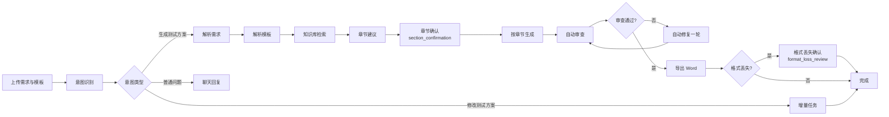

# TestAgent 是什么

TestAgent 是面向测试方案工作的智能协作助手。它把需求资料、团队模板、生成流程和审查能力串成一条可追踪的工作流，帮助测试人员更快地产出结构化、可交付的测试方案。

## 一句话定位

**测试人员的"起草伙伴"，而非"替代者"。**

- 你提供资料、模板和判断；
- TestAgent 负责解析、生成、审查、修复这些机械性工作；
- 最终方案仍由你审阅、修改和负责。

## 适合处理的工作

### 1. 阅读需求与参考资料

- 解析 Word、Markdown、PDF、图片中的需求信息；
- 抽取测试范围、角色、字段、流程、规则、验收标准；
- 整理出"可被测试设计引用"的中间结构。

### 2. 按模板生成测试方案

- 自动识别模板中的章节与表格；
- 在"章节确认"步骤让你选择每章由 AI 生成还是保留原样；
- 按章节填充内容，保持模板原排版。

### 3. 自动审查与修复

- 对生成结果做结构完整性、冲突、缺漏的自动审查；
- 在可修复范围内迭代一次，常见问题会被自动修复；
- 列出仍需人工判断的高风险点。

### 4. 项目化协作

- 用项目组织多次相关对话、共享资料和最终产物；
- 跨对话复用项目资料与知识库连接；
- 项目内集中查看历史测试方案与产物。

## 工作方式

你通过**对话**驱动 TestAgent。整个流程的关键节点是：

1. **表达意图**——说明要做什么（生成测试方案 / 修改章节 / 解答问题）。
2. **绑定资料**——上传或挂接需求文档、模板、知识库连接。
3. **确认决策**——在关键步骤（章节确认、格式丢失确认）做选择。
4. **查看进度**——通过任务卡和章节状态跟踪生成。
5. **复核与下载**——阅读自动审查结论，人工复核后下载 Word。

下面这张流程图展示了完整的处理链路：

## 人的角色

TestAgent 不会替代测试人员的核心责任：

| 职责 | 由谁承担 |
| --- | --- |
| 业务规则澄清与补全 | 测试人员 |
| 模板选择与调整 | 测试人员 |
| 高风险场景识别 | 测试人员 |
| 最终方案评审 | 测试人员 |
| 测试环境与数据准备 | 测试团队 |
| 生成、审查、排版等机械性工作 | TestAgent |

把 TestAgent 看作一个有耐心的"起草人"，把决定权留给你。

继续阅读：[核心能力](/help/article/core-capabilities) · [与普通 AI 的区别](/help/article/testagent-vs-chat-ai) · [能力边界](/help/article/capability-boundaries)