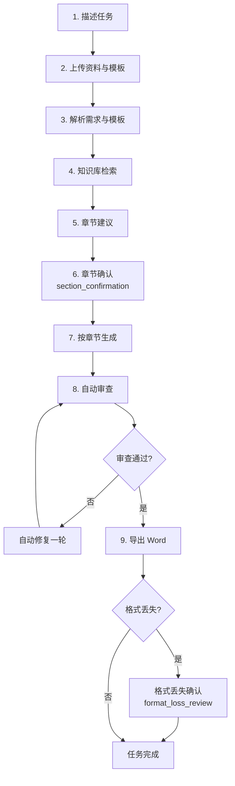

# 如何生成测试方案

生成测试方案是 TestAgent 的核心场景。整个流程涉及需求与模板准备、章节确认、生成、审查与导出五个主要阶段。下面按时间顺序完整介绍每一步。

## 完整流程概览

## 第 1 步：描述任务

在聊天输入框中明确表达生成意图。推荐的措辞：

- "请基于这份需求生成测试方案。"
- "用这份模板帮我出一份【XX 功能】的测试方案，重点关注 X 和 Y。"
- "基于这些资料生成一份测试方案，覆盖功能、性能、安全三类测试。"

测试对象、版本、目标、范围、期望交付时间等信息也建议一并说明，便于 AI 准确理解任务边界。

:::tip
如果你只关心部分章节（例如只生成"测试数据设计"），直接说出来。AI 会聚焦对应章节，其他章节保持简洁。
:::

## 第 2 步：提供资料和模板

测试方案生成至少需要两类文件：

- **需求文档**（requirement_doc）—— 描述"测什么"。
- **测试方案模板**（test_plan_template）—— 描述"按什么结构交付"。

### 上传方式

- **直接上传**：拖拽到聊天输入框，或点击【附件】按钮。
- **从资料库选择**：点击资料库图标，从已有文件中挑选。
- **从项目资料引用**：在项目内发起对话时，项目资料会自动出现在可选项中。

### 模板来源

- **模板市场保存的模板**：在【我的模板】中选择。
- **自己上传的模板**：在【模板市场 → 我的模板】中查看。

### 文件格式支持

- 文档：.docx、.doc（推荐 .docx）。
- 文本：.md、.txt。
- PDF：.pdf（文本型或扫描型均可，扫描型需配置 OCR/视觉能力）。
- 图片：.png、.jpg、.jpeg、.webp、.gif（OCR/视觉理解）。

## 第 3 步：等待解析

系统开始解析需求与模板。这一阶段会做：

- 抽取需求中的范围、角色、字段、流程、规则、验收标准。
- 识别模板的章节结构（一级、二级标题）和表格。
- 准备后续生成的中间状态。

解析通常在数秒内完成。解析过程会在任务进度卡中以"步骤"形式展示。

## 第 4 步：知识库检索（可选）

如果项目绑定了知识库，TestAgent 会从知识库中检索与当前需求相关的参考资料：

- 业务制度、合规要求。
- 历史项目测试方案。
- 团队测试规范。

检索结果会作为上下文注入到生成阶段，帮助 AI 写出更贴近团队规范的方案。

如果未绑定知识库，此步骤自动跳过。

## 第 5 步：章节建议

系统根据模板结构生成章节建议：哪些章节适合由 AI 生成，哪些建议保留原样。**这只是建议**，最终决定权在你。

## 第 6 步：章节确认

这是生成前最重要的控制点。系统弹出章节确认卡片，列出每个章节：

- ✅ 由 AI 生成：测试范围、测试策略、功能测试分析、接口测试分析、风险与依赖、测试数据设计等。
- ⚪ 保留原样：封面、版本说明、术语表、审批签字栏、组织规范。

确认后点击【开始生成】，任务正式进入生成阶段。

:::warning
章节名称相似但含义不同时（例如"功能测试"和"功能测试分析"），必须在确认时逐项核对。仅凭章节名批量选择容易把不该覆盖的章节覆盖掉。
:::

## 第 7 步：跟踪生成

生成启动后，聊天界面显示任务进度卡：

- **章节状态**：每个章节实时显示"待生成 / 生成中 / 已生成 / 已修复"。
- **工具调用**：可见 LLM 调用、知识库检索、模板解析等步骤。
- **SSE 心跳**：连接保持活跃，关闭页面前不要刷新。

生成通常持续 1–5 分钟，取决于模板复杂度和资料规模。

### 中途不要做什么

- 不要重复提交同一个生成请求——会导致多个并行任务互相干扰。
- 不要关闭页面后立刻打开新聊天——会打断 SSE 连接，建议等任务完成后再操作。
- 不要在任务未完成时删除资料文件——会让任务找不到上下文。

## 第 8 步：自动审查与自动修复

每个章节生成后，系统会做一轮自动审查：

- **结构完整性**：必填章节是否齐全。
- **内部一致性**：章节之间是否冲突。
- **明显缺漏**：是否缺少关键场景。

如果审查发现问题且在可修复范围内，系统会自动尝试一轮修复。修复完成后再次审查。

### 自动审查的输出

任务完成后，"任务完成卡片"中会附带自动审查意见，列出：

- 高风险章节（需要重点人工复核）。
- 自动修复的章节（修复了什么）。
- 仍需人工判断的事项。

## 第 9 步：导出 Word 与格式丢失确认

所有章节通过审查后，系统开始导出 Word 文件。导出过程中：

- 按模板的章节结构填充。
- 沿用模板的标题样式、表格样式。
- 生成可下载的 .docx 文件。

### 格式丢失确认

极少数情况下，模板包含复杂排版（嵌套表格、宏、自定义样式），导出时可能出现格式丢失。系统会弹出**格式丢失确认卡片**：

- **接受**：保留当前导出结果，任务结束。
- **重新尝试**：以"低保真"模式重新导出（样式会更简单但内容更稳）。

> 实际场景中【接受】已经能满足绝大多数需求，【重新尝试】只在自动审查明确怀疑结果不可靠时使用。

## 第 10 步：复核与交付

任务完成后，建议的复核顺序：

1. **先看自动审查结论**：标记高风险章节与已修复问题。
2. **再读生成内容**：重点看业务规则、边界条件、测试数据、风险评估。
3. **对照需求文档**：标出 AI 漏掉的部分。
4. **逐节修改**：在对话中提修改要求，让 AI 做增量修改。
5. **下载 Word**：从产物卡片或项目资产页下载。

完成到这里，你就拥有了一份团队规范、需求覆盖、可直接进入评审的测试方案。

继续阅读：[如何选择 AI 生成章节](/help/article/ai-section-confirmation) · [如何查看生成过程](/help/article/generation-progress) · [自动审查与自动修复](/help/article/automatic-review-repair)