# TestAgent 项目总体技术方案

> **配套文档**
> - 实现原理与源码导读:`docs/50_TestAgent_项目实现原理与源码导读.md`
> - 证据索引:`docs/51_TestAgent_项目技术方案证据索引.md`

**编制时间**:2026-07-22（最后更新:2026-08-17 对齐 dev_3.0 真实状态）
**对应分支**:`dev_3.0`

> ⚠️ **本技术方案随项目演进持续更新。**
> 自 2026-08-03 起,项目主线已从 `dev_2.0` 切换至 **`dev_3.0`**,主要变化:
> - **Context Engine 3.0**(`backend/app/context_engine/`)正式接入:profiles / sources / composer / runtime / retrieval / scope / indexing / security / maintenance / memory / snapshot / freeze / planning / selection / tool_output / payload / compression / debug / providers / shadow / adapters / models **22 子模块**,W1→W14 全部完成。
> - **Dynamic Agent 子图**(`backend/app/agent_runtime/dynamic_agent/`)上线:Planner / Executor / Verifier / Replanner / Synthesizer + 11 节点子图 + 4 个原子能力(`word_document_parse` / `knowledge_search` / `evidence_analysis` / `image_understanding`)。
> - **Narrative Composer 接管叙事层**(`backend/app/agent_runtime/narrative_composer/`):由之前确定的 `public_execution_update_builder` 升级为 **LLM-first + 校验 + 事实约束 + 8 Tool 同步 Barrier**,TryFix→fallback 收敛策略保留。
> - **v3 主图拓扑重构**(`backend/app/agent_runtime/graphs/test_plan/versions/v3/graph.py`):旧 13 节点扩为 30+ 节点,新增 `initialize_task` / `validate_inputs` / `tool_narrative_barrier` / `prepare_section_confirmation` / `section_confirmation_interrupt` / `repair_subgraph` / `repair_fallback` / `task_summary_narrative` / `format_loss_interrupt` 等。
> - **Test Faults 故障注入**(`backend/app/test_faults/__init__.py`):开发态 5 种故障开关(`FAULT_SCHEMA_HEADER_MISMATCH` / `FAULT_MISSING_SECTION` / `FAULT_JSON_TRUNCATE` / `FAULT_EMPTY_SECTION_CONTENT` / `FAULT_SECTION_INVALID_VALUE`),生产环境二次保护。
> - **Phase 2.9A.X 修复**:TestPlanGeneratorTool 表头不符不抛 / F023 拆分 / schema_issues 透传;TestPlanRegenTool 增加 cfg_subset self-healing + multi-key 索引 + length 校验;ResultReviewTool 区分工具执行失败与语义失败,失败时 block_issues 拆分;RepairAgent parser 字符串 bug 修复 + decision_summary 截断 + result_parser parse_json_lenient。
> - **MIG_GENERATE 路径恢复**:TestPlanGeneratorTool 通过 ContextInvokerBridge / ContextAwareLLMInvoker 走 Context Engine 3.0 统一上下文组装链路,Maas 知识库检索结果纳入 Knowledge Source。
> - 2026-08-03:补充「意图识别」与「对话上下文」两节技术实现(§7A/§7B)。这两点是智能助手定位的核心 —— 当前只跑测试方案生成与智能问答,后续将扩展到需求分析、缺陷分析报告生成等功能,因此用户意图识别与多轮对话上下文是支撑能力扩展的基础。

---

## 1. 文档说明

### 1.1 文档目的

本文从产品、系统架构、工程实现三个层面,系统介绍 TestAgent 是什么、为什么这样设计、各模块如何协同、一次任务如何从前端进入后端并最终生成 Word 产物,以及 LangGraph、PostgreSQL Checkpointer、MySQL、Redis、SSE、Tool Adapter、Worker、Multi-Worker 等核心能力到底是怎么实现的。

### 1.2 适用读者

| 角色 | 期望收获 |
|---|---|
| 项目负责人 | 项目定位、阶段划分、能力边界、风险与限制 |
| 后续维护开发人员 | 模块划分、调用链、关键技术决策由来 |
| 不熟悉 LangGraph 的工程师 | LangGraph 在本项目中如何落地 |
| 新加入的前端/后端/测试 | 7 天阅读计划、模块阅读顺序 |

### 1.3 当前项目阶段

- **第一阶段**:固定流程测试方案生成器(已交付)
- **第二阶段**:可恢复、可动态决策、可审查修复的 Agent 平台(主体已交付,持续优化)
- **CE-05 WP1-14**:Context Engine 3.0 接入**已完成**(`dev_3.0`)
  - Task Freeze / Flag Resolver / REST 契约 / 三类审计 / 索引管理 / 观测 / 评估 / 灰度 / 最终回归
- **Phase 2.9A.27-30**:Conversation Timeline Assembly 与 Task Hydration 根治**已完成**
  - 统一 TaskRunReducer (hydrate/live 共用)
  - TimelineAssembler 结构化排序
  - payload_json 规范化 + trigger_message_id 公开 ID
  - 每 Task 独立 cursor + 事件/分片去重
  - 受控折叠 + Live SSE 路由
- **Phase 2.9A.X**:测试方案生成 / 审查 / RepairAgent 链路 + 故障注入 + 叙事层收口**已完成**
  - TestPlanGeneratorTool 表头不符不抛 + F023 拆分 + schema_issues 透传
  - TestPlanRegenTool cfg_subset self-healing + multi-key 索引 + length 校验
  - ResultReviewTool 语义失败与工具执行失败区分,block_issues 拆分
  - RepairAgent parser 字符串 bug 修复 + decision_summary 截断 + result_parser parse_json_lenient
  - Test Faults 5 种故障(开发态)
  - MIG_GENERATE 路径恢复,接入 Context Engine 3.0
- **Phase 2.9B.4-7**:Narrative Composer LLM-first 叙事 + 8 Tool 同步 Barrier + Task Summary 事实校验**已完成**
- **Dynamic Agent 子图骨架**:Planner / Executor / Verifier / Replanner / Synthesizer + 4 个原子能力**已上线**
- **Phase 2.8R-K**:dev 默认走 LangGraph + Postgres Checkpointer 收尾已完成

### 1.4 已实现能力

- 用户注册 / 登录 / JWT / 个人资料 / 头像
- 会话列表 / 创建 / 归档
- 文件上传(需求文档 / 模板)
- **意图识别(IntentRouter,LLM 分类 + 确定性覆盖)** [F013/F014/F016]
- **对话上下文(分层上下文:最近轮次 + 会话摘要 + 文件摘要 + 任务摘要)** [F016]
- 需求解析(RequirementParserTool,含 OCR)
- 模板解析(TemplateParserTool)
- 知识库检索(KnowledgeSearchTool)
- 章节建议(SectionSuggestionTool,基于用户约束 F022)
- 测试方案生成(TestPlanGeneratorTool,LLM)
- 自动审查(ResultReviewTool,LLM)
- 自动修复(Review Repair Agent 子图,局部重生成)
- Word 导出(WordExportTool,原子写入)
- 格式检查(DocxFormatCheckTool)
- Format Loss 用户确认(F025-ext)
- Artifact 下载 / 增量 Artifact 版本
- 任务取消 / 任务重试 / 服务恢复
- 实时事件(SSE) / 多 Worker / Agent Event 持久化
- LangGraph v3 + v2 frozen 双引擎
- EngineRouter 6 路径优先级

### 1.5 已实现能力(Phase 2.9A / 2.9B / dev_3.0)

- **Context Engine 3.0**(CE-05 WP1-14 已闭环)[F027-CE]
  - Profile Registry + Resolver(`backend/app/context_engine/profiles/`)
  - 10+ Source Adapter(`sources/`: conversation / memory / summary / system_rules / artifact / file_document / knowledge / task_state / workspace_instruction / orchestrator / deadline)
  - Composer + Preflight 压缩水位状态机(`composer/`)
  - Runtime + Engine Factory(`runtime/`)
  - Retrieval + Audit(`retrieval/`)
  - Scope / Task Scope Validator(`scope/`)
  - Indexing(Lexical + Vector Store / Index Worker / Document Service)
  - Memory / Snapshot / Freeze / Planning / Security / Maintenance / Provider / Shadow / Selection / Tool Output / Payload / Compression 子模块
  - REST 端点(opaque cursor / 权限依赖 / 三类审计 / index admin / debug / observability / payload / 会话设置)
  - Retention Worker + Advisory Lock
  - Task-level Flag Resolver + 13 消费者迁移
- **Narrative Composer**(LLM-first 8 Tool 同步 Barrier)[Phase 2.9B.4-7]
  - composer.py + 1 schema 修复 + 1 fact 修复 + 1 attempt 修复
  - Tagged Narrative Stream V1 流式协议(stream_decoder)
  - NarrativeValidator(Schema + 事实约束:数字白名单 / 文件名 / 状态语义 / 敏感信息)
  - per-Tool Context Builder(白名单压缩事实)
  - 8 Tool(RequirementParser / TemplateParser / KnowledgeSearch / SectionSuggestion / TestPlanGenerator / ResultReview / WordExport / DocxFormatCheck)Barrier 链
  - 前端 displayToolUpdate 互斥选择器(LLM / fallback 互斥)
  - Task Summary 唯一槽位 + 事实校验
- **Dynamic Agent 子图**(98f78de)
  - 11 节点:`initialize` → `create_plan` → `validate_plan` → `execute_next_step` → `verify_goal` → `replan` → `synthesize` → `persist_final_answer` → `need_user` → `finalize` / `fail`
  - Planner(LLM + deterministic fallback)
  - Executor(bridge / deterministic 双模式)
  - Synthesizer(私有化合成)
  - Verifier(完成度四态:complete / continue / replan / need_user)
  - Replanner(Gap-driven,≤2 次)
  - 4 个原子能力:`word_document_parse` / `knowledge_search` / `evidence_analysis` / `image_understanding`
- **Test Faults 故障注入**(dev_3.0,生产 env 关闭)
  - `FAULT_SCHEMA_HEADER_MISMATCH` / `FAULT_MISSING_SECTION` / `FAULT_JSON_TRUNCATE` / `FAULT_EMPTY_SECTION_CONTENT` / `FAULT_SECTION_INVALID_VALUE`
  - 生产环境(`APP_ENV=production/prod`)二次保护
  - 触发 RepairAgent / TestPlanRegenTool 链路回归
- **文件自识别 3.0**(Automatic Attachment Understanding,5018b1c)
- **首页 + 工具调用时间线产品化**(844a596)
- **Context Usage 前端**(移除 Context 管理页)
- **CE 知识库接入 ContextEngine**:commit f4b14a2 MaaS KB → Knowledge Source → composer → 模型请求
- **TestPlanGeneratorTool MIG_GENERATE 路径恢复**:ContextInvokerBridge / ContextAwareLLMInvoker 透传 llm_client
- **测试套件 / 端口契约**:CE-05 WP-12 评估语料 + WP-11 全量扫描 + WP-14 最终回归;BE-01~BE-09 后端产品化;CE-05 WP1-8 阶段验收证据与 admin 删除端点
- **前端 home 建议卡片更新** + 工具名称中文映射(ResultReviewTool / WordExportTool / DocxFormatCheckTool)
- **ResultReviewTool 语义失败展示**：「执行完成,但审查未通过」
- **Markdown 长段落自动分段渲染**
- **TestPlanRegenTool UI 提示文案**
- **Chat 路由 / 上下文学习 / 上下文使用统计 / 对话摘要服务 / 意图理解路由 / 工具生命周期 / API 契约一致性 测试**

### 1.6 当前限制

- 第一阶段没有 Checkpointer,只靠手动重试;**第二阶段才支持自动恢复**
- Postgres Checkpointer 在 dev 环境探活不稳(URL normalize + cache_clear 已修,见 `HANDO.md §4`)
- Legacy orchestrator 仍然保留,EngineRouter 决定路径,**不允许静默回退**(2.8R-A)
- Narrative Composer 在 dev 默认关闭,需 `AGENT_RUNTIME_PHASE29B_TOOL_NARRATIVE_ENABLED=1` 显式打开(否则走确定性 fallback)
- Dynamic Agent 子图骨架已上线,**4 个原子能力完工但业务接入尚未全线贯通**(若走 test_plan 任务仍走 v3 主图)
- Test Faults 5 种故障仅 dev 环境生效;**生产 FAULT_* 必须全部 0**(产品环境二次保护)
- Context Engine 3.0 已闭环 CE-05 WP1-14,W14 最终回归与证据闭环已完成;**长任务(>10 分钟)的 CE preflight 压缩水位状态机未做真实压测**
- Dark mode 未实现(全项目无 `prefers-color-scheme`)
- 没有完整的运行可观测平台(只有 readiness + 日志 + CE-05 WP-10 观测仪表盘)

---

## 2. 项目背景与产品定位

### 2.1 TestAgent 解决什么问题

测试工程师日常产出测试方案时,要做大量重复工作:解析需求文档 → 套用测试方案模板 → 检索已有案例 → 拉取章节建议 → 调用 LLM 生成 → 自审 → 修正 → 导出 Word。**TestAgent 把这条链路自动化**,让用户上传需求文档和模板后,在对话界面看到方案逐步生成、Agent 自动审查、Word 文件自动导出。

### 2.2 面向什么用户

- 软件测试工程师
- 测试主管(需要规范化产出物)
- 产品经理(需要快速看到测试范围)

### 2.3 第一阶段(2024)是什么

**固定流程测试方案生成器**。一条流水线:

```
上传 → 解析需求 → 解析模板 → 检索 → 生成 → 审 → 导出
```

每一步是同步的、没有分支、没有恢复、没有用户确认中断。优点是简单稳定;缺点是:LLM 输出格式错就要全重跑、Word 模板一改就要重启、用户中途想加约束无入口。

### 2.4 第二阶段(2025-)为什么引入 LangGraph

- **可恢复**:LLM 调用断网要重试、Worker 崩溃要续跑,需要 Checkpointer
- **可动态决策**:Preparation / Repair / Incremental 三个动态子图,根据上下文决定下一步
- **可审查修复**:Review 发现问题不能整篇重生成,要锁定 Scope 局部修
- **可中断**:章节确认、格式损失确认需要人类决策
- **可观测**:每个 Node 写入 AgentEvent,可以回放

### 2.5 Legacy 和 LangGraph 分别是什么

| 引擎 | 是什么 | 何时启用 |
|---|---|---|
| **Legacy orchestrator** | 1477 行 Python 类,顺序调用 Tool,有重试但无 Checkpointer | `engine_type='legacy'`,或 LangGraph 故障时 fallback |
| **LangGraph orchestrator** | `LangGraphRunCoordinator` + `compile_test_plan_graph("v3")` + Postgres Checkpointer | `engine_type='langgraph'`,dev 默认 |

**当前**:Legacy 仍然保留(用于对比、用于 LangGraph 故障兜底、用于 `agent_tasks.engine_type='legacy'` 历史任务)。**不允许 LangGraph 故障时静默回退**(2.8R-A 明确禁止),必须 fail-fast。

### 2.6 当前为什么仍然保留 Legacy

- 历史任务可能锁定在 legacy 引擎
- 测试 / 对比基线
- LangGraph 故障时**显示报错**(不是默默回退)

### 2.7 最终项目定位

> **TestAgent 是一个"基于 LangGraph 的测试方案生成 Agent 平台"**,第一阶段的固定流程已经演化为一个**确定性主图 + 三个动态子图**的系统,**支持 Checkpoint 恢复、多 Worker 分布式、Agent Event 全链路回放**。

---

## 3. 项目核心能力

每项标记:`[已实现]` / `[开发中]` / `[规划中]`

| 能力 | 状态 | 模块位置 |
|---|---|---|
| 用户注册登录 | [已实现] | `app/api/v1/auth.py` + `app/services/auth_service.py` |
| 会话管理 | [已实现] | `app/api/v1/conversations.py` + `conversation_service.py` |
| **意图识别** | [已实现] | `app/agent/intent_router.py` + `app/services/message_service.py`(确定性快路径 + LLM 分类 + 文件覆盖)|
| **对话上下文** | [已实现] | `app/services/conversation_context_service.py` + `app/common/context_reducer.py` + `app/services/conversation_summary_service.py` |
| 文件上传 | [已实现] | `app/api/v1/files.py` + `file_service.py` |
| **文件自识别 3.0** | [已实现] | `app/agent_runtime/_shared/attachment_understanding/` + 自动识别投递能力 |
| **Context Engine 3.0** | [已实现] | `app/context_engine/`(**22 子模块**,CE-05 WP1-14 闭环) |
| **ContextInvokerBridge / ContextAwareLLMInvoker** | [已实现] | `app/context_engine/runtime/bridge.py` + `app/context_engine/invoker/` |
| **CE Profile Registry** | [已实现] | `app/context_engine/profiles/registry.py` |
| **CE Source Adapters** | [已实现] | `app/context_engine/sources/`(10+ adapters) |
| **CE Composer + Preflight** | [已实现] | `app/context_engine/composer/` + 水位状态机 |
| **CE Retention Worker** | [已实现] | `app/context_engine/maintenance/retention_worker.py` + Advisory Lock |
| **CE 索引管理(Lexical + Vector)** | [已实现] | `app/context_engine/indexing/` |
| **CE REST 契约 / 审计 / Observability** | [已实现] | `app/api/v1/context.py` + `app/context_engine/retrieval/audit.py` |
| 需求解析 | [已实现] | `tools/requirement_parser_tool.py` |
| 模板解析 | [已实现] | `tools/template_parser_tool.py` |
| 知识库检索(Context Engine Maas) | [已实现] | `tools/knowledge_search_tool.py` + `app/context_engine/sources/knowledge.py` |
| 章节建议 | [已实现] | `tools/section_suggestion_tool.py` + F022 `services/user_constraint_extractor.py` |
| **测试方案生成(MIG_GENERATE)** | [已实现] | `tools/test_plan_generator_tool.py` + ContextInvokerBridge |
| **自动审查(语义失败/工具失败区分)** | [已实现] | `tools/result_review_tool.py` |
| **Repair Agent 局部修复** | [已实现] | `agent_runtime/repair/`(Llm parse + decision_filter + issue_parser + scope_guard) |
| **TestPlanRegenTool self-healing** | [已实现] | `tools/test_plan_regen_tool.py`(cfg_subset / multi-key 索引 / length 校验) |
| Word 导出 | [已实现] | `tools/word_export_tool.py` + `services/atomic_file_writer.py` |
| 格式检查 | [已实现] | `tools/docx_format_check_tool.py` |
| 格式损失确认 | [已实现] | `format_loss_interrupt` + 用户确认 |
| Artifact 下载 | [已实现] | `app/api/v1/artifacts.py` + `services/artifact_service.py` |
| 增量修改 | [已实现] | `agent_runtime/incremental/`(Incremental Agent 子图) |
| 任务取消 | [已实现] | `agent_runtime/cancellation.py` + 分布式 `cancellation_distributed.py` |
| 任务重试 | [已实现] | `agent/retry_policy.py` + Review Repair Loop |
| 服务恢复 | [已实现] | LangGraph Postgres Checkpointer + `agent_execution_worker.py` 轮询 |
| 实时事件 | [已实现] | `app/agent_runtime/event_publisher.py` + Redis Live Event Bus + SSE |
| 多 Worker | [已实现] | `app/services/agent_execution_worker.py` + `SELECT FOR UPDATE SKIP LOCKED` |
| **Narrative Composer(LLM-first 8 Tool Barrier)** | [已实现] | `agent_runtime/narrative_composer/` |
| **Narrative Tagged Stream V1** | [已实现] | `narrative_composer/stream_decoder.py` |
| **Narrative Validator + 事实约束** | [已实现] | `narrative_composer/validator.py` |
| **Task Summary 事实校验** | [已实现] | `agent_runtime/_shared/summary_facts.py` |
| **Tool Identity Contract** | [已实现] | `agent_runtime/adapters/test_agent_tool_adapter.py` 回写 `tool_call_id` |
| **Dynamic Agent 子图** | [已实现] | `agent_runtime/dynamic_agent/`(11 节点 + 4 原子能力) |
| **Atomic Capability Registry** | [已实现] | `app/agent/atomic_capability_registry.py` |
| **Test Faults 故障注入(dev)** | [已实现] | `app/test_faults/__init__.py` |
| Agent 执行叙事层 | [已实现] | Phase 2.9A.27-30;数据层+渲染层均已接入 |
| Conversation Timeline Assembly | [已实现] | `frontend/src/utils/conversationTimeline.ts` + 结构化排序 |
| 统一 TaskRunReducer | [已实现] | `frontend/src/composables/useTaskEventReducer.ts` |
| payload_json 规范化 | [已实现] | `backend/app/common/json_utils.py:normalize_json_object()` |
| trigger_message_id 公开 ID | [已实现] | `backend/app/services/agent_task_service.py:resolve_trigger_message_id` |
| **CE 任务级 Flag Resolver + 13 消费者迁移** | [已实现] | `app/context_engine/scope/resolver.py` |
| **CE Task Freeze** | [已实现] | `app/context_engine/freeze/` |
| **前端 request understanding + tool call timeline** | [已实现] | `frontend/src/components/chat/RequestUnderstandingCard.vue` |
| **SidePanel 用户菜单重设计** | [已实现] | `frontend/src/components/layout/SidePanel.vue` |
| **ChatInputBox 流量栅格换行** | [已实现] | `frontend/src/components/chat/ChatInputBox.vue` |

---

## 4. 总体架构(C4 风格)

### 4.1 系统上下文图

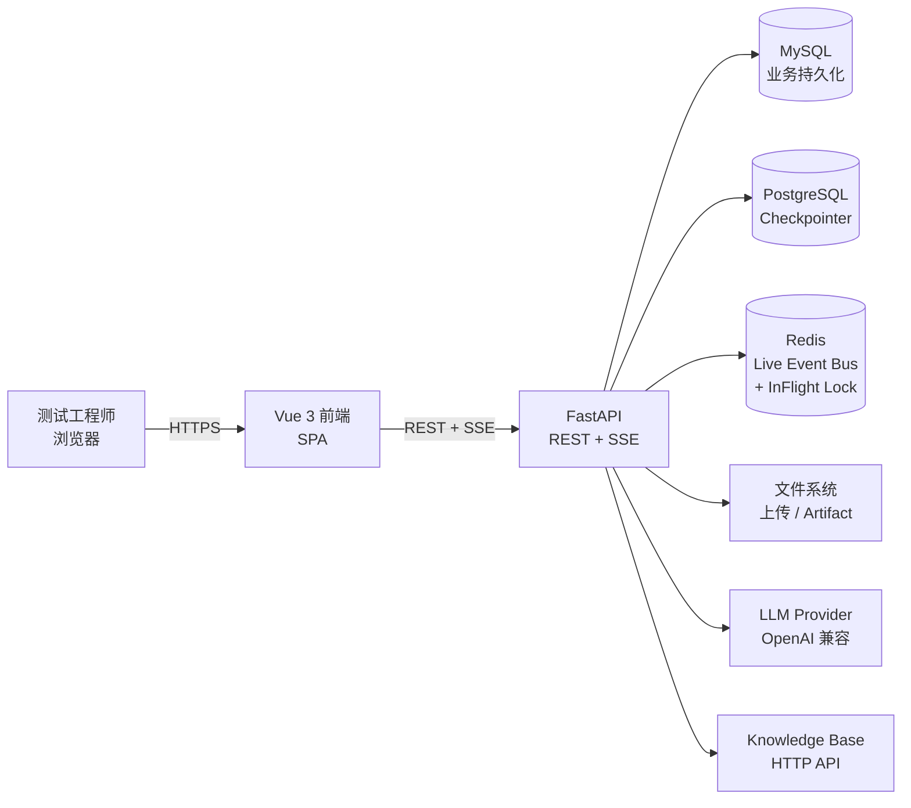

### 4.2 容器架构图

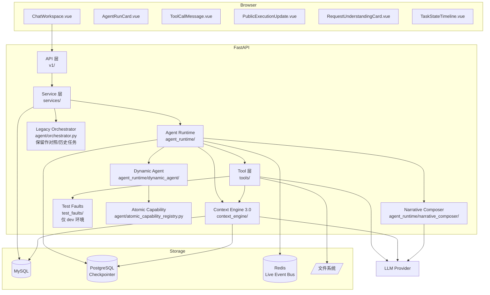

**dev_3.0 新增关键模块说明**:

- **Context Engine 3.0**(`C6`):统一 LLM 上下文组装(profile / source / composer / preflight / runtime / retrieval / scope)。所有 LLM 调用(`tools/`,`narrative_composer/`,`agent_runtime/preparation/`,`agent_runtime/repair/`,`agent_runtime/incremental/`)都**走 ContextInvokerBridge**,由 Bridge 决定是否走 CE composer。Maas 知识库检索结果通过 `Knowledge Source` 接入。
- **Dynamic Agent**(`C7`):新一代可规划 Agent 子图,Planner / Executor / Verifier / Replanner / Synthesizer + 4 个原子能力(`word_document_parse` / `knowledge_search` / `evidence_analysis` / `image_understanding`)。当前 dev_3.0 骨架已上线,业务接入待贯通。
- **Narrative Composer**(`C8`):LLM-first 叙事层,8 Tool 同步 Barrier;NarrativeValidator + 事实约束 + Tagged Stream V1 流式协议。`AGENT_RUNTIME_PHASE29B_TOOL_NARRATIVE_ENABLED=1` 显式启用,否则走确定性 fallback。
- **Test Faults**(`C9`):dev 环境 5 种故障注入,生产 `APP_ENV=production/prod` 二次保护。
- **Atomic Capability Registry**(`C10`):Dynamic Agent 调用的所有原子能力注册中心,与 Tool Adapter 共存但**不同抽象层级**(Atomic Capability = 业务最小可复用单元,经过能力选择器合并 Tool)。

### 4.3 分层职责

| 层 | 职责 | 不允许做 |
|---|---|---|
| 表现层(Vue 3) | 渲染、用户交互、SSE 监听 | 业务逻辑、数据库访问 |
| API 层(FastAPI Router) | 入参校验、鉴权、调用 Service | 业务编排、数据库事务 |
| Service 层 | 业务编排、跨 Repository 事务 | 直接调 LLM / Tool |
| Agent Runtime 层 | 引擎路由、LangGraph 执行、Tool 调用 | 直接读写业务表 |
| Tool 层 | 单一职责(解析 / 生成 / 导出) | 跨工具编排 |
| 数据层 | 模型 / Repository / Alembic | 业务规则 |

---

## 5. 技术栈

### 5.1 前端

| 依赖 | 用途 | 关键模块 |
|---|---|---|
| Vue 3 + TypeScript 5.7.2 | UI 框架 | `src/components/`,`src/views/` |
| Vite 6.0.5 | 构建 | `vite.config.ts` |
| Naive UI | 组件库 | `NTag`/`NButton`/`NIcon`/`NModal` |
| Pinia | 状态管理 | `src/stores/` |
| Vue Router | 路由 | `src/router/` |
| Axios + Fetch | HTTP | `api/client.ts` |
| 原生 EventSource + 自写 parser | SSE | `composables/useSse.ts` |
| markdown-it | Markdown 渲染 | `components/chat/MarkdownMessage.vue` |

**为什么用 Naive UI**:TypeScript 友好,组件按需引入,不强制 Tailwind,适合企业内部工具。

### 5.2 后端

| 依赖 | 版本/范围 | 用途 |
|---|---|---|
| FastAPI | ≥0.115.0 | Web 框架 |
| Pydantic | ≥2.10.0 | 入参校验 |
| Pydantic Settings | ≥2.6.0 | 配置 |
| SQLAlchemy | ≥2.0.36 | ORM(同步 + async) |
| Alembic | ≥1.14.0 | DB 迁移 |
| PyMySQL + aiomysql | ≥1.1 | MySQL 驱动 |
| LangGraph | **0.3.34**(精确锁定) | Agent 运行时 |
| langchain-core | 0.3.86(精确锁定) | LLM 接口 |
| langgraph-checkpoint-postgres | 2.0.25(精确锁定) | Postgres Checkpointer |
| asyncpg | ≥0.29 | Postgres async 驱动 |
| psycopg[binary] | ≥3.0 | Postgres sync 驱动(AsyncPostgresSaver 内部用) |
| Redis(可选) | ≥5.0,<6.0 | Live Event Bus |
| python-docx | ≥1.1.2 | Word 生成 |
| python-jose | ≥3.3 | JWT |
| passlib[bcrypt] | ≥1.7 | 密码哈希 |
| PaddleOCR | ≥3.0,<4.0 | 图片 OCR |
| **Knowledge Source Adapter**(MaaS 知识库) | 内部模块 | `app/context_engine/sources/knowledge.py` 接入 Maas KB |
| **ContextInvokerBridge** | 内部模块 | `app/context_engine/runtime/bridge.py` 统一 LLM 上下文组装 |

**LangGraph 版本锁定原因**:0.3.34 是 Phase 2.0 验证过的基线;**bumping 需要重跑 2.0+2.1 验证矩阵**(见 `backend/requirements.txt` 注释)。

**Context Engine 3.0 关键依赖**:不引入新 Python 包,沿用 SQLAlchemy + asyncpg + Pydantic + 已锁定的 LangGraph 0.3.34;`app/context_engine/profiles/registry.py` Profile 注册表 + Resolver 启动期加载,运行时只读。

### 5.3 数据存储

| 存储 | 角色 | 关键约束 |
|---|---|---|
| MySQL | 业务持久化(用户、会话、消息、Agent Task、Agent Event、Artifact) | `(task_id, sequence_no)` UNIQUE;`idempotency_key` UNIQUE |
| PostgreSQL | LangGraph Checkpointer | `checkpoints` 表 |
| Redis | 跨 Worker Live Event Bus + InFlight Lock | 可选,默认 InMemory |
| 文件系统 | 上传文件 + Artifact 产物 | atomic rename |

---

## 6. 前端架构

### 6.1 路由结构

```
/                          → 重定向到 /chat
/login                     → 登录
/register                  → 注册
/chat                      → ChatView(主工作区)
/chat/:conversationId      → 指定会话
/profile                   → 个人资料
/settings                  → 设置
/knowledge                 → 知识库管理(F017)
```

### 6.2 Chat Workspace 核心组件

```
ChatView.vue
└─ ChatWorkspace.vue            [chat/ChatWorkspace.vue]
   ├─ ChatMessageList.vue       渲染消息流
   │  ├─ MarkdownMessage        agent_text
   │  ├─ AgentRunCard           agent_plan + agent_run 容器
   │  │  ├─ ToolCallMessage     tool_call
   │  │  │  └─ PublicExecutionUpdate  [开发中] 嵌入
   │  │  └─ RetryBadge          tool_retry
   │  ├─ RequirementSummaryCard requirement_summary
   │  ├─ TemplateSummaryCard    template_summary
   │  ├─ KnowledgeSearchSummaryCard
   │  ├─ SectionConfirmCard     section_confirm(Interrupt)
   │  ├─ FormatLossConfirmCard  format_loss_confirm
   │  ├─ GeneratingStatusCard   generating_status
   │  ├─ ReviewResultCard       review_result
   │  ├─ ArtifactDownloadCard   artifact_download
   │  └─ ErrorMessageCard       error
   ├─ ChatInputBox              输入框 + 文件上传
   └─ EmptyState                空状态
```

### 6.3 关键 Store / Composable

| 文件 | 行数 | 职责 |
|---|---|---|
| `stores/conversationStore.ts` | ~550 | 会话列表 + restoreConversation + applyLiveTaskEvent + setTaskRunCollapsed |
| `stores/agentTaskStore.ts` | (存在) | 任务详情 / 取消 / 重试 |
| `composables/useSse.ts` | 135 | SSE 客户端(支持 Last-Event-ID 游标) |
| `composables/useTaskEvents.ts` | ~680 | Live SSE 事件处理 + chunk dedup + _rawEvent 附加 |
| `composables/useTaskEventRestore.ts` | ~516 | Hydrate 模式事件还原(已迁移至 reducer) |
| `composables/useTaskEventReducer.ts` | ~692 | **[新]** 统一 TaskRunReducer (hydrate/live 共用) |
| `utils/conversationTimeline.ts` | ~115 | **[新]** TimelineAssembler + TimelineSortKey |
| `composables/useFileUpload.ts` | (存在) | 文件上传 |

### 6.4 SSE 连接

- 入口:`ChatWorkspace.vue` auto-SSE watch
- URL:`/api/v1/agent-tasks/{task_public_id}/events`(Bearer token 鉴权)
- Reconnect:固定 1000ms(无指数退避)
- **Last-Event-ID**:Phase 2.9A.28 已启用,pre-confirm `/events` 支持 DB 补发
- **每 Task 独立 cursor**:`TaskRunBlock.lastEventCursor` 替代 Conversation 级 cursor

### 6.5 任务事件处理

`useTaskEvents.ts` 内部:
- `eventTypeToMessageType` 映射(24→11)
- `toolChunkIndexByMessageId` Map → 丢弃 out-of-order chunk
- `pendingPlanStepStatuses` Map → plan_step 流式缓冲
- `asPublicUpdate` 解析 public_execution_update 字段
- `eventDataToMessage` 单事件→ChatMessage 转换(payload ?? payload_json ?? data 三级 fallback)

---

## 6B. Conversation Timeline Assembly (Phase 2.9A.30)

### 6B.1 问题背景

历史会话恢复时,task 内部事件（plan/tool/summary 等）被伪装成主会话 ChatMessage,与 user 消息混合排序。由于 task 事件的 `conversationSequence = canonical_order`（范围 1-59）与 user 消息的 `conversation_sequence`（范围 1,2,3）在同一数值空间,导致 Task Block 被拆成多个碎片。

### 6B.2 架构方案

```
API 数据规范化                    前端 Timeline 组装
┌─────────────────┐              ┌──────────────────────────┐
│ normalize_json   │              │ assembleConversation     │
│   _object()      │              │   Timeline()             │
│                  │              │                          │
│ payload → dict   │              │ messages (regular only)  │
│ attached_files ✓  │              │   + taskRunBlocks[]      │
│ trigger_msg_id   │              │   → ConversationItem[]   │
│   → public_id    │              │                          │
└─────────────────┘              │ 结构化 TimelineSortKey   │
                                 │ sequence → rank → time   │
                                 │ → stableId               │
                                 └──────────────────────────┘
```

### 6B.3 核心组件

| 组件 | 文件 | 职责 |
|---|---|---|
| `assembleConversationTimeline()` | `utils/conversationTimeline.ts` | 从 messages + taskRunBlocks 生成 ConversationItem[] |
| `TimelineSortKey` | `utils/conversationTimeline.ts` | 结构化排序键（替代 +0.5 浮点数） |
| `reduceTaskEvent()` | `composables/useTaskEventReducer.ts` | 统一 reducer（hydrate/live 共用） |
| `normalizeTaskEvent()` | `composables/useTaskEventReducer.ts` | 纯函数事件归一化 + event_id 去重 |
| `TaskRunBlock` | `types/index.ts` | 完整任务运行块模型（events/toolExecutions/artifacts） |

### 6B.4 数据流

```
1. restoreConversation()
   ├─ fetchMessages → regular messages (no task events)
   ├─ restoreAllTaskRuns(tasks) → TaskRunBlock[] per task
   │   ├─ fetchTaskDetail → task metadata
   │   ├─ fetchAllTaskEvents → events
   │   ├─ reduceTaskEvents(block, events, 'hydrate') → updated block
   │   └─ fetchTaskArtifacts → artifacts
   └─ store: { messages: regular, taskRunBlocks: TaskRunBlock[] }

2. Live SSE
   └─ applyLiveTaskEvent(convId, taskId, rawEvent)
       └─ reduceTaskEvent(block, event, 'live') → updated block

3. ChatMessageList
   └─ conversationItems = assembleConversationTimeline(
         messages, taskRunBlocks, tasks
      )
```

### 6B.5 排序规则

| 消息类型 | sequence | rank | createdAt | stableId |
|---|---|---|---|---|
| User/Agent text | `conversationSequence` | 0 | `Date.parse(createdAt)` | `message.id` |
| 绑定 trigger 的 Task | `triggerMessage.conversationSequence` | 1 | `Date.parse(task.startedAt)` | `task:${taskId}` |
| 无 trigger 的 Legacy Task | `Number.MAX_SAFE_INTEGER` | 1 | `Date.parse(task.startedAt)` | `task:${taskId}` |

### 6B.6 事件去重

- **事件级**: `seenEventIds: Record<string, true>` — 每个 event_id 只处理一次
- **分片级**: `receivedChunkIndexes: Record<number, true>` — 每个 chunk_index 只合并一次
- **终态判定**: 只有 `chunk_final=true` 或 `tool_failed` 才标记 `terminal=true`

---

## 7A. 意图识别(Intent Recognition)

> **为什么重要**:项目定位是**智能助手**,不只是"测试方案生成器"。当前只落地测试方案生成与智能问答,但后续要扩展需求分析、缺陷分析报告生成等功能。**用户消息到底想干什么**(意图)决定了走哪条处理链路 —— 这是智能助手能力扩展的地基。

### 7A.1 架构:LLM 分类 + 确定性覆盖

意图识别不是单一模型调用,而是 **三层防御**:

```
1. 确定性快路径(_deterministic_test_plan_intent)
   └─ 关键词命中「生成+测试方案」→ 直接 TEST_PLAN_GENERATION,不调 LLM

2. LLM 分类(IntentRouter.recognize → LLMClient.generate_with_profile)
   └─ 带对话上下文(IntentContext)让模型判断 8 类意图 + 6 种路由

3. 文件需求覆盖(_apply_file_requirement_override)
   └─ 用真实文件状态纠正 LLM 的 ask_for_files / agent_task 决策
```

**失败语义**:`recognize` 永不抛异常。LLM 调用失败、JSON 解析失败、低置信度全部降级为 `CLARIFY`(让用户澄清),**绝不让 LLM 故障意外触发 AgentTask 创建**。

### 7A.2 意图与路由枚举(`app/agent/enums.py`)

| 枚举 | 值 | 说明 |
|---|---|---|
| `IntentType` | `general_chat` | 闲聊 / 概念咨询 |
| | `test_plan_generation` | 测试方案生成(当前唯一完整链路) |
| | `test_case_generation` | 测试用例生成(规划中,返回 unsupported) |
| | `document_question` | 对已上传文档提问(规划中) |
| | `knowledge_question` | 知识库问答(规划中) |
| | `result_modification` | 对已存在任务结果的修改/补充(走 Incremental) |
| | `ppt_generation` / `excel_generation` | PPT / Excel 生成(规划中) |
| | `unknown` | 无法判断 → clarify |
| `MessageRoute` | `chat_reply` | 走 ChatLLMService 生成普通回复 |
| | `agent_task` | 创建 AgentTask(唯一允许创建任务的路径) |
| | `ask_for_files` | 引导用户上传缺失文件 |
| | `unsupported` | 功能未开放,给默认文案 |
| | `clarify` | 让用户澄清 |
| | `existing_task_action` | 对进行中任务的操作(继续/确认) |

### 7A.3 意图识别链路(核心代码)

| 层 | 文件 | 职责 |
|---|---|---|
| 意图路由 | `app/agent/intent_router.py` | `IntentRouter.recognize()` — LLM 分类 + 结构化 IntentResult |
| 意图 Prompt | `intent_router.py:_INTENT_SYSTEM_PROMPT` | 8 意图 + 6 路由 + 文件状态 + 已有任务优先级规则 |
| 确定性快路径 | `app/services/message_service.py:_deterministic_test_plan_intent` | 关键词命中测试方案生成,不调 LLM |
| 文件覆盖 | `message_service.py:_apply_file_requirement_override` | 用真实文件状态纠正 ask_for_files / agent_task |
| 意图上下文 | `app/services/conversation_context_service.py:build_intent_context` | 构建 IntentContext(最近轮次 + 摘要 + 任务状态) |
| LLM 合同 | `app/llm/task_profiles.py:INTENT_PROFILE` | 严格 JSON、无 Markdown、解析失败回退 CLARIFY JSON |

### 7A.4 路由决策流(一条消息怎么走)

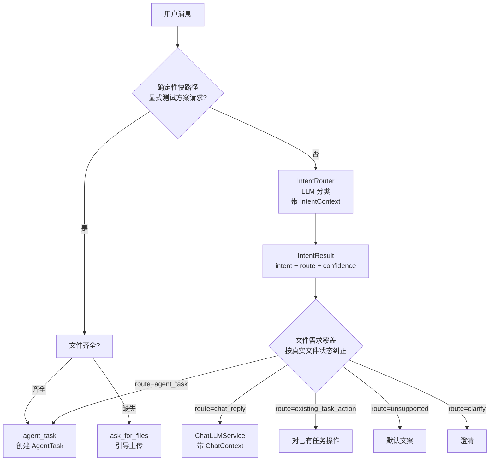

### 7A.5 关键规则(从 Prompt 提炼)

1. **只有 `route=agent_task` 才允许创建 AgentTask**(第 12 条)
2. 上传文件 ≠ 自动生成,必须有明确生成意图(第 10 条)
3. "帮我看看/处理一下" 不创建任务(第 11 条)
4. **已有任务动作优先级最高**:最近任务 `waiting_user_confirm` + 用户说"继续/确认" → `existing_task_action`;running/generating → `existing_task_action`;completed/failed → `chat_reply`(任务已结束)(第 13-15 条)
5. **低置信度防御**:`confidence < 0.5` 且 route=agent_task(非 result_modification)→ 降级 clarify(第 6 条置信度规则)
6. **合并回复**:route=chat_reply 时,LLM 同时在 `reply` 字段生成回复内容;上下文仅作背景,回复焦点永远是当前这条消息

### 7A.6 对智能助手扩展的意义

- 新增能力(需求分析、缺陷分析)只需:①`IntentType` 加枚举;②`_INTENT_SYSTEM_PROMPT` 加一条路由规则;③实现对应的 agent_task 链路。**意图分类器本身不用重写**。
- `result_modification` 已为「结果修改」铺路 —— 用户在生成后说"把第 3 章改一下"能路由到 Incremental Agent。
- `document_question` / `knowledge_question` 已预留在意图层,当前返回 unsupported 文案,后续接文档问答 / 知识库问答即可激活。

---

## 7B. 对话上下文(Dialogue Context)

> **为什么重要**:智能助手必须"记得上文"。TestAgent 用 **分层上下文** 在 LLM 调用前重建会话背景 —— 不是把整个历史塞给模型,而是用「最近轮次 + 会话摘要 + 文件摘要 + 任务摘要」四层,控制 token 预算的同时保留关键背景。

### 7B.1 分层上下文架构(F016)

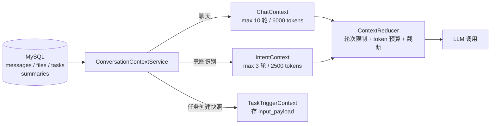

### 7B.2 四种上下文对象(`app/schemas/context.py`)

| 对象 | 用途 | 关键字段 |
|---|---|---|
| `ChatContext` | 普通聊天回复 | 最近 10 轮消息 + 会话摘要 + 文件摘要 + 最近任务摘要 + 知识库片段(F026) |
| `IntentContext` | 意图识别 | 最近 3 轮 + 会话摘要 + 文件摘要 + 最近任务摘要 + 本消息附加文件 |
| `TaskTriggerContext` | 任务创建快照 | 会话摘要 + 用户目标 + 选中文件 + intent/route,存 `agent_tasks.context_json` |
| `KnowledgeContext` / `LongTermMemoryContext` | 知识库问答 / 长期记忆(预留) | 尚未接入管线 |

### 7B.3 构建流程(`ConversationContextService`)

每个 LLM 调用前按需构建:

| 步骤 | 数据源 | 说明 |
|---|---|---|
| 最近轮次 | `MessageRepository.list_recent_by_conversation` | 只取 `user_text` / `agent_text`,非空内容 |
| 会话摘要 | `ConversationSummaryRepository.get_latest_active` | LLM 压缩过的历史摘要,非原始全文 |
| 文件摘要 | `FileRepository.list_by_conversation` | 轻量元数据(public_id / 文件名 / 类型 / 状态),**不含 storage_path** |
| 最近任务 | `AgentTaskRepository.list_by_conversation` + 待确认数 / 产物数 / 最新事件 / 失败工具 | 让意图识别判断「继续上一个任务」还是「新建任务」 |

**Fail-safe**:任何一步异常都降级为空上下文,绝不让上下文构建阻塞消息流。

### 7B.4 上下文压缩(`app/common/context_reducer.py`)

`ContextReducer` 用纯函数控制大小:

| 参数 | 默认值 | 作用 |
|---|---|---|
| `max_chat_turns` | 10 | 聊天上下文最近轮次 |
| `max_intent_turns` | 3 | 意图上下文最近轮次(意图识别要轻量快) |
| `max_chat_tokens` | 6000 | 聊天上下文 token 预算 |
| `max_intent_tokens` | 2500 | 意图上下文 token 预算 |
| `max_summary_chars` | 1200 | 会话摘要截断长度 |
| `max_file_summaries` | 10 | 最多带几个文件摘要 |
| `max_single_message_chars` | 1500 | 单条消息截断长度 |

**截断策略**:超长文本加 `[内容过长,已截断]` 后缀;最近轮次按 `created_at` 倒序取 N 条再反转回正序(保证最近在上文末尾,最贴近当前消息)。

### 7B.5 会话摘要(长期上下文)

`ConversationSummaryService` 负责把长对话压缩成摘要,解决"上下文窗口放不下整个历史"的问题:

- **触发阈值**:消息数 ≥ 12 才生成;新消息比上次摘要覆盖多 ≥ 8 条 → 判定过期重新生成
- **生成**:`SUMMARY_PROFILE`(LLM)把最近 50 条消息转录压缩成一段摘要
- **存储**:`conversation_summaries` 表(`summary_text` / `covered_message_start_id` / `covered_message_end_id` / `message_count`)
- **软异步**:`maybe_update_summary` 失败只 log,绝不阻塞消息流
- **调用点**:`MessageService.send_message` / `stream_message` 末尾触发

### 7B.6 上下文如何注入 LLM(以意图识别为例)

`IntentRouter._build_context_user_content` 把 `IntentContext` 渲染成结构化 Prompt:

```
【当前用户消息】
<本次消息>(永远放第一,保证可见性)

【会话摘要】
<LLM 压缩的历史摘要>

【最近对话(仅作背景参考)】
用户:...
助手:...

【当前会话文件摘要】
- file_id=... file_name=... file_type=...

【最近任务状态】
任务类型：test_plan_generation；状态：waiting_user_confirm；待确认：1 项
```

**关键设计**:当前消息放第一 + 上下文仅作背景。这与 7A.5 第 6 条呼应 —— 回复焦点永远是当前消息,历史只是帮助理解。

### 7B.7 对智能助手扩展的意义

- **能力无关**:分层上下文是通用的,新增需求分析 / 缺陷分析能力时复用同一套 `ConversationContextService` + `ContextReducer`。
- **任务上下文可追溯**:每个 AgentTask 创建时写入 `TaskTriggerContext` 快照(存 `context_json`),执行时能还原"用户当时想干什么、带了哪些文件、意图是什么"。
- **长期记忆预留**:`LongTermMemoryContext` 已定义 schema,未来可接跨会话记忆。
- **F026 已打通知识库片段注入**:`knowledge_snippets` 注入 `ChatContext`,为「知识库问答」能力铺路。

---

## 7. 后端分层架构

### 7.1 标准分层

```
API Router (app/api/v1/*.py)
    ↓ 调
Schema (app/schemas/*.py)
    ↓ 验
Service (app/services/*.py)
    ↓ 编排
Repository (app/repositories/*.py)
    ↓ 持久化
Model (app/models/*.py)
    ↕ ORM
MySQL / PostgreSQL
```

### 7.2 Agent Runtime 为何独立

Agent Runtime(`app/agent_runtime/`)独立于普通业务 Service,因为:
1. **引擎可替换**:LangGraph vs Legacy,EngineRouter 决定
2. **执行时间长**:LLM 调用 + Tool 调用可能跑几十秒,不适合普通 HTTP 请求-响应
3. **需要 Checkpointer**:PostgreSQL 持久化图状态,这是普通 Service 没有的概念
4. **事件驱动**:通过 AgentEvent + Live Event Bus 而不是返回值传递中间状态
5. **多 Worker**:通过 Outbox + Worker 轮询分布式执行

**调用方向**:
- `Service` 可以调 `Agent Runtime`(`agent_task_service.create_task` → `api_dispatcher.dispatch_new_task`)
- `Agent Runtime` 调 `Tool`,Tool 调 `Repository`(不经 Service)
- `Legacy orchestrator` 调 `Service`(例如 `message_service` 创建任务附件关联)

---

## 8. Agent 总体架构

### 8.1 Workflow vs Agent

- **Workflow**:步骤和分支都是确定的,LLM 只是其中一个节点(TestAgent 的 LangGraph 主图)
- **Agent**:LLM 决定下一步走哪里,工具是可选分支(TestAgent 的 Preparation / Repair / Incremental / Dynamic Agent 子图)

### 8.2 为什么"确定性主图 + 动态子图"

- 整个测试方案生成**主流程是确定的**:解析需求 → 解析模板 → 知识库检索 → 章节建议 → 用户确认 → 生成 → 审查 → 局部修复 → 导出 → 格式检查 → 用户确认 → 任务总结
- 但**有些步骤内部需要动态决策**:
  - 准备阶段不知道需要哪些信息 → Preparation Agent 搜索知识库
  - 审查发现问题 → Repair Agent 决定改哪里
  - 增量任务 → Incremental Agent 识别修改范围
  - **新:Dynamic Agent 子图**(生成式 / 问答式任务) → Planner 决定步骤
- 全用 Agent → 不可控,LLM 可能跳步
- 全用 Workflow → 不能处理意外情况
- **混合模式**:主图 = Workflow,关键决策点 = Subgraph(Agent)

### 8.3 模型为什么不能控制所有步骤

- **可靠性**:LLM 输出格式不可预测,直接驱动图跳转容易崩
- **可观测性**:每一步都要写 AgentEvent,LLM 直接跳步就丢事件
- **可恢复性**:Checkpointer 按 Node 切,LLM 自由跳转恢复点不固定
- **成本**:LLM 调用贵,主图里每个跳转都调模型不划算

### 8.4 工具为什么要经过 ToolAdapter

`agent_runtime/adapters/test_agent_tool_adapter.py` 提供:
- **白名单**:只能调注册的 Tool,防止 LLM 注入任意 Python 调用
- **Tool Identity Contract**:回写真实 `tool_call_id` + `last_terminal_event_id`,前端按 `(sourceToolCallId, attempt)` 锚定(Phase 2.9B.4 修复「执行了但未显示」)
- **参数校验**:`tool_input_schema` Pydantic 校验
- **Scope Guard**:不允许跨用户读 Artifact
- **Budget Guard**:每个 Tool 调用计费,防 LLM 死循环
- **Envelop**:统一 ToolResult 格式

### 8.5 Dynamic Agent 子图(`backend/app/agent_runtime/dynamic_agent/`,dev_3.0 上线)

```
START → initialize → create_plan → validate_plan
                            │
                ┌───────────┼───────────┐
                │           │           │
            execute_next_step          need_user
                │           │           │
                ▼           ▼           END
            verify_goal (COMPLETE/CONTINUE/REPLAN/NEED_USER)
                │           │           │
            synthesize    replan        fail
                │           │           │
            persist_final_answer → finalize → END
```

| 节点 | 目的 |
|---|---|
| `initialize` | 初始化 task_status / completed_nodes |
| `create_plan` | DynamicPlanner(LLM + deterministic fallback)生成 Plan |
| `validate_plan` | DynamicPlanValidator 校验 schema |
| `execute_next_step` | DynamicStepExecutor(bridge / deterministic 双模式)执行下一个 pending step |
| `verify_goal` | DynamicVerifier 四态判定(complete / continue / replan / need_user) |
| `replan` | DynamicReplanner(Gap-driven,≤2 次)重新规划 |
| `synthesize` | DynamicSynthesizer 私有化合成最终答复 |
| `persist_final_answer` | 写最终答复 |
| `need_user` | 等待用户补充(动态生成 question) |
| `finalize` | 任务完成 |
| `fail` | 任务失败 |

**Atomic Capability Registry**(`backend/app/agent/atomic_capability_registry.py`):Dynamic Agent 调用的所有原子能力注册中心,4 个原子能力:
- `word_document_parse` — Word 文档解析
- `knowledge_search` — 知识库检索
- `evidence_analysis` — 证据分析
- `image_understanding` — 图片理解

**当前状态**:dev_3.0 骨架已上线,业务接入测试用例生成 / 文档问答 / 知识库问答等场景待贯通;test_plan 业务负载仍走 v3 主图,Dynamic Agent 独立 graph name 不挂在 v3 下。

---

## 9. LangGraph v3 主图(Graph v3 真实拓扑,dev_3.0)

### 9.1 拓扑图(`backend/app/agent_runtime/graphs/test_plan/versions/v3/graph.py`)

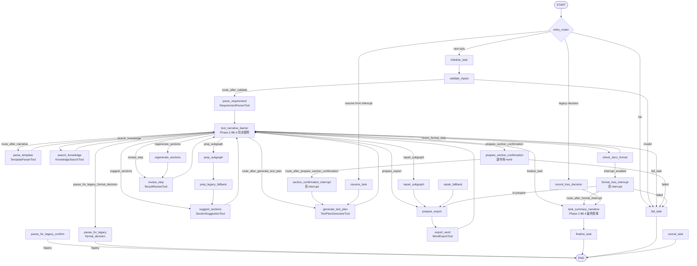

### 9.2 节点说明(dev_3.0 真实节点)

| 节点 | 目的 | 是否调 LLM | 是否调 Tool | 是否可重试 | 下一节点 |
|---|---|---|---|---|---|
| `initialize_task` | 初始化 runtime + 任务状态 | ✘ | ✘ | ✘ | validate_inputs |
| `validate_inputs` | 校验输入 + 加载 context | ✘ | ✘ | ✘ | parse_requirement / fail_task |
| `parse_requirement` | 解析需求文档 | ✘ | ✔ RequirementParserTool | ✔ | tool_narrative_barrier |
| `tool_narrative_barrier` | **Phase 2.9B.4** 同步叙事屏障:每个 Tool 叙事完成后才进入下一节点 | ✘ | ✘ | ✘ | route_after_narrative 多分支 |
| `parse_template` | 解析模板 | ✘ | ✔ TemplateParserTool | ✔ | tool_narrative_barrier |
| `search_knowledge` | 知识库检索 | ✔ | ✔ KnowledgeSearchTool | ✔ | tool_narrative_barrier |
| `prep_subgraph` | 准备阶段子图入口 | ✔ | ✔ | ✔ | prep_legacy_fallback |
| `prep_legacy_fallback` | 准备阶段 fallback | ✘ | ✔ | ✘ | suggest_sections |
| `suggest_sections` | 章节建议 | ✘ | ✔ SectionSuggestionTool | ✔ | tool_narrative_barrier |
| `prepare_section_confirmation` | 准备章节确认副作用(持久化 + emit 事件) | ✘ | ✘ | ✘ | section_confirmation_interrupt / fail_task |
| `section_confirmation_interrupt` | **Interrupt** 等待用户确认(真 sync) | ✘ | ✘ | ✘ | generate_test_plan |
| `pause_for_legacy_confirm` | legacy sentinel pause 路径(default 不走) | ✘ | ✘ | ✘ | END |
| `resume_task` | 从中断恢复 | ✘ | ✘ | ✘ | generate_test_plan |
| `generate_test_plan` | 生成测试方案(MIG_GENERATE 含 ContextInvokerBridge) | ✔ | ✔ TestPlanGeneratorTool | ✔(JSON 错走 schema_feedback) | tool_narrative_barrier |
| `review_step` | 自动审查(ResultReviewTool) | ✔ | ✔ ResultReviewTool | ✔ | tool_narrative_barrier |
| `regenerate_sections` | 整段重新生成 | ✔ | ✔ TestPlanGeneratorTool | ✔ | review_step |
| `repair_subgraph` | 局部修复(Repair Agent 子图,`agent_runtime/repair/`) | ✔ | ✔ TestPlanRegenTool | ✔ | prepare_export |
| `repair_fallback` | Repair 不可达时的 fallback | ✘ | ✔ | ✘ | prepare_export |
| `prepare_export` | 准备导出(校验 section_package) | ✘ | ✘ | ✘ | export_word |
| `export_word` | 导出 Word | ✘ | ✔ WordExportTool | ✔ | tool_narrative_barrier |
| `check_docx_format` | 格式检查 | ✘ | ✔ DocxFormatCheckTool | ✔ | format_loss_interrupt / tool_narrative_barrier |
| `format_loss_interrupt` | **Interrupt** 等待格式损失决定 | ✘ | ✘ | ✘ | task_summary_narrative / prepare_export / fail_task |
| `pause_for_legacy_format_decision` | legacy sentinel 路径 | ✘ | ✘ | ✘ | END |
| `record_loss_decision` | legacy 路径写入用户决定 | ✘ | ✘ | ✘ | task_summary_narrative |
| `task_summary_narrative` | **Phase 2.9B.4** 任务总结 LLM 叙事 + 事实校验 | ✔ | ✘ | ✔ | finalize_task |
| `finalize_task` | 写 Artifact + 终态事件 | ✘ | ✘ | ✘ | END |
| `fail_task` | 终态失败 | ✘ | ✘ | ✘ | END |
| `cancel_task` | 终态取消 | ✘ | ✘ | ✘ | END |

### 9.3 子图入口

- **Preparation / Repair / Incremental** 子图通过 `compile_test_plan_graph("v3")` 注册到 `GraphRegistry`。主图用 `Command(goto=...)` 跳入子图,子图返回后回到主图。
- **Dynamic Agent 子图**(`backend/app/agent_runtime/graphs/dynamic_agent/graph.py`):独立 graph name,不挂在 v3 test_plan 图下,通过 `intelligent_router`/`dispatcher` 入口调用。

### 9.4 关键设计变更

- **`tool_narrative_barrier`**:Phase 2.9B.4 在每个 Tool 节点后插入的同步叙事屏障,等 Narrative Composer 完成叙事(fallback / LLM)后才进入下一节点。**禁用同步 Barrier 会导致 task_summary_narrative 拿到不完整事实**。
- **`section_confirmation_interrupt` + `format_loss_interrupt`**:v3 默认 `interrupt_enabled=True`,**真 sync `interrupt()` 节点**;`pause_for_legacy_confirm` / `pause_for_legacy_format_decision` 保留 sentinel pause 路径但默认不再走,否则 Resume 时 LangGraph 找不到 pending interrupt 而重跑整个图,任务永远停在 `waiting_user_confirm`。
- **`task_summary_narrative`**:任务总结由 NarrativeComposer LLM 生成 + Fact Validator 校验,失败时 deterministic fallback;`task_completed` 事件不覆盖 `taskSummaryNarrative` 槽位,前端 `completionSummary = validLlmTaskSummary ?? deterministicTaskSummary`。

---

## 10. Preparation Agent(动态子图)

### 10.1 子图结构

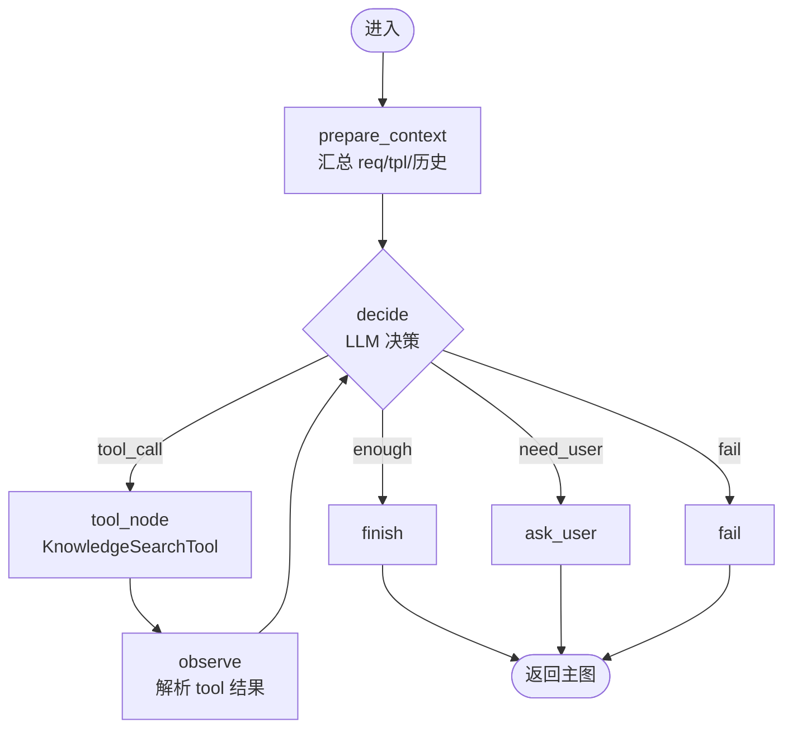

### 10.2 示例:知识库搜索

> 用户需求文档说"测试智能工单系统的性能"。Preparation Agent 看到 `req.tpl.coverage` 没填,且 `kb.query('性能测试 智能工单')` 返回 3 个相似案例。

步骤:
1. **prepare_context** 汇总:`requirement_coverage={"功能": [...], "性能": null, "安全": [...]}`,模板要求所有维度
2. **decide**(LLM):看到性能缺 → `tool_call(name="KnowledgeSearchTool", input={"query": "智能工单系统 性能测试用例"})`
3. **tool_node** 调用知识库 API → 返回 3 个相似案例
4. **observe** 把 3 个案例 append 到 `state.kb_results`
5. **decide**(LLM):够了 → finish
6. **finish** 触发主图 `section_suggest` 把 3 个案例塞进"性能"章节建议

### 10.3 Budget 限制

Preparation Agent 受 `BusinessBudgets.preparation_max_steps=8`(可配置),超过强制 finish 防 LLM 死循环。

---

## 11. Review Repair Agent(动态子图)

### 11.1 子图结构

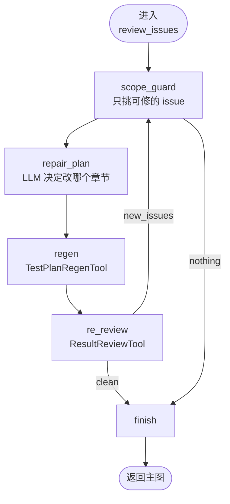

### 11.2 ReviewIssue 与 Scope Guard

- **ReviewIssue**:`{"section": "性能测试", "type": "missing_coverage", "severity": "high"}`
- **Scope Guard**:只允许修复 `section in state.locked_sections` 的章节;不能动用户已确认的章节
- **最大循环**:`repair_max_loops=3`,超过放弃

### 11.3 为什么不能整篇重生成

- LLM 整体重生成 → 用户看到全部章节变化 → 不可控
- 局部修 → 用户只看到修改章节的 diff → 可解释、可撤回
- Checkpointer 在 Repair 失败时只回滚到 review 节点,不重跑全图

---

## 12. Incremental Agent(动态子图)

### 12.1 工作流

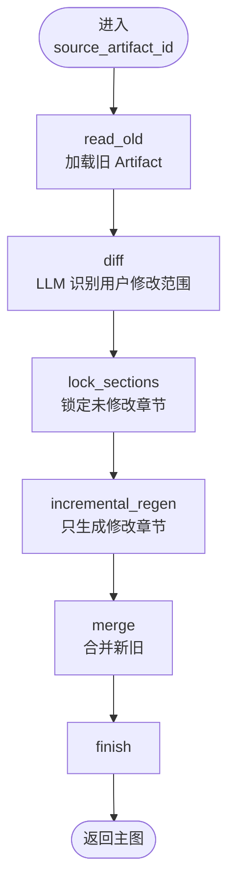

### 12.2 关键点

- `source_artifact_id` 由用户在 Conversation 里指定
- `lock_sections` 把不变章节拷到 `state.locked_sections`,Repair Agent 不能动
- 创建新 Artifact 时 `idempotency_key` 不同,**不会覆盖旧 Artifact**(`artifact` 表按 idempotency_key UNIQUE)

---

## 13. 工具系统

### 13.1 调用链

```
Agent Decision (LLM output)
    ↓
ToolAdapter (whitelist + Tool Identity Contract + envelope + rate limit)
    ↓
Scope Guard / Budget Guard
    ↓
ToolExecutor.run(tool, inputs, ctx, retry_context)
    ↓
Tool.run(inputs, ctx, retry_context)
    ↓
TestPlanGeneratorTool: 走 ContextInvokerBridge → ContextEngine 3.0 composer → LLM
    其他 Tool: 直接调 LLM
    ↓
ToolResult (统一信封,带 narrative 锚点)
    ↓
narrative_composer.composer.build_for_tool_result(...)
    ↓
tool_narrative_barrier / task_summary_narrative 同步屏障
    ↓
写 AgentEvent + SSE
```

### 13.2 核心 Tool 清单(dev_3.0)

| Tool | 文件 | 调用方式 | 失败重试 | dev_3.0 变更 |
|---|---|---|---|---|
| `RequirementParserTool` | `tools/requirement_parser_tool.py` | 同步(OCR 走 Paddle) | hard_stop / degrade | – |
| `TemplateParserTool` | `tools/template_parser_tool.py` | 同步 | hard_stop | – |
| `KnowledgeSearchTool` | `tools/knowledge_search_tool.py` | HTTP | skip / degrade | **Maas KB → ContextEngine Knowledge Source** 与 MIG_GENERATE 路径对齐 |
| `SectionSuggestionTool` | `tools/section_suggestion_tool.py` | 同步(LLM 间接) | hard_stop | – |
| `TestPlanGeneratorTool` | `tools/test_plan_generator_tool.py` | LLM(走 ContextInvokerBridge) | schema_feedback | **MIG_GENERATE 路径恢复**;**表头不符不抛**;**F023 内容拆分**;**schema_issues 透传**;**接 Test Faults 注入钩子** |
| `ResultReviewTool` | `tools/result_review_tool.py` | LLM | schema_feedback | **语义失败与工具执行失败区分**;失败时 block_issues 拆分;`ReviewIssue` 不被工具异常吞掉 |
| `TestPlanRegenTool` | `tools/test_plan_regen_tool.py` | LLM | schema_feedback | **cfg_subset self-healing**(RepairAgent LLM 构造残缺时从 ctx.template_structure 重建);**multi-key 索引**(section_id / id / field / title 任一命名空间命中);**length 校验** |
| `WordExportTool` | `tools/word_export_tool.py` | 同步(python-docx) | same_inputs / hard_stop | – |
| `DocxFormatCheckTool` | `tools/docx_format_check_tool.py` | 同步 | schema_feedback | – |

### 13.3 ResultReviewTool 语义失败区分(Phase 2.9A.X)

```
工具执行本身失败(Pydantic / network / timeout):
  → 抛 ToolError, RetryPolicy.decide() 决定同 inputs / backoff / degrade / hard_stop
  → 失败最终计入 task_failed,不算"审查未通过"

工具执行成功但发现语义问题(如缺章节 / 表头不符 / F023 拆分漏):
  → block_issues 拆分到 ResultReviewTool 输出 payload
  → Repair Agent scope_guard → decision_filter → TestPlanRegenTool
  → 任务显示"执行完成,但审查未通过"(前端 ResultReviewTool 卡片文案)
```

### 13.4 TestPlanRegenTool self-healing(dev_3.0)

修复 `REGEN_NOTHING_TARGETABLE` 反复触发的根因:

```
RepairAgent LLM 构造 cfg_subset:
  ↓ 经常丢字段 / 把 section_id 错用为 field
  ↓ 导致 _find_config_entry 反复 MISS
  ↓ 触发 REGEN_NOTHING_TARGETABLE

TestPlanRegenTool.run() 入口增加 self-healing:
  ├─ 若 cfg_subset 缺失 / ai_fields 为空 → _rebuild_cfg_subset(context, section_ids)
  │   ├─ 从 context.template_structure.generation_config.ai_fields 过滤
  │   ├─ 匹配命名空间:entry.field == sid / entry.section_id == sid / sid in entry.title
  │   └─ 去重返回至少包含 section_ids 的 cfg_subset
  └─ 若仍不足 → REGEN_NO_CONFIG (UNRECOVERABLE)

_index_by_id 改 multi-key 索引:
  每个 section 在索引里挂 section_id / id / field / title 任一可用 key
  上游按任一命名空间传 section_ids 都能命中
```

### 13.5 Test Faults 故障注入(`backend/app/test_faults/__init__.py`,仅 dev 环境)

```
TestPlanGeneratorTool.run() 中:
  raw_json = await llm_client.generate(...)
  raw_json = apply_test_faults(raw_json, generation_config)   ← 注入钩子
  # 后续 truncation / parse 失败 → TestPlanRegenTool 链路回归
```

5 种故障:`FAULT_SCHEMA_HEADER_MISMATCH` / `FAULT_MISSING_SECTION` / `FAULT_JSON_TRUNCATE` / `FAULT_EMPTY_SECTION_CONTENT` / `FAULT_SECTION_INVALID_VALUE`。
每轮只触发第一个(避免组合爆炸),由 `FAULT_ENABLED=1` 总开关 + 生产 `APP_ENV=production/prod` 二次保护。

---

## 14. 模型调用设计

### 14.1 模型配置来源

- 用户级:`user.model_config_id`(F015 每个用户可配)
- 全局:`model_configs` 表 + `model_config_repository`
- ChatLLMService 启动时按 `user_id` 选配置

### 14.2 Prompt 构造

- 系统提示词:每个 Tool 自己的 `system_prompt_template`
- 用户提示词:`context.requirement_summary + context.template_summary + ...`
- F022 提取的用户约束以 `system_append` 注入

### 14.3 结构化输出

- Native Tool Calling(优先)
- Structured Action Fallback Mode B(JSON-mode schema 注入)
- Schema 校验失败 → `JSON_VALIDATION_FAILED` → 走 `schema_feedback` retry

### 14.4 不信任模型原始输出

- 所有 LLM 输出经 Pydantic `model_validate` 后再写 State
- Schema 校验失败**绝不直接用**,一定 retry 或 fail
- Token 统计进 `agent_runs.token_usage` 字段

### 14.5 Context Engine 3.0 统一上下文组装(dev_3.0)

```
LLM 调用目标:
  ├─ TestPlanGeneratorTool(MIG_GENERATE)
  ├─ ResultReviewTool
  ├─ TestPlanRegenTool
  ├─ NarrativeComposer(LLM 叙事)
  ├─ Preparation / Repair / Incremental agent_loop LLM
  └─ Dynamic Agent Planner / Replanner
       ↓
ContextInvokerBridge.invoke(...)
  ├─ ProfileResolver → ContextProfile
  ├─ SourceRegistry.collect(profile)  → Source Bundle
  ├─ Composer.compose(sources, profile)
  ├─ Preflight.compress(composed_snapshot)  → 水位状态机
  └─ ContextAwareLLMInvoker(llm_client) → 真正 LLM 调用
       ↓
透传 llm_client(避免 bridge provider 丢失)
```

**关键设计**:
- **Profile Registry**:`backend/app/context_engine/profiles/registry.py` 启动期加载,运行时只读。
- **Source Adapter**:`backend/app/context_engine/sources/` 10+ adapters(conversation / memory / summary / system_rules / artifact / file_document / knowledge / task_state / workspace_instruction / orchestrator / deadline)。
- **CE 知识库接入**:`sources/knowledge.py` 接收 Maas KB 检索结果,作为 Knowledge Source 注入 composer。
- **Preflight 压缩水位状态机**:超 token 预算时按 strategy 压缩(compress / truncate / drop),保留关键事实。
- **Scope Validator**:`backend/app/context_engine/scope/task_scope_validator.py` 校验任务级别访问权限。

### 14.6 Fallback 链

```
LLM 调用失败(NETWORK / TIMEOUT / 5xx):
  ├─ RetryPolicy.decide():
  │   NETWORK_ERROR_CODES → backoff retry, 3 次后 task_failed
  │   SCHEMA_ERROR_CODES → schema_feedback(同 inputs)
  │   DEGRADABLE_ERROR_CODES → degrade(降级到无 LLM 路径)
  └─ 失败 3 次 → task_failed
```

---

## 15. State 与 Runtime Context

### 15.1 State(任务现在是什么样)

LangGraph `StateGraph` 的 TypedDict:

```
TestPlanState:
  task_id: str
  user_id: int
  requirement: RequirementSummary
  template: TemplateSummary
  kb_results: list[KBHit]
  locked_sections: list[str]
  generated_sections: dict[str, Section]
  review_issues: list[ReviewIssue]
  review_iteration: int
  preparation_iteration: int
  current_node: str
  errors: list[str]
  ...
```

**State 进入 Checkpointer**(PostgreSQL),所以**不能放大对象**(图片二进制、Paddle 结果)。

### 15.2 Runtime Context(节点依靠什么执行)

`AgentContext` dataclass:
- `task_id`, `user_id`, `conversation_id`
- `engine_type`, `graph_version`
- DB session、Redis client、LLM client 工厂
- 回调函数(写 AgentEvent、发 SSE)

**Runtime Context 不进 State**,而是放进 `config["configurable"]`,通过 `LangGraphRunCoordinator` 注入。

### 15.3 不能进入 State 的对象

- 文件二进制
- HTTP response 原始 body
- LLM streaming chunks
- DB session(可序列化但巨大)

---

## 16. Checkpoint 与服务恢复

### 16.1 完整恢复流程

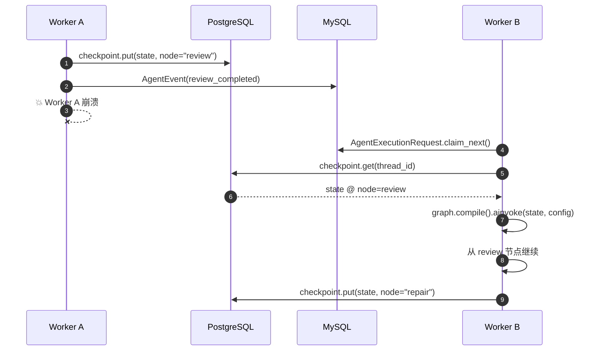

### 16.2 关键字段

| 字段 | 含义 |
|---|---|
| `thread_id` | `agent_run.public_id`(严格唯一,2.8R-C) |
| `graph_name` | `test_plan` |
| `graph_version` | `v3`(或 `v2_frozen`) |
| `checkpoint_ns` | LangGraph 内部命名空间 |
| `Interrupt` | LangGraph 暂停点,等待 `Command(resume=...)` |
| `Resume` | 跨 Worker 也能 resume(只要 Postgres 可达) |

### 16.3 为什么不能使用 stub-thread

stub-thread 是开发时 mock 的 thread_id,生产代码必须拒绝(否则 Checkpoint 复用导致任务错乱)。

### 16.4 为什么生产不能使用 MemorySaver

MemorySaver 进程内 → Worker 崩溃就丢 → **Checkpointer 必须 Postgres**(2.8R-A 明确禁止 dev bypass)。

---

## 17. 人机协同

### 17.1 场景

- **章节确认**(`section_confirm`):生成方案前让用户确认章节列表
- **格式损失确认**(`format_loss_confirm`):Word 导出后发现格式丢失,询问用户继续/重做
- **ask_user**:`Preparation Agent` 决定信息不足时直接问

### 17.2 实现

- Interrupt:LangGraph `interrupt(value)` 暂停图执行
- `Confirmation` 表:`{task_id, kind, payload, status: pending/approved/rejected, expires_at}`
- `Command(resume=...)`:API 收到用户确认后调 `LangGraphRunCoordinator.resume(ctx, decision)`,从 PostgreSQL 加载 state,继续图

### 17.3 跨 Worker Resume

- Worker A 跑图到 Interrupt → 写 Checkpoint(状态 pending)
- 用户在 Worker B 上点确认 → API 路由到任意 Worker
- 任一 Worker 调 `coordinator.resume(ctx, ...)` → 从 PG 加载 state → 继续

### 17.4 重复确认幂等

`Confirmation` 表按 `(task_id, kind)` UNIQUE,重复请求返回原结果,不重复触发 resume。

---

## 18. 任务调度

### 18.1 数据模型

```
AgentTask                  # 用户意图(由用户消息产生)
   ↓ 1:1
AgentExecutionRequest      # Outbox,worker 待领取
   ↓ 1:N(每个请求可能被多个 worker 抢)
AgentExecutionWorker       # 后台 poll loop
   ↓ 调
ApiDispatcher              # 决定 engine + 调引擎
```

### 18.2 为什么任务不能由 SSE 启动

- SSE 是只读流,不能产生写操作
- 任务创建是写操作,要走 POST API
- SSE 只负责**接收**事件,不**产生**事件

### 18.3 Lease 与 `SELECT FOR UPDATE SKIP LOCKED`

```sql
SELECT * FROM agent_execution_requests
WHERE status = 'pending'
ORDER BY created_at
LIMIT 1
FOR UPDATE SKIP LOCKED;
```

- `SKIP LOCKED`:Worker A 锁定的行,Worker B 跳过 → 无重复领取
- `Lease`:`claimed_by` + `claimed_until`,过期未完成 → 释放回 pending

### 18.4 `AgentExecutionRequest` 状态机

```
pending → claimed → running → completed
                     ↘ failed
                     ↘ cancelled
```

---

## 19. Legacy 与 LangGraph 双引擎

### 19.1 EngineRouter 6 路径

| 路径 | 何时启用 |
|---|---|
| 1. langgraph + canary 100% | dev 默认 |
| 2. langgraph + canary 灰度 | prod 灰度 |
| 3. legacy + engine_type='legacy' | 历史任务 |
| 4. legacy + 紧急 kill switch | LangGraph 故障时手动 |
| 5. legacy + new_task fallback | (已禁用,2.8R-A) |
| 6. fail-fast | LangGraph probe unhealthy |

**2.8R-A 改动**:路径 5 移除 → probe fail 时双闸门 lockout,**不允许静默回退 legacy**。

### 19.2 engine_type 何时写入

- `agent_tasks.engine_type` 由 `EngineRouter.decide()` 决定,创建任务时写入
- 整个执行期间不能切换(防止半新半旧)

### 19.3 Legacy 的保留作用

- 历史任务(`engine_type='legacy'`)继续用
- 测试 / 对比基线
- LangGraph 故障时**显示报错**而不是静默回退

---

## 20. 重试体系

### 20.1 分类

| 重试层 | 触发 | 策略 |
|---|---|---|
| Tool Retry | 单个 Tool 抛 `RecoverableError` | 由 `RetryPolicy.decide()` 决定 |
| LLM Schema Retry | LLM 输出 JSON 校验失败 | schema_feedback(prompt 注入修正) |
| Node Retry | Node 内部 Tool Retry 失败 | 由 Node 自身重试或 fail |
| Review Repair Loop | review_issues 不为空 | repair_max_loops=3 |
| Format Loop | format_loss_confirm 拒绝 | 由用户决定 |
| 任务重试 | 整个 task failed | 手动重试(API `/tasks/{id}/retry`) |

### 20.2 WordExportTool 完整案例

```
WordExportTool.run()
  ├─ 校验 input.section_package → 缺 EXPORT_CONTENT_MISSING
  │   → UNRECOVERABLE → hard_stop → task_failed
  ├─ 读模板文件 → EXPORT_TEMPLATE_NOT_FOUND
  │   → UNRECOVERABLE → hard_stop → task_failed
  ├─ tmp_output_path = uuid.uuid4().hex[:8]
  ├─ 写 tmp → 失败 → EXPORT_FAILED (recoverable=True)
  │   → retry_policy.decide() → "unknown code" → same_inputs, backoff=0.5s
  ├─ retry → tmp + atomic rename → 成功 → EXPORT_CONTENT_MISSING 不再抛
  └─ 删 tmp
```

---

## 21. Artifact 与文件幂等

### 21.1 幂等关键

- `input_hash = sha256(section_package 序列化)`
- `idempotency_key = "{task_id}:{input_hash}"`
- UNIQUE 约束:`artifacts.idempotency_key` UNIQUE
- `ArtifactRepository.create_or_get_by_idempotency_key()` → 已存在则返回旧

### 21.2 原子写入

```python
tmp = output_path.with_suffix(output_path.suffix + ".tmp." + uuid.uuid4().hex[:8])
with open(tmp, "wb") as f:
    f.write(content)
    f.flush()
    os.fsync(f.fileno())
os.replace(tmp, output_path)  # 原子 rename
```

### 21.3 Worker 崩溃不会生成重复文件

- Worker 在 `os.replace` 之前崩溃 → tmp 文件残留 → 下次启动清理
- Worker 在 `os.replace` 之后崩溃 → final 文件已落 → Worker 重试时 `create_or_get_by_idempotency_key` 命中 → 不重复创建
- MySQL Artifact 行在文件 rename 之后写 → 数据库和文件一致

---

## 22. AgentEvent 系统

### 22.1 流图(dev_3.0)

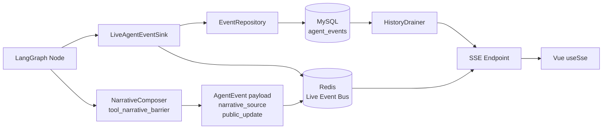

### 22.2 关键字段

| 字段 | 含义 |
|---|---|
| `event_type` | task_created / plan_created / tool_started / tool_finished / retrying / `tool_narrative_update` / `task_summary_narrative` / `plan_step_started` / `plan_step_completed` / `plan_step_failed` / `task_waiting` / `need_user_confirm` / `task_completed` / ... |
| `sequence_no` | 任务内单调递增(`(task_id, sequence_no)` UNIQUE) |
| `idempotency_key` | `{task_id}:{event_type}:{local_seq}` UNIQUE(2.8R-E) |
| `graph_run_id` | LangGraph run 标识 |
| `tool_call_id` | 关联 Tool 调用(Phase 2.9B.4 tool_identity_contract) |
| `narrative_source` | `llm` / `deterministic`(互斥锚点) |
| `payload` / `payload_json` | 事件内容(aiomysql 字符串兼容) |

### 22.3 去重

- 同 `idempotency_key` 重发 → MySQL UNIQUE 冲突 → 不重复写
- 前端 `toolChunkIndexByMessageId` Map → 丢 out-of-order chunk
- `receivedChunkIndexes` Map → 每个 chunk_index 只合并一次
- `seenEventIds` Map → 每个 event_id 只处理一次

### 22.4 Narrative Composer 事件流(Phase 2.9B+)

- 同步 Barrier 节点 `_publish(AgentEventType.TOOL_NARRATIVE_UPDATE, payload=...)`
- payload 含 `narrative_source` / `public_update` / `chunk_index` / `chunk_total` / `chunk_final`
- 最终总结节点 `_publish(AgentEventType.TASK_SUMMARY_NARRATIVE, payload=...)`
- 持久化事件源:`live_event_bus` + MySQL 双重写,断线后 HistoryDrainer 重放

---

## 23. SSE 与断线恢复

### 23.1 协议

```
event: <event_type>
id: <event_public_id>           # 当前前端不解析
data: <JSON payload>
```

### 23.2 HistoryDrainer

- SSE 连接建立时:从 MySQL `agent_events` 读 task_id 所有事件
- 按 `sequence_no` 排序
- Live + History 重叠去重(by event_public_id)

### 23.3 Last-Event-ID

- **Phase 2.9A.28 已启用**:前端 `useSse.ts` 支持 `Last-Event-ID` header
- 后端 pre-confirm `/events` 支持 DB 补发(断线期间事件从 MySQL 重放)
- **每 Task 独立 cursor**:`TaskRunBlock.lastEventCursor` 替代 Conversation 级 `lastEventCursor`（已 deprecated）

### 23.4 重连

- 固定 1000ms(`useSse.ts:122-125`)
- 无指数退避(已知 P1)

---

## 24. Agent 叙事层(Phase 2.9B.4-7,Narrative Composer)

### 24.1 链路(LLM-first + 8 Tool 同步 Barrier)

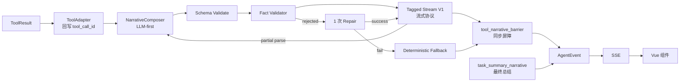

### 24.2 字段

- `headline`:一句话标题(32 字限)
- `summary`:摘要(200 字限)
- `impact`:对用户的影响(120 字限)
- `next_action`:下一步(80 字限)
- `details`:列表项(最多 6 项,每项 80 字)
- `narrative_text`:LLM 生成的自然语言段落(Phase 2.9B+ 新增)
- `narrative_source`:`llm` / `deterministic`(互斥锚点)
- `chunk_index` / `chunk_total` / `chunk_final`:渐进式 chunks

### 24.3 progressive chunks(LLM 流式)

- StreamDecoder 解析 Tagged Narrative Stream V1(`<NARRATIVE>...</NARRATIVE>`)→ 增量渲染
- success/info:5 帧(headline → +summary → +impact → +next → +details)
- warning/failed/retry:2 帧(headline → +summary+details)
- 每帧带 `chunk_index` / `chunk_total` / `chunk_final`

### 24.4 Fact Validator(事实约束,避免 LLM 编造)

- **数字白名单**:LLM 报出的数字必须来自白名单事实
- **文件名校验**:LLM 提到的文件名必须存在于事实
- **状态语义**:禁止"blocking>0 却说无阻塞问题"等事实冲突
- **敏感信息**:`path` / `secret` / `token` / `api_key` 正则替换
- 失败时 1 次 schema_feedback repair,失败则 deterministic fallback

### 24.5 Tool Identity Contract(避免「执行了但未显示」)

- `ToolAdapter.wrap()` 回写真实 `tool_call_id`(envelope['tool_call_id'])
- `last_terminal_event_id()` 真实终态 event_id
- 节点 `_build_pending_narrative(source_event_id=adapter.last_terminal_event_id())`
- 前端 `AgentRunCard.displayToolUpdate` 互斥选择器按 `(sourceToolCallId, attempt)` 锚定
- **禁止**再用 `f"{tool_name}-{task_id}"` 伪锚点

### 24.6 8 Tool 同步 Barrier

dev_3.0 v3 主图在每个 Tool 节点后插入 `tool_narrative_barrier`:

```
RequirementParser → barrier → TemplateParser
TemplateParser → barrier → PrepSubgraph / KnowledgeSearch / SuggestSections
KnowledgeSearch → barrier → ...
Generate / Review / WordExport / FormatCheck → barrier → 下一节点
```

- **目的**:确保 NarrativeComposer 完成叙事(LLM/fallback)后才进入下一节点
- **关键**:`task_summary_narrative` 节点消费 barrier 同步路径上的全部事实,做最终 `task_completed` 叙事
- **失败语义**:barrier 失败不算任务失败;deterministic fallback 仍可前进

### 24.7 Task Summary 事实校验

- `frontend/src/utils/taskState.ts` `deriveTaskRunState()` 纯函数
  - 优先级 completed > failed > cancelled > waiting > running
  - **禁止**用局部 Tool 失败推断任务失败
- `frontend/src/composables/useTaskEventReducer.ts` `reduceTaskSummaryNarrative()`
  - `block.taskSummaryNarrative` 唯一槽位
  - `task_completed` 不得清空该槽位
- `AgentRunCard.completionSummary = validLlmTaskSummary ?? deterministicTaskSummary`

### 24.8 不展示 Chain of Thought

- LLM thinking **不写入** State / Event / UI
- 用户看不到 LLM 推理过程
- 所有可见文案由 NarrativeComposer + 校验 + Fallback 链生成

### 24.9 配置开关

```bash
# .env(dev 默认 0,需显式打开)
AGENT_RUNTIME_PHASE29B_TOOL_NARRATIVE_ENABLED=1
```

关闭时,所有 Tool 走 `public_execution_update_builder`(老确定性路径)作为 fallback,但 `task_summary_narrative` 仍由节点 deterministic formatter 输出。

---

## 25. 数据库设计

### 25.1 核心表

| 表 | 用途 | 主键 | 关键 UNIQUE |
|---|---|---|---|
| `users` | 用户 | id | email |
| `conversations` | 会话 | id | – |
| `messages` | 消息 | id | – |
| `files` | 上传文件元数据 | id | – |
| `agent_tasks` | Agent 任务 | id | public_id |
| `agent_runs` | 单次图运行 | id | (task_id, attempt) |
| `agent_events` | 事件流 | id | (task_id, sequence_no), idempotency_key |
| `agent_event_sequences` | 序列分配 | id | – |
| `agent_execution_requests` | Outbox | id | – |
| `confirmations` | 用户确认 | id | (task_id, kind) |
| `artifacts` | 产物 | id | idempotency_key |
| `tool_calls` | Tool 调用记录 | id | – |
| `agent_context_snapshots` | Context 快照 | id | – |
| `knowledge_configs` | 知识库配置 | id | – |
| `image_understanding_configs` | 图片识别配置 | id | – |
| `conversation_summaries` | 会话摘要 | id | – |
| `model_configs` | 模型配置 | id | – |

### 25.2 ER 概览

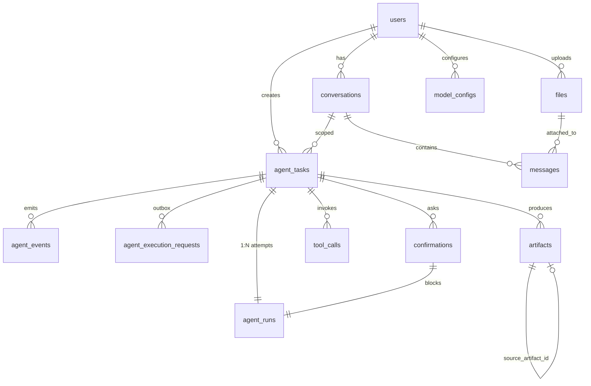

---

## 26. 安全设计

| 维度 | 设计 |
|---|---|
| JWT | `python-jose` HS256,Access Token 30min,Refresh Token 7d |
| 用户隔离 | 所有 Repository 查询带 `user_id` 过滤 |
| 文件所有权 | `files.user_id == current_user.id` 才允许下载 |
| Tool 白名单 | ToolAdapter 只放行注册 Tool |
| Scope Guard | Tool 输入带 `allowed_sections` 字段校验 |
| Budget | 每个 Tool 调用预算,超限 kill |
| Prompt Injection | Tool 输入经 Pydantic 校验,不允许用户消息注入 Tool args |
| 敏感脱敏 | `narrative_composer/validator.py` 数字白名单 + 状态语义 + 名词校验 + 敏感信息正则替换;旧 `public_execution_update_builder._sanitize_text` 路径在 `AGENT_RUNTIME_PHASE29B_TOOL_NARRATIVE_ENABLED=0` 时保留 |
| 不展示 CoT | LLM thinking 不写入 State / Event / UI |
| API 错误 | 统一 `HTTPException`,body `{detail, code}` |
| 日志脱敏 | `server_debug.log` 不写 DSN / Token / 用户密码 |

---

## 27. 多 Worker 与分布式设计

### 27.1 拓扑

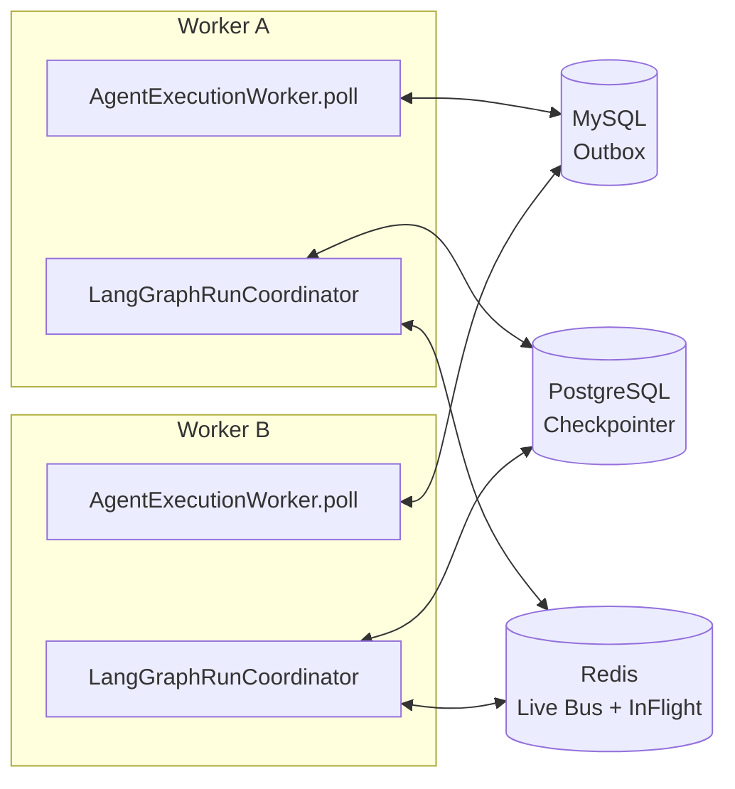

### 27.2 InMemory vs Redis

| 模式 | 适用 | 何时启用 |
|---|---|---|
| InMemoryLiveEventBus | 单进程开发 | 默认 |
| RedisLiveEventBus | 多 Worker 生产 | `AGENT_RUNTIME_REDIS_URL` 设置 |

### 27.3 InFlight Lock

- `Redis SETNX` 锁,防止同 task 被多 Worker 同时 dispatch
- 锁过期时间 = task dispatch timeout

### 27.4 跨 Worker Cancel

- `cancellation_distributed.py` 在 Redis 写 `cancel:{task_id}` 标记
- 所有 Worker poll 任务时检查 → 标记存在 → 调 `coordinator.cancel(...)`
- LangGraph 通过 Checkpoint 状态标记 cancel

### 27.5 跨 Worker Resume

- `Confirmation.approve` → 任一 Worker poll → `coordinator.resume(ctx, decision)`
- 从 PostgreSQL 加载 state → 继续图
- 所有 Worker 都可 resume,不绑定原 Worker

---

## 28. 可观测性

| 维度 | 来源 |
|---|---|
| `agent_runs.duration_ms` | Node 耗时统计 |
| `agent_runs.token_usage` | LLM token 计数 |
| `agent_runs.error` | 错误消息 |
| `agent_events` | 全链路事件流 |
| `artifacts` | 产物状态 |
| `Readiness` | `app/services/agent_runtime/readiness.py` 汇总 PG/Redis 状态 |
| Health | `/healthz` `/readyz` |
| Canary | `agent_runtime/canary/` 灰度与回滚演练 |
| 日志 | `server_debug.log` 结构化 JSON |

---

## 29. 测试体系

| 类型 | 位置 |
|---|---|
| Node Unit | `backend/tests/agent_runtime/graphs/test_plan/versions/v3/test_nodes_*.py` |
| Router | `backend/tests/agent_runtime/test_canary/test_engine_router_decisions.py` |
| Tool | `backend/tests/tools/test_*_tool.py` |
| Graph | `backend/tests/agent_runtime/graphs/test_plan/test_compile.py` |
| Interrupt | `backend/tests/agent_runtime/test_interrupt_resume.py` |
| Recovery | `backend/tests/agent_runtime/test_persistence_postgres_probe.py` |
| Artifact Idempotency | `backend/tests/agent_runtime/test_artifact_idempotency.py` |
| Event | `backend/tests/agent_runtime/test_event_*` |
| SSE | `backend/tests/agent_runtime/test_dispatch/test_sse_decoupled_from_execution.py` |
| 双 Worker E2E | `backend/tests/agent_runtime/test_canary/test_rollback_drill_e2e.py` |
| 前端 Vitest | `frontend/src/**/*.spec.ts` |

---

## 30. 部署架构

### 30.1 开发环境(Windows + WSL2 / Docker)

- `docker-compose.dev.yml` 起 PG + Redis
- Python venv + `pip install -r requirements.txt`
- `uvicorn app.main:app --reload --port 8000`
- 前端 `npm run dev` 起 Vite

### 30.2 生产环境

- `docker-compose.prod.yml` 起全套(FastAPI + MySQL + PG + Redis + Nginx)
- 多 Worker 进程 + 共享 MySQL/PG/Redis
- 环境变量:`AGENT_RUNTIME_REDIS_URL` / `AGENT_RUNTIME_POSTGRES_URL` / `AGENT_RUNTIME_LANGGRAPH_ENABLED`

### 30.3 启动顺序

1. PostgreSQL → probe 成功
2. MySQL → Alembic migration up to head
3. Redis(可选)
4. FastAPI Worker(s) → `uvicorn` × N
5. SSE 由 FastAPI 路由承担,不单独进程

---

## 31. 一次完整任务的生命周期

### 31.1 场景

> 用户上传"智能工单系统需求文档"和"测试方案模板",要求生成测试方案。

### 31.2 时序图

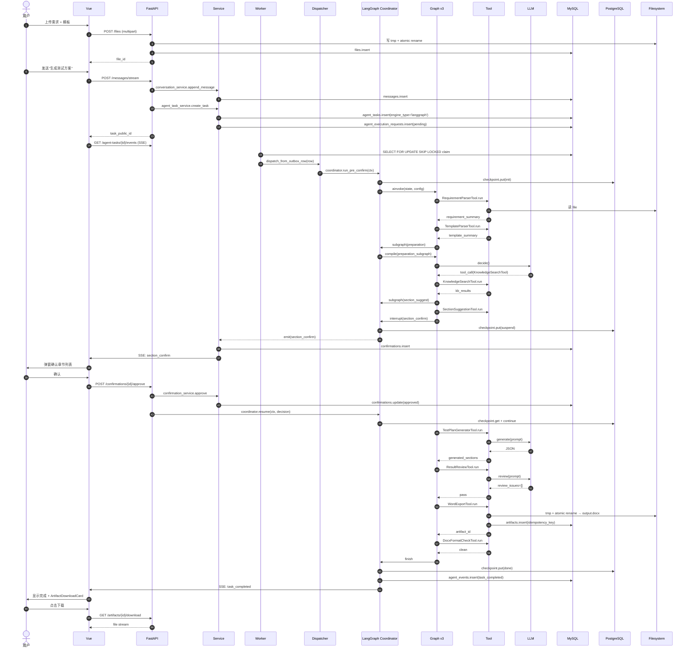

### 31.3 阶段小结

| 阶段 | 涉及模块 |
|---|---|
| 上传 | files API + file_service + atomic_file_writer |
| 任务创建 | messages API + agent_task_service + engine_router |
| Worker 领取 | agent_execution_worker.poll |
| Dispatch | api_dispatcher.dispatch_from_outbox_row |
| 协调 | langgraph_run_coordinator.run_pre_confirm / ainvoke |
| 主图 | compiled graph v3 |
| 子图 | preparation / repair / incremental |
| Tool | 各 tool |
| Checkpoint | PG(每个 Node 后) |
| 事件 | MySQL + Redis + SSE |
| 用户确认 | Confirmation + Command(resume) |
| 产物 | Artifact + atomic rename |

---

## 32. 异常场景

| 场景 | 处理 |
|---|---|
| LLM 超时 | `MODEL_TIMEOUT` → `backoff` retry,3 次后 task_failed |
| Tool 失败 | RetryPolicy.decide → schema/network/degrade/same_inputs/hard_stop |
| Word 导出失败 | `EXPORT_FAILED` → `same_inputs` retry → max_retries 后 task_failed |
| 用户不确认 | Confirmation.expires → confirmation_timeout_service 触发 fail 或 fallback |
| 用户重复确认 | (task_id, kind) UNIQUE → 返回原结果 |
| Worker 崩溃 | Checkpoint 已落 → 新 Worker claim → checkpoint.get → 续跑 |
| Redis 故障 | 降级 InMemory → 单 Worker 模式告警 |
| PostgreSQL 故障 | 双闸门 lockout → fail-fast,不允许静默回退 legacy |
| SSE 断线 | 前端 reconnect 1000ms → HistoryDrainer replay |
| 重复任务 | (task_id, idempotency_key) UNIQUE → 拒绝重发 |
| 用户取消 | cancellation_distributed → Redis 标记 → Worker poll 检查 → checkpoint 标 cancel |
| 未知 Graph 版本 | compile_test_plan_graph(unknown) → GRAPH_VERSION_NOT_AVAILABLE |

---

## 33. 扩展新 Agent 的方法(以"测试用例 Agent"为例)

新增一个 Agent 需要改/加:

| 项 | 文件 |
|---|---|
| State 字段 | `agent_runtime/graphs/test_plan/state.py` |
| Graph | `agent_runtime/graphs/test_plan/versions/v4/nodes.py` |
| Node | `agent_runtime/graphs/test_plan/versions/v4/nodes/test_case_*.py` |
| Tool | `tools/test_case_generator_tool.py` |
| Event | `agent_event.py` 加 `test_case_generated` |
| Artifact | 新增 `test_case_artifact_kind` |
| API | `app/api/v1/test_cases.py` |
| 前端卡片 | `components/cards/TestCaseCard.vue` |
| Graph Version 注册 | `graph_registry.compile_test_plan_graph("v4")` |
| 测试 | `tests/agent_runtime/graphs/test_plan/versions/v4/test_*.py` |

**不要改**:LangGraph 主图入口签名、`api_dispatcher` 协议、Prompt 模板(每个 Tool 自己一份)、Alembic 主键约束。

---

## 34. 架构不变量(20+ 条)

1. LangGraph 任务**不能**静默回退 Legacy(2.8R-A)
2. SSE **不能**启动任务(只读流)
3. 生产**不能**使用 MemorySaver(必须 Postgres Checkpointer)
4. `thread_id` **不能**为空或 stub
5. Graph 版本**不能**覆盖已有版本(必须新增 v3 → v4)
6. Artifact **必须**有 `idempotency_key` UNIQUE
7. AgentEvent **必须**先持久化 MySQL 再 Publish 到 Live Bus
8. 模型**不能**直接执行工具(必须经 ToolAdapter)
9. **不展示** Chain of Thought(LLM thinking 不进 State/Event/UI)
10. Tool 输出**必须**经 Pydantic Schema 校验
11. 文件**必须**走 atomic rename(临时文件 + `os.replace`)
12. JWT **必须**带 `user_id` 隔离
13. Cross-Worker 任务**必须**经 `SELECT FOR UPDATE SKIP LOCKED`
14. Confirmation **必须**(task_id, kind) UNIQUE 幂等
15. EngineRouter 决定 engine 后**不可**中途切换
16. PostgreSQL probe fail → **必须** fail-fast,不静默 fallback
17. **不能**修改 v2_frozen 代码(只读)
18. 所有 LLM 调用**必须**经过 ChatLLMService 或 ContextInvokerBridge
19. Tool Adapter 白名单外**不允许**调用
20. Tool 叙事**必须**经过 NarrativeComposer(`AGENT_RUNTIME_PHASE29B_TOOL_NARRATIVE_ENABLED=1` 时 8 Tool 同步 Barrier);关闭时走 `public_execution_update_builder` 老路径作为 fallback
21. 检查点 `idempotency_key` 命名空间**必须** `{task_id}:{event_type}:{local_seq}`
22. AgentRun `(task_id, attempt)` UNIQUE,防止重复运行
23. SSE 事件 `id:` 字段**必须**写 `event_public_id`(即使前端暂时不解析)
24. Artifact `source_artifact_id` 自引用**必须**指向同 task 历史
25. Resume 命令**必须**携带原 thread_id,不创建新 thread
26. **Tool Identity Contract**:ToolAdapter **必须**回写真实 `tool_call_id` + `last_terminal_event_id`,禁止 `f"{tool_name}-{task_id}"` 伪锚点
27. **CE Composer**:**必须**走 Profile → Source → Composer → Preflight → LLM;**禁止**直接绕开 ContextInvokerBridge 直连 LLM
28. **Test Faults**:`APP_ENV=production/prod` **必须**忽略所有 `FAULT_*` 开关(产品环境二次保护)
29. **Narrative Composer 事实约束**:`narrative_composer/validator.py` **必须**拒绝 `blocking>0 却说无阻塞问题` 等事实冲突
30. **Task Summary 唯一槽位**:`task_completed` 事件**不得**清空 `taskSummaryNarrative`

---

## 35. 当前限制与后续规划

### 35.1 当前限制(dev_3.0)

| 限制 | 描述 |
|---|---|
| 单 LLM provider | 仅 OpenAI 兼容接口,Claude / Gemini 适配待做 |
| Knowledge Base HTTP | 知识库外部依赖(Maas),KB 故障会 degrade |
| OCR 依赖 Paddle | 体积大,生产部署需镜像分离 |
| **Narrative Composer 默认关闭** | dev 默认 `AGENT_RUNTIME_PHASE29B_TOOL_NARRATIVE_ENABLED=0`,需显式打开 |
| **真实浏览器 LLM 叙事复核未完成** | docs/100 历史会话 `conv_48dacfd9` 不在测试账号可见范围,需用新任务复核 8 Tool 卡片 + Task Summary |
| **Dynamic Agent 业务接入未贯通** | dev_3.0 骨架已上线,test_plan 业务仍走 v3 主图;新场景(缺陷分析 / 用例生成)接入待完成 |
| **Test Faults 仅 dev 生效** | 5 种故障生产环境二次保护,真实生产链路回归需手动演练 |
| **PostgreSQL probe 在生产云稳定性** | dev 探活已修,生产云未验证 |
| **CE preflight 压缩水位状态机** | 已实现,长任务(>10 分钟)真实压测未做 |
| **多 Worker 真实压测** | 2.8R-G E2E 骨架已有,真实负载待跑 |
| **后端 trigger 查询 N+1** | 每个 task 单独查询 trigger_message_id,批量 JOIN 待优化 |
| **前端 Live/Hydrate 一致性验证** | 需浏览器真实 E2E 验证 |
| **多 Task 会话验证** | 当前只验证单 Task,多 Task 需额外测试 |
| Dark mode 未实现 | 全项目 |
| Legacy orchestrator 退役 | 仍保留;无法真正退役(历史任务依赖) |

### 35.2 正在开发

- **Dynamic Agent 业务接入**:能力扩展路由(测试用例生成 / 缺陷分析 / 文档问答 / 知识库问答)
- **Test Faults 演练手册**:5 种故障的回归剧本
- **Narrative Composer 浏览器复核**:8 Tool 卡片 + Task Summary 真实任务下 UI 验证
- **多 LLM provider 适配**(规划中)
- **Dark mode**(规划中)

### 35.3 待验证

- 多 Worker 真实压测(2.8R-G E2E 骨架已有,真实负载待跑)
- PostgreSQL probe 在生产云的稳定性
- 长任务(>10 分钟)的 SSE + Checkpoint 一致性
- CE preflight 压缩水位状态机真实长任务回归

### 35.4 规划中

- **需求分析能力**:复用 IntentType 枚举 + agent_task 链路,新增 `requirement_analysis` 意图与对应图
- **缺陷分析报告生成能力**:同上,新增 `defect_report_generation` 意图;docs/缺陷分析报告能力迁移/ 已有完整迁移规格
- **文档问答**(`document_question` 意图已预留):激活已上传文档的问答链路,Dynamic Agent + atomic_capability `evidence_analysis` 已打基础
- **知识库问答**(`knowledge_question` 意图已预留 + F026 KB 片段注入已打通 + CE Knowledge Source 已接入)
- **测试用例生成 Agent**:Dynamic Agent + atomic_capability 路线
- **RAG 内部知识库**(已有内部 Lexical + Vector Store,可对接替代外部 KB)
- **完整运行可观测平台**(CE-05 WP-10 观测仪表盘 + Admin API + Retention Worker 已有,取代 readiness + 日志)
- **Legacy orchestrator 逻辑退役**:只保留用于历史任务
- **长期记忆**(`LongTermMemoryContext` schema 已定义 + CE memory sources 已就绪,未跨会话接线)
- **多 LLM provider 适配**(Claude / Gemini / 自研)
- **Dark mode**

---

**本文档结束。配套见 docs/50(源码导读)+ docs/51(证据索引)。**