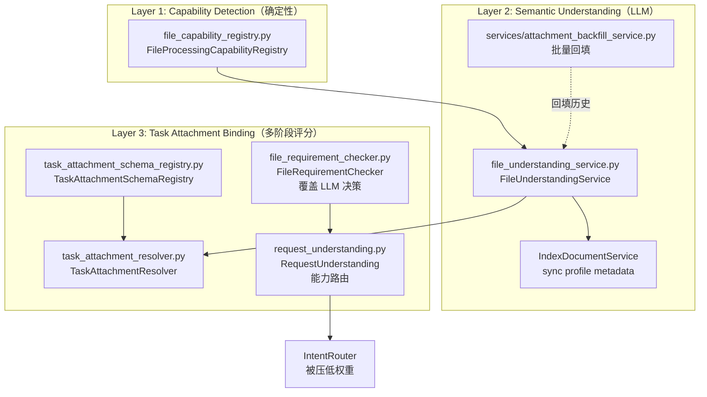
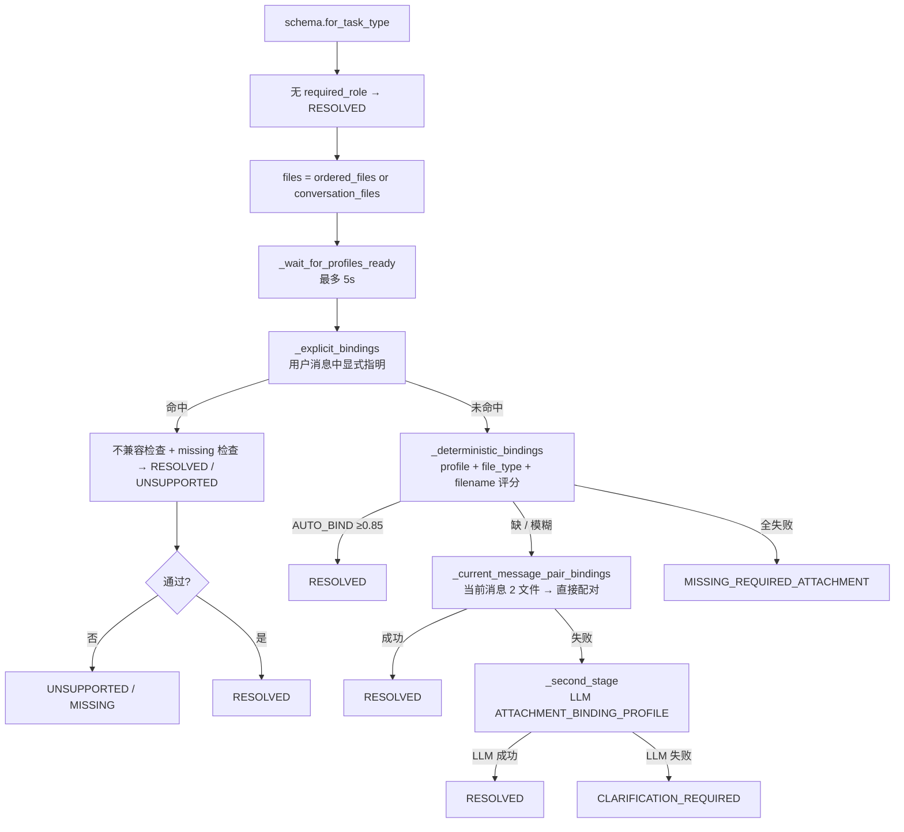

# TestAgent 文件识别系统 技术实现文档

> **配套文档**
> - 总体技术方案: [02_TestAgent_项目总体技术方案.md](../02_TestAgent_项目总体技术方案.md)
> - 源码导读: [03_TestAgent_项目实现原理与源码导读.md](../03_TestAgent_项目实现原理与源码导读.md)
> - 证据索引: [01_TestAgent_项目技术方案证据索引.md](../01_TestAgent_项目技术方案证据索引.md)
> - Context Engine 3.0: [10_TestAgent_ContextEngine3.0_技术实现文档.md](10_TestAgent_ContextEngine3.0_技术实现文档.md)

**编制时间**: 2026-08-25
**对应分支**: `dev_3.0`
**最后对齐**: 与 F019/F020 + 2026-08-19 profile ready wait fix 同步

> 本文档面向**接手文件识别模块**的开发者，覆盖**3 层识别（Capability / Semantic / Binding）、5 个核心组件、关键 Bug Fix、与 LLM 的集成契约、与 Context Engine Indexing 的协同**。
> 行号以当前 `dev_3.0` HEAD 为准。

---

## 1. 文档说明

### 1.1 模块定位

文件识别系统（File Understanding Pipeline，F019/F020）是 TestAgent **从"用户上传文件"到"任务能用哪个文件"** 的完整链路：

- **职责 1**：判断每个文件**能被怎么处理**（parse / index / vision / ocr / semantic_profile）
- **职责 2**：用 LLM 推断每个文件的**语义类型**（requirements_specification / test_plan_template / supplemental_reference / unknown）
- **职责 3**：在触发测试方案任务时，把用户上传的多个文件**绑定到任务槽位**（requirement_source / output_template / reference_material）

### 1.2 适用读者

| 角色 | 期望收获 |
|---|---|
| **意图识别 / 任务创建维护者** | RequestUnderstanding + FileRequirementChecker 覆盖 LLM 决策的方式 |
| **文件语义识别维护者** | FileUnderstandingService 完整管线（capability → sampler → classifier → profile）|
| **任务附件绑定维护者** | TaskAttachmentResolver 三阶段评分（profile / file_type / filename）|
| **Frontend 开发者** | FileAttachmentCard 状态机 + 上传 → 等待 ready → 绑定的 UX |
| **新接入 capability** | FileProcessingCapabilityRegistry 注册新扩展名 |

### 1.3 当前状态

- **F019/F020 已闭环**：3.0 文件自识别系统接入
- **2026-08-19 Bug Fix**：profile ready 等待机制（避免"刚上传不能用"）
- **3 个核心数据模型**：`FileSemanticProfile` / `MessageAttachment` / `TaskFileBinding`
- **4 个独立组件**：CapabilityRegistry / UnderstandingService / AttachmentResolver / RequirementChecker
- **支持扩展名**：docx / txt / md / json（可语义识别）/ png / jpg / jpeg / webp（可 vision+ocr）/ pdf（已注册但暂未实现解析）/ xlsx / pptx（已注册但无任何能力）

---

## 2. 总体架构（3 层识别）



### 2.1 三层职责分工

| 层 | 组件 | 触发时机 | 是否调 LLM | 输出 |
|---|---|---|---|---|
| **L1 Capability** | `FileProcessingCapabilityRegistry` | 文件上传 / 任何文件操作前 | 否（in-memory singleton）| `FileProcessingCapability` |
| **L2 Semantic** | `FileUnderstandingService` + `attachment_backfill_service` | 上传后异步 / 历史回填 | 是（`FILE_UNDERSTANDING_PROFILE`）| `FileSemanticProfile` |
| **L3 Binding** | `TaskAttachmentResolver` + `FileRequirementChecker` + `RequestUnderstanding` | 任务创建时 / `send_message` | 第二阶段可选 | `TaskFileBinding` / `RequestUnderstandingResult` |

---

## 3. Layer 1：Capability Detection

文件：`backend/app/services/file_capability_registry.py`

### 3.1 `FileProcessingCapability` 数据类

```python
@dataclass(frozen=True)
class FileProcessingCapability:
    extension: str            # e.g. "docx"
    media_category: str       # document / image / spreadsheet / presentation / unknown
    can_parse: bool           # 能否抽取文本与结构
    can_index: bool           # 能否进入 CE 索引
    can_vision: bool          # 能否视觉理解
    can_ocr: bool             # 能否 OCR
    can_semantic_profile: bool  # 能否 LLM 语义分类
```

### 3.2 内置 Capability 表（实际 `for_extension()` 验证）

| 扩展名 | media_category | parse | index | vision | ocr | semantic_profile |
|---|---|---|---|---|---|---|
| `docx` | document | ✅ | ✅ | ✘ | ✘ | ✅ |
| `txt` | document | ✅ | ✅ | ✘ | ✘ | ✅ |
| `md` | document | ✅ | ✅ | ✘ | ✘ | ✅ |
| `json` | document | ✅ | ✅ | ✘ | ✘ | ✅ |
| `png` | image | ✘ | ✘ | ✅ | ✅ | ✘ |
| `jpg` | image | ✘ | ✘ | ✅ | ✅ | ✘ |
| `jpeg` | image | ✘ | ✘ | ✅ | ✅ | ✘ |
| `webp` | image | ✘ | ✘ | ✅ | ✅ | ✘ |
| `pdf` | document | ✘ | ✘ | ✘ | ✘ | ✘ |
| `xlsx` | spreadsheet | ✘ | ✘ | ✘ | ✘ | ✘ |
| `pptx` | presentation | ✘ | ✘ | ✘ | ✘ | ✘ |

**关键观察**：
- **pdf 已注册但所有能力为 False** —— 占位预留，需后续接入解析
- **xlsx / pptx 仅识别扩展名**，没有任何处理能力
- 未知扩展名返回 `("unknown", False×5)`，触发 `unsupported` 状态

### 3.3 使用方式

```python
from app.services.file_capability_registry import FileProcessingCapabilityRegistry

capability = FileProcessingCapabilityRegistry().for_extension("docx")
if capability.can_semantic_profile:
    # 走 LLM 语义识别
    ...
elif capability.can_vision:
    # 走视觉理解
    ...
```

### 3.4 设计原则（注释自描述）

- **in-memory singleton**：不允许本地状态被持久化
- **新增能力必须先在 registry 中注册**，再被上层消费
- **误分类风险**：测试覆盖要排查"图片走文本解析路径"（沉默失败）

---

## 4. Layer 2：Semantic Understanding

文件：`backend/app/services/file_understanding_service.py`（400+ 行）

### 4.1 数据模型（`FileSemanticProfile`）

文件：`backend/app/models/attachment_understanding.py`

```sql
CREATE TABLE file_semantic_profiles (
    id              BIGINT PRIMARY KEY AUTOINCREMENT,
    public_id       VARCHAR(64) UNIQUE NOT NULL,
    file_id         BIGINT NOT NULL UNIQUE REFERENCES uploaded_files(id),
    user_id         BIGINT NOT NULL REFERENCES users(id),
    conversation_id BIGINT NOT NULL REFERENCES conversations(id),
    status          VARCHAR(32) NOT NULL DEFAULT 'pending',
    document_kind   VARCHAR(64) NOT NULL DEFAULT 'unknown',
    summary         TEXT,
    semantic_labels_json   JSON,
    possible_usages_json   JSON,
    characteristics_json   JSON,
    confidence      NUMERIC(6, 5),
    classifier_version VARCHAR(64),
    source_hash     VARCHAR(128),
    error_code      VARCHAR(128),
    created_at      DATETIME NOT NULL DEFAULT NOW(),
    updated_at      DATETIME NOT NULL DEFAULT NOW() ON UPDATE NOW(),
    deleted_at      DATETIME
);
```

### 4.2 5 个 Profile 状态

| Status | 含义 | 触发 |
|---|---|---|
| `pending` | 初始 | profile 刚创建 |
| `processing` | LLM 调用中 | sampler.build + classifier.classify 执行中 |
| `ready` | 终态-成功 | profile 写入完成 |
| `failed` | 终态-失败 | LLM 异常 / 解析失败 / 文件不可读 |
| `unsupported` | 终态-跳过 | `capability.can_semantic_profile = False` |

### 4.3 4 类 Document Kind

```python
_ALLOWED_DOCUMENT_KINDS = {
    "requirements_specification",  # 需求文档 / PRD
    "test_plan_template",          # 测试方案模板
    "supplemental_reference",      # 参考资料
    "unknown",                     # 兜底
}
```

### 4.4 `FileUnderstandingService.understand_file()` 主流程

```python
async def understand_file(
    self,
    *,
    user_internal_id: int,
    file_public_id: str,
) -> FileSemanticProfile:
    uploaded = await self._file_repo.get_by_public_id(user_internal_id, file_public_id)
    if uploaded is None:
        raise NotFoundError("file")

    # 1. 缓存命中检查（profile 已 ready 且 source_hash 一致）
    source_hash = _source_hash(uploaded)
    existing = await self._profile_repo.get_by_file_id(uploaded.id)
    if (
        existing is not None
        and existing.status == "ready"
        and existing.source_hash == source_hash
        and existing.classifier_version == self._classifier_version
    ):
        await self._sync_index_metadata(user_internal_id, file_public_id)
        return existing

    # 2. Capability 拦截
    capability = FileProcessingCapabilityRegistry().for_extension(uploaded.file_ext)
    if not capability.can_semantic_profile:
        return await self._profile_repo.upsert_profile(
            uploaded_file=uploaded,
            status="unsupported",
            document_kind="unknown",
            ...
            error_code="unsupported_file_type",
        )

    # 3. 写入 processing 状态
    profile = await self._profile_repo.upsert_profile(
        uploaded_file=uploaded,
        status="processing",
        ...
    )

    # 4. Sampler + Classifier
    try:
        sample = self._sampler.build(uploaded)
        classified = await self._classify(sample, user_internal_id=user_internal_id)
        normalized = _normalize_classification(classified)
        profile = await self._profile_repo.upsert_profile(
            uploaded_file=uploaded,
            status="ready",
            document_kind=normalized["document_kind"],
            summary=normalized["summary"],
            ...
            confidence=normalized["confidence"],
        )
        # 5. 触发 CE Indexing 同步
        await self._sync_index_metadata(user_internal_id, file_public_id)
    except Exception as exc:
        # 6. 写入 failed 状态（swallow exception）
        logger.warning("file understanding failed | file=%s | err=%s", ...)
        profile = await self._profile_repo.upsert_profile(
            uploaded_file=uploaded,
            status="failed",
            document_kind="unknown",
            ...
            error_code="classification_failed",
        )
    return profile
```

### 4.5 `FileSemanticSampler` — 采样器

构造**有界、清洗过的样本**喂给 LLM：

```python
class FileSemanticSampler:
    MAX_SAMPLE_CHARS = 6000

    def build(self, uploaded_file: UploadedFile) -> dict[str, Any]:
        text, stats = self._read_text(uploaded_file)  # docx/txt/md/json
        sanitized = _sanitize_text(text)              # 脱敏 + PII + Injection
        headings = _extract_headings(sanitized)
        table_headers = _extract_table_headers(sanitized)
        excerpts = _representative_excerpts(sanitized, MAX_SAMPLE_CHARS)
        return {
            "metadata": {"filename", "extension", "mime_type", "file_size"},
            "structure": {"title", "headings"[:20], "table_headers"[:20], "statistics"},
            "representative_excerpts": excerpts,  # 头/中/尾三段
        }
```

**`_read_text()` 支持**：docx（`DocumentReader.read_structured()`）/ txt / md / json。**不支持时抛 `FileUnderstandingError("unsupported_file_type")`**。

### 4.6 `_representative_excerpts()` — 三段采样

```python
def _representative_excerpts(text: str, max_chars: int) -> list[str]:
    compact = re.sub(r"\n{3,}", "\n\n", text.strip())
    if not compact:
        return []
    if len(compact) <= max_chars:
        return [compact]
    slice_size = max_chars // 3  # 每段 2000 字符
    middle_start = max(0, len(compact) // 2 - slice_size // 2)
    return [
        compact[:slice_size],                  # 头部
        compact[middle_start:middle_start + slice_size],  # 中部
        compact[-slice_size:],                 # 尾部
    ]
```

### 4.7 `_sanitize_text()` — 4 重脱敏

```python
def _sanitize_text(text: str) -> str:
    text = _redact_secrets(text)                        # 1. API key/token/secret 正则替换
    text = PIIRedactor(mode="redact").apply(text)        # 2. PII 检测脱敏
    text = InjectionGuard.sanitize(text)                 # 3. Prompt Injection 清理
    return text
```

`_redact_secrets` 覆盖：
- `api_key` / `token` / `secret` / `password` 字段
- `Bearer xxxxx` 模式
- `sk-xxxxxx`（OpenAI 风格 key）

### 4.8 `_source_hash()` — 缓存失效

```python
def _source_hash(uploaded_file: UploadedFile) -> str:
    if uploaded_file.file_hash:
        return f"file_hash:{uploaded_file.file_hash}"
    path = _resolve_storage_path(uploaded_file.storage_path)
    if path.exists():
        return "sha256:" + hashlib.sha256(path.read_bytes()).hexdigest()
    fallback = f"{uploaded_file.public_id}:{uploaded_file.file_size}:{uploaded_file.updated_at}"
    return "metadata:" + hashlib.sha256(fallback.encode("utf-8")).hexdigest()
```

**关键**：profile 已 ready 且 source_hash + classifier_version 一致时**直接返回缓存**，不再调 LLM。

### 4.9 `_sync_index_metadata()` — 与 CE Indexing 协同

```python
async def _sync_index_metadata(self, user_internal_id: int, file_public_id: str) -> None:
    try:
        from app.context_engine.indexing.document_service import IndexDocumentService
        await IndexDocumentService(self._session).sync_uploaded_file_profile_metadata(
            user_id=user_internal_id,
            file_public_id=file_public_id,
        )
    except Exception as exc:
        logger.warning("file understanding index metadata sync failed | ...")
```

**作用**：把 semantic profile 同步给 Context Engine 的索引服务（CE IndexDocumentService），让 CE 检索时能用到 document_kind / summary / possible_usages。

### 4.10 与 LLM 的集成

通过 `FILE_UNDERSTANDING_PROFILE`（定义于 `backend/app/llm/task_profiles.py`）：

```python
class LLMFileUnderstandingClassifier:
    async def classify(self, sample: dict[str, Any]) -> dict[str, Any]:
        result = await self._llm_client.generate_with_profile(
            FILE_UNDERSTANDING_PROFILE,
            json.dumps(sample, ensure_ascii=False),
        )
        if not getattr(result, "success", False) or not isinstance(result.parsed, dict):
            raise FileUnderstandingError(...)
        return result.parsed
```

### 4.11 `_normalize_classification()` — 输出校验

```python
_MAX_STORED_SUMMARY_CHARS = 1000

def _normalize_classification(raw: dict[str, Any]) -> dict[str, Any]:
    document_kind = str(raw.get("document_kind") or "unknown")
    if document_kind not in _ALLOWED_DOCUMENT_KINDS:
        document_kind = "unknown"
    confidence = max(0.0, min(1.0, float(raw.get("confidence", 0.0))))
    return {
        "document_kind": document_kind,
        "summary": _sanitize_text(str(raw.get("summary") or ""))[:1000],
        "semantic_labels": _string_list(raw.get("semantic_labels")),   # max 20 items, each ≤ 80 chars
        "possible_usages": _string_list(raw.get("possible_usages")),    # max 20 items
        "confidence": confidence,
    }
```

### 4.12 `attachment_backfill_service.py` — 历史回填

PHASE-1 批量回填：把已上传但未做语义识别的旧文件批量跑一遍。

```python
# 链路：
#   attachment_backfill_service.run_batch(limit=N)
#     → FileUnderstandingService.understand_file(...)
#       → 写 attachment_understanding + uploaded_file.file_type
```

**关键约束（模块自描述）**：
- 不允许在本服务直接调 vision/ocr —— 走 orchestrator
- 失败必须 swallow，落到 `attachment_understanding.status='failed'`
- 与 PHASE-1 `attachment_backfill_service` 同一根编排，后者仅一次性批量跑

---

## 5. Layer 3：Task Attachment Binding

### 5.1 数据模型（`MessageAttachment` + `TaskFileBinding`）

文件：`backend/app/models/attachment_understanding.py`

```sql
-- Message 关联上传的文件
CREATE TABLE message_attachments (
    id BIGINT PRIMARY KEY,
    message_id BIGINT NOT NULL REFERENCES messages(id),
    file_id    BIGINT NOT NULL REFERENCES uploaded_files(id),
    position   BIGINT NOT NULL,
    created_at DATETIME NOT NULL DEFAULT NOW(),
    UNIQUE(message_id, file_id),
    UNIQUE(message_id, position)
);

-- Task 绑定到具体 role 的文件
CREATE TABLE task_file_bindings (
    id BIGINT PRIMARY KEY,
    task_id        BIGINT NOT NULL REFERENCES agent_tasks(id),
    file_id        BIGINT NOT NULL REFERENCES uploaded_files(id),
    binding_role   VARCHAR(64) NOT NULL,
    position       BIGINT NOT NULL DEFAULT 0,
    is_primary     BOOLEAN NOT NULL DEFAULT FALSE,
    binding_source VARCHAR(64) NOT NULL,
    confidence     NUMERIC(6, 5),
    metadata_json  JSON,
    created_at     DATETIME NOT NULL DEFAULT NOW(),
    UNIQUE(task_id, file_id, binding_role)
);
```

### 5.2 Schema Registry

文件：`backend/app/services/task_attachment_schema_registry.py`

```python
@dataclass(frozen=True)
class AttachmentRoleSchema:
    name: str                  # requirement_source / output_template / reference_material
    min_count: int = 0
    max_count: int | None = None
    compatible_extensions: tuple[str, ...] = ()

@dataclass(frozen=True)
class TaskAttachmentSchema:
    task_type: str             # test_plan_generation / normal_chat
    roles: tuple[AttachmentRoleSchema, ...]
```

### 5.3 内置 Schema（`test_plan_generation`）

| Role | min | max | compatible_extensions |
|---|---|---|---|
| `requirement_source` | 1 | None | docx / txt / md / json |
| `output_template` | 1 | 1 | docx |
| `reference_material` | 0 | None | docx / txt / md / json |

`normal_chat` 不需要附件 → 空 schema。

### 5.4 `TaskAttachmentResolver.resolve()` — 4 阶段解析

文件：`backend/app/services/task_attachment_resolver.py`（540 行）



### 5.5 3 个阈值常量

```python
class TaskAttachmentResolver:
    AUTO_BIND_THRESHOLD = 0.85    # 自动绑定阈值
    SECOND_STAGE_THRESHOLD = 0.65  # 第二阶段（pair binding）阈值
    REQUIRED_MARGIN = 0.15         # 首位候选与次位的最小差（防模糊）
```

### 5.6 4 种 Binding Source

| Source | 含义 | 触发 |
|---|---|---|
| `user_explicit` | 用户在消息中显式指明 | 正则匹配"用《XX》作为需求/模板"或"第一个...第二个..." |
| `automatic` | 确定性评分自动绑定 | `_deterministic_bindings` 分数 ≥ AUTO_BIND_THRESHOLD |
| `current_message_pair` | 当前消息正好 2 个文件 → 直接配对 | `_current_message_pair_bindings` 命中 |
| `llm` | LLM 第二阶段 | `_second_stage` 调 `ATTACHMENT_BINDING_PROFILE` |

### 5.7 `_score_role()` — 3 信号评分

```python
@staticmethod
def _score_role(
    file: UploadedFile,
    profile: FileSemanticProfile | None,
    role: str,
) -> float:
    score = 0.0
    # 信号 1: Semantic Profile（最权威）
    if profile is not None and profile.status == "ready":
        usages = set(profile.possible_usages_json or [])
        if role in usages:
            score = max(score, float(profile.confidence or Decimal("0.90")))
        kind = profile.document_kind
        if role == "requirement_source" and kind == "requirements_specification":
            score = max(score, float(profile.confidence or Decimal("0.90")))
        if role == "output_template" and kind == "test_plan_template":
            score = max(score, float(profile.confidence or Decimal("0.90")))
        if role == "reference_material" and kind == "supplemental_reference":
            score = max(score, float(profile.confidence or Decimal("0.90")))

    # 信号 2: file_type 字段（中权威，用户已确认）
    file_type = getattr(file, "file_type", "") or ""
    if role == "requirement_source" and file_type == "requirement_doc":
        score = max(score, 0.86)
    if role == "output_template" and file_type == "test_plan_template":
        score = max(score, 0.86)
    if role == "reference_material" and file_type == "supplemental_doc":
        score = max(score, 0.86)

    # 信号 3: 文件名启发式（兜底）
    name = (file.original_name or "").lower()
    if role == "requirement_source" and any(k in name for k in ("requirement", "prd", "spec", "需求")):
        score = max(score, 0.70)
    if role == "output_template" and any(k in name for k in ("template", "test_plan", "模板")):
        score = max(score, 0.70)
    return score
```

**信号优先级**：profile > file_type > filename。

### 5.8 BUG FIX 2026-08-19：profile ready 等待

```python
PROFILE_READY_WAIT_TIMEOUT_S = 5.0
PROFILE_READY_POLL_INTERVAL_S = 0.1

_PROFILE_TERMINAL_NON_READY_STATUSES = frozenset({"failed", "unsupported"})

async def _wait_for_profiles_ready(
    self, files: list[UploadedFile]
) -> dict[int, FileSemanticProfile]:
    """拉 profiles 后，对未 ready 且非终态的 profile 短轮询等到 ready。
    
    等待策略：
      - 每 100ms 轮询一次，最多 5s；
      - profile.status == "ready" → 视为可用，纳入评分；
      - profile.status ∈ {"failed","unsupported"} → 视为终态失败，不等；
      - profile 缺失或 status ∈ {"pending","processing"} → 等下一轮；
      - 超时：返回当前快照（与历史行为一致，落入 3.0 的拒绝路径）。
    """
```

**Bug 背景**：用户上传完成后，`FileUnderstandingService` 异步跑 LLM 分类（通常 1-3s）。用户"上传完立刻发起任务"时 profile 还在 processing；resolver 不等就立刻以 0 分跑 `_score_role` → 任务被拒，体验上像是"刚上传不能用"。

### 5.9 `_explicit_bindings()` — 用户显式指明

```python
# 正则匹配：
patterns = (
    (r"第\s*一\s*个.*需求", "requirement_source"),
    (r"第\s*二\s*个.*模板", "output_template"),
    (r"用《([^》]+)》作为需求", "requirement_source"),
    (r"用《([^》]+)》作为模板", "output_template"),
)
```

### 5.10 `_current_message_pair_bindings()` — 双文件直接配对

当用户消息正好附了 **2 个文件**，且 schema 正好需要 **2 个 required role**（min_count=1），且每个 role 在这 2 个文件中**有唯一最优候选**，就直接配对（跳过 LLM）。

### 5.11 `_second_stage()` — LLM 第二阶段（兜底）

只有当 deterministic + current_message_pair 都没结果时才调 LLM：

```python
async def _second_stage(...) -> TaskAttachmentResolveResult:
    payload = {
        "profile": ATTACHMENT_BINDING_PROFILE.name,
        "user_message": user_message,
        "attachments": [_attachment_metadata(i, f, profiles.get(int(f.id))) for i, f in enumerate(files)],
        "task_schema": {"task_type", "required_roles", "roles"},
    }
    classifier = self._binding_classifier
    if hasattr(classifier, "classify"):
        result = classifier.classify(payload)
    ...
```

使用 `ATTACHMENT_BINDING_PROFILE`（`backend/app/llm/task_profiles.py`）。

### 5.12 Status 终态

| Status | 触发 | 用户体验 |
|---|---|---|
| `RESOLVED` | 4 阶段任一成功 | 任务继续 |
| `UNSUPPORTED_ATTACHMENT` | 显式绑定不兼容 / LLM 绑定不兼容 | 报错"附件类型不兼容" |
| `MISSING_REQUIRED_ATTACHMENT` | required role 无候选 | 报错"缺少必要附件" |
| `CLARIFICATION_REQUIRED` | 模糊 / LLM 失败 / LLM 不完整 | 进入 ask_user 流程 |

---

## 6. 覆盖 LLM 的两个确定性组件

### 6.1 `FileRequirementChecker` — 文件需求校验

文件：`backend/app/agent/file_requirement_checker.py`（~110 行）

```python
class FileRequirementChecker:
    REQUIRED_FOR_TEST_PLAN: tuple[str, ...] = ("requirement_doc", "test_plan_template")

    _NAME_KEYWORDS: tuple[tuple[str, str], ...] = (
        ("requirement_doc", ("需求", "requirement", "prd", "spec")),
        ("test_plan_template", ("模板", "template", "测试方案", "test_plan")),
    )

    @staticmethod
    def resolve_confirmed_type(file: UploadedFile) -> Optional[str]:
        """单文件类型解析（4 优先级）：
        1. upload_status=='confirmed' AND file_type 已设置 → 用 file_type
        2. file_type 已设置（不论 status） → 用 file_type
        3. 文件名启发式
        4. None
        """
```

**模块定位注释自描述**：

```
MessageService 在做 IntentRouter 之前先跑这里,目的是覆盖 LLM 决策:
  - 用户上传了 requirement + template → 必须走 agent_task;
  - 用户上传了但缺关键字段 → 走 ask_for_files;
  - 无附件且 query 命中 agent 关键词 → agent_task;否则 chat_reply
```

**关键约束**：
- 纯函数，无 LLM，可单测
- **优先级高于 IntentRouter**
- 不要在这里加 LLM 逻辑，违反确定性原则

### 6.2 `RequestUnderstanding` — 能力路由

文件：`backend/app/agent/request_understanding.py`（100+ 行）

```python
class RequestClass(StrEnum):
    CHAT = "chat"
    AGENT_TASK = "agent_task"
    TASK_ACTION = "task_action"
    CLARIFICATION = "clarification"

class RequestUnderstandingResult(BaseModel):
    request_class: RequestClass
    operation: str = "qa"
    target_capability: str = "general_chat"
    task_type: str | None = None
    active_task_action: str | None = None
    attachment_context: bool = False
    attachment_file_exts: list[str] = Field(default_factory=list)
    vision_required: bool = False
    knowledge_scope_hint: str = "general"
    enterprise_knowledge_likelihood: float = Field(default=0.0, ge=0.0, le=1.0)
    confidence: float = Field(default=0.8, ge=0.0, le=1.0)
    degraded: bool = False
    reason: str = ""
```

**设计意图**（模块注释）：

> 翻译 intent/route guess + 确定性消息事实 → capability-oriented request shape。**结果刻意保守**：unknown 或 degraded 的回合 fallback 到普通 chat，**绝不**触发任务创建。

### 6.3 关键词词典（确定性）

```python
_GENERATE_WORDS = ("生成", "编写", "创建", "输出", "制定", "generate", "create", "write")
_TEST_PLAN_WORDS = ("测试方案", "测试计划", "测试文档", "test plan", "test-plan", "testplan")
_TEST_CASE_WORDS = ("测试用例", "test case", "testcase")
_QUESTION_WORDS = ("是什么", "什么是", "解释", "说明", "介绍", "怎么", "如何", "?")
_DOCUMENT_WORDS = ("文档", "附件", "文件", "需求", "prd", "模板", "总结", "提取", "抽取")
_ENTERPRISE_WORDS = ("公司", "知识库", "内部", "规范", "制度", "历史项目", "maas", "企业")
_IMAGE_EXTENSIONS = {".png", ".jpg", ".jpeg", ".webp", ".bmp", ".gif"}
```

---

## 7. 关键 LLM Profile

文件：`backend/app/llm/task_profiles.py`（实际有 2 个用于文件识别）

### 7.1 `FILE_UNDERSTANDING_PROFILE`

- **用途**：调用 LLM 给 `FileSemanticSampler.build()` 的输出做分类
- **输入**：JSON `{"metadata", "structure", "representative_excerpts"}`
- **输出**：`{"document_kind", "summary", "semantic_labels", "possible_usages", "confidence"}`

### 7.2 `ATTACHMENT_BINDING_PROFILE`

- **用途**：第二阶段 LLM 评分，解析多个文件应该绑定到哪些 role
- **输入**：`{"profile", "user_message", "attachments", "task_schema"}`
- **输出**：`{"bindings": [{"file_public_id", "binding_role", "confidence"}]}`

---

## 8. 前端：FileAttachmentCard

文件：`frontend/src/components/cards/FileAttachmentCard.vue`

### 8.1 状态机（class 状态）

| Class | 状态 |
|---|---|
| `file-card--pending` | 上传完成，semantic profile 正在分析 |
| `file-card--ready` | profile ready |
| `file-card--failed` | profile failed |
| `file-card--unsupported` | 不支持语义识别 |
| `file-card--compact` | 紧凑模式 |
| `file-card--floating` | 浮动模式（可移除） |

### 8.2 关键 props / events

- `file` — `{id, name, size, status, type, ...}`
- `compact` — 紧凑模式
- `isFloating` — 浮动模式
- `@remove` — 移除事件
- `extensionClass` — 根据扩展名切换图标类（`file-card--docx` / `file-card--pdf` / `file-card--image` 等）

---

## 9. 测试与验证

### 9.1 测试目录

```
backend/tests/
├── test_file_understanding_service.py        # FileUnderstandingService 全链路
├── test_file_capability_registry.py         # Capability Registry
├── test_task_attachment_resolver.py         # 4 阶段 + Bug Fix 等待
├── test_task_attachment_schema_registry.py  # Schema + 兼容性
├── test_file_requirement_checker.py         # 4 优先级
├── test_request_understanding.py            # 能力路由
├── test_attachment_backfill_service.py      # 历史回填
└── test_attachment_understanding_repository.py  # DB 操作
```

### 9.2 关键验证命令

```bash
# 文件理解完整测试
cd backend && python -m pytest tests/test_file_understanding_service.py -x -q

# 附件绑定完整测试
cd backend && python -m pytest tests/test_task_attachment_resolver.py -x -q

# 端到端：上传 → 语义识别 → 任务绑定
cd backend && python -m pytest tests/test_file_understanding_e2e.py -x -q
```

### 9.3 手动验证流程

```bash
# 1. 上传 docx 文件
curl -F "file=@test.docx" http://localhost:8000/api/v1/files/upload

# 2. 查询 profile 状态
curl http://localhost:8000/api/v1/files/{public_id}
# 应返回: status=ready, document_kind=requirements_specification/test_plan_template, ...

# 3. 触发测试方案任务，附 2 个文件
curl -X POST http://localhost:8000/api/v1/messages/send \
  -H "Content-Type: application/json" \
  -d '{"content":"生成测试方案","attachment_public_ids":["file_1","file_2"]}'

# 4. 查询任务文件绑定
curl http://localhost:8000/api/v1/agent/tasks/{task_id}
# 应返回: requirement_file_id / template_file_id 正确指向
```

---

## 10. 架构不变量

> 改动前必须确认的不变量。

| # | 规则 | 证据 | 验证 |
|---|---|---|---|
| 1 | `FileProcessingCapabilityRegistry` 是 **in-memory singleton**，不允许本地状态持久化 | `file_capability_registry.py` 注释 | `grep "in-memory singleton"` |
| 2 | 新增能力必须**先在 registry 注册** | `file_capability_registry.py` 注释 | – |
| 3 | `FileUnderstandingService` 失败**必须 swallow**，落到 `status='failed'` | `file_understanding_service.py` L201-220 | `grep "status=\"failed\""` |
| 4 | `FileSemanticSampler` 限制 `MAX_SAMPLE_CHARS=6000`、`MAX_STORED_SUMMARY_CHARS=1000` | `file_understanding_service.py` L29-30 | – |
| 5 | 4 类 `document_kind` 白名单 | `file_understanding_service.py` `_ALLOWED_DOCUMENT_KINDS` | – |
| 6 | 5 类 profile status（pending/processing/ready/failed/unsupported）| `task_attachment_resolver.py` `_PROFILE_TERMINAL_NON_READY_STATUSES` | – |
| 7 | `FileRequirementChecker` **纯函数无 LLM** | `file_requirement_checker.py` 注释 | `grep "no LLM"` |
| 8 | `FileRequirementChecker` **优先级高于 IntentRouter** | `file_requirement_checker.py` 注释 | – |
| 9 | `TaskAttachmentResolver` profile ready 等待最多 5s（间隔 100ms）| `task_attachment_resolver.py` L36-37 | `grep "PROFILE_READY_WAIT"` |
| 10 | `TaskAttachmentResolver` 4 阶段：explicit → deterministic → pair → llm | `task_attachment_resolver.py` L95-150 | – |
| 11 | `_score_role` 3 信号：profile > file_type > filename | `task_attachment_resolver.py` L348-380 | – |
| 12 | AUTO_BIND_THRESHOLD=0.85, SECOND_STAGE_THRESHOLD=0.65, REQUIRED_MARGIN=0.15 | `task_attachment_resolver.py` L80-82 | – |
| 13 | `TaskAttachmentSchemaRegistry` 新增 task_type **必须显式登记**，否则默认拒绝 | `task_attachment_schema_registry.py` 注释 | – |
| 14 | `RequestUnderstanding` unknown/degraded **fallback 到 chat**，绝不触发任务 | `request_understanding.py` 注释 | – |
| 15 | `_sanitize_text` 4 重脱敏：secrets + PII + Injection | `file_understanding_service.py` `_sanitize_text` | – |
| 16 | profile ready 时**触发 CE IndexDocumentService 同步** | `file_understanding_service.py` `_sync_index_metadata` | `grep "sync_uploaded_file_profile_metadata"` |
| 17 | 缓存命中：`status='ready'` + `source_hash` 一致 + `classifier_version` 一致 → 直接返回 | `file_understanding_service.py` L155-162 | – |
| 18 | `file_service` 与 `task_attachment_resolver` **职责分明**：前者管 upload + storage，后者管"在任务中能用哪个文件" | `task_attachment_resolver.py` 模块注释 | – |

---

## 11. 当前限制

### 11.1 真实限制（dev_3.0）

1. **PDF 未实现解析**：`FileProcessingCapabilityRegistry` 中 `pdf` 全 False
2. **xlsx/pptx 无能力**：仅识别扩展名
3. **LLM 分类同步等待**：profile 分类 1-3s，期间前端展示"pending"
4. **profile ready 等待仅 5s**：超时落入拒绝路径
5. **图像 OCR 未联动 file_understanding**：`can_ocr` 在 png/jpg 上为 True，但 FileUnderstandingService 不处理图像
6. **backfill 是 PHASE-1 一次性**：不再主动跑
7. **Attachment LLM 评分无 audit**：第二阶段 LLM 失败/不完整只记 reason
8. **vision_required 字段未实际使用**：`RequestUnderstandingResult` 有 `vision_required` 字段但当前不上 vision pipeline

### 11.2 后续规划

- **Phase 4（规划中）**：接入 PDF 解析（参考 `docs/开发帮助文档/`）
- **OCR 集成**：`current_message_image_vision_service` 已有，下一步联动 file_understanding
- **更强缓存**：profile 按 file_hash + classifier_version 永久缓存
- **第二轮 LLM 评分 audit**：把 `_second_stage` 的输入输出记到 `MessageAttachment.metadata_json`

---

## 12. 与其他文档的关系

| 文档 | 关系 |
|---|---|
| [docs_x/02 §1.5](../02_TestAgent_项目总体技术方案.md) | 已实现能力"文件自识别 3.0"|
| [docs_x/02 §6](../02_TestAgent_项目总体技术方案.md) | 前端架构（FileAttachmentCard）|
| [docs_x/10 Context Engine 3.0](10_TestAgent_ContextEngine3.0_技术实现文档.md) | CE Indexing 接收 profile 同步 |
| [docs_x/02 §22](../02_TestAgent_项目总体技术方案.md) | AgentEvent 与 SSE |
| `docs/context-engine/TestAgent_3.0_Automatic_Attachment_Understanding_详细技术方案.md` | **已废弃**，由本文档替代 |

---

## 13. 索引自检（dev_3.0）

- [x] 3 层识别（Capability / Semantic / Binding）职责清晰
- [x] `FileProcessingCapabilityRegistry` 11 个扩展名 + 4 类能力（parse/index/vision/ocr/semantic_profile）
- [x] `FileUnderstandingService` 5 状态 + 4 类 document_kind + LLM profile（`FILE_UNDERSTANDING_PROFILE`）
- [x] `TaskAttachmentResolver` 4 阶段解析 + 3 阈值常量 + 4 binding source
- [x] `TaskAttachmentSchemaRegistry` 2 schema + 兼容性校验
- [x] `FileRequirementChecker` 4 优先级 + 纯函数无 LLM
- [x] `RequestUnderstanding` 4 RequestClass + 关键词词典
- [x] 3 个数据模型（FileSemanticProfile / MessageAttachment / TaskFileBinding）+ UNIQUE 约束
- [x] 2026-08-19 Bug Fix：profile ready 等待 5s 记录
- [x] `_sanitize_text` 4 重脱敏记录
- [x] 与 CE Indexing 协同（`_sync_index_metadata`）
- [x] 18 条架构不变量
- [x] 当前限制 + 后续规划
- [x] 与 docs_x/02/03/10 文档关系清晰
- [x] 文档中**不包含** codex / claude code / 指导 AI 开发的人员 等描述

**文档完成。配套阅读：[docs_x/02 §1.5](../02_TestAgent_项目总体技术方案.md) + [docs_x/10 Context Engine 3.0](10_TestAgent_ContextEngine3.0_技术实现文档.md)。**
