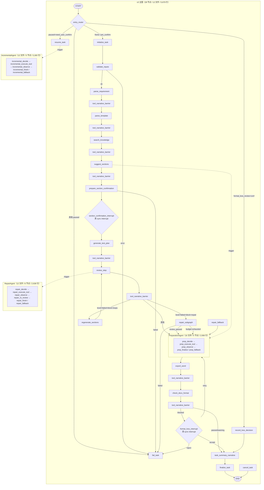
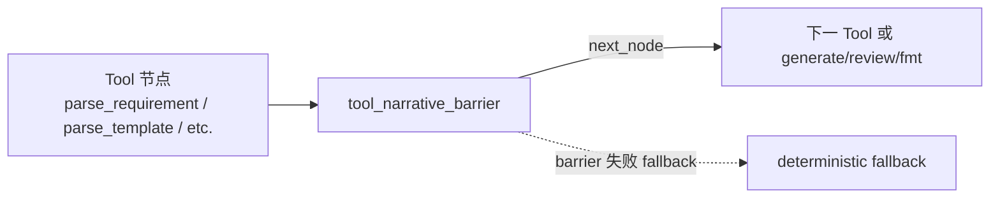
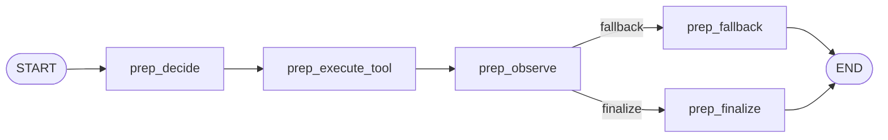
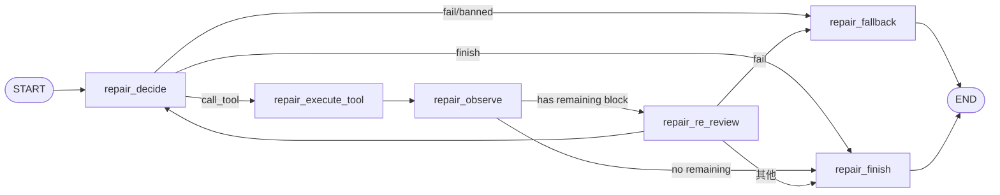
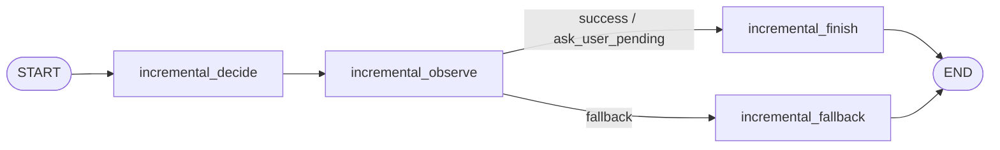

# TestAgent 测试方案生成主图与三个动态子图 技术实现文档

> **配套文档**
> - 总体技术方案: [02_TestAgent_项目总体技术方案.md](../02_TestAgent_项目总体技术方案.md)
> - 源码导读: [03_TestAgent_项目实现原理与源码导读.md](../03_TestAgent_项目实现原理与源码导读.md)
> - 证据索引: [01_TestAgent_项目技术方案证据索引.md](../01_TestAgent_项目技术方案证据索引.md)
> - Context Engine 3.0: [10_TestAgent_ContextEngine3.0_技术实现文档.md](10_TestAgent_ContextEngine3.0_技术实现文档.md)
> - 文件识别系统: [11_TestAgent_文件识别系统_技术实现文档.md](11_TestAgent_文件识别系统_技术实现文档.md)

**编制时间**: 2026-08-25
**对应分支**: `dev_3.0`
**最后对齐**: 与 Phase 2.9A/2.9B + 2.9A.X 关键修复同步

> 本文档面向**接手测试方案生成主图与三个动态子图**的开发者，覆盖 **v3 主图（28 节点，5,679 行）、PreparationAgent（10 文件 / 5 节点）、RepairAgent（12 文件 / 6 节点）、IncrementalAgent（12 文件 / 5 节点）** 的完整拓扑、状态字段、路由决策、关键架构不变量。
> 行号以当前 `dev_3.0` HEAD 为准。

---

## 1. 文档说明

### 1.1 模块定位

测试方案生成主图与三个动态子图是 TestAgent 第二阶段（LangGraph v3）的**核心业务逻辑**：

- **v3 主图**：固定的 28 节点拓扑，编排测试方案生成的完整流程（初始化 → 校验 → 解析 → 生成 → 审查 → 修复 → 导出 → 收尾）
- **三个动态子图**：在主图关键节点插入的 LangGraph 子图
  - **PreparationAgent**：需求/模板解析 → 知识库检索 → 章节建议
  - **RepairAgent**：ResultReview 失败时局部重生成 + 复审闭环
  - **IncrementalAgent**：用户后续修改指定章节（增量生成新 artifact）

### 1.2 适用读者

| 角色 | 期望收获 |
|---|---|
| **主图维护者** | 28 节点拓扑、11 个路由函数、entry_router 5 路径 |
| **动态子图维护者** | 三个子图的设计原则（Mode A vs B / 永不抛 / 单步决策）|
| **新增业务节点** | `_bind_async` / `_bind_sync` 包装规则 |
| **路由调优** | route_after_* 系列函数 + MAX_REVIEW_LOOPS / MAX_FORMAT_LOOPS 阈值 |
| **前端 narrative 集成** | tool_narrative_barrier 与 NarrativeComposer 协同 |

### 1.3 当前状态

- **v3 主图**：`dev_3.0` 已接入，graph name = `test_plan_generation_v3`
- **3 个动态子图**：PreparationAgent（Mode A）/ RepairAgent（Mode A）/ IncrementalAgent
- **5,679 行主图代码 + 7,826 行子图代码**（Preparation 2,008 + Repair 2,638 + Incremental 3,180）
- **Phase 2.9A.7**：interrupt_enabled=True 默认开（真 sync interrupt）
- **Phase 2.9A.9 Fail-Fast**：GEN / EXPORT 失败不再级联
- **Phase 2.9B.4**：tool_narrative_barrier 同步叙事屏障

---

## 2. 总体架构



---

## 3. v3 主图（28 节点 / 12 文件 / 5,679 行）

### 3.1 文件结构（实际 `wc -l` 验证）

| 文件 | 行数 | 职责 |
|---|---|---|
| `__init__.py` | 24 | 模块导出 |
| `entry_routing.py` | 88 | START 入口条件路由（5 路径）|
| `graph.py` | 463 | **主装配**：节点注册 + 边 + path_map |
| `nodes_pre_confirm.py` | 1,128 | 9 个 pre-confirm 节点实现 |
| `nodes_post_confirm.py` | 1,280 | 6 个 post-confirm 节点实现 |
| `nodes_review_format.py` | 1,107 | 5 个 review/format 节点实现 |
| `nodes_narrative.py` | 559 | 2 个 narrative 节点（barrier + summary）|
| `nodes_interrupts.py` | 259 | 2 个 interrupt 节点 |
| `nodes_terminal.py` | 100 | 3 个 terminal 节点（finalize/fail/cancel）|
| `nodes_util.py` | 119 | `_bind_async` / `_bind_sync` 包装器 |
| `routing.py` | 443 | 11 个 route_after_* 函数 + 节点常量 |
| `routing_after_interrupt.py` | 109 | interrupt 后路由（format_loss_interrupt 决策）|

### 3.2 28 个节点分类

| 阶段 | 节点数 | 节点名 |
|---|---|---|
| **入口** | 1 | `entry_router`（条件路由，不是节点）|
| **初始化** | 2 | `initialize_task` / `validate_inputs` |
| **Pre-confirm（解析）** | 6 | `parse_requirement` / `parse_template` / `search_knowledge` / `prep_subgraph` / `prep_legacy_fallback` / `suggest_sections` |
| **Interrupt（章节确认）** | 3 | `prepare_section_confirmation` / `section_confirmation_interrupt` / `pause_for_legacy_confirm` |
| **Resume** | 1 | `resume_task` |
| **Post-confirm（生成）** | 1 | `generate_test_plan` |
| **Review/Repair** | 4 | `review_step` / `regenerate_sections` / `repair_subgraph` / `repair_fallback` |
| **Export** | 2 | `prepare_export` / `export_word` |
| **Format check** | 1 | `check_docx_format` |
| **Format-loss Interrupt** | 3 | `format_loss_interrupt` / `pause_for_legacy_format_decision` / `record_loss_decision` |
| **Narrative（Phase 2.9B.4）** | 2 | `tool_narrative_barrier` / `task_summary_narrative` |
| **Terminal** | 3 | `finalize_task` / `fail_task` / `cancel_task` |

### 3.3 节点签名与包装（`nodes_util.py`）

```python
def _bind_async(node_fn):
    """把 ``async def f(state, *, ctx)`` 包成 LangGraph 节点 ``async def f(state, config)``。
    业务节点(ctx 系列)签名 ``async def f(state, *, ctx)`` 只接收显式 ctx;
    LangGraph 调度时仅传 ``(state, config)``,因此必须用 helper 把 config 解析
    为 ctx 后再透传给原函数。保留 ``__name__`` 让 LangGraph 内部异常栈可读。
    """
    async def _wrapped(state: TestPlanGraphState, config: Any) -> dict:
        ctx = get_ctx(config)
        return await node_fn(state, ctx=ctx)
    _wrapped.__name__ = node_fn.__name__
    return _wrapped


def _bind_sync(node_fn):
    """interrupt 节点必须 sync,通过此 helper 包装。
    LangGraph 的 ``interrupt()`` 调用必须发生在同步节点内,异步节点会与
    checkpointer 的状态机冲突。
    """
    def _wrapped(state: TestPlanGraphState, config: Any) -> dict:
        return node_fn(state, config)
    _wrapped.__name__ = node_fn.__name__
    return _wrapped
```

### 3.4 v3 装配（`build_compiled_v3_graph`）

```python
def build_compiled_v3_graph(
    checkpointer: Optional[Any] = None,
    *,
    interrupt_enabled: bool = True,
):
    """组装 v3 业务图并编译。

    Phase 2.8R-D 关键差异(vs v2_frozen):
      * graph name = f"{GRAPH_NAME_TEST_PLAN}_{GRAPH_VERSION_V3}"
      * 默认 state_schema_version = V7
      * 与 v2_frozen 完全目录独立

    Phase 2.9A.7: ``interrupt_enabled`` 默认 ``True``。
    """
    g = StateGraph(TestPlanGraphState)
    # ── 节点 ───────────────────────────────────────────────────────────
    g.add_node(NODE_INIT, _bind_async(initialize_task_node))
    g.add_node(NODE_VALID, _bind_async(validate_inputs_node))
    g.add_node(NODE_PARSE_REQ, _bind_async(parse_requirement_node))
    g.add_node(NODE_PARSE_TPL, _bind_async(parse_template_node))
    g.add_node(NODE_TOOL_NARRATIVE_BARRIER, _bind_async(tool_narrative_barrier_node))
    g.add_node(NODE_KB, _bind_async(search_knowledge_node))
    g.add_node(NODE_PREP_SUB, _bind_async(prep_subgraph_node))
    g.add_node(NODE_PREP_FALLBACK, _bind_async(prep_legacy_fallback_node))
    g.add_node(NODE_SEC, _bind_async(suggest_sections_node))

    if interrupt_enabled:
        g.add_node(NODE_PREP_CONFIRM, _bind_async(prepare_section_confirmation_node))
        from .nodes_interrupts import section_confirmation_interrupt_node
        g.add_node(NODE_SECTION_INTERRUPT, _bind_sync(section_confirmation_interrupt_node))
    g.add_node(NODE_PAUSE_CONF, _bind_async(pause_for_legacy_confirm_node))

    g.add_node(NODE_RESUME, _bind_async(resume_task_node))
    g.add_node(NODE_GEN, _bind_async(generate_test_plan_node))
    g.add_node(NODE_REVIEW, _bind_async(review_result_node))
    g.add_node(NODE_REG, _bind_async(regenerate_sections_node))
    g.add_node(NODE_REPAIR, _bind_async(repair_subgraph_node))
    g.add_node(NODE_REPAIR_FB, _bind_async(repair_fallback_node))
    g.add_node(NODE_PREP, _bind_async(prepare_export_node))
    g.add_node(NODE_WORD, _bind_async(export_word_node))
    g.add_node(NODE_FMT, _bind_async(check_docx_format_node))

    g.add_node(NODE_TASK_SUMMARY_NARRATIVE, _bind_async(task_summary_narrative_node))

    if interrupt_enabled:
        from .nodes_interrupts import format_loss_interrupt_node
        g.add_node(NODE_FORMAT_INTERRUPT, _bind_sync(format_loss_interrupt_node))
    g.add_node(NODE_PAUSE_FMT_DEC, _bind_async(pause_for_legacy_format_decision_node))
    g.add_node(NODE_RLD, _bind_async(record_loss_decision_node))
    g.add_node(NODE_FIN, _bind_async(finalize_task_node))
    g.add_node(NODE_FAIL, _bind_async(fail_task_node))
    g.add_node(NODE_CANCEL, _bind_async(cancel_task_node))

    # ── 边（详见 §3.6）──────────────────────────────────────────────────
    ...

    return g.compile(
        checkpointer=checkpointer,
        name=f"{GRAPH_NAME_TEST_PLAN}_{GRAPH_VERSION_V3}",
    )
```

### 3.5 entry_router：START 的 5 路径

文件：`entry_routing.py`（88 行）

```python
def entry_router(state: TestPlanGraphState) -> EntryTarget:
    phase = state.get("current_phase")
    marker = state.get("pause_marker")
    confirmation = state.get("format_loss_confirmation")

    # 1) 全新派发
    if phase in (None, "pre_confirm") and marker is None:
        return NODE_INITIALIZE_TASK

    # 2) 章节确认等待
    if phase == "paused" and marker == "need_user_confirm":
        return NODE_RESUME_TASK

    # 3) 格式丢失确认
    if (phase == "paused" and marker == "format_loss_review"
            and isinstance(confirmation, dict)):
        return NODE_RECORD_LOSS_DECISION

    # 4) 防御性 fail
    if phase == "paused":
        return NODE_FAIL_TASK

    # 5) 已完成任务
    if phase in ("completed", "failed", "cancelled"):
        return NODE_FAIL_TASK

    # 兜底
    return NODE_INITIALIZE_TASK
```

### 3.6 路由决策表（11 个 router 函数）

文件：`routing.py`（443 行）

| 路由函数 | 输入 | 输出 | 关键决策 |
|---|---|---|---|
| `route_after_narrative` | `state.next_node` | `parse_template` 等 | 屏障后下一节点（由上游 Tool 写入 `pending_narrative.continuation_route`）|
| `route_after_validate` | `state.last_error` | `parse_requirement` / `fail_task` | last_error 非空 → fail_task |
| `route_after_parse_template` | `state.preparation_agent_enabled` | `prep_subgraph` / `search_knowledge` | Phase 2.3 增量 |
| `route_after_prepare_section_confirmation` | `state.task_status` | `section_confirmation_interrupt` / `fail_task` | task_status=failed → fail_task |
| `route_after_generate_test_plan` | `state.task_status` | `review_step` / `fail_task` | **Phase 2.9A.9 Fail-Fast** |
| `route_after_result_review` | review_result / loops | `prepare_export` / `regenerate_sections` / `repair_subgraph` / `fail_task` | **Phase 2.9A.10** 工具执行失败 vs 语义失败区分 |
| `route_after_repair` | repair_result | `prepare_export` / `fail_task` | review_passed → prepare_export；budget exhausted → prepare_export；其他 → fail_task |
| `route_after_export_word` | `state.task_status` | `check_docx_format` / `fail_task` | **Phase 2.9A.9** |
| `route_after_format_check` | format_check_result | `finalize_task` / `prepare_export` / `pause_for_legacy_format_decision` | 4 路：passed/warning → finalize；blocked+loops≤MAX → pause；failed+loops<MAX → prepare_export；其他 → pause |

### 3.7 `route_after_result_review`（Phase 2.9A.10 最复杂）

```python
def route_after_result_review(state: TestPlanGraphState) -> str:
    if state.get("task_status") == "failed":
        return NODE_FAIL_TASK

    review = state.get("review_result") or {}
    level = str(review.get("level") or "")

    # 优先读 review_issues（新），兜底 block_issues（旧）
    review_issues = review.get("review_issues") or []
    if review_issues:
        block_issues = [
            i for i in review_issues
            if isinstance(i, dict) and i.get("severity") == "block"
        ]
    else:
        block_issues = review.get("block_issues") or []
    loops = int(state.get("review_loop_count") or 0)
    repair_loops = int(state.get("repair_loop_count") or 0)

    # 优先级 1: task_status=failed → fail_task
    if state.get("task_status") == "failed":
        return NODE_FAIL_TASK

    # 优先级 2: level=failed + block + repair_agent_enabled + repair_loops<MAX
    if (level == "failed" and block_issues
            and state.get("repair_agent_enabled")
            and repair_loops < MAX_REVIEW_LOOPS):
        return NODE_REPAIR_SUBGRAPH

    # 优先级 3: level=failed + block + loops<MAX（Phase 2.1 legacy regen）
    if (level == "failed" and block_issues
            and loops < MAX_REVIEW_LOOPS):
        return NODE_REGENERATE_SECTIONS_STEP

    # 优先级 4: pass-through → prepare_export
    return NODE_PREPARE_EXPORT
```

**关键**：工具执行失败（REVIEW_CONTENT_MISSING / envelope.success=False）vs review level=warning/failed 必须分开 —— **工具执行失败 = 立刻 fail_task；review level 不通过 = 修复路径**。

### 3.8 tool_narrative_barrier（Phase 2.9B.4）

每个 Tool 节点完成后进 barrier，由 `route_after_narrative` 读 `state.pending_narrative.continuation_route` 决定下一节点。



**barrier_path_map**（`graph.py` 集中管理）：

```python
barrier_path_map = {
    NODE_PARSE_TPL: NODE_PARSE_TPL,
    ROUTE_NODE_PREP_SUB: NODE_PREP_SUB,
    ROUTE_NODE_KB: NODE_KB,
    NODE_SEC: NODE_SEC,
    NODE_PREPARE_SECTION_CONFIRMATION: (NODE_PREP_CONFIRM if interrupt_enabled else NODE_PAUSE_CONF),
    ROUTE_NODE_REVIEW: NODE_REVIEW,
    ROUTE_NODE_REG: NODE_REG,
    ROUTE_NODE_REPAIR: NODE_REPAIR,
    ROUTE_NODE_PREP: NODE_PREP,
    NODE_CHECK_FORMAT_STEP: NODE_FMT,
    ROUTE_NODE_FIN: NODE_TASK_SUMMARY_NARRATIVE,
    ROUTE_NODE_PAUSE_FMT: (NODE_FORMAT_INTERRUPT if interrupt_enabled else NODE_PAUSE_FMT_DEC),
    ROUTE_NODE_FORMAT_LOSS_INTERRUPT: (NODE_FORMAT_INTERRUPT if interrupt_enabled else NODE_PAUSE_FMT_DEC),
    ROUTE_NODE_FAIL: NODE_FAIL,
}
```

### 3.9 interrupt 节点（Phase 2.9A.7 真 sync interrupt）

**两个 interrupt 节点**：
- `section_confirmation_interrupt` — 真 `interrupt()` 等待用户选章节策略
- `format_loss_interrupt` — 真 `interrupt()` 等待用户确认格式丢失

**关键**（`graph.py` 注释）：

> 否则 Resume 时 LangGraph 找不到 pending interrupt 而重跑整个图，最终 task 永远停在 `waiting_user_confirm`，Worker 记 dispatched 但 TestPlanGeneratorTool 不开始（静默 no-op）。

**legacy sentinel 路径**（`pause_for_legacy_confirm` / `pause_for_legacy_format_decision`）保留但默认不开 — 仅当 `interrupt_enabled=False` 时使用。

### 3.10 状态字段（TestPlanGraphState）

文件：`app/agent_runtime/graphs/test_plan/state.py`

| 字段 | 类型 | 写入者 | 读取者 |
|---|---|---|---|
| `task_id` / `task_public_id` | int / str | initialize_task | 所有节点 |
| `current_phase` | str | 各节点写入 | entry_router |
| `pause_marker` | str (`need_user_confirm` / `format_loss_review` / None) | interrupt 节点 | entry_router |
| `format_loss_confirmation` | dict | 用户决策 | entry_router / record_loss_decision |
| `task_status` | str (`pending` / `running` / `completed` / `failed` / `cancelled`) | 各节点 | 路由函数 |
| `last_error` | dict | 失败节点 | 路由函数 |
| `next_node` | str | Tool 节点 | route_after_narrative |
| `pending_narrative` | dict | Tool 节点 | barrier 节点 |
| `review_result` | dict | review_step | route_after_result_review |
| `review_loop_count` | int | review_step | 路由函数 |
| `repair_result` | dict | repair_subgraph | route_after_repair |
| `repair_loop_count` | int | repair_subgraph | 路由函数 |
| `repair_unresolved_issue_details` | list | repair_subgraph | RepairAgent 观察 |
| `format_check_result` | dict | check_docx_format | route_after_format_check |
| `format_loop_count` | int | check_docx_format | 路由函数 |
| `preparation_agent_enabled` | bool | feature_flags | route_after_parse_template |
| `repair_agent_enabled` | bool | feature_flags | route_after_result_review |
| `incremental_intent` | dict | dispatch | 增量任务 |
| `incremental_result` | dict | incremental_subgraph | 路由 |
| `incremental_steps` | list | incremental_subgraph | 路由 |
| `incremental_observed_success` | bool | incremental_observe | route_after_observe |
| `incremental_observed_fallback` | bool | incremental_observe | route_after_observe |
| `source_task` / `source_artifact_public_id` | str | dispatch | 增量任务 |
| `runtime_context` | RuntimeContext | main | 各节点 ctx |

---

## 4. PreparationAgent（10 文件 / 5 节点 / 2,008 行）

文件：`backend/app/agent_runtime/preparation/`

### 4.1 文件结构（实际 `wc -l` 验证）

| 文件 | 行数 | 职责 |
|---|---|---|
| `agent_loop.py` | 676 | **主循环**：`run_preparation()` 单步决策 |
| `prompt.py` | 250 | PREPARATION_PROFILE 包装 + args_signature |
| `subgraph.py` | 225 | 5 节点 LangGraph 装配 + `run_preparation_subgraph()` facade |
| `event_emitter.py` | 216 | PREPARATION_* 事件 emit |
| `fallback.py` | 194 | `run_legacy_kb_fallback()` legacy 单次 KB |
| `schemas.py` | 148 | Pydantic 模型（AgentDecision / PreparationResult / KnowledgeEvidence / UserQuestion / PublicSummary）|
| `tool_filter.py` | 127 | `filter_decision_tool_calls()` 白名单 |
| `capabilities.py` | 82 | `resolve_capabilities()` ModelCapabilities |
| `permission.py` | 35 | ToolPermissionGuard |
| `budget.py` | 14 | BudgetTracker |
| `__init__.py` | 41 | 模块导出 |

### 4.2 5 节点拓扑（`subgraph.py`）



**`PrepState` TypedDict**（LangGraph 内存使用，不入 MySQL）：

```python
class PrepState(TypedDict, total=False):
    state_snapshot: Dict[str, Any]                # 输入
    prep_decision: Dict[str, Any]                 # 内部累积
    prep_evidence: List[Dict[str, Any]]
    prep_queries: List[str]
    prep_steps: List[Dict[str, Any]]             # audit（仅 sanitized summary + 12-char sig）
    prep_budget_state: Dict[str, Any]
    prep_fallback_reason: Optional[str]
    prep_next_action: str                        # decide / execute_tool / observe / finalize / fallback
    prep_tool_inputs: Dict[str, Any]
    prep_tool_name: str
    prep_result: Dict[str, Any]                  # PreparationResult.model_dump()
```

### 4.3 设计原则（模块自描述）

```
* 永不抛 — 失败时合成 best-effort PreparationResult + emit PREPARATION_FALLBACK
* 单步决策 = (action, tool_name, tool_arguments, decision_summary, public_update)
* 工具调用一律走 TestAgentToolAdapter.execute()（白名单 + 节奏 + 信封）
* 完整审计链写入 state.preparation_steps;仅存 decision_summary ≤500 + 12 字符
  args_signature,绝无 raw LLM 文本 (Rule 11)
* 单一终止: budget exhaust / permanent permission deny / loop_error / decision.finish
```

### 4.4 Mode A vs Mode B

**Phase 2.3 仅 Mode A**（Structured Action JSON）；Mode B（native tool-calling）推迟到 Phase 2.4+：

```python
def _maybe_mode_b(capabilities: ModelCapabilities) -> str:
    """决定当前运行使用 Mode A 还是 Mode B。

    Phase 2.3 仅 Mode A。Mode B 仅在测试显式 override capabilities.native_tool_calling=True
    时被调用,且抛 ModeBNotImplemented (test_prep_native_mode_b_deferred 验证)。
    """
    if capabilities.native_tool_calling:
        raise ModeBNotImplemented(
            "Mode B (native tool-calling) deferred to Phase 2.4+; "
            "LLMClient currently has no generate_with_tools() API."
        )
    return "mode_a"
```

### 4.5 `PreparationResult` Schema（终产物）

```python
class PreparationResult(BaseModel):
    model_config = ConfigDict(extra="forbid")

    information_sufficient: bool
    knowledge_search_used: bool
    queries: List[str] = Field(default_factory=list)
    evidence: List[KnowledgeEvidence] = Field(default_factory=list)
    requirement_gaps: List[RequirementGap] = Field(default_factory=list)
    user_questions: List[UserQuestion] = Field(default_factory=list)   # 主图目前不消费
    constraints: List[str] = Field(default_factory=list)
    confidence: float = Field(ge=0.0, le=1.0)
    public_summary: PublicSummary
    fallback_reason: Optional[str] = Field(default=None, max_length=240)
    budget_state: BudgetState
```

**`AgentDecision` Action**：`call_tool` / `finish` / `ask_user` / `fail`（**主图目前不消费 `user_questions`**——见 `[[project-prep-ask-user-todo]]`）。

### 4.6 `run_preparation_subgraph()` facade

```python
async def run_preparation_subgraph(
    state: Dict[str, Any],
    *,
    llm_client,
    tool_adapter,
    ctx,
    capabilities: Optional[ModelCapabilities] = None,
    clock=time.monotonic,
    parser=None,
) -> PreparationResult:
    """Prep subgraph 主入口。

    为避免 LangGraph 节点持有 LLMClient 引用 (Rule 10),
    run_preparation 在 ainvoke 外执行,然后把结果写入 prep_state 入口,
    子图仅做最终路由 (finalize / fallback)。
    """
    result = await run_preparation(
        state,
        llm_client=llm_client,
        tool_adapter=tool_adapter,
        ctx=ctx,
        capabilities=capabilities or resolve_capabilities(),
        clock=clock,
        parser=parser,
    )
    return result
```

---

## 5. RepairAgent（12 文件 / 6 节点 / 2,638 行）

文件：`backend/app/agent_runtime/repair/`

### 5.1 文件结构

| 文件 | 行数 | 职责 |
|---|---|---|
| `agent_loop.py` | 1,038 | **主循环**：`run_repair()` |
| `decision_filter.py` | 378 | `filter_repair_decision()` |
| `prompt.py` | 274 | REPAIR_SYSTEM_PROMPT + `build_repair_prompt()` |
| `event_emitter.py` | 263 | REPAIR_* 事件 emit |
| `schemas.py` | 150 | Pydantic 模型（RepairDecision / RepairResult / ReviewIssue）|
| `scope_guard.py` | 122 | scope 保护（不允许改 locked section）|
| `issue_parser.py` | 121 | `parse_review_issues()` |
| `subgraph.py` | 93 | 6 节点 LangGraph 装配 + `run_repair_subgraph()` facade |
| `fallback.py` | 54 | `run_legacy_repair_fallback()` |
| `permission.py` | 43 | REPAIR_TOOL_WHITELIST + ToolPermissionGuard |
| `capabilities.py` | 24 | ModelCapabilities |
| `budget.py` | 14 | BudgetTracker |

### 5.2 6 节点拓扑（`subgraph.py`）



### 5.3 设计原则（模块自描述）

```
镜像 preparation.agent_loop.run_preparation 但适配 Repair:
* 6 节点不是 5: 加一个 repair_re_review（单次 repair 内可多次调
  ResultReviewTool 看是否仍 block）
* 收尾条件:所有 block issues 都解决 OR budget 耗尽 OR 异常
* 永不抛:失败合成 best-effort RepairResult + emit REPAIR_FALLBACK
* Mode A (Structured Action JSON) 唯一通路;Mode B TODO stub 与 prep 一致
```

### 5.4 RepairAgent 预算（比 Prep 略宽松）

```python
class _RepairBudgetLimits:
    MAX_AGENT_STEPS = _MAX_REPAIR_STEPS             # 8
    MAX_TOOL_CALLS = _MAX_REPAIR_TOOL_CALLS          # 6
    MAX_WALL_TIME_SECONDS = _MAX_REPAIR_WALL_TIME    # 120.0
    MAX_TOKEN_ESTIMATE = _MAX_REPAIR_TOKEN_ESTIMATE  # 8000
    MAX_SAME_TOOL_SAME_ARGS = _MAX_SAME_TOOL_SAME_ARGS  # 2
```

### 5.5 `parse_review_issues()` — 关键数据流

文件：`issue_parser.py`（121 行）

```python
def parse_review_issues(
    review_result: Dict[str, Any],
    *,
    locked_section_ids: Iterable[str] = (),
) -> List[ReviewIssue]:
    """Parse ResultReviewTool output → 过滤后的 list[ReviewIssue]。

    兼容:
    * 新字段 review_issues 优先（Phase 2.4 standardized）
    * 旧字段 block_issues 兜底（Phase 2.1 / Phase 2.3 testing）

    过滤:
    * severity != "block"
    * section_id ∈ locked_section_ids
    * repairable=False
    """
    locked = set(locked_section_ids or ())

    raw_issues: List[Dict[str, Any]] = []
    new_field = review_result.get("review_issues")
    if isinstance(new_field, list):
        for it in new_field:
            if isinstance(it, dict) and it.get("severity") == "block":
                raw_issues.append(it)
    else:
        # 旧路径 — block_issues 已经是 severity=block 的子集
        legacy = review_result.get("block_issues") or review_result.get("issues") or []
        if isinstance(legacy, list):
            raw_issues = [it for it in legacy if isinstance(it, dict)]

    out: List[ReviewIssue] = []
    for idx, raw in enumerate(raw_issues):
        section_id = raw.get("section_id") or ""
        if section_id in locked:
            continue
        if raw.get("repairable") is False:
            continue
        rule_id = str(raw.get("rule_id") or "unknown_rule")
        kind = str(raw.get("kind") or "unknown")
        issue_id = _coerce_issue_id(rule_id, section_id or "", idx, raw.get("issue_id"))
        out.append(ReviewIssue(
            issue_id=issue_id,
            rule_id=rule_id,
            kind=kind,
            severity="block",
            section_id=section_id or None,
            field_path=raw.get("field_path"),
            message=str(raw.get("message") or "")[:480],
            evidence=coerce_evidence_text(raw.get("evidence")),
            expected_rule=raw.get("expected_rule"),
            repairable=True,
            suggested_strategy=raw.get("suggested_strategy") or "regenerate_section",
            # Phase 2.9A.X：透传 fix_instruction — LLM-actionable 修正指令
            fix_instruction=raw.get("fix_instruction"),
        ))
    return out
```

**Phase 2.9A.X 关键**：`fix_instruction` 透传 — LLM-actionable 修正指令，`TestPlanRegenTool._build_prompt` 优先用它替代 `message`。

### 5.6 ReviewIssue 字段

```python
ReviewIssue(
    issue_id,           # 确定性：f"{rule_id}:{section_id or 'global'}:{idx}"
    rule_id,            # 来自 review_result
    kind,               # block 类型（schema_invalid / content_missing / etc）
    severity="block",   # 固定
    section_id,         # None 表示全局
    field_path,         # JSON 字段路径
    message,            # ≤480 字符
    evidence,           # coerce_evidence_text 截断 ≤400
    expected_rule,      # 期望规则
    repairable=True,    # 固定
    suggested_strategy, # "regenerate_section"（默认）
    fix_instruction,    # Phase 2.9A.X：LLM-actionable 修正指令
)
```

### 5.7 `run_repair_subgraph()` facade

```python
async def run_repair_subgraph(
    state: TestPlanGraphState,
    *,
    llm_client,
    tool_adapter,
    ctx: RuntimeContext,
) -> Any:
    """Repair subgraph 主入口;直接调 run_repair 主循环。

    把 state 字典化(避开 TypedDict 校验)交给 agent_loop;返回 RepairResult
    实例,主图 repair_subgraph_node 读它做状态更新。
    """
    from app.agent_runtime.repair.agent_loop import run_repair
    state_dict: Dict[str, Any] = dict(state)
    return await run_repair(
        state_dict,
        llm_client=llm_client,
        tool_adapter=tool_adapter,
        ctx=ctx,
    )
```

**Phase 2.4 设计**：LangGraph 6 节点作为"语义占位"在 documentation 里描述，**真实执行在 `run_repair`**（避免在 subgraph 内另起一个 checkpoint memory）。

### 5.8 与主图的硬契约（来自 HANDO.md）

**RepairAgent 闭环**（来自 HANDO §3.3）：

1. `TestPlanRegenTool success → ResultReviewTool` **必须是硬路径**
2. 两次 Regen 之间**必须有一次 ResultReviewTool 复审**
3. 只有复审通过，`repair_result.review_passed=True`，Repair 子图才可 clean/finish
4. 复审仍失败时，把新的 `review_issues` 喂回 RepairAgent 决定下一轮
5. 主图 `NODE_REPAIR` 后不能无条件 prepare_export，**应按 repair result 条件路由**
6. 预算耗尽但仍有 block issue：继续导出，但叙事层必须明确告诉用户哪些章节还有问题，最终总结用 **Markdown 加粗**标出风险

---

## 6. IncrementalAgent（12 文件 / 5 节点 / 3,180 行）

文件：`backend/app/agent_runtime/incremental/`

### 6.1 文件结构

| 文件 | 行数 | 职责 |
|---|---|---|
| `agent_loop.py` | 650 | **主循环**：`run_incremental()` |
| `decision_filter.py` | 539 | `filter_incremental_decision()` |
| `fallback.py` | 403 | `run_legacy_incremental_fallback()` |
| `event_emitter.py` | 322 | INCREMENTAL_* 事件 emit |
| `subgraph.py` | 291 | 5 节点 LangGraph 装配 + `run_incremental_subgraph()` facade |
| `artifact_chain.py` | 287 | 幂等 artifact 链管理 |
| `schemas.py` | 231 | Pydantic 模型（IncrementalDecision / IncrementalIntent / IncrementalResult / PublicSummary）|
| `prompt.py` | 208 | `build_incremental_prompt()` |
| `scope_guard.py` | 107 | scope 保护（locked section） |
| `permission.py` | 52 | INCREMENTAL_TOOL_WHITELIST + ToolPermissionGuard |
| `capabilities.py` | 20 | ModelCapabilities |
| `budget.py` | 13 | BudgetTracker |

### 6.2 5 节点拓扑（`subgraph.py`）



**`graph_name="incremental_test_plan"`**（与 v3 的 `"test_plan_generation"` **隔离**）—— 老任务不会被新 subgraph 误识别。

### 6.3 设计原则（模块自描述）

```
镜像 preparation.subgraph / repair.subgraph 的设计:5-6 节点 LangGraph,
compile 返回 CompiledStateGraph。

节点拓扑:

incremental_decide ─┬─→  incremental_execute_tool  ─→  incremental_observe  ─┐
                    │                                                       │
                    └────────────────── re-iterate ────────────────────────┘

                    incremental_decide ─finish/ask_user─→  incremental_finish  ─→ END
                    incremental_observe ─permanent_deny/budget/fail─→  incremental_fallback  ─→ END

graph_name="incremental_test_plan" 与 Phase 2.1 / 2.4
"test_plan_generation" 隔离 —— 老任务不会被新 subgraph 误识别。
```

### 6.4 触发场景（来自 HANDO.md §3.10）

用户在已生成测试方案的会话里继续说：

- 「项目概述章节内容太少了，需要更加丰富，起码达到100字才可以」
- 或「帮我修改测试目标章节...」

→ 识别为 **结果修改/增量任务**，而不是重新开完整测试方案生成。

### 6.5 IncrementalAgent 预算

```python
class _IncrementalBudget(BudgetTracker):
    """Phase 2.5 预算比 Repair 略宽,因为包含 export + format check。"""
    MAX_AGENT_STEPS = 8
    MAX_TOOL_CALLS = 6
    MAX_WALL_TIME_SECONDS = 180
    MAX_TOKEN_ESTIMATE = 8000
    MAX_SAME_TOOL_SAME_ARGS = 2
```

### 6.6 `artifact_chain.py` — 增量 Artifact 链

文件：`incremental/artifact_chain.py`（287 行）

**职责**：

1. `incremental_artifact_idempotency_key()`：基于 `(source_task_id, source_artifact_id, incremental_modification_id)` 计算 SHA16 → `artifact-inc-<sha16>`
2. `create_incremental_artifact_record()`：事务中 INSERT 新 `Artifact(version_no=source.version_no + 1, source_artifact_id=source.id)`
3. `append_superseded_to_task_context()`：把 `source.id` 追加到 `agent_tasks.task_context_json.superseded_artifact_ids`，带 CAS

**设计要点**：
- **全部幂等**：同一 idempotency_key 二次调用 → 返回旧 record，不重复 INSERT
- **CAS 写入 task_context_json** 防并发覆盖
- **不写 SQL event 表**（避免和 GraphEventAdapter 重复）；事件由 `IncrementalEventEmitter` 走 `event_sink.emit`

```python
def incremental_artifact_idempotency_key(
    *,
    source_task_public_id: str,
    source_artifact_public_id: str,
    source_artifact_version_no: int,
    incremental_modification_id: str,
) -> str:
    """计算稳定的 16-char SHA 幂等 key。"""
    raw = (
        f"{source_task_public_id}|{source_artifact_public_id}|"
        f"{source_artifact_version_no}|{incremental_modification_id}"
    ).encode("utf-8")
    digest = hashlib.sha256(raw).hexdigest()[:16]
    return f"artifact-inc-{digest}"
```

### 6.7 `IncrementalResult` Schema

```python
class IncrementalArtifactChainResult(BaseModel):
    model_config = {"extra": "forbid"}

    success: bool
    new_artifact_public_id: Optional[str] = Field(default=None, max_length=64)
    new_artifact_version_no: Optional[int] = Field(default=None, ge=2)
    source_artifact_internal_id: Optional[int] = Field(default=None, ge=1)
    superseded_chain: List[int] = Field(default_factory=list)
    idempotency_key: str = Field(max_length=128)
    fallback_reason: Optional[str] = Field(default=None, max_length=240)
```

### 6.8 `run_incremental_subgraph()` facade（Phase 2.8R-C thread_id 严格）

```python
async def run_incremental_subgraph(
    state: Dict[str, Any],
    *,
    ctx,
    config: Dict[str, Any] | None = None,
    checkpointer=None,
) -> Dict[str, Any]:
    """运行增量子 Agent,返回 final state。

    增量 Agent 与 preparation / repair 子图一样依赖 RuntimeContext
    (event_sink / llm_client / tool_adapter / session_factory)。

    Phase 2.8R-C:task_id 缺失/空/stub-thread 一律抛 InvalidGraphThreadIdError。
    """
    from app.agent_runtime.graph_thread_id import require_graph_thread_id

    thread_id = require_graph_thread_id(state, context="incremental_subgraph")
    cfg = config or {"configurable": {"thread_id": thread_id}}
    runtime_ctx = ctx
    if runtime_ctx is None:
        runtime_ctx = (cfg.get("configurable") or {}).get("runtime_context")
    if runtime_ctx is None:
        raise RuntimeError(
            "incremental_runtime_context_missing: "
            "IncrementalAgent requires RuntimeContext, but ctx was not provided"
        )

    state_dict = dict(state)
    result = await run_incremental(state_dict, ctx=runtime_ctx)
    ...
```

**关键约束**：不静默回退到 `incremental-default`。

---

## 7. 关键架构不变量

> 改动前必须确认的不变量。

| # | 规则 | 证据 | 验证 |
|---|---|---|---|
| 1 | v3 graph name = `f"{GRAPH_NAME_TEST_PLAN}_{GRAPH_VERSION_V3}"` | `graph.py:427` | `grep "GRAPH_NAME_TEST_PLAN"` |
| 2 | v3 与 v2_frozen **完全目录独立**；本目录所有 .py 是 v3 专属 | `graph.py:2-15` | `ls versions/` |
| 3 | 默认 `state_schema_version_for` = V7（V6 + 1）| `graph.py:6` | – |
| 4 | 未知 version → `GraphVersionNotAvailableError`，**不 fallback** | `graph.py:8-9` | – |
| 5 | 业务节点签名 `async def f(state, *, ctx)`，LangGraph 节点必须 `_bind_async` 包装 | `nodes_util.py` L127-142 | `grep "_bind_async"` |
| 6 | interrupt 节点必须 sync → `_bind_sync` 包装 | `nodes_util.py` L145-156 | – |
| 7 | **LangGraph `interrupt()` 必须在同步节点内**，异步节点会与 checkpointer 状态机冲突 | `nodes_util.py` L148-151` | – |
| 8 | `interrupt_enabled` **默认 True**（Phase 2.9A.7） | `graph.py:200` | – |
| 9 | Legacy sentinel pause 路径（`pause_for_legacy_confirm` / `pause_for_legacy_format_decision`）**默认不开**，否则 resume 时找不到 pending interrupt 静默 no-op | `graph.py:444-449` | – |
| 10 | section_confirmation_interrupt 完成后**直连 generate_test_plan**，**不**绕 resume_task_node | `graph.py:361-363` | – |
| 11 | **Phase 2.9A.9 Fail-Fast**：GEN 失败 → fail_task（不级联 review） | `routing.py:117-133` | `grep "Fail-Fast"` |
| 12 | **Phase 2.9A.9 Fail-Fast**：WordExport 失败 → fail_task（不级联 format_check） | `routing.py:229-236` | – |
| 13 | **Phase 2.9A.10**：`task_status=failed` 优先于 review level（工具执行失败 ≠ review level） | `routing.py:139-189` | – |
| 14 | repair 闭环：`TestPlanRegenTool success → ResultReviewTool` **硬路径** | HANDO §3.3 | `grep "review_passed"` |
| 15 | 两次 Regen 之间**必须有一次 ResultReviewTool 复审** | HANDO §3.3 | – |
| 16 | RepairAgent 预算耗尽仍可导出，但叙事层必须用 **Markdown 加粗**标出风险章节 | HANDO §3.3 | – |
| 17 | IncrementalAgent `graph_name="incremental_test_plan"`（隔离 v3 主图） | `subgraph.py:17-18` | `grep "incremental_test_plan"` |
| 18 | `prepare_section_confirmation` `task_status=failed` → **直接 fail_task**（不让 interrupt 救） | `routing.py:95-111` | – |
| 19 | Format check `level=blocked` + `loops≤MAX` → `pause_for_legacy_format_decision` | `routing.py:402-403` | – |
| 20 | Format check `level=failed` + `loops<MAX` → `prepare_export`（降低保真度重试） | `routing.py:407-410` | – |
| 21 | barrier 节点是纯函数（只决定"放行 + 落到 next_node"），由上游 Tool 在 `pending_narrative.continuation_route` 显式告知下一节点 | `routing.py:46-55` | – |
| 22 | preparation/repair/incremental **永不抛**：失败合成 best-effort result + emit FALLBACK | 模块设计注释 | – |
| 23 | PreparationAgent Mode A only，Mode B 抛 `ModeBNotImplemented` | `preparation/agent_loop.py` L82-98 | `grep "ModeBNotImplemented"` |
| 24 | RepairAgent `_MAX_REPAIR_STEPS=8, _MAX_REPAIR_TOOL_CALLS=6, _MAX_REPAIR_WALL_TIME=120.0s` | `repair/agent_loop.py` L42-46 | – |
| 25 | IncrementalAgent `MAX_AGENT_STEPS=8, MAX_TOOL_CALLS=6, MAX_WALL_TIME_SECONDS=180` | `incremental/agent_loop.py` L46-52` | – |
| 26 | 增量 artifact 链使用 `task_context_json.superseded_artifact_ids` 字段（无 Alembic） | `incremental/artifact_chain.py` L2-5` | `grep "superseded_artifact_ids"` |
| 27 | 增量 idempotency_key = `artifact-inc-<sha16>` 基于 `(source_task_id, source_artifact_id, source_artifact_version_no, incremental_modification_id)` | `incremental/artifact_chain.py` L53-70` | – |
| 28 | `parse_review_issues` 优先读 `review_issues`（新），兜底 `block_issues`（旧） | `repair/issue_parser.py` L70-80` | – |
| 29 | `parse_review_issues` 过滤 `severity != "block"` / `section_id ∈ locked` / `repairable=False` | `repair/issue_parser.py` L82-90` | – |
| 30 | `ReviewIssue.fix_instruction`（Phase 2.9A.X）：透传自 review_result，`TestPlanRegenTool._build_prompt` 优先用它替代 `message` | `repair/issue_parser.py` L110-112` | `grep "fix_instruction"` |

---

## 8. 测试与验证

### 8.1 测试目录

```
backend/tests/agent_runtime/
├── test_plan/
│   ├── test_compile_v3.py
│   ├── test_interrupt_resume.py
│   ├── test_nodes_*.py
│   ├── test_routing.py
│   └── ...
├── test_plan_preparation_agent/
│   ├── test_preparation_agent_loop.py
│   ├── test_prep_subgraph.py
│   ├── test_prep_native_mode_b_deferred.py   # Phase 2.4+ Mode B 测试桩
│   └── ...
├── test_plan_repair_agent/
│   ├── test_repair_auto_re_review.py        # Phase 2.4 自动复审闭环
│   ├── test_repair_schema_issues.py         # Phase 2.9A.X schema 透传
│   ├── test_issue_parser.py
│   └── ...
├── test_plan_incremental_agent/
│   ├── test_incremental_artifact_chain.py
│   ├── test_incremental_subgraph.py
│   └── ...
├── test_dispatch/
│   ├── test_incremental_api_dispatcher.py
│   └── ...
├── test_incremental_coordinator_context.py
└── ...
```

### 8.2 关键验证命令

```bash
# v3 主图编译 + interrupt 测试
cd backend && python -m pytest tests/agent_runtime/test_plan/ -x -q
cd backend && python -m pytest tests/agent_runtime/test_interrupt_resume.py -x -q

# PreparationAgent
cd backend && python -m pytest tests/agent_runtime/test_plan_preparation_agent/ -x -q

# RepairAgent（含闭环 + schema 透传）
cd backend && python -m pytest tests/agent_runtime/test_plan_repair_agent/ -x -q

# IncrementalAgent
cd backend && python -m pytest tests/agent_runtime/test_plan_incremental_agent/ -x -q
cd backend && python -m pytest tests/agent_runtime/test_incremental_coordinator_context.py -x -q
cd backend && python -m pytest tests/agent_runtime/test_dispatch/test_incremental_api_dispatcher.py -x -q
```

### 8.3 端到端验证

```bash
# 启动 dev_3.0 后端 + 启动 LangGraph v3
export AGENT_RUNTIME_DEFAULT_ENGINE=langgraph
export AGENT_RUNTIME_POSTGRES_URL=postgresql+psycopg://...
python -m uvicorn app.main:app --reload

# 1. 测试方案生成流程
curl -X POST http://localhost:8000/api/v1/messages/send \
  -H "Content-Type: application/json" \
  -d '{"content":"生成测试方案","attachment_public_ids":["file_1","file_2"]}'

# 2. 触发增量生成（在已生成测试方案的会话里）
curl -X POST http://localhost:8000/api/v1/messages/send \
  -H "Content-Type: application/json" \
  -d '{"content":"项目概述章节内容太少了，需要更加丰富，起码达到100字才可以"}'

# 观察 SSE：task 应走 incremental_test_plan 子图
```

---

## 9. 当前限制

### 9.1 真实限制（dev_3.0）

1. **PreparationAgent `ask_user` 未接入主图** — schema/prompt 都支持，但主图不消费 `user_questions`；真正能停主图的只有 `section_confirmation` / `format_loss_review` 两个 interrupt（见 `[[project-prep-ask-user-todo]]`）
2. **PreparationAgent Mode B 推迟** — 抛 `ModeBNotImplemented`，需 Phase 2.4+ 实现 LLM native tool-calling
3. **RepairAgent `fire_and_forget dispatch_repair_task`** — 仅当 `dynamic_agent_api_enabled=True` 时触发，否则 no-op（`routing.py:309-362`）
4. **IncrementalAgent 单元测试已通过但浏览器真实链路未实测**（来自 HANDO §4）
5. **narrative_governance 是单一调用源**（详 `13_NarrativeComposer_技术实现文档.md`）
6. **legacy sentinel pause 默认关闭** — 用户开 `interrupt_enabled=False` 才走

### 9.2 后续规划

- **Phase 2.10**：修复 `section_1 → generation_config_subset` 映射在真实链路（来自 HANDO §3.5 修复方向）
- **Mode B 推进**：LLM native tool-calling
- **IncrementalAgent 真实链路验证**：浏览器实测

---

## 10. 与其他文档的关系

| 文档 | 关系 |
|---|---|
| [docs_x/02 §9-12](../02_TestAgent_项目总体技术方案.md) | 总体技术方案对应章节 |
| [docs_x/10 Context Engine 3.0](10_TestAgent_ContextEngine3.0_技术实现文档.md) | Context Engine 为 Tool 提供 context（via MIG flags）|
| [docs_x/11 文件识别系统](11_TestAgent_文件识别系统_技术实现文档.md) | 文件识别上游为 Generation 提供上下文 |
| [docs_x/12 NarrativeComposer](12_TestAgent_NarrativeComposer_技术实现文档.md) | tool_narrative_barrier 调用 NarrativeComposer |
| `docs/06_TestAgent_Agent工作流设计.md` | 设计文档（已迁移到 docs_x/）|

---

## 11. 索引自检（dev_3.0）

- [x] v3 主图 28 节点 / 12 文件 / 5,679 行（实际 `wc -l` 验证）
- [x] PreparationAgent 10 文件 / 5 节点 / 2,008 行
- [x] RepairAgent 12 文件 / 6 节点 / 2,638 行
- [x] IncrementalAgent 12 文件 / 5 节点 / 3,180 行
- [x] 11 个 router 函数 + 路由决策表
- [x] entry_router 5 路径
- [x] 节点包装 `_bind_async` / `_bind_sync` 规则
- [x] tool_narrative_barrier 集中 path_map
- [x] Phase 2.9A.7 / 2.9A.9 / 2.9A.10 / 2.9B.4 关键变更记录
- [x] IncrementalAgent 隔离 graph_name="incremental_test_plan"
- [x] artifact_chain idempotency_key + CAS 写入
- [x] 30 条架构不变量
- [x] 当前限制 + 后续规划
- [x] 与 docs_x/02/10/11/12 文档关系清晰
- [x] 文档中**不包含** codex / claude code / 指导 AI 开发的人员 等描述

**文档完成。配套阅读：[docs_x/02 §9-12](../02_TestAgent_项目总体技术方案.md) + [docs_x/10 Context Engine 3.0](10_TestAgent_ContextEngine3.0_技术实现文档.md)。**