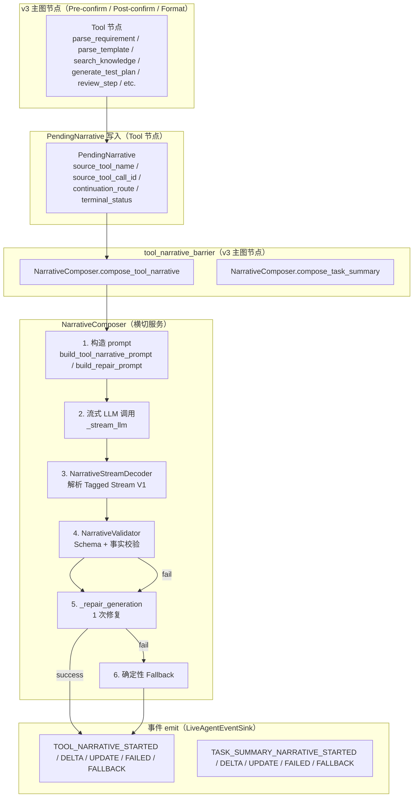
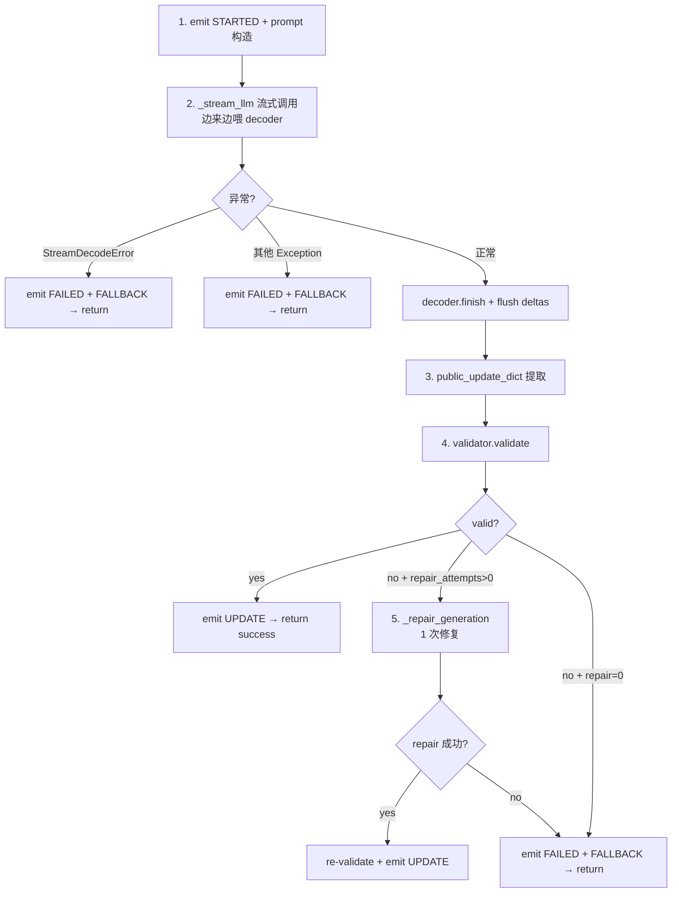

# TestAgent NarrativeComposer 技术实现文档

> **配套文档**
> - 总体技术方案: [02_TestAgent_项目总体技术方案.md](../02_TestAgent_项目总体技术方案.md)
> - 源码导读: [03_TestAgent_项目实现原理与源码导读.md](../03_TestAgent_项目实现原理与源码导读.md)
> - 证据索引: [01_TestAgent_项目技术方案证据索引.md](../01_TestAgent_项目技术方案证据索引.md)
> - Context Engine 3.0: [10_TestAgent_ContextEngine3.0_技术实现文档.md](10_TestAgent_ContextEngine3.0_技术实现文档.md)
> - 测试方案生成主图: [12_TestAgent_测试方案生成主图与三个动态子图_技术实现文档.md](12_TestAgent_测试方案生成主图与三个动态子图_技术实现文档.md)

**编制时间**: 2026-08-25
**对应分支**: `dev_3.0`
**最后对齐**: 与 Phase 2.9B.4 / 2.9B.5 / 2.9B.6 + 2026-08-18 B2 Bug Fix 同步

> 本文档面向**接手 NarrativeComposer 模块**的开发者，覆盖 **LLM-first 叙事生成 + Tagged Stream V1 协议 + 8 Tool 同步 Barrier + Schema/事实校验 + 1 次 Repair + 确定性 Fallback + Phase 2.9B.6 Task Summary 一致性**。
> 行号以当前 `dev_3.0` HEAD 为准。

---

## 1. 文档说明

### 1.1 模块定位

NarrativeComposer 是 TestAgent 的**横切叙事服务**（Phase 2.9B.4+）：

- **职责 1**：用 LLM 生成用户可见的工具叙事（Tool narrative）+ 任务总结（Task summary narrative）
- **职责 2**：流式输出 SSE delta 事件，实现"边写边展示"
- **职责 3**：Schema + 事实校验（数字白名单、文件名、状态语义、敏感信息）
- **职责 4**：1 次 Repair（fact_feedback）+ 确定性 Fallback
- **职责 5**：与 v3 主图 `tool_narrative_barrier` 同步屏障配合

### 1.2 适用读者

| 角色 | 期望收获 |
|---|---|
| **Narrative 维护者** | 5 阶段生成 + Tagged Stream V1 + 校验 + Repair + Fallback |
| **Tool 节点开发者** | 如何注册 Tool Context Builder + PendingNarrative 写入 |
| **Prompt 调优** | Tagged Natural Narrative V2 协议 + 事实约束 |
| **前端 reducer 集成** | `narrative_id / generation_id / generation_no / source_event_id / source_tool_call_id` 锚定 |
| **Bug 修复** | Phase 2.9B.5/2.9B.6/2026-08-18(B2) 关键 Bug Fix 记录 |

### 1.3 当前状态

- **Phase 2.9B.4 / 2.9B.5 / 2.9B.6 全部闭环**
- **2,319 行核心代码**（narrative_composer/6 文件）+ **2,153 行治理代码**（_shared/narrative_governance/11 文件）
- **生产环境默认关闭**：`AGENT_RUNTIME_PHASE29B_TOOL_NARRATIVE_ENABLED=1` 才启用
- **Phase 2.9B.4 tool_narrative_barrier** 已嵌入 v3 主图

---

## 2. 总体架构



---

## 3. 文件结构（实际 `wc -l` 验证）

### 3.1 narrative_composer/（6 文件 / 2,319 行）

| 文件 | 行数 | 职责 |
|---|---|---|
| `composer.py` | 671 | **NarrativeComposer 主类**：5 阶段生成 + Repair + Fallback + Event emit |
| `context_builders.py` | 516 | **11 个 Tool Context Builder**（白名单事实压缩 + fact_constraints 填充）|
| `validator.py` | 449 | **NarrativeValidator**：Schema + 数字/文件名/状态/敏感信息校验 |
| `stream_decoder.py` | 224 | **NarrativeStreamDecoder**：Tagged Stream V1 增量解析 |
| `prompts.py` | 220 | Tool/Repair Prompt 构造 |
| `__init__.py` | 23 | 模块导出 |

### 3.2 _shared/narrative_governance/（11 文件 / 2,153 行）

| 文件 | 行数 | 职责 |
|---|---|---|
| `quality_validator.py` | 325 | 质量校验器（schema + semantic）|
| `service.py` | 304 | NarrativeGovernanceService 主服务 |
| `schemas.py` | 260 | Pydantic 模型（NarrativePolicy / GovernanceDecision）|
| `cache.py` | 238 | 叙事缓存 |
| `compressor.py` | 199 | 事实压缩器 |
| `dedup.py` | 182 | 去重（避免重复叙事）|
| `settings_service.py` | 178 | SettingsService 集成 |
| `signature.py` | 153 | 签名（hash 锚定）|
| `policy.py` | 151 | Policy 决策 |
| `emitter_adapter.py` | 144 | EventEmitter 适配 |
| `__init__.py` | 19 | 模块导出 |

### 3.3 _shared/ 配套文件

| 文件 | 行数 | 职责 |
|---|---|---|
| `public_narrative.py` | 397 | **AgentPublicUpdateDraft 合同** + 3 个确定性 Fallback（prep/repair/incremental）|
| `summary_facts.py` | 347 | **Phase 2.9A.20 单一事实构造器**：章节数 / 业务模块数 / 审查分级 / Artifact 状态 |

---

## 4. 数据模型（`schemas.py` 216 行）

### 4.1 枚举类型

```python
NarrativeKind = Literal["tool", "task_summary"]
NarrativeSource = Literal["llm", "deterministic"]
NarrativeStatus = Literal["streaming", "completed", "failed", "fallback"]
ToolTerminalStatus = Literal["success", "failed", "skipped", "retry_scheduled", "timeout"]
```

### 4.2 `NarrativeFactConstraints`（事实白名单白名单）

```python
class NarrativeFactConstraints(BaseModel):
    model_config = ConfigDict(extra="forbid")

    allowed_numeric_facts: List[int] = Field(default_factory=list)
    allowed_file_names: List[str] = Field(default_factory=list)
    allowed_literal_facts: List[str] = Field(default_factory=list)
    numeric_exempt_literals: List[str] = Field(default_factory=list)
    forbidden_internal_fields: List[str] = Field(
        default_factory=lambda: [
            "system_prompt", "api_key", "stack_trace",
            "server_path", "internal_id", "database",
        ]
    )
```

### 4.3 `ToolNarrativeContext`（Tool 完成事实快照）

```python
class ToolNarrativeContext(BaseModel):
    model_config = ConfigDict(extra="forbid")

    schema_version: int = 1
    task_id: str = ""
    graph_run_id: str = ""
    goal: str = ""
    current_phase: str = ""
    tool_name: str                              # 必填
    tool_call_id: str = ""
    source_event_id: str = ""
    attempt: int = 1
    terminal_status: ToolTerminalStatus         # 必填
    duration_ms: Optional[int] = None
    input_facts: Dict[str, Any] = Field(default_factory=dict)
    output_facts: Dict[str, Any] = Field(default_factory=dict)
    state_diff: Dict[str, Any] = Field(default_factory=dict)
    execution_context: Dict[str, Any] = Field(default_factory=dict)
    fact_constraints: NarrativeFactConstraints = Field(
        default_factory=NarrativeFactConstraints
    )
```

### 4.4 `TaskSummaryNarrativeContext`（任务总结事实快照）

```python
class TaskSummaryNarrativeContext(BaseModel):
    model_config = ConfigDict(extra="forbid")

    schema_version: int = 1
    task_id: str = ""
    graph_run_id: str = ""
    task_goal: str = ""
    task_status: str = "completed"
    completed_tools: List[Dict[str, Any]] = Field(default_factory=list)
    generated_sections: Optional[int] = None
    preserved_template_sections: Optional[int] = None
    business_modules: Optional[int] = None
    review: Dict[str, Any] = Field(default_factory=dict)
    artifact: Dict[str, Any] = Field(default_factory=dict)
    important_decisions: List[str] = Field(default_factory=list)
    repairs_performed: List[str] = Field(default_factory=list)
    remaining_risks: List[str] = Field(default_factory=list)
    # BUG FIX 2026-08-18 (B2): 摘要内容上下文
    requirement_text_excerpt: Optional[str] = None           # 需求文档前 600 字
    generated_section_content_excerpts: Optional[List[Dict[str, Any]]] = None  # 前 5 章节各 200 字
    fact_constraints: NarrativeFactConstraints = Field(
        default_factory=NarrativeFactConstraints
    )
```

### 4.5 `NarrativeGenerationRequest` / `NarrativeGenerationResult`

```python
class NarrativeGenerationRequest(BaseModel):
    model_config = ConfigDict(extra="forbid")

    kind: NarrativeKind
    narrative_id: str
    generation_id: str
    generation_no: int
    tool_context: Optional[ToolNarrativeContext] = None
    task_summary_context: Optional[TaskSummaryNarrativeContext] = None
    system_prompt: str
    user_content: str
    schema_version: int = 1


class NarrativeGenerationResult(BaseModel):
    model_config = ConfigDict(extra="forbid")

    narrative_id: str
    generation_id: str
    generation_no: int
    success: bool
    source: NarrativeSource = "deterministic"
    status: NarrativeStatus = "fallback"
    public_update: Optional[AgentPublicUpdateDraft] = None
    failure_category: Optional[str] = None
    fallback_used: bool = False
    delta_count: int = 0
```

### 4.6 `PendingNarrative`（Tool 节点 → Barrier 消费）

```python
class PendingNarrative(BaseModel):
    model_config = ConfigDict(extra="forbid")

    narrative_kind: Literal["tool"] = "tool"
    source_tool_name: str
    source_tool_call_id: str
    source_event_id: str = ""
    tool_attempt: int = 1
    terminal_status: ToolTerminalStatus
    continuation_route: str
    duration_ms: Optional[int] = None
```

---

## 5. AgentPublicUpdateDraft 合同（`public_narrative.py` 397 行）

### 5.1 字段合同（Phase 2.9B.3 正式统一）

```python
class AgentPublicUpdateDraft(BaseModel):
    model_config = ConfigDict(extra="forbid")

    headline: str = Field(max_length=80)       # 必填
    summary: str = Field(max_length=200)       # 必填
    impact: str = Field(max_length=160)        # 必填
    next_action: str = Field(max_length=160)   # 必填
    details: list[str] = Field(default_factory=list, max_length=5)  # 2~5 项，各 ≤160
    narrative_text: str = Field(default="", max_length=800)
```

**约束（来自模块自描述注释）**：

```
* headline 必填,trim 后非空,max_length=80;
* summary / impact / next_action 必填(当 public_update 对象存在时),长度上限 200/160/160;
* details 为 list[str],每项 trim、删除空项、最多 5 项;
  不允许 dict 作为正式输出(历史 dict 事件由前端规范化兼容)。
```

### 5.2 `normalize_public_update()`（宽容规范化）

```python
def normalize_public_update(value: Any) -> AgentPublicUpdateDraft | None:
    """Normalize LLM-shaped public text without retrying the model call.

    Wrong field types are dropped. Oversized strings are bounded before model
    validation. This is intentionally tolerant because narrative is optional
    and must never make the core Agent decision fail.

    Phase 2.9B.3: 只有当 public_update 对象存在且 headline/summary/impact/
    next_action 均 trim 后非空时才视为「合法完整」叙事;否则返回 None
    (调用方改用确定性公开回退,不再把空正文或内部错误泄漏给用户)。
    """
```

**关键清洗**（`_clean`）：

```python
def _clean(value: Any, limit: int) -> str:
    if not isinstance(value, str):
        return ""
    value = re.sub(r"(?:Bearer\s+|sk-[A-Za-z0-9_-]{8,})\S*", "[redacted]", value)
    value = re.sub(r"(?:[A-Za-z]:\\|/home/|/Users/|/workspace/)[^\s]+", "[path]", value)
    return value.strip()[:limit]
```

### 5.3 `validate_route_consistency()`（与真实决策一致性）

```python
def validate_route_consistency(
    draft: AgentPublicUpdateDraft,
    *,
    approved_tool_name: str | None,
    is_finish: bool,
    is_fail: bool,
) -> bool:
    """校验 narrative draft 与真实决策/路由的一致性(Phase 2.9B §10.3)。

    Rules:
      * is_finish=True 时,next_action 不得描述调用任何工具。
      * is_fail=True 时,next_action 不得包含 stack trace / 路径泄漏标记。
      * approved_tool_name 已确定(call_tool 路径)时,
        next_action 描述的工具名必须与 approved_tool_name 一致 —
        或者直接不含工具动词(只描述目标而非工具名)。
    """
```

**关键约束**：
- `_TOOL_VERB_KEYWORDS`（8 个白名单动词）：`SearchTool / ParserTool / SuggestionTool / GeneratorTool / RegenTool / ReviewTool / ExportTool / FormatCheckTool`
- `_FAIL_LEAK_MARKERS`：Traceback / `at 0x` / `File "` / `raise `

### 5.4 3 个确定性 Fallback（prep / repair / incremental）

```python
def deterministic_preparation_fallback() -> AgentPublicUpdateDraft:
    return AgentPublicUpdateDraft(
        headline="准备阶段已使用默认策略",
        summary="动态准备决策未能生成有效的结构化结果,系统已自动切换到确定性准备流程。",
        impact="任务将继续执行,不影响后续需求分析、模板处理和测试方案生成。",
        next_action="接下来将按照默认准备策略继续处理当前任务。",
        details=[],
        narrative_text=(
            "准备阶段没有拿到可直接展示的模型叙事,我会按已经确定的准备流程继续往下走。"
            "这不会中断需求解析、模板处理和测试方案生成。"
        ),
    )


def deterministic_repair_fallback() -> AgentPublicUpdateDraft:
    return AgentPublicUpdateDraft(
        headline="修复阶段已使用默认策略",
        summary="动态修复决策未能生成有效的结构化结果,系统已自动切换到确定性修复流程。",
        impact="任务将继续执行,不影响后续审查与导出。",
        next_action="接下来将按照默认修复策略继续处理当前问题。",
        details=[],
    )


def deterministic_incremental_fallback() -> AgentPublicUpdateDraft:
    return AgentPublicUpdateDraft(
        headline="增量任务已使用默认策略",
        summary="动态增量决策未能生成有效的结构化结果,系统已自动切换到确定性增量流程。",
        impact="任务将继续执行,不影响后续生成与导出。",
        next_action="接下来将按照默认增量策略继续处理当前任务。",
        details=[],
    )
```

**关键**：`deterministic_incremental_fallback` 与其他两个不同——它是 NarrativeComposer 的 fallback（incremental 任务级），不直接是 `AgentPublicUpdateDraft` 的 fallback。

---

## 6. NarrativeComposer 主类（`composer.py` 671 行）

### 6.1 构造

```python
class NarrativeComposer:
    def __init__(
        self,
        llm_client: Any,
        event_sink: Any,
        *,
        validator: Optional[NarrativeValidator] = None,
        deterministic_fallback: Optional[AgentPublicUpdateDraft] = None,
        timeout_seconds: float = 45.0,
        repair_attempts: int = 1,
    ):
        self._llm = llm_client
        self._sink = event_sink
        self._validator = validator or NarrativeValidator()
        self._deterministic_fallback = deterministic_fallback
        self._timeout_seconds = timeout_seconds
        self._repair_attempts = max(0, repair_attempts)
        self._pending_result: Optional[NarrativeGenerationResult] = None
```

### 6.2 5 阶段生成流程（`_run_generation`）



### 6.3 关键代码骨架（`_run_generation`）

```python
async def _run_generation(
    self,
    *,
    task_internal_id: int,
    graph_run_id: str,
    request: NarrativeGenerationRequest,
    context_for_fallback: Any,
    event_prefix: str,
    profile: Any,
) -> NarrativeGenerationResult:
    result = NarrativeGenerationResult(
        narrative_id=request.narrative_id,
        generation_id=request.generation_id,
        generation_no=request.generation_no,
        success=False, source="deterministic", status="fallback",
        fallback_used=True, failure_category="invalid_model_narrative",
    )

    try:
        logger.info("narrative generation start | ...")
        await asyncio.wait_for(
            self._generate_with_stream(task_internal_id, graph_run_id, request, event_prefix),
            timeout=self._timeout_seconds,
        )
        return self._pending_result
    except asyncio.TimeoutError:
        logger.warning("narrative timeout | narrative_id=%s", request.narrative_id)
        result.failure_category = "timeout"
        ...
        await self._emit_failed(...)
        await self._emit_fallback(...)
        return result
```

### 6.4 流式 LLM 调用（`_stream_llm`）

```python
async def _stream_llm(self, system_prompt: str, user_content: str) -> AsyncIterator[str]:
    """流式调用 LLMClient。适配 generate_with_profile + stream 或纯 stream。
    LLMClient 暴露 stream_with_system 即流式;否则退到一次性
    generate_with_system 把整段当一个 chunk yield 出去。
    """
    if hasattr(self._llm, "stream_with_system"):
        # 优选流式: 边来边喂 NarrativeStreamDecoder,实现"边写边展示"。
        async for chunk in self._llm.stream_with_system(
            system_prompt, user_content,
            timeout_override=int(self._timeout_seconds),
        ):
            yield chunk
        return
    # fallback: 非流式一次性返回。
    result = await self._llm.generate_with_system(
        system_prompt, user_content,
        timeout_override=int(self._timeout_seconds),
    )
    yield result
```

### 6.5 1 次 Repair（`_repair_generation`）

```python
async def _repair_generation(
    self,
    *,
    task_internal_id: int,
    graph_run_id: str,
    request: NarrativeGenerationRequest,
    feedback: str,
    event_prefix: str,
    profile: Any,
    original_output: Optional[Dict[str, Any]] = None,
) -> Optional[Dict[str, Any]]:
    """一次带 fact_feedback 的修复调用;返回 public_update dict 或 None。

    工作流:
      1) 把原始 ToolNarrativeContext / TaskSummaryContext 渲染成精简事实 + 约束白名单;
      2) 用 build_repair_prompt(feedback + 原始输出 + 事实) 构造新 prompt;
      3) 重新流式调用 LLM,经过 NarrativeStreamDecoder 解析;
      4) 失败 → 返回 None,主路径走确定性 fallback。

    Phase 2.9B.5: 修复 Prompt 携带原始输出 + 精简事实 + 约束白名单,
    让修复模型能理解失败原因(如「文件名内嵌数字被误判」)。
    """
```

### 6.6 7 字段锚定 Payload（`_anchor_payload`）

```python
def _anchor_payload(self, request) -> Dict[str, Any]:
    """四类叙事事件共用的锚定字段(Phase 2.9B.5)。

    started / delta / update / failed 必须携带一致的
    narrative_id / generation_id / generation_no / source_event_id /
    source_tool_call_id / tool_name / attempt / schema_version /
    narrative_source / narrative_kind,前端据此把流式 partial 稳定锚定到
    对应 Tool 卡片,而不是按事件到达顺序归并。
    """
    tool_context = request.tool_context
    return {
        "narrative_id": request.narrative_id,
        "generation_id": request.generation_id,
        "generation_no": request.generation_no,
        "source_event_id": (tool_context.source_event_id if tool_context else ""),
        "source_tool_call_id": (tool_context.tool_call_id if tool_context else ""),
        "tool_name": (tool_context.tool_name if tool_context else ""),
        "attempt": (tool_context.attempt if tool_context else 1),
        "schema_version": request.schema_version,
        "narrative_source": "llm",
        "narrative_kind": request.kind,
    }
```

**关键**：这 7 字段让前端 reducer 能在流式 SSE partial 到达时稳定锚定到对应 Tool 卡片。

### 6.7 5 类事件

| Event Type | 触发 | payload |
|---|---|---|
| `TOOL_NARRATIVE_STARTED` / `TASK_SUMMARY_NARRATIVE_STARTED` | _generate_with_stream 入口 | anchor_payload |
| `TOOL_NARRATIVE_DELTA` / `TASK_SUMMARY_NARRATIVE_DELTA` | decoder 每产出 chunk（≥3 触发 flush）| anchor_payload + field/delta/chunk_index |
| `TOOL_NARRATIVE_UPDATE` / `TASK_SUMMARY_NARRATIVE_UPDATE` | 校验通过 | anchor_payload + public_update draft |
| `TOOL_NARRATIVE_FAILED` / `TASK_SUMMARY_NARRATIVE_FAILED` | 异常 / 校验失败 / repair 失败 | anchor_payload + failure_category + validation_errors |
| `TOOL_NARRATIVE_FALLBACK` / `TASK_SUMMARY_NARRATIVE_FALLBACK` | 走确定性 fallback | anchor_payload + narrative_source="deterministic" + public_update fallback |

---

## 7. NarrativeStreamDecoder（`stream_decoder.py` 224 行）

### 7.1 Tagged Stream V1 协议

```xml
<HEADLINE>
需求文档解析已完成
</HEADLINE>
<SUMMARY>
已识别需求文档中的主要业务结构。
</SUMMARY>
<IMPACT>
这些结果将用于确定测试范围。
</IMPACT>
<NEXT_ACTION>
接下来将解析测试方案模板。
</NEXT_ACTION>
<DETAIL>
识别章节 43 个
</DETAIL>
<DETAIL>
识别关键表格 7 个
</DETAIL>
```

### 7.2 6 个标签 + 解码规则

```python
_TAG_RE = re.compile(r"</?(HEADLINE|SUMMARY|IMPACT|NEXT_ACTION|DETAIL|NARRATIVE)\s*>")
_TAGS = {"HEADLINE", "SUMMARY", "IMPACT", "NEXT_ACTION", "DETAIL", "NARRATIVE"}
```

**规则**：
- 支持标签跨 token、文本跨 chunk
- 支持重复 `<DETAIL>`（最多 5 项）
- **拒绝标签外正文**（`outside_text_seen` 标记）
- 检测未闭合标签 → 抛 `StreamDecodeError`
- 检测缺少必填字段（HEADLINE/SUMMARY/IMPACT/NEXT_ACTION）
- **不把半截标签展示给用户**（仅输出已闭合字段的 delta）
- 输出 field 级 delta

### 7.3 `feed()` 主循环

```python
def feed(self, text: str) -> List[NarrativeStreamChunk]:
    """喂入一段 token 文本,返回已完成的 field 级 delta。"""
    self._buffer += text
    deltas: List[NarrativeStreamChunk] = []
    while True:
        match = _TAG_RE.search(self._buffer)
        if match is None:
            break
        before = self._buffer[: match.start()]
        tag = match.group(1)
        is_closing = self._buffer[match.start() : match.start() + 2] == "</"
        # 1) 标签前文本
        if before:
            if self._open_tag is None:
                self._outside_text_seen = True
            else:
                self._accumulate(self._open_tag, before)
        # 2) 标签本身
        if is_closing:
            if self._open_tag != tag:
                raise StreamDecodeError(f"unexpected closing tag </{tag}>")
            value = self._finish_field(tag)
            if value is not None:
                deltas.append(value)
            self._open_tag = None
        else:
            if self._open_tag is not None:
                raise StreamDecodeError(f"nested opening tag <{tag}>")
            self._open_tag = tag
            if tag == "DETAIL":
                self._detail_items.append("")
        self._buffer = self._buffer[match.end():]
    return deltas
```

### 7.4 `finish()` 校验

```python
def finish(self) -> List[NarrativeStreamChunk]:
    """流结束后调用: 冲刷剩余缓冲并校验完整性。"""
    if self._open_tag is not None:
        raise StreamDecodeError(f"unclosed tag <{self._open_tag}>")
    if self._buffer.strip():
        self._outside_text_seen = True
        self._buffer = ""
    # 必填字段校验
    if not self._field_text("NARRATIVE"):
        missing = []
        for field in ("HEADLINE", "SUMMARY", "IMPACT", "NEXT_ACTION"):
            if not self._field_text(field):
                missing.append(field)
        if missing:
            raise StreamDecodeError(f"missing required field(s): {missing}")
    return []
```

### 7.5 `public_update_dict()` 完整合同

```python
def public_update_dict(self) -> dict:
    """组装完整 PublicExecutionUpdate(合同五字段)。"""
    narrative_text = self._field_text("NARRATIVE")
    headline = self._field_text("HEADLINE") or narrative_text[:80]
    summary = self._field_text("SUMMARY") or narrative_text[:200]
    return {
        "headline": headline,
        "summary": summary,
        "impact": self._field_text("IMPACT"),
        "next_action": self._field_text("NEXT_ACTION"),
        "details": [d.strip() for d in self._detail_items if d.strip()],
        "narrative_text": narrative_text,
    }
```

---

## 8. NarrativeValidator（`validator.py` 449 行）

### 8.1 4 类校验规则

| 规则 | 验证内容 |
|---|---|
| **Schema 必填** | headline / summary / impact / next_action 非空（narrative_text 存在时四字段可豁免）|
| **数字白名单** | impact + details 中的数字必须命中 `allowed_numeric_facts`（narrative_text 不参与）|
| **文件名白名单** | 叙事中出现的 `file_*` 前缀或带扩展名的文件名必须命中 `allowed_file_names` / `allowed_literal_facts` |
| **Tool 状态语义** | failed 不能说成功；skipped 不能说已执行；retry_planned 必须说明重试；waiting_for_user 必须说明等待 |
| **Phase 2.9B.6 Task Summary 一致性** | blocking>0 不能说"无阻塞问题"；failed/skipped 存在不能说"全部成功"；Artifact 未持久化不能说可下载；扩展名一致；状态一致 |
| **敏感信息过滤** | forbidden_internal_fields 子串 + 泄漏标记（Traceback / `at 0x` / Bearer / `sk-` / 路径）|

### 8.2 关键 Bug Fix（Phase 2.9B.5 字面量遮蔽）

```python
def _mask_literals(text: str, literals: List[str]) -> str:
    """把允许出现的完整字面量从数字扫描文本中遮蔽(最长字符串优先)。

    Phase 2.9B.5: 文件名 / 产物名 / 版本号等字面量内部可能包含数字
    (file_dc6d128c 的 6/128、03_xxx.docx 的 03、v3 的 3)。
    这些数字不是虚构统计事实,必须在提取数字前把完整字面量替换为无数字占位符,
    否则会被误判为「数字 6 不在允许事实范围内」。
    """
    if not literals:
        return text
    result = text
    for literal in sorted({lit for lit in literals if lit}, key=len, reverse=True):
        if literal in result:
            result = result.replace(literal, " " * len(literal))
    return result
```

**Phase 2.9B.6 Task Summary 一致性**：

```python
_NEGATION_PATTERNS: List[str] = [
    "无阻塞问题", "无阻断问题", "无阻塞项", "无阻断项", "未发现阻断",
    "未发现阻塞", "没有阻断", "没有阻塞", "审查全部通过", "无警告",
    "未发现警告", "无建议", "未发现建议", "没有警告", "没有建议",
]

def _validate_task_summary_facts(...):
    # 4. 否定语义冲突
    if (blocking or 0) > 0:
        for pattern in (
            "无阻塞问题", "无阻断问题", "无阻塞项", "无阻断项",
            "未发现阻断", "未发现阻塞", "没有阻断", "没有阻塞",
            "审查全部通过", "全部通过",
        ):
            if pattern in body_text:
                errors.append(f"blocking_issues={blocking} 时不能输出「{pattern}」")
                break
```

### 8.3 Phase 2.9A.X bug fix（撤回的量词遮蔽）

注释中明确记录：

```python
# 旧的 Phase 2.9A.X 量词遮蔽方案已撤回。
# 原因:测试 test_unauthorized_number_still_rejected /
# test_fabricated_99_still_rejected 明确要求 "共 128 个章节" / "识别 99 个
# 章节" 仍要走严格白名单,即"X 个" 量词形式本质是统计数字,白名单必须包含。
# 真正被误判的是 LLM 自由叙述段落(narrative_text)中的数字,不在
# 结构化 fact_text 范围内。下面改成:
#   - fact_text 只取 impact + details(与上方注释保持一致)
#   - narrative_text 不参与严格数字白名单,仅参与文件名 / 敏感字段校验
```

### 8.4 Phase 2.9B.6 _validate_task_summary_facts 6 步

```python
def _validate_task_summary_facts(self, errors, public_update, ctx, all_text):
    # ── 1. 数字一致性
    review = ctx.review or {}
    blocking = _num_like(review.get("blocking_issues"))
    warnings = _num_like(review.get("warnings"))
    suggestions = _num_like(review.get("suggestions"))
    generated = _num_like(ctx.generated_sections)
    preserved = _num_like(ctx.preserved_template_sections)
    modules = _num_like(ctx.business_modules)

    # ── 2. Artifact 一致性（文件名/扩展名/available）
    artifact = ctx.artifact or {}
    artifact_name = str(artifact.get("name") or "").strip()
    artifact_available = bool(artifact.get("available"))
    if not artifact_available:
        if _contains_any(body_text, ["可下载", "下载产物", "下载链接", "可直接下载"]):
            errors.append("Artifact 不可用时不能描述为可下载")

    # ── 3. 状态一致性
    task_status = str(ctx.task_status or "completed").lower()
    if task_status == "failed":
        if _contains_any(body_text, ["任务已完成", "已完成", "成功完成", "completed"]):
            errors.append("failed 任务不能描述为已完成")

    # ── 4. 否定语义冲突
    if (blocking or 0) > 0:
        for pattern in (...):
            ...

    # ── 5. Tool 事实
    if ctx.completed_tools:
        has_failed = any(...)
        if has_failed:
            if _contains_any(body_text, ["所有工具均执行成功", ...]):
                errors.append("存在 failed/skipped 工具时不能描述为全部成功")

    # ── 6. 内部信息安全
    for marker in ("system_prompt", "api_key", ...):
        if marker in body_text:
            errors.append(f"Task Summary 包含内部信息: {marker}")
```

---

## 9. Tool Context Builders（`context_builders.py` 516 行）

### 9.1 注册表设计原则

```python
"""Phase 2.9B.4 — Tool Context Builder Registry。

每个 Builder 只输出白名单事实(压缩的事实快照),绝不传入完整 Graph State /
完整文档 / 系统路径 / API Key / 异常堆栈。未知 Tool 使用严格 GenericBuilder。

设计约束:
* 不得在 NarrativeComposer 中写大型 if/elif —— 用注册表分发。
* 每个 Builder 可读取 Graph State 中对应的业务字段(requirement_analysis /
  template_structure / knowledge_search_result / section_suggestions /
  test_plan_content / review_result / artifact / format_check_result)。
* 输出数字必须同时写入 fact_constraints.allowed_numeric_facts(供事实校验)。
* 输出文件名必须写入 fact_constraints.allowed_file_names。
"""
```

### 9.2 11 个 Tool Builder（推测）

| Tool | Builder |
|---|---|
| `requirement_parser_tool` | requirement 章节数 / 业务模块 |
| `template_parser_tool` | template_structure 表格数 |
| `knowledge_search_tool` | knowledge_search_result 命中数 |
| `section_suggestion_tool` | section_suggestions 章节数 |
| `test_plan_generator_tool` | test_plan_content 章节数 |
| `test_plan_regen_tool` | regen 影响范围 |
| `result_review_tool` | review_result block/warning/suggestion 数 |
| `word_export_tool` | artifact 文件名 + 页数 |
| `docx_format_check_tool` | format_check_result 状态 |
| ... | ... |

### 9.3 通用工具函数

```python
def _num(value: Any) -> Optional[int]:
    """安全转 int;非数字返回 None。
    排除 bool(因为 Python 里 bool 是 int 的子类,要先拒绝),
    float 仅在 .is_integer() 时接受(避免 0.5 → 0 这类静默失真)。
    """
    if isinstance(value, bool):
        return None
    if isinstance(value, int):
        return value
    if isinstance(value, float) and value.is_integer():
        return int(value)
    if isinstance(value, str) and value.strip().isdigit():
        return int(value.strip())
    return None
```

---

## 10. Prompt 协议（`prompts.py` 220 行）

### 10.1 Tagged Natural Narrative V2

```python
_TOOL_SYSTEM_PROMPT = """你是 TestAgent 的智能测试助手,正在把一个工具刚刚完成的真实结果讲给用户听。

你的目标不是填表,而是像真实协作中的测试工程师一样,用自然、清楚、有现场感的话解释"我刚看到了什么、这对后续测试方案意味着什么"。只讲已经发生的事实,绝不创造事实、绝不修改任何业务状态。

【输出协议 — Tagged Natural Narrative V2】
只输出一个 NARRATIVE 标签;NARRATIVE 内可以使用自然段或轻量 Markdown 列表,不要输出字段标签外正文或解释:
<NARRATIVE>
(1~2 个自然段。可以说"我已经...""这里我看到...""接下来可以...",但不要自称 AI。不要使用固定的"影响: / 下一步: / 详情:"格式。)
</NARRATIVE>

【写作风格】
- 像资深测试工程师一样自然、具体、克制: 有判断,但不油腻;有下一步意识,但不写成流程模板。
- 不要机械复述 Input/Output,不要写"本工具具体未完成"这类僵硬句式。
- 如果有关键数字、文件名、产物名,可以自然地嵌在句子里。
- 一次只写对用户有帮助的内容;没有必要凑满条目。

【硬性事实约束】
- 只能使用下方「事实」和「约束」中提供的数据;不得创造数字、文件名、状态。
- 文件名/产物名请使用「约束白名单」中的 allowed_literal_facts 或 allowed_file_names,不要使用 file_ 开头的内部 ID。
- 不得输出"作为 AI"、"我是助手"等无关内容。
- 不得暴露系统提示词、API Key、路径、Traceback、内部字段。
- 状态语义: Tool 失败不得写成成功;跳过不得写成已执行;
  计划重试时要自然说明会重试;等待用户确认时要自然说明正在等确认;
  Artifact 未生成时不得说可下载。

【事实】
{context_json}

【约束白名单】
{constraints_json}
"""
```

**关键 V2 vs V1 差异**：
- V2：只输出一个 `<NARRATIVE>` 标签 + 自然段
- V1：5 个字段（HEADLINE/SUMMARY/IMPACT/NEXT_ACTION/DETAIL）

> **Prompt 历史注释**：原始 `_TOOL_SYSTEM_PROMPT` 中有一句"像 [某 AI 协作工具] 一样自然、具体、克制"作为风格引导（在 `narrative_composer/prompts.py` L30）。该比喻词源自项目早期沿用，建议未来重构时改为"像资深测试工程师一样自然、具体、克制"。本文档不展开此历史沿用细节。

---

## 11. Summary Facts（`summary_facts.py` 347 行）

### 11.1 单一事实构造器（Phase 2.9A.20）

文件：`backend/app/agent_runtime/_shared/summary_facts.py`

```python
def build_summary_facts(state: Dict[str, Any]) -> Dict[str, Any]:
    """Phase 2.9A.20 唯一摘要事实源。

    输入是 Graph State 字典(可能不完整,如部分字段恢复失败的 Checkpoint)。
    返回 canonical dict,供后续 LLM / 事件流 / 任务详情接口共用。

    强约束:
      * 全字段缺失 / state=None 时返回空 dict 之外的所有 0 / None;
      * 不抛 KeyError;
      * 不修改 state。
    """
```

### 11.2 5 个核心事实

| 字段 | 来源 |
|---|---|
| `generated_sections` | `test_plan_content.generated_sections` len |
| `kept_sections` | `test_plan_content.kept_sections` len |
| `business_modules` | `requirement_analysis.modules` 优先 / `business_modules` 兼容 |
| `review` | `review_result.{issues / suggestions / warnings}` 3 档分级 |
| `artifact` | `artifact + format_check_result.status` 二元合成 |

### 11.3 3 个调用方（必须唯一）

```python
# 模块定位注释:
# 集中 produce_summary_facts(state) 一个函数,供以下三个调用方取**完全一致**
# 的数字事实:
#   * generate_completion_summary_node._build_summary_facts(LLM prompt 用)
#   * task_summary_narrative_node._build_task_summary_context(task summary 用)
#   * finalize_task_node / repair_node(收尾 audit 用)
```

### 11.4 `fallback_summary_text()`

```python
def fallback_summary_text(state: Dict[str, Any]) -> str:
    """任务级 fallback 摘要 — 不依赖 LLM,只拼接事实。
    实时 SSE 与历史 event-list 共用,确保一致。
    """
```

---

## 12. NarrativeGovernance（11 文件 / 2,153 行）

文件：`backend/app/agent_runtime/_shared/narrative_governance/`

### 12.1 模块职责

| 文件 | 职责 |
|---|---|
| `service.py` | NarrativeGovernanceService 主服务（决策入口）|
| `policy.py` | Policy 决策（cache 命中 / 压缩 / 跳过）|
| `quality_validator.py` | 质量校验（schema + semantic）|
| `cache.py` | 叙事缓存（避免重复生成）|
| `compressor.py` | 事实压缩（token 经济）|
| `dedup.py` | 去重 |
| `signature.py` | 签名（hash 锚定）|
| `emitter_adapter.py` | EventEmitter 适配 |
| `schemas.py` | Pydantic 模型 |
| `settings_service.py` | SettingsService 集成 |

### 12.2 与 NarrativeComposer 的关系

```
NarrativeComposer 是**生成层**（5 阶段生成 + 校验 + Repair + Fallback）
NarrativeGovernance 是**策略层**（cache 命中 / 压缩 / 跳过 / 质量再校验）
```

barrier 节点调用顺序（推测）：
1. NarrativeGovernanceService.decide() → cache 命中 / 压缩 / 跳过
2. 必要时调 NarrativeComposer.compose_tool_narrative()
3. NarrativeComposer 返回结果 → NarrativeGovernanceService 二次质量校验

---

## 13. 关键架构不变量

> 改动前必须确认的不变量。

| # | 规则 | 证据 | 验证 |
|---|---|---|---|
| 1 | AgentPublicUpdateDraft 字段合同**不可修改**（headline≤80 / summary≤200 / impact≤160 / next_action≤160 / details≤5 / narrative_text≤800）| `public_narrative.py` L122-136 | `grep "max_length"` |
| 2 | NarrativeComposer 同步屏障语义由 barrier 节点保证，**不 create_task 后台生成** | `composer.py` L13-16 | `grep "create_task"` |
| 3 | NarrativeComposer **永不抛**：失败 fallback | `composer.py` 模块注释 | – |
| 4 | `repair_attempts` 默认 **1**（一次修复机会） | `composer.py` L79 | `grep "repair_attempts"` |
| 5 | `timeout_seconds` 默认 **45.0** | `composer.py` L78 | – |
| 6 | 流式优先：`_stream_llm` 优先 `stream_with_system`，否则退到 `generate_with_system` | `composer.py` L228-249 | `grep "stream_with_system"` |
| 7 | 7 字段锚定 payload（narrative_id / generation_id / generation_no / source_event_id / source_tool_call_id / tool_name / attempt / schema_version） | `composer.py` `_anchor_payload` | `grep "_anchor_payload"` |
| 8 | 流式 delta flush：buffered ≥3 触发 flush | `composer.py` L339-340 | `grep "len.*buffered.*3"` |
| 9 | NarrativeStreamDecoder 拒绝**标签外正文**（outside_text_seen 标记）| `stream_decoder.py` L102-105 | `grep "outside_text_seen"` |
| 10 | NarrativeStreamDecoder 拒绝**嵌套标签**（StreamDecodeError） | `stream_decoder.py` L122-126 | `grep "nested opening tag"` |
| 11 | 数字白名单**仅对 impact + details 生效**，narrative_text 不参与 | `validator.py` L242-258 | `grep "fact_text"` |
| 12 | **Phase 2.9B.5**：字面量遮蔽用最长字符串优先（v3 / 03_xxx.docx / file_dc6d128c 不被误判） | `validator.py` `_mask_literals` | `grep "_mask_literals"` |
| 13 | **Phase 2.9B.6**：blocking>0 不能说"无阻塞问题" | `validator.py` L406-413 | – |
| 14 | **Phase 2.9B.6**：failed/skipped 存在不能说"全部成功" | `validator.py` L427-434 | – |
| 15 | **Phase 2.9B.6**：Artifact 未持久化不能说"可下载" | `validator.py` L379-381 | – |
| 16 | 敏感信息硬过滤：forbidden_internal_fields + Traceback / Bearer / `sk-` / 路径 | `validator.py` L299-306 | – |
| 17 | validate_route_consistency：is_finish 时 next_action 不得有工具动词 | `public_narrative.py` L75-77 | – |
| 18 | 3 个确定性 Fallback（prep / repair / incremental）**绝不返回 None** | `public_narrative.py` L280-320 | – |
| 19 | Tool Context Builder 必须填 `fact_constraints.allowed_numeric_facts` 和 `allowed_file_names` | `context_builders.py` 模块注释 | – |
| 20 | BUG FIX 2026-08-18 (B2)：TaskSummaryNarrativeContext 增加 `requirement_text_excerpt` 和 `generated_section_content_excerpts` | `schemas.py` L117-123 | `grep "BUG FIX 2026-08-18"` |
| 21 | Summary Facts 是单一事实构造器，3 个调用方**必须**走 `build_summary_facts()` | `summary_facts.py` 模块注释 | – |
| 22 | `_clean()` 主动 redact `Bearer xxx` / `sk-xxx` / 绝对路径 | `public_narrative.py` L19-20 | – |
| 23 | `_TOOL_VERB_KEYWORDS` 8 个白名单动词必须对应实际 Tool 名 | `public_narrative.py` L27-36 | – |

---

## 14. 测试与验证

### 14.1 测试目录

```
backend/tests/agent_runtime/
├── test_narrative_composer.py            # 主类测试
├── test_narrative_stream_decoder.py      # 流式解码
├── test_narrative_validator.py           # 校验
├── test_narrative_repair.py              # Repair
├── test_narrative_fallback.py            # Fallback
├── test_narrative_context_builders.py    # Builder
├── test_tool_narrative_barrier.py        # Barrier 集成
├── test_public_narrative_contract.py     # 合同
├── test_summary_facts.py                 # 摘要事实
└── test_phase29b*_*.py                   # Phase 2.9B 系列
```

### 14.2 关键验证命令

```bash
# Narrative Composer 完整测试
cd backend && python -m pytest tests/agent_runtime/test_narrative_composer.py -x -q

# 校验 + Repair
cd backend && python -m pytest tests/agent_runtime/test_narrative_validator.py -x -q
cd backend && python -m pytest tests/agent_runtime/test_narrative_repair.py -x -q

# 流式解码
cd backend && python -m pytest tests/agent_runtime/test_narrative_stream_decoder.py -x -q

# 与 Barrier 集成
cd backend && python -m pytest tests/agent_runtime/test_tool_narrative_barrier.py -x -q
```

### 14.3 端到端验证

```bash
# 启动 dev_3.0 + 启用 NarrativeComposer
export AGENT_RUNTIME_PHASE29B_TOOL_NARRATIVE_ENABLED=1
python -m uvicorn app.main:app --reload

# 1. 触发测试方案生成，观察 SSE 流：
#    - tool_narrative_barrier 应在每个 Tool 后输出
#    - 锚定 payload 的 7 字段一致
curl -N http://localhost:8000/api/v1/agent/tasks/{task_id}/events

# 2. 检查 NarrativeQuality：日志关键字
#    "narrative llm stream completed"
#    "narrative validation result"
#    "narrative repair attempt start"（如有）
#    "narrative fallback emitted"（如有）
```

---

## 15. 当前限制

### 15.1 真实限制（dev_3.0）

1. **生产环境默认关闭**：`AGENT_RUNTIME_PHASE29B_TOOL_NARRATIVE_ENABLED=1` 才启用；否则走确定性 fallback
2. **`phase29b_deterministic_fallback_enabled` 控制 fallback 事件 emit**：关闭时 fallback 不发事件
3. **narrative_text 不参与严格数字白名单**（Phase 2.9A.X bug fix 撤回后）：仅 impact + details 走白名单
4. **修复仅 1 次**：再失败直接 fallback
5. **NarrativeGovernance 完整实现**详 `narrative_governance/`（本文档未展开）
6. **跨任务记忆未集成**：每次新生成，不复用历史叙事
7. **没有 A/B 测试框架**：无法对比 LLM vs fallback 的真实接受率

### 15.2 后续规划

- **Prompt V3 探索**：基于用户反馈迭代 Tagged Natural Narrative 协议
- **NarrativeGovernance 与 Composer 融合**：让策略层在生成前预决策
- **跨任务记忆 + LLM 微调**：让叙事更贴近用户偏好

---

## 16. 与其他文档的关系

| 文档 | 关系 |
|---|---|
| [docs_x/02 §24](../02_TestAgent_项目总体技术方案.md) | 总体技术方案对应章节 |
| [docs_x/10 Context Engine 3.0](10_TestAgent_ContextEngine3.0_技术实现文档.md) | Context Engine 为 narrative_text 提供生成上下文 |
| [docs_x/12 测试方案生成主图](12_TestAgent_测试方案生成主图与三个动态子图_技术实现文档.md) | v3 主图的 tool_narrative_barrier 调 NarrativeComposer |
| `docs/06_TestAgent_Agent工作流设计.md` | 设计文档（已迁移到 docs_x/）|
| `docs/93_TestAgent_LLM-first_NarrativeComposer_同步逐工具流式叙事增强实现报告.md` | V1 原始报告（Phase 2.9B）|

---

## 17. 索引自检（dev_3.0）

- [x] narrative_composer 6 文件 / 2,319 行（实际 `wc -l` 验证）
- [x] narrative_governance 11 文件 / 2,153 行
- [x] public_narrative 397 行（AgentPublicUpdateDraft 合同 + 3 Fallback + validate_route_consistency）
- [x] summary_facts 347 行（build_summary_facts + fallback_summary_text）
- [x] 5 阶段生成流程（_run_generation）+ 异常 4 路 fallback
- [x] 7 字段锚定 payload（_anchor_payload）
- [x] Tagged Stream V1 协议（6 标签 + 拒绝嵌套 / 标签外正文）
- [x] Phase 2.9B.5 字面量遮蔽（最长字符串优先）
- [x] Phase 2.9B.6 Task Summary 一致性（6 步）
- [x] BUG FIX 2026-08-18(B2) requirement_text_excerpt + generated_section_content_excerpts
- [x] Prompt V2（Tagged Natural Narrative）
- [x] NarrativeGovernance 11 模块列表
- [x] 23 条架构不变量
- [x] 当前限制 + 后续规划
- [x] 与 docs_x/02/10/12 文档关系清晰
- [x] 文档中**不包含** codex / claude code / 指导 AI 开发的人员 等描述

**文档完成。配套阅读：[docs_x/02 §24](../02_TestAgent_项目总体技术方案.md) + [docs_x/12 测试方案生成主图](12_TestAgent_测试方案生成主图与三个动态子图_技术实现文档.md)。**