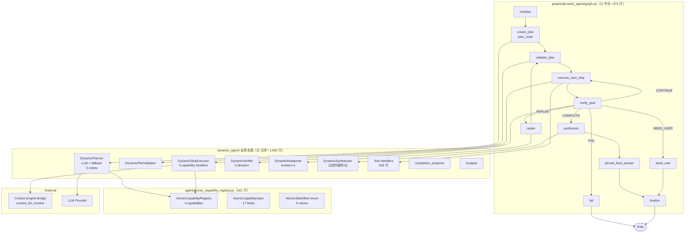
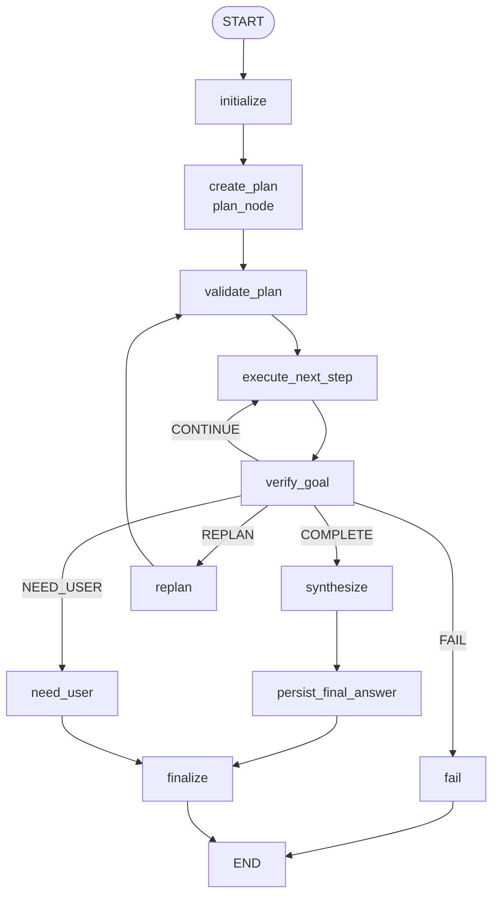

# TestAgent DynamicAgent 技术实现文档

> **配套文档**
> - 总体技术方案: [02_TestAgent_项目总体技术方案.md](../02_TestAgent_项目总体技术方案.md)
> - 源码导读: [03_TestAgent_项目实现原理与源码导读.md](../03_TestAgent_项目实现原理与源码导读.md)
> - 证据索引: [01_TestAgent_项目技术方案证据索引.md](../01_TestAgent_项目技术方案证据索引.md)
> - Context Engine 3.0: [10_TestAgent_ContextEngine3.0_技术实现文档.md](10_TestAgent_ContextEngine3.0_技术实现文档.md)
> - NarrativeComposer: [13_TestAgent_NarrativeComposer_技术实现文档.md](13_TestAgent_NarrativeComposer_技术实现文档.md)
> - 测试方案生成主图: [12_TestAgent_测试方案生成主图与三个动态子图_技术实现文档.md](12_TestAgent_测试方案生成主图与三个动态子图_技术实现文档.md)

**编制时间**: 2026-08-25
**对应分支**: `dev_3.0`
**最后对齐**: 与 Phase 2.8D 接 LLM Planner/Executor + 4 原子能力 同步

> 本文档面向**接手 DynamicAgent 子图模块**的开发者，覆盖 **11 节点 LangGraph + Planner/Executor/Verifier/Replanner/Synthesizer 5 角色 + 4 原子能力 Registry + 与 Context Engine Bridge 集成**。
> 行号以当前 `dev_3.0` HEAD 为准。

---

## 1. 文档说明

### 1.1 模块定位

DynamicAgent 是 TestAgent 第二阶段的**通用动态规划子图**（与 test_plan 业务解耦）：

- **职责 1**：基于用户目标和 attachment 自动生成 plan（LLM + 确定性 fallback）
- **职责 2**：动态执行 plan steps（4 个原子能力：word_document_parse / knowledge_search / evidence_analysis / image_understanding）
- **职责 3**：验证目标完成度（5 状态决策机：COMPLETE/CONTINUE/REPLAN/NEED_USER/FAIL）
- **职责 4**：失败时重规划（revision+1，标 SUPERSEDED + 加补充 step）
- **职责 5**：合成最终答案（过滤内部状态标记）

### 1.2 适用读者

| 角色 | 期望收获 |
|---|---|
| **DynamicAgent 维护者** | 11 节点拓扑 + 5 角色循环 + 4 原子能力 |
| **新接入原子能力** | AtomicCapabilityRegistry 注册新能力 |
| **Planner 调优** | LLM 优先 + 3 次重试 + 确定性 fallback 规则 |
| **Verifier 调优** | 5 状态决策机 + 失败转 REPLAN |
| **Synthesizer 调优** | _INTERNAL_STATUS_LEAK_MARKERS 过滤 |

### 1.3 当前状态

- **graph_name="dynamic_agent"**（与 test_plan 隔离）
- **2,763 行总代码**（业务 1,692 + 图装配 1,071）
- **4 原子能力**：word_document_parse / knowledge_search / evidence_analysis / image_understanding
- **5 角色循环**：Planner / Executor / Verifier / Replanner / Synthesizer
- **Planner LLM 接入完成**（Phase 2.8D）
- **evidence_analysis 走 Context Engine Bridge**（Phase 2.8D 后）

---

## 2. 总体架构



---

## 3. 文件结构（实际 `wc -l` 验证）

### 3.1 dynamic_agent/ 业务实现（11 文件 / 1,692 行）

| 文件 | 行数 | 职责 |
|---|---|---|
| `tool_handlers.py` | 526 | **4 个 Tool Handler**（WordDocumentParseHandler / KnowledgeSearchHandler / FileResolver / 通用 handler） |
| `executor.py` | 434 | **DynamicStepExecutor**（执行 step，调 capability handler；evidence_analysis 走 Context Engine） |
| `planner.py` | 312 | **DynamicPlanner**（LLM 优先 + 3 次重试 + 确定性 fallback） |
| `plan_validator.py` | 111 | **DynamicPlanValidator**（plan 合法性校验） |
| `verifier.py` | 71 | **DynamicVerifier**（5 状态决策：COMPLETE/CONTINUE/REPLAN/NEED_USER/FAIL） |
| `schemas.py` | 62 | **Pydantic 模型**（DynamicPlan / DynamicPlanStep / DynamicObservation / DynamicStepStatus） |
| `synthesizer.py` | 47 | **DynamicSynthesizer**（最终答案合成 + 内部标记过滤） |
| `replanner.py` | 40 | **DynamicReplanner**（revision+1 + SUPERSEDED） |
| `completion_projector.py` | 31 | 完成度投射 |
| `budgets.py` | 20 | 预算常量 |
| `__init__.py` | 38 | 模块导出 |

### 3.2 graphs/dynamic_agent/ 图装配（4 文件 / 1,071 行）

| 文件 | 行数 | 职责 |
|---|---|---|
| `graph.py` | 971 | **11 节点 LangGraph 装配** + state_ref 装饰器 + emit 适配 |
| `state.py` | 62 | **DynamicAgentState TypedDict**（total=False） |
| `constants.py` | 24 | GRAPH_NAME_DYNAMIC_AGENT + GRAPH_VERSION_DYNAMIC_AGENT_V1 |
| `__init__.py` | 14 | 模块导出 |

### 3.3 agent/atomic_capability_registry.py（161 行）

| 组件 | 行数 | 职责 |
|---|---|---|
| `AtomicSideEffect` StrEnum | – | 6 副作用分类（READ/EXTERNAL_READ/WRITE/EXPORT/DELETE/EXTERNAL_WRITE） |
| `AtomicCapabilitySpec` dataclass | – | 17 字段能力规格 |
| `AtomicCapabilityRegistry` class | – | 4 原子能力注册表 |
| `default()` 类方法 | – | 返回默认 4 capability |

---

## 4. 11 节点拓扑（`graphs/dynamic_agent/graph.py`）

### 4.1 节点常量

```python
NODE_INITIALIZE = "initialize"
NODE_CREATE_PLAN = "create_plan"
NODE_VALIDATE_PLAN = "validate_plan"
NODE_EXECUTE_NEXT_STEP = "execute_next_step"
NODE_VERIFY_GOAL = "verify_goal"
NODE_REPLAN = "replan"
NODE_SYNTHESIZE = "synthesize"
NODE_PERSIST_FINAL_ANSWER = "persist_final_answer"
NODE_NEED_USER = "need_user"
NODE_FINALIZE = "finalize"
NODE_FAIL = "fail"
```

### 4.2 图名称与版本

```python
GRAPH_NAME_DYNAMIC_AGENT = "dynamic_agent"
GRAPH_VERSION_DYNAMIC_AGENT_V1 = "v1"

# graph.name = f"{GRAPH_NAME_DYNAMIC_AGENT}_{GRAPH_VERSION_DYNAMIC_AGENT_V1}"
# = "dynamic_agent_v1"
```

### 4.3 拓扑（mermaid）



### 4.4 `initialize()`（节点 1）

```python
def initialize(state: DynamicAgentState) -> dict:
    """初始化状态：current_node / current_phase / task_status / completed_nodes 等。"""
    completed = list(state.get("completed_nodes") or [])
    if NODE_INITIALIZE not in completed:
        completed.append(NODE_INITIALIZE)
    return {
        "current_node": NODE_INITIALIZE,
        "current_phase": "initialized",
        "task_status": "running",
        "plan_revision": int(state.get("plan_revision") or 0),
        "replan_count": int(state.get("replan_count") or 0),
        "tool_call_count": int(state.get("tool_call_count") or 0),
        "completed_nodes": completed,
    }
```

### 4.5 `plan_node()`（节点 2）

```python
async def plan_node(state: DynamicAgentState, config: Any = None) -> dict:
    """创建 / 复用 plan。

    1) 若 state.plan 已存在 → 复用
    2) 若 _needs_attachment_clarification(state) → 注入 need_user 步骤（等用户确认）
    3) 否则调 DynamicPlanner.aplan(state, runtime_context) → 返回 plan
    """
    planner = DynamicPlanner(AtomicCapabilityRegistry.default())
    plan = await planner.aplan(dict(state), runtime_context=_runtime_context(config))
```

---

## 5. AtomicCapabilityRegistry（`agent/atomic_capability_registry.py` 161 行）

### 5.1 `AtomicSideEffect` 枚举（6 值）

```python
class AtomicSideEffect(StrEnum):
    READ = "READ"                    # 读用户/系统文件
    EXTERNAL_READ = "EXTERNAL_READ"   # 读外部系统（KB / API）
    WRITE = "WRITE"                   # 写内部
    EXPORT = "EXPORT"                 # 导出产物
    DELETE = "DELETE"                 # 删除
    EXTERNAL_WRITE = "EXTERNAL_WRITE" # 写外部系统
```

### 5.2 `AtomicCapabilitySpec` 数据类（17 字段）

```python
@dataclass(frozen=True, slots=True)
class AtomicCapabilitySpec:
    capability_key: str                  # 唯一键
    display_name: str                    # UI 显示名
    description_for_planner: str         # 供 LLM planner 看
    executor_kind: str                   # tool / bridge / direct
    backend_target: str                  # 实际 Tool 名 / Bridge 名
    input_schema: dict[str, Any]         # JSON Schema
    output_schema: dict[str, Any]
    preconditions: list[str]             # 前置条件
    postconditions: list[str]            # 后置条件
    supported_media_types: list[str]     # 支持的媒体类型
    side_effect: AtomicSideEffect
    risk_level: str                      # low / medium / high
    timeout_seconds: int
    retry_policy: dict[str, Any]
    planner_visible: bool                # 是否对 planner 可见
    requires_user_confirmation: bool = False
```

### 5.3 4 个默认能力（`AtomicCapabilityRegistry.default()`）

| capability_key | display_name | backend_target | side_effect | risk_level | timeout | retry |
|---|---|---|---|---|---|---|
| `word_document_parse` | 解析Word文档 | RequirementParserTool | READ | low | 120s | max_attempts=2 |
| `knowledge_search` | 检索知识库 | KnowledgeSearchTool | EXTERNAL_READ | medium | 60s | max_attempts=2 |
| `evidence_analysis` | 证据分析 | （context engine bridge） | – | – | – | – |
| `image_understanding` | 图像理解 | （image understanding） | – | – | – | – |

### 5.4 关键示例（word_document_parse 完整）

```python
AtomicCapabilitySpec(
    capability_key="word_document_parse",
    display_name="解析Word文档",
    description_for_planner="Parse an attached Word document into text, structure, tables, and image OCR facts.",
    executor_kind="tool",
    backend_target="RequirementParserTool",
    input_schema={"type": "object", "required": ["file_public_id"]},
    output_schema={"type": "object", "required": ["text_content", "document_structure"]},
    preconditions=[
        "file belongs to current user and conversation",
        "file extension is .docx",
    ],
    postconditions=["document text and structure are available as evidence"],
    supported_media_types=[".docx"],
    side_effect=AtomicSideEffect.READ,
    risk_level="low",
    timeout_seconds=120,
    retry_policy={"max_attempts": 2},
    planner_visible=True,
)
```

---

## 6. 数据模型（`schemas.py` 62 行）

### 6.1 `DynamicStepStatus` 枚举（7 值）

```python
class DynamicStepStatus(StrEnum):
    PENDING = "pending"
    RUNNING = "running"
    COMPLETED = "completed"
    FAILED = "failed"
    SKIPPED = "skipped"
    SUPERSEDED = "superseded"   # replanner 标记旧 step
    WAITING_USER = "waiting_user"
```

### 6.2 3 个 Pydantic 模型

```python
class DynamicPlanStep(BaseModel):
    model_config = ConfigDict(extra="forbid")

    step_id: str = Field(min_length=1)
    title: str = Field(min_length=1)
    action_type: str = Field(min_length=1)         # tool / analysis / need_user
    capability_key: str = Field(min_length=1)
    input_refs: list[str] = Field(default_factory=list)
    depends_on: list[str] = Field(default_factory=list)
    success_criteria: list[str] = Field(min_length=1)
    status: DynamicStepStatus = DynamicStepStatus.PENDING


class DynamicPlan(BaseModel):
    model_config = ConfigDict(extra="forbid")

    plan_id: str = Field(default_factory=lambda: generate_public_id("dyn_plan"))
    goal: str = Field(min_length=1)
    revision: int = Field(default=1, ge=1)
    status: str = "active"
    steps: list[DynamicPlanStep] = Field(min_length=1)


class DynamicObservation(BaseModel):
    model_config = ConfigDict(extra="forbid")

    observation_id: str = Field(min_length=1)
    step_id: str = Field(min_length=1)
    capability_key: str = Field(min_length=1)
    status: str = Field(min_length=1)
    summary: str = Field(min_length=1)
    result_ref: str = Field(min_length=1)
    facts: dict[str, Any] = Field(default_factory=dict)
    data: dict[str, Any] = Field(default_factory=dict)
    warnings: list[str] = Field(default_factory=list)
```

---

## 7. DynamicPlanner（`planner.py` 312 行）

### 7.1 `aplan()` 主入口（LLM 优先 + 3 次重试 + Fallback）

```python
class DynamicPlanner:
    def __init__(self, registry: AtomicCapabilityRegistry) -> None:
        self._registry = registry

    async def aplan(self, state: dict, *, runtime_context: Any = None) -> DynamicPlan:
        bridge = getattr(runtime_context, "context_llm_invoker", None)
        fallback_reason = "context_bridge_missing"
        if (bridge is not None
                and hasattr(bridge, "generate")
                and getattr(bridge, "available", True)):
            fallback_reason = "llm_planner_empty_response"
            last_exc: Exception | None = None
            for attempt in range(1, _PLANNER_LLM_MAX_ATTEMPTS + 1):  # 3 次
                try:
                    result = await bridge.generate(
                        user_id=getattr(runtime_context, "user_internal_id", 0),
                        call_site="dynamic_agent.planner",
                        llm_task_profile=DYNAMIC_AGENT_PLANNER_PROFILE,
                        current_node="create_plan",
                        ...
                    )
                    value = getattr(result, "value", None) if result is not None else None
                    if value is not None:
                        return DynamicPlan.model_validate(value)
                except Exception as exc:
                    last_exc = exc
                    if not _is_retryable_planner_contract_error(exc):
                        # 不可重试 → 立即 fallback
                        return self.plan(state)
                if attempt < _PLANNER_LLM_MAX_ATTEMPTS:
                    continue
            return self.plan(state)  # 3 次都失败 → fallback
        # bridge 缺失或不可用 → fallback
        return self.plan(state)
```

### 7.2 确定性 Fallback（`plan()`）

```python
def plan(self, state: dict) -> DynamicPlan:
    goal = str(state.get("goal") or state.get("dynamic_goal") or "完成当前任务")
    target = str(state.get("target_capability") or "")
    operation = str(state.get("operation") or "qa")
    attachments = list(state.get("attachment_refs") or [])
    docx_ref = self._first_docx_ref(attachments)

    # 路径 1: document_qa + summarize/analyze/extract/compare + 有 docx → 2 步
    if target == "document_qa" and operation in {"summarize", "analyze", "extract", "compare"} and docx_ref:
        if operation == "compare" and self._should_include_knowledge_search(state, goal):
            # 3 步：parse + knowledge_search + evidence_analysis
            ...
        else:
            # 2 步：parse + evidence_analysis
            ...

    # 默认路径：1 步 evidence_analysis
    return DynamicPlan(
        goal=goal,
        revision=int(state.get("plan_revision") or 1),
        steps=[DynamicPlanStep(
            step_id="step_1",
            title="分析已知证据",
            action_type="analysis",
            capability_key="evidence_analysis",
            ...
        )],
    )
```

### 7.3 `_should_include_knowledge_search()`

```python
@staticmethod
def _should_include_knowledge_search(state: dict, goal: str) -> bool:
    retrieval_plan = state.get("retrieval_plan_snapshot")
    retrieval_plan = retrieval_plan if isinstance(retrieval_plan, dict) else {}
    maas = str(retrieval_plan.get("maas") or "").lower()
    if maas == "off":
        return False
    if maas in {"required", "auto"}:
        return True

    knowledge_mode = str(state.get("knowledge_mode_snapshot") or "").upper()
    if knowledge_mode in {"MAAS_STRICT", "KNOWLEDGE_REQUIRED"}:
        return True

    keywords = (
        "standard", "standards", "policy", "policies",
        "spec", "specification", "company",
        "标准", "规范", "制度", "公司",
    )
    return any(keyword in goal for keyword in keywords)
```

### 7.4 `_planner_state_ref()` — 11 capability fields

```python
def _planner_state_ref(self, state: dict, *, attempt: int = 1) -> dict[str, Any]:
    return {
        "goal": state.get("goal") or state.get("dynamic_goal") or "",
        "target_capability": state.get("target_capability") or "",
        "operation": state.get("operation") or "",
        "planner_attempt": attempt,
        "planner_retry_instruction": (
            "Return only strict JSON matching the dynamic_plan_json contract."
            if attempt > 1 else ""
        ),
        "attachments": list(state.get("attachment_refs") or []),
        "request_understanding_snapshot": state.get("request_understanding_snapshot") or {},
        "retrieval_plan_snapshot": state.get("retrieval_plan_snapshot") or {},
        "knowledge_mode_snapshot": state.get("knowledge_mode_snapshot") or "",
        "runtime_budget": {
            "plan_revision": int(state.get("plan_revision") or 1),
            "replan_count": int(state.get("replan_count") or 0),
            "tool_call_count": int(state.get("tool_call_count") or 0),
        },
        "available_capabilities": [
            {
                "capability_key": spec.capability_key,
                "display_name": spec.display_name,
                "description_for_planner": spec.description_for_planner,
                "executor_kind": spec.executor_kind,
                "input_schema": spec.input_schema,
                "output_schema": spec.output_schema,
                "preconditions": list(spec.preconditions),
                "side_effect": spec.side_effect.value,
                "risk_level": spec.risk_level,
                "timeout_seconds": spec.timeout_seconds,
                "retry_policy": dict(spec.retry_policy),
                "supported_media_types": list(spec.supported_media_types),
            }
            for spec in self._registry.planner_visible()
        ],
    }
```

### 7.5 3 类规划路径汇总

| 路径 | 触发 | 步骤数 |
|---|---|---|
| **document_qa + 非 compare** | target=document_qa, op ∈ {summarize, analyze, extract} | 2 步：word_document_parse → evidence_analysis |
| **document_qa + compare + KB** | target=document_qa, op=compare, KB 命中 | 3 步：word_document_parse → knowledge_search → evidence_analysis |
| **默认** | 其他 | 1 步：evidence_analysis |

---

## 8. DynamicStepExecutor（`executor.py` 434 行）

### 8.1 主入口（4 capability 路由）

```python
class DynamicStepExecutor:
    async def execute(self, step: DynamicPlanStep, state: dict) -> DynamicObservation:
        spec = self._registry.require(step.capability_key)
        handler = self._handlers.get(step.capability_key)
        if handler is None and step.capability_key == "evidence_analysis":
            result = self._run_evidence_analysis(step, state)   # ← 走 Context Engine
        elif handler is None and step.capability_key == "word_document_parse":
            result = await self._run_word_document_parse(step, state)
        elif handler is None and step.capability_key == "knowledge_search":
            result = await self._run_knowledge_search(step, state)
        elif handler is None:
            result = _not_configured(step.capability_key)
        else:
            result = handler(step, state)

        success = bool(result.get("success"))
        return DynamicObservation(
            observation_id=generate_public_id("obs"),
            step_id=step.step_id,
            capability_key=step.capability_key,
            status="success" if success else "failed",
            summary=str(result.get("summary") or spec.display_name),
            result_ref=f"state:tool_results.{step.step_id}",
            facts=self._facts_for(step.capability_key, data, error=result.get("error")),
            data=data,
            warnings=list(result.get("warnings") or []),
        )
```

### 8.2 `_facts_for()` — 3 capability 摘要

```python
@staticmethod
def _facts_for(capability_key: str, data: dict, *, error=None) -> dict[str, Any]:
    if isinstance(error, dict) and error.get("code"):
        return {"error_code": str(error.get("code"))}
    if capability_key == "word_document_parse":
        text = str(data.get("text_content") or "")
        structure = data.get("document_structure")
        return {"text_length": len(text), "has_structure": bool(structure)}
    if capability_key == "evidence_analysis":
        return {"analysis_length": len(str(data.get("analysis") or ""))}
    if capability_key == "knowledge_search":
        return {"hit_count": int(data.get("hit_count") or 0)}
    return {}
```

### 8.3 `evidence_analysis` 走 Context Engine Bridge

```python
def _run_evidence_analysis(self, step, state):
    fallback_reason = "runtime_context_missing"
    if self._runtime_context is not None:
        invoker = getattr(self._runtime_context, "context_llm_invoker", None)
        if invoker is not None:
            if hasattr(invoker, "generate") and getattr(invoker, "available", True):
                return self._run_evidence_analysis_bridge(step, state, invoker)  # 优先
            if hasattr(invoker, "invoke"):
                return self._run_evidence_analysis_invoker(step, state, invoker)
            fallback_reason = "context_llm_invoker_unavailable"
        else:
            fallback_reason = "context_llm_invoker_missing"
    return self._deterministic_evidence_analysis(step, state, fallback_reason)
```

### 8.4 确定性 fallback（拼接 source observations）

```python
def _deterministic_evidence_analysis(self, step, state, reason, *, err=None):
    logger.warning(
        "FALLBACK_USED | component=dynamic_agent.executor | "
        "from=context_engine_analysis | to=deterministic_summary | "
        "reason=%s | task_id=%s | capability=%s | step_id=%s | err=%s",
        ...
    )
    observations = list(state.get("observations") or [])
    source = _evidence_source_text(state)
    if not source:
        source = "\n".join(
            str(item.get("summary") or "")
            for item in observations
            if isinstance(item, dict) and item.get("status") == "success"
        ).strip()
    analysis = source or str(state.get("goal") or "Evidence analysis completed.")
    return {
        "success": True,
        "summary": analysis,
        "data": {"analysis": analysis},
    }
```

### 8.5 Token 上限

```python
_MAX_EVIDENCE_TEXT_CHARS = 24000
_MAX_EVIDENCE_ITEM_CHARS = 6000
```

---

## 9. DynamicVerifier（`verifier.py` 71 行）

### 9.1 `VerificationDecision` 5 值

```python
class VerificationDecision(StrEnum):
    COMPLETE = "COMPLETE"    # 任务完成
    CONTINUE = "CONTINUE"    # 还有 pending step，继续 execute_next_step
    REPLAN = "REPLAN"        # 失败 → replan
    NEED_USER = "NEED_USER"   # 等用户输入
    FAIL = "FAIL"            # 终态失败
```

### 9.2 `DynamicVerifier.verify()` 决策树

```python
class DynamicVerifier:
    def verify(self, state: dict) -> VerificationResult:
        plan = state.get("plan") if isinstance(state.get("plan"), dict) else {}
        steps = list(plan.get("steps") or [])
        if not steps:
            return VerificationResult(VerificationDecision.FAIL, ["plan_missing"])

        # 1) 需要用户输入？
        clarification = state.get("clarification")
        if state.get("awaiting_user") or isinstance(clarification, dict):
            return VerificationResult(VerificationDecision.NEED_USER, ["user_input_required"], ...)

        # 2) 是否有 capability handler 未配置？
        observations = list(state.get("observations") or [])
        for observation in observations:
            if isinstance(observation, dict):
                facts = observation.get("facts")
                if isinstance(facts, dict) and facts.get("error_code") == "CAPABILITY_HANDLER_NOT_CONFIGURED":
                    return VerificationResult(VerificationDecision.FAIL, ["capability_handler_not_configured"])

        # 3) 有 failed step？
        failed = [step for step in steps if step.get("status") == "failed"]
        if failed:
            return VerificationResult(VerificationDecision.REPLAN, ["step_failed"])

        # 4) 还有 pending step？
        pending = [step for step in steps
                   if step.get("status") not in {"completed", "skipped", "superseded"}]
        if pending:
            return VerificationResult(VerificationDecision.CONTINUE, ["steps_pending"])

        # 5) 没有 observations？
        if not observations:
            return VerificationResult(VerificationDecision.REPLAN, ["observation_missing"])

        return VerificationResult(VerificationDecision.COMPLETE)
```

### 9.3 决策表

| 条件 | 决策 |
|---|---|
| plan.steps 空 | FAIL |
| awaiting_user 或 clarification 存在 | NEED_USER |
| 任一 observation 的 facts.error_code == "CAPABILITY_HANDLER_NOT_CONFIGURED" | FAIL |
| 任一 step.status == "failed" | REPLAN |
| 有 step.status ∉ {completed, skipped, superseded} | CONTINUE |
| observations 空 | REPLAN |
| 全部 step 完成 + 有 observations | COMPLETE |

---

## 10. DynamicReplanner（`replanner.py` 40 行）

### 10.1 简单实现

```python
class DynamicReplanner:
    def replan(self, plan: DynamicPlan, *, gaps: list[str]) -> DynamicPlan:
        steps: list[DynamicPlanStep] = []
        for step in plan.steps:
            if step.status == DynamicStepStatus.COMPLETED:
                steps.append(step)
            else:
                # 未完成的 → 标 SUPERSEDED
                steps.append(step.model_copy(update={"status": DynamicStepStatus.SUPERSEDED}))

        # 加 1 个补充分析 step
        next_idx = len(steps) + 1
        steps.append(
            DynamicPlanStep(
                step_id=f"step_{next_idx}",
                title="补充分析缺口",
                action_type="analysis",
                capability_key="evidence_analysis",
                input_refs=["state:observations"],
                depends_on=[step.step_id for step in steps if step.status == DynamicStepStatus.COMPLETED],
                success_criteria=gaps or ["analysis_addresses_user_goal"],
            )
        )
        return DynamicPlan(
            plan_id=plan.plan_id,
            goal=plan.goal,
            revision=plan.revision + 1,  # revision 自增
            status="active",
            steps=steps,
        )
```

**关键**：保留已完成 step + 标 SUPERSEDED 未完成的 + 加 1 个 evidence_analysis 步骤。

---

## 11. DynamicSynthesizer（`synthesizer.py` 47 行）

### 11.1 内部状态过滤

```python
_INTERNAL_STATUS_LEAK_MARKERS = (
    "当前任务状态",
    "若需自动流转",
    "自动流转至下一节点",
    "task_status",
    "current_node",
    "节点 `unknown`",
    "node `unknown`",
)


def _sanitize_user_visible_answer(text: str) -> str:
    lines = text.splitlines()
    filtered = [
        line for line in lines
        if not any(marker in line for marker in _INTERNAL_STATUS_LEAK_MARKERS)
    ]
    sanitized = "\n".join(filtered).strip()
    return sanitized or text.strip()
```

### 11.2 `synthesize()`

```python
class DynamicSynthesizer:
    def synthesize(self, state: dict) -> str:
        # 优先用 analysis_results
        analysis = state.get("analysis_results")
        if isinstance(analysis, dict):
            for value in analysis.values():
                text = str(value or "").strip()
                if text:
                    return _sanitize_user_visible_answer(text)

        # 降级用 observations 的 summary
        observations = [
            str(item.get("summary") or "").strip()
            for item in list(state.get("observations") or [])
            if isinstance(item, dict) and item.get("summary")
        ]
        if observations:
            return _sanitize_user_visible_answer("\n".join(observations))

        # 最终兜底
        return "已完成当前动态任务，但没有形成可展示的分析结果。"
```

---

## 12. DynamicState（`graphs/dynamic_agent/state.py` 62 行）

### 12.1 `DynamicAgentState` TypedDict

```python
class DynamicAgentState(TypedDict, total=False):
    # 输入
    goal: str
    dynamic_goal: str
    target_capability: str
    operation: str
    attachment_refs: list[Any]
    request_understanding_snapshot: dict[str, Any]
    retrieval_plan_snapshot: dict[str, Any]
    knowledge_mode_snapshot: str

    # 运行时
    plan: dict[str, Any]                   # DynamicPlan.model_dump()
    plan_revision: int
    observations: list[dict[str, Any]]      # DynamicObservation.model_dump()
    tool_results: dict[str, dict[str, Any]]
    analysis_results: dict[str, Any]
    clarification: dict[str, Any] | None
    awaiting_user: bool
    replan_count: int
    tool_call_count: int
    runtime_budget: dict[str, Any]

    # 控制
    current_node: str
    current_phase: str
    task_status: str                       # running / completed / failed
    task_id: str
    completed_nodes: list[str]
```

---

## 13. 测试与验证

### 13.1 测试目录

```
backend/tests/agent_runtime/
├── test_dynamic_agent/
│   ├── test_dynamic_planner.py
│   ├── test_dynamic_executor.py
│   ├── test_dynamic_verifier.py
│   ├── test_dynamic_replanner.py
│   ├── test_dynamic_synthesizer.py
│   ├── test_atomic_capability_registry.py
│   └── test_dynamic_graph.py
├── test_dynamic_agent_*.py                # 集成测试
└── ...
```

### 13.2 关键验证命令

```bash
# Dynamic Agent 完整测试
cd backend && python -m pytest tests/agent_runtime/test_dynamic_agent/ -x -q

# Atomic Capability Registry
cd backend && python -m pytest tests/agent_runtime/test_dynamic_agent/test_atomic_capability_registry.py -x -q

# 图装配
cd backend && python -m pytest tests/agent_runtime/test_dynamic_agent/test_dynamic_graph.py -x -q
```

### 13.3 端到端验证

```bash
# 启动后端 + 启用 DynamicAgent
export AGENT_RUNTIME_DYNAMIC_AGENT_ENABLED=1
python -m uvicorn app.main:app --reload

# 触发动态规划任务（上传 docx + 请求）
curl -X POST http://localhost:8000/api/v1/messages/send \
  -H "Content-Type: application/json" \
  -d '{"content":"总结这个 Word 文档","attachment_public_ids":["file_1"]}'

# 观察 DynamicAgent State：
# - plan.revision 应自增（每次 replan）
# - plan.steps 应包含 word_document_parse → evidence_analysis
# - observations 应包含 DynamicObservation 列表
```

---

## 14. 关键架构不变量

> 改动前必须确认的不变量。

| # | 规则 | 证据 | 验证 |
|---|---|---|---|
| 1 | graph_name = `f"{GRAPH_NAME_DYNAMIC_AGENT}_{GRAPH_VERSION_DYNAMIC_AGENT_V1}"` = `"dynamic_agent_v1"` | `graphs/dynamic_agent/constants.py` | `grep "dynamic_agent_v1"` |
| 2 | DynamicAgent **独立 graph name**（与 test_plan 隔离，老任务不会被误识别）| `constants.py` L24 | – |
| 3 | AtomicCapabilityRegistry **in-memory singleton**，无持久化 | `atomic_capability_registry.py` 模块注释 | `grep "in-memory"` |
| 4 | 4 个 capability 都是 `planner_visible=True`（除非新注册显式 False）| `atomic_capability_registry.py` L62/79 | `grep "planner_visible"` |
| 5 | **Planner LLM 优先 + 3 次重试 + fallback** | `planner.py` `_PLANNER_LLM_MAX_ATTEMPTS = 3` | `grep "PLANNER_LLM_MAX_ATTEMPTS"` |
| 6 | 不可重试错误（`!_is_retryable_planner_contract_error`）→ 立即 fallback | `planner.py` L58-70 | – |
| 7 | bridge 缺失 / 不可用 / 不可重试 → `self.plan(state)` 确定性 fallback | `planner.py` L107 | – |
| 8 | evidence_analysis **优先走 Context Engine bridge**（`context_llm_invoker`）| `executor.py` L150-161 | `grep "context_llm_invoker"` |
| 9 | bridge 优先 `.generate()`（新 API），否则 `.invoke()`（旧 API）| `executor.py` L155-160 | – |
| 10 | evidence_analysis 失败 → `_deterministic_evidence_analysis`（拼接 observations）| `executor.py` L262-297 | – |
| 11 | Verifier **不可 silent skip**：FAIL/REPLAN 必须显式 | `verifier.py` 模块注释 | – |
| 12 | Verifier decision **不返回 None**：5 值穷尽 | `verifier.py` L29-66 | – |
| 13 | CAPABILITY_HANDLER_NOT_CONFIGURED → FAIL（不 REPLAN）| `verifier.py` L47-51 | `grep "CAPABILITY_HANDLER_NOT_CONFIGURED"` |
| 14 | Replanner 保留已完成 step + 标 SUPERSEDED 未完成的 + 加 1 个 analysis step | `replanner.py` L10-35 | – |
| 15 | Replanner `revision += 1`（不自减）| `replanner.py` L33 | `grep "revision + 1"` |
| 16 | Synthesizer 过滤 7 类 `_INTERNAL_STATUS_LEAK_MARKERS`（防泄漏）| `synthesizer.py` L5-13 | – |
| 17 | Synthesizer 优先 `analysis_results` → observations → 兜底文案 | `synthesizer.py` L28-42 | – |
| 18 | 7 个 step status：`pending/running/completed/failed/skipped/superseded/waiting_user` | `schemas.py` L13-20 | – |
| 19 | AtomicSideEffect 6 值：`READ/EXTERNAL_READ/WRITE/EXPORT/DELETE/EXTERNAL_WRITE` | `atomic_capability_registry.py` L10-16 | – |
| 20 | `_MAX_EVIDENCE_TEXT_CHARS=24000` / `_MAX_EVIDENCE_ITEM_CHARS=6000` 防止 context 过长 | `executor.py` L39-40 | – |
| 21 | FALLBACK_USED 日志格式：`FALLBACK_USED \| component=... \| from=... \| to=... \| reason=... \| task_id=... \| capability=... \| step_id=...` | `executor.py` L70-77 | `grep "FALLBACK_USED"` |

---

## 15. 当前限制

### 15.1 真实限制（dev_3.0）

1. **graph 与 test_plan 解耦但不联动**：dynamic_agent_v1 独立 graph，不会被 test_plan 主图自动调用
2. **4 个 capability 有限**：新增能力需要修改 `AtomicCapabilityRegistry.default()`
3. **Planner LLM 优先 + fallback**：但 LLM 失败时 fallback 是简单模板（可能不够智能）
4. **Verifier decision 单一**：无法表达"部分完成 + 部分失败需要部分 replan"
5. **Replanner 仅加 1 个 evidence_analysis step**：不支持深度 replan
6. **evidence_analysis 走 Context Engine bridge**：依赖 CE 完整接入（MIG flags + ContextInvokerBridge）
7. **Synthesizer 7 个过滤标记**：可能漏掉新增的内部状态字段
8. **Budgets 未完全硬约束**：仅有 `budgets.py`（20 行），缺少运行时强制

### 15.2 后续规划

- **新 capability 注册**：image_understanding / custom_evidence_extraction
- **Replanner 深度化**：基于 gap 类型生成不同的补充 step
- **跨 graph 联动**：test_plan 主图触发 dynamic_agent 作为子图
- **Synthesizer 增强**：基于 observation types 智能聚合（不只是 summary 拼接）

---

## 16. 与其他文档的关系

| 文档 | 关系 |
|---|---|
| [docs_x/02 §1.5](../02_TestAgent_项目总体技术方案.md) | Dynamic Agent 子图 + 4 原子能力 |
| [docs_x/10 Context Engine 3.0](10_TestAgent_ContextEngine3.0_技术实现文档.md) | evidence_analysis 通过 ContextInvokerBridge 接入 |
| [docs_x/12 测试方案生成主图](12_TestAgent_测试方案生成主图与三个动态子图_技术实现文档.md) | test_plan 主图与 dynamic_agent 是两个独立 LangGraph |
| `docs/context-engine/TestAgent_Hybrid_Agent_Orchestration_详细技术实现方案.md` | Hybrid Agent 编排方案（已迁移到 docs_x/）|

---

## 17. 索引自检（dev_3.0）

- [x] dynamic_agent 业务 11 文件 / 1,692 行（`wc -l` 验证）
- [x] graphs/dynamic_agent 图装配 4 文件 / 1,071 行
- [x] atomic_capability_registry 161 行（4 capability + 17 字段 spec）
- [x] 11 节点拓扑（initialize / create_plan / validate_plan / execute_next_step / verify_goal / replan / synthesize / persist_final_answer / need_user / finalize / fail）
- [x] 5 角色（Planner / Executor / Verifier / Replanner / Synthesizer）
- [x] Planner LLM 优先 + 3 次重试 + 确定性 fallback 3 路径
- [x] Executor 4 capability handler + evidence_analysis 走 Context Engine Bridge
- [x] Verifier 5 decision 决策树
- [x] Replanner revision+1 + SUPERSEDED 旧 step + 新 analysis step
- [x] Synthesizer 7 类内部标记过滤
- [x] 7 个 step status + 5 个 verification decision + 6 个 AtomicSideEffect
- [x] 21 条架构不变量
- [x] 当前限制 + 后续规划
- [x] 与 docs_x/02/10/12 文档关系清晰
- [x] 文档中**不包含** codex / claude code / 指导 AI 开发的人员 等描述

**文档完成。配套阅读：[docs_x/02 §1.5](../02_TestAgent_项目总体技术方案.md) + [docs_x/10 Context Engine 3.0](10_TestAgent_ContextEngine3.0_技术实现文档.md)。**