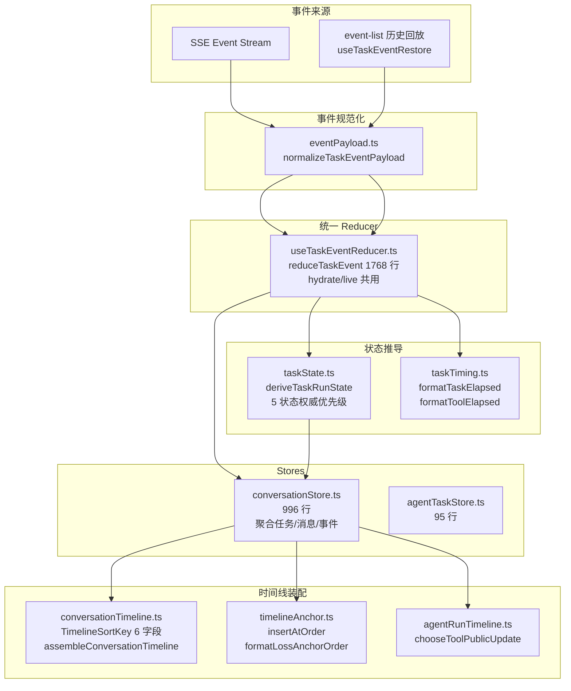

# TestAgent ConversationTimeline与TaskHydration 技术实现文档

> **配套文档**
> - 总体技术方案: [02_TestAgent_项目总体技术方案.md](../02_TestAgent_项目总体技术方案.md)
> - 源码导读: [03_TestAgent_项目实现原理与源码导读.md](../03_TestAgent_项目实现原理与源码导读.md)
> - 证据索引: [01_TestAgent_项目技术方案证据索引.md](../01_TestAgent_项目技术方案证据索引.md)
> - Context Engine 3.0: [10_TestAgent_ContextEngine3.0_技术实现文档.md](10_TestAgent_ContextEngine3.0_技术实现文档.md)
> - NarrativeComposer: [13_TestAgent_NarrativeComposer_技术实现文档.md](13_TestAgent_NarrativeComposer_技术实现文档.md)
> - 测试方案生成主图: [12_TestAgent_测试方案生成主图与三个动态子图_技术实现文档.md](12_TestAgent_测试方案生成主图与三个动态子图_技术实现文档.md)

**编制时间**: 2026-08-25
**对应分支**: `dev_3.0`
**最后对齐**: 与 Phase 2.9A.27-30（Task Hydration 根治）+ Phase 2.9A.35（clientOrder/timelineRank）+ 2026-08-19 Bug Fix（format-loss banner 锚定）同步

> 本文档面向**接手前端 Timeline 与 Hydration 模块**的开发者，覆盖 **TimelineSortKey 结构化排序、TaskRunBlock 统一 reducer、TaskRunState 5 状态权威推导、Tool Narrative 流式 reducer、Format-Loss Banner 锚定**。
> 行号以当前 `dev_3.0` HEAD 为准。

---

## 1. 文档说明

### 1.1 模块定位

ConversationTimeline + TaskHydration 是 TestAgent 前端的**会话时间线与任务回放核心**（Phase 2.9A.27-30）：

- **职责 1**：结构化排序会话消息与任务块（TimelineSortKey 6 字段）
- **职责 2**：统一 TaskRunReducer（hydrate/live 共用，避免双 reducer 不一致）
- **职责 3**：权威推导 TaskRunState（5 状态：completed/failed/cancelled/waiting/running）
- **职责 4**：Tool Narrative 流式归约（5 事件类型 → ToolNarrativeState）
- **职责 5**：Task Summary Narrative 唯一权威槽位（Phase 2.9B.6）
- **职责 6**：Format-Loss Banner 锚定到 DocxFormatCheckTool 之后

### 1.2 适用读者

| 角色 | 期望收获 |
|---|---|
| **Timeline 维护者** | TimelineSortKey 6 字段 + Assembler |
| **Hydration 维护者** | 单一 TaskRunReducer（reduceTaskEvent）|
| **Narrative UI 开发者** | ToolNarrativeState 流式归约 + 来源选择器（chooseToolPublicUpdate） |
| **Bug 修复者** | Phase 2.9A.35 + 2026-08-19 Bug Fix 记录 |
| **状态机调优** | deriveTaskRunState 5 状态权威优先级 |

### 1.3 当前状态

- **2 文件夹 / 5 文件 / 5,485 行**（utils 1,311 + composables 3,048 + stores 1,091 + 部分 4,239）
- **Phase 2.9A.27-30 Task Hydration 根治**（统一 reducer）
- **Phase 2.9A.35**（clientOrder / timelineRank / effective reduction order）
- **Phase 2.9B.4 Tool Narrative**（流式 5 事件）
- **Phase 2.9B.6 Task Summary Narrative**（唯一权威槽位）

---

## 2. 总体架构



---

## 3. 文件结构（实际 `wc -l` 验证）

### 3.1 utils/（8 文件 / 1,311 行核心 + 工具）

| 文件 | 行数 | 职责 |
|---|---|---|
| `taskTiming.ts` | 180 | **任务/工具耗时格式化**（formatTaskElapsed / formatToolElapsed / resolveTaskElapsedMs）|
| `conversationTimeline.ts` | 149 | **TimelineSortKey 6 字段** + ConversationItem 类型 + Assembler |
| `taskState.ts` | 140 | **TaskRunState 5 状态权威推导** + 任务忙/输入阻塞判断 |
| `toolCallPresentation.ts` | 123 | Tool 卡片展示字段抽取 |
| `agentRunTimeline.ts` | 105 | **chooseToolPublicUpdate**（LLM 叙事 vs 确定性回退选择）|
| `timelineAnchor.ts` | 83 | **insertAtOrder** + formatLossAnchorOrder |
| `toolStatus.ts` | 27 | Tool 状态枚举与展示名 |
| `eventPayload.ts` | 274 | **normalizeTaskEventPayload / extractPublicExecutionUpdate / mergePublicExecutionUpdate** |

### 3.2 composables/（3 文件 / 3,048 行）

| 文件 | 行数 | 职责 |
|---|---|---|
| `useTaskEventReducer.ts` | **1,768** | **统一 TaskRunReducer**（hydrate/live 共用，唯一 reducer）|
| `useTaskEvents.ts` | 760 | 事件映射器（SSE/event-list → ChatMessage）|
| `useTaskEventRestore.ts` | 520 | 历史回放（hydrate 模式批量处理）|

### 3.3 stores/（2 文件 / 1,091 行）

| 文件 | 行数 | 职责 |
|---|---|---|
| `conversationStore.ts` | 996 | **主 store**（任务/消息/事件聚合，hydrate + live 统一）|
| `agentTaskStore.ts` | 95 | 任务列表 store |

---

## 4. TimelineSortKey（`conversationTimeline.ts` 149 行）

### 4.1 6 字段结构（Phase 2.9A.30 / 2.9A.35）

```typescript
export interface TimelineSortKey {
  /** 主排序：conversation_sequence（消息）或 trigger sequence（Task）*/
  sequence: number
  /**
   * Phase 2.9A.35: 客户端顺序 — 乐观消息用它锚定位置。
   * 同一个发送动作产生的 User + Thinking 共享同一 clientOrder。
   */
  clientOrder?: number
  /**
   * Phase 2.9A.35: 同一 clientOrder 内 user=0, agent thinking=1。
   * 保证 User 永远排在 Thinking 之前(不再退化为 stableId 字母序)。
   */
  timelineRank?: number
  /** 同 sequence：regular messages (rank=0) 在 Task (rank=1) 之前 */
  rank: number
  /** 同 sequence+rank：按 creation time */
  createdAt: number
  /** 终局 tiebreaker：stable string comparison */
  stableId: string
}
```

### 4.2 比较函数（无浮点）

```typescript
export function compareTimelineKeys(a: TimelineSortKey, b: TimelineSortKey): number {
  if (a.sequence !== b.sequence) return a.sequence - b.sequence
  if (a.clientOrder !== undefined || b.clientOrder !== undefined) {
    const ao = a.clientOrder ?? Number.MAX_SAFE_INTEGER
    const bo = b.clientOrder ?? Number.MAX_SAFE_INTEGER
    if (ao !== bo) return ao - bo
  }
  if (a.timelineRank !== undefined || b.timelineRank !== undefined) {
    const ar = a.timelineRank ?? 0
    const br = b.timelineRank ?? 0
    if (ar !== br) return ar - br
  }
  if (a.rank !== b.rank) return a.rank - b.rank
  if (a.createdAt !== b.createdAt) return a.createdAt - b.createdAt
  return a.stableId.localeCompare(b.stableId)
}
```

**关键设计**：完全用整数比较，无浮点——避免 IEEE 754 浮点漂移导致顺序错位。

### 4.3 ConversationItem 类型

```typescript
export type PlainMessageItem = { 
  id: string
  kind: 'user' | 'agent'
  message: ChatMessage 
}

export type AgentRunItem = {
  id: string
  kind: 'agent-run'
  runKey: string
  taskId?: string
  messages: ChatMessage[]
  block: TaskRunBlock
}

export type ConversationItem = PlainMessageItem | AgentRunItem
```

### 4.4 `conversationMessageKind()` — role vs type 双源

```typescript
const USER_MESSAGE_TYPES = new Set<ChatMessage['type']>(['user_text', 'user_file'])

/**
 * Message role is the normal source of truth, but the message type is a
 * stronger UI boundary for stream races: assistant-shaped messages must not
 * become right-aligned just because a stale payload carried role=user.
 */
export function conversationMessageKind(message: ChatMessage): 'user' | 'agent' {
  return message.role === 'user' && USER_MESSAGE_TYPES.has(message.type) ? 'user' : 'agent'
}
```

### 4.5 `assembleConversationTimeline()`

```typescript
export function assembleConversationTimeline(
  messages: ChatMessage[],
  taskRunBlocks: TaskRunBlock[],
  tasks: AgentTask[]
): ConversationItem[] {
  // 1. Build triggerMessageSequenceMap
  const triggerMap = new Map<string, number | undefined>()
  for (const block of taskRunBlocks) {
    const task = tasks.find(t => t.task_id === block.taskId)
    const triggerMessageId = block.triggerMessageId ?? task?.triggerMessageId ?? null
    if (triggerMessageId) {
      const triggerMsg = messages.find(m => m.id === triggerMessageId)
      triggerMap.set(block.taskId, triggerMsg?.conversationSequence)
    }
  }

  // 2. Build sort keys for regular messages
  const messageItems = messages.map(m => ({
    item: { id: m.id, kind: conversationMessageKind(m), message: m },
    key: {
      sequence: m.conversationSequence ?? Number.MAX_SAFE_INTEGER,
      clientOrder: m.clientOrder,
      timelineRank: m.timelineRank,
      rank: 0,
      createdAt: safeParseTime(m.createdAt),
      stableId: m.id
    }
  }))

  // 3. Build sort keys for task run blocks
  const taskItems = taskRunBlocks.map(block => {
    const triggerSeq = triggerMap.get(block.taskId)
    return {
      item: { ... kind: 'agent-run' ... },
      key: {
        sequence: triggerSeq ?? Number.MAX_SAFE_INTEGER,
        rank: 1,  // 任务块在消息之后
        createdAt: safeParseTime(block.startedAt),
        stableId: `task:${block.taskId}`
      }
    }
  })

  // 4. Merge and sort
  const all = [...messageItems, ...taskItems]
  all.sort((a, b) => compareTimelineKeys(a.key, b.key))

  return all.map(entry => entry.item)
}
```

---

## 5. TaskRunBlock 统一 Reducer（`useTaskEventReducer.ts` 1,768 行）

### 5.1 核心不变量

```typescript
/**
 * Contracts:
 * - normalizeTaskEvent() is a pure function (no side effects)
 * - reduceTaskEvent() is the ONLY function that mutates TaskRunBlock state
 * - Both modes produce identical TaskRunBlock structures
 */
```

**单一 reducer 原则**：hydrate 和 live 模式共用 `reduceTaskEvent()`，保证最终结构完全一致。

### 5.2 TaskRunBlock 字段（29+ 字段）

```typescript
interface TaskRunBlock {
  // 标识
  taskId: string
  triggerMessageId: string | null
  
  // 状态
  status: TaskStatus                    // waiting_user_confirm / running / completed / failed / cancelled
  currentPhase: string                  // execution / review / section_confirmation / completed / failed / cancelled
  collapsed: boolean                    // 默认折叠
  userCollapseOverride: boolean | null
  
  // 事件
  events: NormalizedTaskEvent[]
  seenEventIds: Record<string, true>   // 幂去重
  
  // 3 个 cursor 拆分
  lastAppliedCanonicalOrder: number | null  // 用于分页
  lastSseSequence: number | null             // SSE 增量
  // eventListPageCursor 由 fetchAllTaskEvents 分页时写入(不属于 reducer)
  
  // 内容
  messages: ChatMessage[]                  // ChatMessage 列表（含 tool_call / agent_plan / section_confirm 等）
  toolExecutions: ToolExecutionViewModel[]  // Tool 执行卡片（按 logicalKey 去重）
  dynamicNarratives: DynamicNarrative[]    // Phase 2.9B.2 动态叙事
  toolNarratives: ToolNarrativeState[]      // Phase 2.9B.4 Tool 叙事
  taskSummaryNarrative: TaskSummaryNarrativeState | null  // Phase 2.9B.6 唯一权威槽位
  
  // 业务事实
  summaryFacts: SummaryFacts
  artifacts: Artifact[]
  reviewResult: Record<string, unknown> | undefined
  formatCheckResult: Record<string, unknown> | undefined
  
  // 时间
  startedAt: string | undefined
  completedAt: string | undefined
  durationMs: number | null | undefined
  lastUpdateMode: 'hydrate' | 'live'
}
```

### 5.3 `normalizeTaskEvent()` — 纯函数幂去重

```typescript
export function normalizeTaskEvent(
  block: TaskRunBlock,
  raw: RawEventInput
): NormalizedTaskEvent | null {
  const eventId = raw.event_id ?? ''
  if (!eventId) return null
  // Event-level dedup
  if (block.seenEventIds[eventId]) return null

  return {
    event_id: eventId,
    event_type: raw.event_type ?? '',
    task_id: raw.task_id ?? block.taskId,
    canonical_order: raw.canonical_order,
    sequence_no: raw.sequence_no,
    content: raw.content,
    payload: normalizeTaskEventPayload(raw.payload),  // Phase 2.9A.35: 恒为 object
    created_at: raw.created_at,
    title: raw.title,
    status: raw.status,
    graph_run_id: raw.graph_run_id,
    graph_version: raw.graph_version,
    node_name: raw.node_name,
    event_schema_version: raw.event_schema_version,
    reductionOrder: raw.reductionOrder ?? buildEffectiveReductionOrder(...)
  }
}
```

### 5.4 `buildEffectiveReductionOrder()`（Phase 2.9A.35）

```typescript
export function buildEffectiveReductionOrder(
  eventType: string,
  sequenceNo: number | null | undefined,
  canonicalOrder: number | undefined
): number {
  // 1. task_created → 0（必须先于所有 Graph 事件处理）
  if (eventType === 'task_created') return 0
  // 2. sequence_no 非空 → 按 sequence_no
  if (typeof sequenceNo === 'number' && Number.isFinite(sequenceNo)) return sequenceNo
  // 3. 其它 Legacy 事件 → canonical_order（或安全 fallback）
  if (typeof canonicalOrder === 'number' && Number.isFinite(canonicalOrder)) return canonicalOrder
  return Number.MAX_SAFE_INTEGER
}
```

### 5.5 `reduceTaskEvent()` 6 大事件类（switch case）

| 事件类型 | 处理 |
|---|---|
| **Tool lifecycle** | `tool_started` / `tool_progress` / `tool_finished` / `tool_failed` |
| **Task status transitions** | `task_created` / `task_resumed` / `task_waiting` / `task_completed` / `task_failed` / `task_cancelled` |
| **Plan** | `plan_created` / `plan_updated` |
| **Summaries** | `requirement_summary` / `template_summary` / `knowledge_summary` |
| **Section confirm** | `need_user_confirm`（直接生成确认卡片）|
| **Generating status** | `generating_started` / `generating_progress` |
| **Review** | `review_started` / `review_completed` |
| **Artifact** | `artifact_created` |
| **Dynamic narrative** | `agent_decision_update` / `agent_observation_update` |
| **Tool narrative** | `tool_narrative_started/delta/update/failed/fallback` |
| **Task summary narrative** | `task_summary_narrative_started/delta/update/failed/fallback` |
| **Plan steps** | `plan_step_started/completed/failed` |
| **Format loss** | `format_loss_confirm_requested` / `format_loss_decision_recorded` / `format_loss_resuming` |
| **Retry** | `retrying` / `stream_phase_done` |

### 5.6 状态单调性（关键不变量）

```typescript
// ── 状态单调性: task_created 不得覆盖等待/终态 ──────────────
const isTaskCreated = event.event_type === 'task_created'
const nonOverrideableStatuses: TaskStatus[] = ['waiting_user_confirm', 'completed', 'failed', 'cancelled']
const statusProtected = isTaskCreated && nonOverrideableStatuses.includes(newStatus)

// ── need_user_confirm 状态机: 立即进入 section_confirmation ───
const isNeedUserConfirm = event.event_type === 'need_user_confirm'
if (isNeedUserConfirm) {
  const terminal = newStatus === 'completed' || newStatus === 'failed' || newStatus === 'cancelled'
  if (!terminal) {
    newStatus = 'waiting_user_confirm'
    newCurrentPhase = 'section_confirmation'
  }
}
```

**关键原则**：
- **task_created 不得覆盖终态**——已完成的 task 不能再被新的 task_created 推回 running
- **need_user_confirm 是立即触发器**——只要没终态，强制进入 `waiting_user_confirm` + `section_confirmation`
- **task_completed 不得清空 taskSummaryNarrative**——Final 叙事与终态解耦

### 5.7 `reduceToolStarted()` / `reduceToolFinished()` / `reduceToolProgress()`

3 个 tool lifecycle 函数（核心：按 `logicalKey = "${toolCallId}:${attempt}"` 去重）。

```typescript
function reduceToolStarted(block, event, payload, now) {
  const toolCallId = getFirstString(payload, ['tool_call_id', 'toolCallId'], event.event_id)
  const attempt = Number(payload.attempt ?? 1)
  const logicalKey = `${toolCallId}:${attempt}`
  const toolName = inferToolName(payload, event)
  const chunkIndex = explicitChunkIndex(payload)  // Phase 2.9A.35: null vs 0 区分
  
  const existing = block.toolExecutions.find(t => t.logicalKey === logicalKey)
  if (existing) {
    // Don't restart a terminal tool
    if (existing.terminal) return { toolExecutions: block.toolExecutions, messages: block.messages }
    // Chunk dedup — 仅当 payload 显式携带 chunk_index 时才按 chunk 去重
    if (chunkIndex !== null && existing.receivedChunkIndexes[chunkIndex]) {
      return { toolExecutions: block.toolExecutions, messages: block.messages }
    }
    // Update existing
    ...
  }
  
  // Create new tool execution
  const toolExec: ToolExecutionViewModel = {
    logicalKey, toolCallId, toolName, attempt,
    status: 'running', terminal: false,
    seenEventIds: { [event.event_id]: true },
    receivedChunkIndexes: chunkIndex !== null ? { [chunkIndex]: true } : {},
    startedAt: now, startedAtMs: parseApiDateTime(now),
    input: formatToolInput(payload),
    ...presentation,
    publicUpdate: extractPublicExecutionUpdate(payload)
  }
  ...
}
```

**关键不变量**：
- **Chunk dedup 只在 payload 显式携带 chunk_index 时生效**（tool_started 通常没有 chunk_index，不能默认 0）
- **terminal tool 不得重启**
- **status 单调性**：running → success / failed，不回头

### 5.8 `reduceToolNarrative()`（Phase 2.9B.4 流式）

```typescript
function reduceToolNarrative(
  existing: ToolNarrativeState[],
  event: NormalizedTaskEvent,
  payload: Record<string, unknown>
): ToolNarrativeState[] {
  const narrativeId = String(payload.narrative_id ?? '')
  if (!narrativeId) return existing
  const eventType = event.event_type as string

  const findIdx = existing.findIndex((n) => n.narrativeId === narrativeId)
  const base = findIdx >= 0 ? existing[findIdx] : null

  // started: 创建新 partial（或 reset 新 generation）
  if (eventType === 'tool_narrative_started') {
    const generationId = String(payload.generation_id ?? '')
    const generationNo = Number(payload.generation_no ?? 1)
    const sourceToolCallId = String(payload.source_tool_call_id ?? '')
    const toolName = String(payload.tool_name ?? '')
    const state: ToolNarrativeState = {
      narrativeId, generationId, generationNo, sourceToolCallId, toolName,
      attempt: Number(payload.attempt ?? 1),
      status: 'streaming', source: 'llm',
      publicUpdate: emptyPublicExecutionUpdate(),
      lastChunkIndex: -1,
      canonicalOrder: ...,
      createdAt: event.created_at
    }
    const rest = findIdx >= 0 ? existing.filter((n) => n.narrativeId !== narrativeId) : existing
    return [...rest, state]
  }

  // delta: 按 field 追加 + chunk 单调去重
  if (eventType === 'tool_narrative_delta') {
    const chunkIndex = Number(payload.chunk_index ?? 0)
    if (chunkIndex <= base.lastChunkIndex) return existing
    const field = String(payload.field ?? '')
    const delta = String(payload.delta ?? '')
    const next: ToolNarrativeState = { ...base, lastChunkIndex: chunkIndex }
    if (field === 'headline') next.publicUpdate = { ...base.publicUpdate, headline: delta }
    else if (field === 'summary') next.publicUpdate = { ...base.publicUpdate, summary: (base.publicUpdate.summary ?? '') + delta }
    // ... narrative_text / next_action / details ...
    return existing.map((n, i) => (i === findIdx ? next : n))
  }

  // update / fallback: 用完整已校验 public_update 覆盖 partial
  if (eventType === 'tool_narrative_update' || eventType === 'tool_narrative_fallback') {
    const rawUpdate = payload.public_update
    const parsed = extractPublicExecutionUpdate(rawUpdate)
    const next: ToolNarrativeState = {
      ...base,
      status: eventType === 'tool_narrative_fallback' ? 'fallback' : 'completed',
      source: eventType === 'tool_narrative_fallback' ? 'deterministic' : 'llm',
      publicUpdate: parsed ?? base.publicUpdate,
      completedAt: event.created_at
    }
    return existing.map((n, i) => (i === findIdx ? next : n))
  }
  
  // failed: 标记失败（保留已有 partial）
  if (eventType === 'tool_narrative_failed') {
    const next: ToolNarrativeState = { ...base, status: 'failed', completedAt: event.created_at }
    return existing.map((n, i) => (i === findIdx ? next : n))
  }

  return existing
}
```

**关键规则**：
- **started**: 新 generationId 覆盖旧（reset 语义）
- **delta**: chunk 单调去重（`chunkIndex > base.lastChunkIndex`）
- **update / fallback**: 用完整 public_update 覆盖 partial
- **failed**: 保留已有 partial（前端可展示确定性回退前的内容）

### 5.9 `reduceTaskSummaryNarrative()`（Phase 2.9B.6 唯一权威槽位）

```typescript
function reduceTaskSummaryNarrative(
  existing: TaskSummaryNarrativeState | null,
  event: NormalizedTaskEvent,
  payload: Record<string, unknown>
): TaskSummaryNarrativeState | null {
  // 旧 generation 不能覆盖新 generation
  if (eventType === 'task_summary_narrative_started') {
    if (existing && existing.generationNo != null && existing.generationNo > generationNo) {
      return existing
    }
    ...
  }
  ...
  // task_completed 不得清空本槽
  // Narrative failed 不得修改 task.status
}
```

**关键约束**：
- **唯一权威槽位**：`block.taskSummaryNarrative`（不在 tool narratives 数组里）
- **新 generation 不覆盖旧 generation**
- **task_completed 不得清空**——Final 叙事与任务终态解耦

### 5.10 `reduceTaskEvents()` 批量归约（hydrate 模式）

```typescript
export function reduceTaskEvents(
  initialBlock: TaskRunBlock,
  events: RawEventInput[],
  mode: 'hydrate' | 'live' = 'hydrate'
): TaskRunBlock {
  const sorted = [...events].sort((a, b) => {
    const orderA = a.reductionOrder ?? buildEffectiveReductionOrder(...)
    const orderB = b.reductionOrder ?? buildEffectiveReductionOrder(...)
    if (orderA !== orderB) return orderA - orderB
    const coA = a.canonical_order ?? a.sequence_no ?? 0
    const coB = b.canonical_order ?? b.sequence_no ?? 0
    if (coA !== coB) return coA - coB
    return (a.event_id ?? '').localeCompare(b.event_id ?? '')
  })
  let block = initialBlock
  for (const event of sorted) {
    block = reduceTaskEvent(block, event, mode)
  }
  return block
}
```

**Phase 2.9A.35**：按 effective reduction order 排序后再归约，保证 task_created 先处理、Graph 事件按 sequence_no。

---

## 6. TaskRunState 权威推导（`taskState.ts` 140 行）

### 6.1 `deriveTaskRunState()` 5 状态权威优先级

```typescript
/**
 * Phase 2.9B.5 — 任务级 runState 权威推导纯函数。
 *
 * 权威优先级:
 *   1. Task/Run 明确 completed  → completed
 *   2. Task/Run 明确 failed     → failed
 *   3. Task/Run 明确 cancelled  → cancelled
 *   4. waiting_user_confirm     → waiting
 *   5. 其它(queued/running/resuming/…) → running
 */
export type DerivedTaskRunState = 'completed' | 'failed' | 'cancelled' | 'waiting' | 'running'

export function deriveTaskRunState(input: TaskRunStateInput): DerivedTaskRunState {
  const status = input.taskStatus
  // 1~3. 权威 Task 终态优先 — reducer / Task Detail 已经决定终态,
  // 局部失败不得覆盖。
  if (status === 'completed' || input.explicitCompleted) return 'completed'
  if (status === 'failed' || input.explicitTaskFailed) return 'failed'
  if (status === 'cancelled' || input.explicitCancelled) return 'cancelled'
  // 4. 等待用户确认。
  if (status === 'waiting_user' || status === 'waiting_user_confirm' || input.waitingConfirmation) return 'waiting'
  // 5. 其余一律按进行中。
  return 'running'
}
```

### 6.2 关键不变量

- **任务失败只能由权威来源决定**：
  - `Task Detail.status` / `Run.status`（后端已终态）
  - `task_failed` / `run_failed` 事件
- **局部失败不得提升**：
  - `tool_failed`
  - `tool_narrative_failed` / `task_summary_narrative_failed`
  - `preparation_fallback` / `repair_fallback`

### 6.3 辅助函数

```typescript
export function isTerminalTaskStatus(status): boolean
export function taskBlocksInput(conversation) → boolean    // 是否阻塞输入
export function taskBusyText(conversation) → string      // 输入框禁用提示
export function taskDurationLabel(state) → string       // UI 文案
```

`taskDurationLabel` 关键映射：
- `waiting_user_confirm` → '等待确认'（不是 '处理中'）
- `completed` → '已处理'
- `failed` → '执行失败'
- `cancelled` → '已取消'

---

## 7. TaskTiming（`taskTiming.ts` 180 行）

### 7.1 `formatTaskElapsed()`

```typescript
export function formatTaskElapsed(task: TaskTimingSource, nowMs: number): string {
  const run = task.run
  const hasTaskLifecycleTiming =
    !!task.startedAt ||
    !!task.completedAt ||
    isNonNegativeFinite(task.durationMs)
  const elapsedMs = resolveTaskElapsedMs({
    status: task.status,
    startedAt: task.startedAt ?? (hasTaskLifecycleTiming ? null : run?.startedAt) ?? null,
    completedAt: task.completedAt ?? (hasTaskLifecycleTiming ? null : run?.finishedAt) ?? null,
    durationMs: task.durationMs ?? (hasTaskLifecycleTiming ? null : run?.durationMs) ?? null,
    nowMs
  })
  return elapsedMs === null ? '—' : formatElapsedDuration(elapsedMs)
}
```

### 7.2 `resolveTaskElapsedMs()`

```typescript
export function resolveTaskElapsedMs(input): number | null {
  const status = input.status ?? null
  if (isTerminalTaskStatus(status)) {
    // 终态：用 durationMs 或 completedAt - startedAt
    if (isNonNegativeFinite(input.durationMs)) return input.durationMs
    const startedAt = parseTime(input.startedAt)
    const completedAt = parseTime(input.completedAt)
    if (startedAt === null || completedAt === null) return null
    return Math.max(0, completedAt - startedAt)
  }
  // 运行中：nowMs - startedAt
  const startedAt = parseTime(input.startedAt)
  if (startedAt === null) return null
  return Math.max(0, input.nowMs - startedAt)
}
```

### 7.3 `formatToolElapsed()` — 最少 3 秒

```typescript
export function formatToolElapsed(tool: ToolTimingSource, nowMs: number): string {
  const explicitDuration = tool.duration?.trim()
  if (explicitDuration) {
    const match = explicitDuration.match(/^(\d+(?:\.\d+)?)s$/)
    if (match) {
      const seconds = Math.floor(parseFloat(match[1]))
      // 最少显示 3 秒，让用户感受到程序在思考
      const displaySeconds = Math.max(3, seconds)
      return `${displaySeconds}s`
    }
    return explicitDuration
  }
  
  const startedAt = parseTime(tool.startedAt)
  if (startedAt === null) return tool.status === 'running' ? '3s' : '--'
  
  const finishedAt = parseTime(tool.finishedAt)
  const endedAt = tool.status === 'running' || finishedAt === null ? nowMs : finishedAt
  const elapsedMs = Math.max(0, endedAt - startedAt)
  const elapsedSeconds = Math.floor(elapsedMs / 1000)
  // 最少显示 3 秒
  const displaySeconds = Math.max(3, elapsedSeconds)
  return `${displaySeconds}s`
}
```

### 7.4 11 个 active 状态

```typescript
const TASK_TIMING_ACTIVE_STATES = new Set([
  'created', 'queued', 'planning', 'running',
  'waiting', 'waiting_user_confirm', 'resuming',
  'generating', 'reviewing', 'exporting', 'format_loss_review'
])
```

### 7.5 时区处理

```typescript
function parseTime(value?: string | null): number | null {
  // Phase 2.9A.35: 无时区字符串按 UTC 解析，避免本地时区漂移
  const parsed = parseApiDateTime(value)
  return Number.isFinite(parsed) ? parsed : null
}
```

---

## 8. TimelineAnchor（`timelineAnchor.ts` 83 行）

### 8.1 `insertAtOrder()` — 通用锚定

```typescript
export function insertAtOrder<T extends TimelineInsertItem>(
  items: T[],
  newItem: T,
  newOrder: number | undefined,
): void {
  if (typeof newOrder !== 'number') {
    items.push(newItem)
    return
  }
  let insertAt = items.length
  // 倒序查找：最后一个 order ≤ newOrder 的 item
  for (let i = items.length - 1; i >= 0; i -= 1) {
    const candidate = items[i]
    const itemOrder = orderOf(candidate)
    if (typeof itemOrder === 'number' && itemOrder <= newOrder) {
      insertAt = i + 1
      break
    }
  }
  items.splice(insertAt, 0, newItem)
}
```

**关键**：
- 倒序查找避免 O(N²)
- 找不到则 append 到末尾

### 8.2 `formatLossAnchorOrder()` — BUG FIX 2026-08-19

```typescript
/**
 * BUG FIX 2026-08-19：format-loss banner 必须锚定到 DocxFormatCheckTool
 * 完成项之后，而不是渲染在 timeline 顶部（用户视角）。
 */
export function formatLossAnchorOrder(
  checkToolOrder: number | undefined,
  lossMessageOrder: number | undefined,
): number | undefined {
  if (typeof checkToolOrder === 'number' && typeof lossMessageOrder === 'number') {
    // 取两者中较大的（保证 banner 落在自检工具完成之后、且不会被旧消息插到它前面）
    return Math.max(checkToolOrder, lossMessageOrder)
  }
  if (typeof checkToolOrder === 'number') return checkToolOrder
  if (typeof lossMessageOrder === 'number') return lossMessageOrder
  return undefined
}
```

**关键**：取 `max` 而非 `min`——banner 必须在 DocxFormatCheckTool 完成项之后，但又要避免被更晚到达的事件挤到前面。

---

## 9. chooseToolPublicUpdate（`agentRunTimeline.ts` 105 行）

### 9.1 LLM 叙事 vs 确定性回退选择

```typescript
export function chooseToolPublicUpdate(
  toolCall: ToolCall | undefined,
  narratives: ToolNarrativeState[] = [],
): ToolPublicUpdateChoice | undefined {
  if (!toolCall) return undefined

  const narrative = latestMatchingNarrative(toolCall, narratives)
  if (narrative) {
    // LLM 优先（streaming / completed 且 source=llm）
    const llmVisible = narrative.source === 'llm' && (
      narrative.status === 'streaming' || narrative.status === 'completed'
    )
    if (llmVisible) {
      const update = normalizeVisibleUpdate(narrative.publicUpdate)
      if (!update) return undefined
      return {
        update,
        source: 'llm',
        startTime: narrative.createdAt
      }
    }

    // Fallback 优先
    if (narrative.status === 'fallback') {
      const update = normalizeVisibleUpdate(narrative.publicUpdate)
      if (update) {
        return {
          update,
          source: 'deterministic',
          startTime: narrative.completedAt ?? narrative.createdAt
        }
      }
    }
  }

  // narrative  没有或未完成 → tool_call 自带的 publicUpdate
  if (toolCall.narrativeExpected && toolCall.status === 'running') return undefined
  if (toolCall.publicUpdate?.headline) {
    return {
      update: toolCall.publicUpdate,
      source: 'deterministic',
      startTime: toolCall.startedAt
    }
  }
  return undefined
}
```

### 9.2 `latestMatchingNarrative()`

```typescript
function latestMatchingNarrative(toolCall, narratives): ToolNarrativeState | undefined {
  const toolCallId = toolCall.id
  if (!toolCallId) return undefined
  const attempt = toolCall.attempt ?? 1
  
  // 优先匹配 sourceToolCallId
  let matches = narratives.filter(
    (n) => n.sourceToolCallId === toolCallId && (n.attempt ?? 1) === attempt
  )
  // fallback: toolName 匹配
  if (matches.length === 0 && toolCall.name) {
    matches = narratives.filter(
      (n) => n.toolName === toolCall.name && (n.attempt ?? 1) === attempt
    )
  }
  if (matches.length === 0) return undefined
  
  // 按 status 优先级：completed > fallback > failed > streaming
  return matches.reduce((best, cur) => {
    const rank = (status) => {
      if (status === 'completed') return 4
      if (status === 'fallback') return 3
      if (status === 'failed') return 2
      return 1
    }
    return rank(cur.status) >= rank(best.status) ? cur : best
  }, matches[0])
}
```

---

## 10. eventPayload 工具（`eventPayload.ts` 274 行）

### 10.1 4 个核心函数

| 函数 | 职责 |
|---|---|
| `normalizeTaskEventPayload(payload)` | Phase 2.9A.35: payload 恒为 object（不再用 any）|
| `normalizeConfirmationSectionsItems(payload)` | 解析 section_confirm 的 sections 列表 |
| `extractPublicExecutionUpdate(payload)` | 提取 public_update（兼容嵌套 / 字段名变体）|
| `mergePublicExecutionUpdate(existing, incoming)` | 合并 partial public_update |

### 10.2 字段兼容矩阵

| 输入字段 | 输出字段 |
|---|---|
| `displayName` / `displayToolName` / `display_tool_name` | 统一 `displayName` |
| `toolName` / `tool_name` / `name` | 优先 `payload.tool_name` → `name` → `node_name` |
| `chunk_index` / `chunkIndex` | 优先 `chunk_index` |
| `duration_ms` / `durationMs` | 优先 `duration_ms` |
| `conversationSequence` / `sequence` | 优先 `conversationSequence` |

---

## 11. conversationStore（`stores/conversationStore.ts` 996 行）

### 11.1 聚合责任

```typescript
// 主 store 聚合：
// - conversations / messages / tasks
// - TaskRunBlock[]（每 task 一个）
// - toolNarratives / dynamicNarratives
// - hydration state（loading / restored / partial）
// - taskBlocksInput（是否阻塞输入）
```

### 11.2 关键不变量

- **单一任务块**：每个 task 一个 TaskRunBlock（按 taskId 索引）
- **hydrate + live 共用**：hydrate 完成后切换到 live 模式
- **失败兜底**：hydrate 失败展示历史快照，live 重连

---

## 12. 测试与验证

### 12.1 测试目录（vitest）

```
frontend/src/
├── composables/
│   ├── useTaskEventReducer.spec.ts        # 40+ tests
│   ├── useTaskEvents.spec.ts              # 20+ tests
│   └── useTaskEventRestore.spec.ts         # 历史回放 tests
├── stores/
│   └── conversationStore.spec.ts          # 30+ tests
├── utils/
│   ├── conversationTimeline.spec.ts       # 排序 tests
│   ├── taskState.spec.ts                  # 5 状态 tests
│   ├── taskTiming.spec.ts                 # 时长格式化 tests
│   ├── timelineAnchor.spec.ts             # 锚定 tests
│   ├── agentRunTimeline.spec.ts           # LLM vs fallback tests
│   └── eventPayload.spec.ts               # 字段兼容 tests
└── components/cards/AgentRunCard.spec.ts  # 组件 tests
```

### 12.2 关键验证命令

```bash
# Timeline + Reducer
cd frontend && npm run test -- useTaskEventReducer.spec.ts
cd frontend && npm run test -- conversationTimeline.spec.ts
cd frontend && npm run test -- timelineAnchor.spec.ts

# TaskRunState + TaskTiming
cd frontend && npm run test -- taskState.spec.ts
cd frontend && npm run test -- taskTiming.spec.ts

# Tool Narrative 选择
cd frontend && npm run test -- agentRunTimeline.spec.ts
```

### 12.3 端到端验证

```bash
# 启动后端 + 启用完整事件流
python -m uvicorn app.main:app --reload

# 浏览器场景：
# 1. 上传 docx → 触发测试方案生成
# 2. 打开 DevTools → Network → SSE
# 3. 验证 timeline 排序：User → Thinking → Tool → Result
# 4. 验证 format-loss banner 在 DocxFormatCheckTool 之后
# 5. 验证 taskRunState 切换：running → waiting → running → completed
```

---

## 13. 关键架构不变量

> 改动前必须确认的不变量。

| # | 规则 | 证据 | 验证 |
|---|---|---|---|
| 1 | **单一 reducer**：`reduceTaskEvent()` 是唯一更新 TaskRunBlock 的函数 | `useTaskEventReducer.ts` 模块注释 | `grep "the ONLY function"` |
| 2 | **hydrate + live 共用**：两种模式产出一致 TaskRunBlock | `useTaskEventReducer.ts` L13-15 | – |
| 3 | `normalizeTaskEvent()` 是纯函数（无副作用）| `useTaskEventReducer.ts` L13 | – |
| 4 | TimelineSortKey **6 字段全部整数**，无浮点 | `conversationTimeline.ts` L14-34 | – |
| 5 | TimelineSortKey 比较 `clientOrder` 缺失时 fallback `MAX_SAFE_INTEGER` | `conversationTimeline.ts` L39 | `grep "MAX_SAFE_INTEGER"` |
| 6 | `conversationMessageKind` 用 `role` + `type` 双源（流式竞态安全）| `conversationTimeline.ts` L72-81 | – |
| 7 | deriveTaskRunState **5 状态权威优先级**（1-5）| `taskState.ts` L111-122 | – |
| 8 | 局部失败（tool_failed / narrative failed / fallback）**不得提升为任务级失败** | `taskState.ts` 模块注释 | – |
| 9 | `task_created` **不得覆盖终态**（`statusProtected`）| `useTaskEventReducer.ts` L165-167 | `grep "statusProtected"` |
| 10 | `need_user_confirm` **强制进入 waiting_user_confirm**（除非终态）| `useTaskEventReducer.ts` L171-178 | – |
| 11 | **3 个 cursor 拆分**：`lastAppliedCanonicalOrder` / `lastSseSequence` / `eventListPageCursor` | `useTaskEventReducer.ts` L153-162 | – |
| 12 | **Chunk dedup 仅当 payload 显式携带 chunk_index**（tool_started 默认 0 会误判）| `useTaskEventReducer.ts` L614-622 + L644-647 | `grep "explicitChunkIndex"` |
| 13 | **terminal tool 不得重启** | `useTaskEventReducer.ts` L642 | – |
| 14 | **Tool Narrative chunk 单调去重**：`chunkIndex > base.lastChunkIndex` | `useTaskEventReducer.ts` L1527 | – |
| 15 | **Task Summary 唯一权威槽位**：`block.taskSummaryNarrative`（不在 narratives 数组里）| `useTaskEventReducer.ts` L440-451 | `grep "taskSummaryNarrative"` |
| 16 | **task_completed 不得清空 taskSummaryNarrative** | `useTaskEventReducer.ts` 模块注释 | – |
| 17 | **Narrative failed 不得修改 task.status** | `useTaskEventReducer.ts` 模块注释 | – |
| 18 | formatLossAnchorOrder = `max(checkTool, lossMessage)` | `timelineAnchor.ts` L78-79 | `grep "Math.max"` |
| 19 | `formatToolElapsed` 最少显示 **3 秒**（让用户感受到程序在思考）| `taskTiming.ts` L100-102 | `grep "Math.max(3"` |
| 20 | chooseToolPublicUpdate LLM 优先：`source=llm` + `streaming`/`completed` | `agentRunTimeline.ts` L17-22 | – |
| 21 | chooseToolPublicUpdate status 优先级：completed > fallback > failed > streaming | `agentRunTimeline.ts` L78-84 | – |
| 22 | `narrativeExpected=true` 且 status=running 时**不展示**（等待 narrative）| `agentRunTimeline.ts` L42 | – |
| 23 | buildEffectiveReductionOrder：task_created=0 / sequence_no / canonical_order / MAX_SAFE_INTEGER | `useTaskEventReducer.ts` L1702-1711 | – |

---

## 14. 当前限制

### 14.1 真实限制（dev_3.0）

1. **Phase 2.9B.6 task_summary_narrative** 与 `task_completed` 事件**部分耦合**——同时到达时序需精确
2. **chunk_index 默认值**：tool_started 不带 chunk_index，dedup 不生效（潜在风险）
3. **hydrate 失败兜底**：仅展示历史快照，不自动 retry
4. **clientOrder 仅前端用**：后端不感知，乐观消息顺序靠前端
5. **format-loss banner 单锚点**：没有多个 format_loss 处理逻辑
6. **chooseToolPublicUpdate 匹配逻辑**：优先 sourceToolCallId，fallback toolName——可能出现误匹配
7. **TimelineSortKey 整数排序**：极大 createdAt 时精度（Number.MAX_SAFE_INTEGER 边界）
8. **timelineRank 边界**：user=0, thinking=1 不再有"其他类型"扩展空间
9. **Bug 修复分散**：2026-08-19 fix 散落在多个文件中，未集中版本控制

### 14.2 后续规划

- **rehydrate 协议**：支持 partial hydrate + live 重连
- **SSE 断线重连**：cursor 持久化 + event-list 增量拉取
- **多 format-loss 处理**：banner stacking + 用户决策合并
- **TimelineSortKey 扩展**：增加 tiebreaker 维度（如 source_tool_call_id）
- **Tool Narrative 多 generation**：保留 N 个历史 generation 供回看

---

## 15. 与其他文档的关系

| 文档 | 关系 |
|---|---|
| [docs_x/02 §22](../02_TestAgent_项目总体技术方案.md) | AgentEvent 与 SSE（前端事件来源）|
| [docs_x/12 测试方案生成主图](12_TestAgent_测试方案生成主图与三个动态子图_技术实现文档.md) | 后端事件契约 |
| [docs_x/13 NarrativeComposer](13_TestAgent_NarrativeComposer_技术实现文档.md) | PublicExecutionUpdate 字段定义 |
| [docs_x/16 Tool系统](16_TestAgent_Tool系统_技术实现文档.md)（待写）| tool_call.message 字段定义 |
| [frontend/AGENTS.md](../../frontend/AGENTS.md) | 前端开发规范 |

---

## 16. 索引自检（dev_3.0）

- [x] utils 6 文件核心 / 1,311 行（实际 `wc -l` 验证）
- [x] composables 3 文件 / 3,048 行（useTaskEventReducer 1,768 行最大）
- [x] stores 2 文件 / 1,091 行
- [x] TimelineSortKey 6 字段（sequence / clientOrder / timelineRank / rank / createdAt / stableId）
- [x] TaskRunBlock 29+ 字段 + 3 cursor 拆分
- [x] 6 大事件类 + 23 子事件
- [x] 单一 reducer 不变量
- [x] hydrate + live 共用保证一致
- [x] TaskRunState 5 状态权威优先级
- [x] TaskTiming 11 active states + 最少 3 秒显示
- [x] TimelineAnchor 倒序查找 + formatLossAnchorOrder max
- [x] chooseToolPublicUpdate LLM 优先 + status 4 优先级
- [x] eventPayload 4 函数 + 字段兼容矩阵
- [x] 23 条架构不变量
- [x] 当前限制 + 后续规划
- [x] 与 docs_x/02/12/13 文档关系清晰
- [x] 文档中**不包含** codex / claude code / 指导 AI 开发的人员 等描述

**文档完成。配套阅读：[docs_x/02 §22](../02_TestAgent_项目总体技术方案.md) + [docs_x/13 NarrativeComposer](13_TestAgent_NarrativeComposer_技术实现文档.md)。**