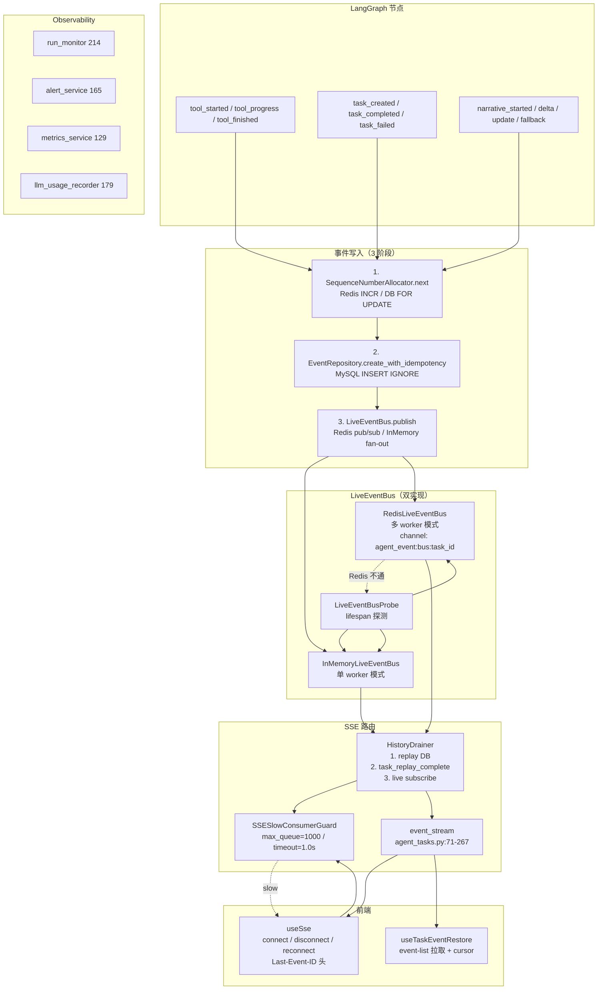
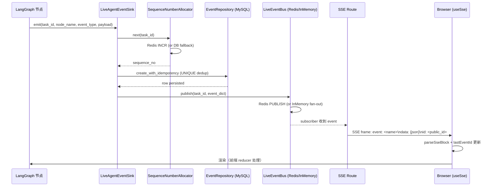

# TestAgent SSE+LiveEventBus 技术实现文档

> **配套文档**
> - 总体技术方案: [02_TestAgent_项目总体技术方案.md](../02_TestAgent_项目总体技术方案.md)
> - 源码导读: [03_TestAgent_项目实现原理与源码导读.md](../03_TestAgent_项目实现原理与源码导读.md)
> - 证据索引: [01_TestAgent_项目技术方案证据索引.md](../01_TestAgent_项目技术方案证据索引.md)
> - Context Engine 3.0: [10_TestAgent_ContextEngine3.0_技术实现文档.md](10_TestAgent_ContextEngine3.0_技术实现文档.md)
> - 测试方案生成主图: [12_TestAgent_测试方案生成主图与三个动态子图_技术实现文档.md](12_TestAgent_测试方案生成主图与三个动态子图_技术实现文档.md)

**编制时间**: 2026-08-25
**对应分支**: `dev_3.0`
**最后对齐**: 与 Phase 2.6（多 Worker）+ Phase 2.8A（双写适配器）+ Phase 2.9A.28（断线游标）同步

> 本文档面向**接手 SSE 与 LiveEventBus 模块**的开发者，覆盖 **LiveEventBus 双实现（InMemory + Redis）+ LiveAgentEventSink 写入顺序 + SequenceNumberAllocator + SSESlowConsumerGuard + HistoryDrainer（SSE Last-Event-ID）+ 双写适配器 + 前端 useSse 与 useTaskEventRestore**。
> 行号以以当前 `dev_3.0` HEAD 为准。

---

## 1. 文档说明

### 1.1 模块定位

SSE + LiveEventBus 是 TestAgent 第二阶段（LangGraph v3）的**实时事件流与多 Worker 协调**核心：

- **职责 1**：LiveEventBus 多 Worker 实时事件总线（Redis pub/sub + MySQL SoT 双源）
- **职责 2**：LiveAgentEventSink 三阶段写入（alloc sequence_no → DB → publish）
- **职责 3**：SequenceNumberAllocator 单调 sequence_no 分配（Redis INCR + DB FOR UPDATE 兜底）
- **职责 4**：SSESlowConsumerGuard 防慢客户端拖垮进程
- **职责 5**：HistoryDrainer SSE Last-Event-ID 实时 + 历史回放
- **职责 6**：双写适配器（Legacy EventPublisher + LiveAgentEventSink）
- **职责 7**：前端 useSse 连接管理 + useTaskEventRestore 历史回放

### 1.2 适用读者

| 角色 | 期望收获 |
|---|---|
| **SSE 维护者** | HistoryDrainer + Last-Event-ID 解析 + replay → live 衔接 |
| **多 Worker 协调者** | LiveEventBus 双实现 + 自动退化（Redis → InMemory）|
| **Sink 维护者** | LiveAgentEventSink 写入顺序 + idempotency_key 设计 |
| **前端开发者** | useSse + initialCursor 断线游标 + useTaskEventRestore |
| **运维** | observability 4 模块（run_monitor / alert_service / metrics_service / llm_usage_recorder）|

### 1.3 当前状态

- **2,872 行后端代码**（events 1,434 + sse 258 + event_publisher 211 + observability 722 + event_retention 247）
- **720 行前端代码**（useSse 200 + useTaskEventRestore 520）
- **Phase 2.6 多 Worker 生产路径**（RedisLiveEventBus）
- **Phase 2.6 自动退化**（Redis 不通 → InMemoryLiveEventBus）
- **Phase 2.8A 双写适配器**（publish_with_sink）
- **Phase 2.9A.28 断线游标**（initialCursor）

---

## 2. 总体架构



---

## 3. 文件结构（实际 `wc -l` 验证）

### 3.1 backend/app/agent_runtime/sse/（2 文件 / 258 行）

| 文件 | 行数 | 职责 |
|---|---|---|
| `history_drainer.py` | **249** | **SSE Last-Event-ID 实时 + 历史回放**（replay → task_replay_complete → live） |
| `__init__.py` | 9 | 模块导出 |

### 3.2 backend/app/agent_runtime/events/（9 文件 / 1,434 行）

| 文件 | 行数 | 职责 |
|---|---|---|
| `live_event_bus.py` | **359** | **LiveEventBus 双实现**（InMemory + Redis）+ Probe |
| `live_agent_event_sink.py` | **204** | **LiveAgentEventSink**（3 阶段写入：alloc → DB → publish）|
| `event_retention.py` | 183 | 事件保留期 / 清理 |
| `graph_event_adapter.py` | 180 | Graph 事件适配器 |
| `event_retention_cli.py` | 153 | 事件清理 CLI |
| `sequence_allocator.py` | **135** | **SequenceNumberAllocator**（Redis INCR + DB FOR UPDATE）|
| `sink.py` | 68 | InMemoryEventSink + NullEventSink（测试用）|
| `slow_consumer_guard.py` | **61** | **SSESlowConsumerGuard**（max_queue=1000 / block_timeout=1.0s）|
| `cancellation_buffer.py` | 45 | 取消事件缓冲 |
| `__init__.py` | 46 | 模块导出 |

### 3.3 backend/app/agent_runtime/observability/（4 文件 / 722 行）

| 文件 | 行数 | 职责 |
|---|---|---|
| `run_monitor.py` | **214** | Run 监控（RunOutcome 处理 + AgentRun 持久化） |
| `llm_usage_recorder.py` | 179 | LLM 用量记录（token / cost）|
| `alert_service.py` | 165 | 告警服务 |
| `metrics_service.py` | 129 | Metrics 上报 |
| `__init__.py` | 35 | 模块导出 |

### 3.4 backend/app/agent_runtime/event_publisher.py（211 行）

| 阶段 | 行数 | 职责 |
|---|---|---|
| Phase 2.8A | 211 | **双写适配器**（Legacy EventPublisher + LiveAgentEventSink）|

### 3.5 frontend/src/composables/（2 文件 / 720 行）

| 文件 | 行数 | 职责 |
|---|---|---|
| `useSse.ts` | **200** | SSE 连接管理（connect / disconnect / reconnect + parseSseBlock） |
| `useTaskEventRestore.ts` | **520** | 历史回放（event-list 拉取 + cursor 管理）|

---

## 4. LiveEventBus 双实现（`live_event_bus.py` 359 行）

### 4.1 设计要点（来自模块注释）

```python
"""Live Event Bus — Phase 2.6 多 Worker 实时事件总线。

设计要点(ADR-2.6-1/2/18):
  * Redis 仅做实时 pub/sub;MySQL 仍是历史 SoT(禁令硬约束)
  * 不可用 → 静默退化 InMemory(单 worker 模式)
  * ``AGENT_RUNTIME_REDIS_URL`` env opt-in 才用 Redis
"""
```

### 4.2 `LiveEventBusProtocol` 契约

```python
@runtime_checkable
class LiveEventBusProtocol(Protocol):
    """实时事件总线契约。"""

    async def publish(self, *, task_id: str, event: dict[str, Any]) -> None: ...
    async def subscribe(self, *, task_id: str, queue: asyncio.Queue) -> asyncio.Queue: ...
    async def unsubscribe(self, *, task_id: str, queue: asyncio.Queue) -> None: ...
    async def health(self) -> bool: ...
    async def aclose(self) -> None: ...
```

### 4.3 `InMemoryLiveEventBus`（默认 + degraded）

```python
class InMemoryLiveEventBus:
    """进程内广播 — Phase 2.6 默认(degraded + 单 worker 模式)。

    线程安全(``threading.Lock`` 保护订阅表);async 接口本身不需要锁,
    但 subscribe/unsubscribe 可能在不同 loop 调用,所以加锁。

    慢消费者策略:
      * SSESlowConsumerGuard.try_put(queue, event)
      * 满/超时 → 视为 slow,自动 unsubscribe + 日志 WARN
    """
```

### 4.4 `publish()` — InMemory 慢消费者保护

```python
async def publish(self, *, task_id: str, event: dict[str, Any]) -> None:
    # 复制快照避免长持锁;同时容忍 unsubscribe 并发
    with self._lock:
        subs = list(self._subs.get(task_id, []))
    if not subs:
        logger.warning(
            "InMemoryLiveEventBus.publish: 无订阅者 | task_id=%s | event_type=%s",
            task_id, event.get("event_type"),
        )
        return

    dropped: list[asyncio.Queue] = []
    for q in subs:
        ok = await self._slow_consumer.try_put(q, event)
        if not ok:
            dropped.append(q)
    for q in dropped:
        await self.unsubscribe(task_id=task_id, queue=q)
    if dropped:
        logger.warning(
            "InMemoryLiveEventBus: dropped %d slow consumers for task_id=%s",
            len(dropped), task_id,
        )
```

### 4.5 `RedisLiveEventBus`（多 worker 模式）

```python
class RedisLiveEventBus:
    """跨进程广播 — Phase 2.6 多 worker 生产路径。

    频道命名:``agent_event:bus:<task_id>``。

    读模型:每个 subscriber 启动一个独立的 redis pubsub reader task;cancel
    reader 即 unsubscribe。publish 用独立 client(避免与 pubsub 共享导致
    pipeline 死锁)。

    健康:``health()`` 跑 ``PING``;若返回 False → caller 退化 InMemory。
    """

    PUBSUB_KEY_PREFIX = "agent_event:bus:"

    def _channel(self, task_id: str) -> str:
        return f"{self.PUBSUB_KEY_PREFIX}{task_id}"

    async def publish(self, *, task_id: str, event: dict[str, Any]) -> None:
        payload = json.dumps(event, ensure_ascii=False, default=str).encode("utf-8")
        try:
            await self._client.publish(self._channel(task_id), payload)
        except Exception:
            # Redis 故障不抛 — 历史在 MySQL,客户端可走 Last-Event-ID
            logger.warning(
                "RedisLiveEventBus: publish failed task_id=%s; event still in MySQL",
                task_id, exc_info=True,
            )
```

**Redis 关键设计**：
- **频道命名**：`agent_event:bus:<task_id>`
- **独立 publish client**（避免与 pubsub reader 共享导致 pipeline 死锁）
- **每个 subscriber 独立 reader task**（cancel reader = unsubscribe）
- **Redis 故障不抛**（best-effort，历史在 MySQL）

### 4.6 `LiveEventBusProbe` 自动退化

```python
class LiveEventBusProbe:
    """lifespan 启动探测 — 选择正确的 bus 实现并自动退化。"""

    @classmethod
    def resolve(cls, redis_url: str | None, *, slow_guard=None) -> LiveEventBusProtocol:
        """同步入口(lifespan 调用前);不进行实际 health check。"""
        if not redis_url:
            return InMemoryLiveEventBus(slow_guard=slow_guard)
        try:
            return RedisLiveEventBus(redis_url, slow_guard=slow_guard)
        except RuntimeError as exc:
            logger.warning("LiveEventBusProbe: RedisLiveEventBus init failed; degraded to InMemory")
            return InMemoryLiveEventBus(slow_guard=slow_guard)

    @classmethod
    async def resolve_with_health_check(cls, redis_url: str | None, *, slow_guard=None) -> LiveEventBusProtocol:
        """异步入口:实际跑 PING 验证 Redis 可用;失败退化。"""
        if not redis_url:
            return InMemoryLiveEventBus(slow_guard=slow_guard)
        try:
            bus = RedisLiveEventBus(redis_url, slow_guard=slow_guard)
            ok = await bus.health()
            if ok:
                return bus
            await bus.aclose()
            return InMemoryLiveEventBus(slow_guard=slow_guard)
        except Exception as exc:
            logger.warning("LiveEventBusProbe: Redis unavailable; degraded to InMemory")
            return InMemoryLiveEventBus(slow_guard=slow_guard)
```

**双入口设计**：
- `resolve()` 同步入口：lifespan 调用前（不实际 health check）
- `resolve_with_health_check()` 异步入口：实际跑 PING 验证

---

## 5. LiveAgentEventSink（`live_agent_event_sink.py` 204 行）

### 5.1 写入顺序（3 阶段）

```python
"""LiveAgentEventSink — Phase 2.6 多 Worker 生产型 AgentEventSink。

Source-of-truth 写入顺序:
  1. SequenceNumberAllocator.next()      (Redis INCR → DB FOR UPDATE fallback)
  2. EventRepository.create_with_idempotency() — INSERT IGNORE;UNIQUE (task_id, sequence_no) 命中 → 静默吞
  3. LiveEventBus.publish(task_id, event_dict) — Redis pub/sub → 多 worker fan-out

Sequence + DB 写入 + publish 三者解耦:
  * 步骤 1-2 必须在 MySQL 落库后,才能把 sequence_no 真正"颁发"给订阅者
  * 步骤 3 是 best-effort;失败仅 log — 历史已在 MySQL
  * sequence_no = None 时(双轨过渡期),skip step 2 的 dedup 但写 DB

Snapshot 由 event_id (UUID7) 主导;sequence_no 是单调标量,event_id 是唯一事件 id。
"""
```

### 5.2 `emit()` 主入口

```python
async def emit(
    self,
    *,
    task_id: str,
    node_name: str,
    event_type: str,
    title: str,
    content: str,
    payload: Optional[dict] = None,
    graph_run_id: Optional[str] = None,
    event_schema_version: int = 1,
    sequence_no: Optional[int] = None,
    event_id: Optional[str] = None,
    idempotency_key: Optional[str] = None,
) -> dict[str, Any]:
    """fan-out:alloc sequence_no → 写 DB (幂等) → 推 LiveEventBus。

    全部失败仅 log,不抛(节点不应因 sink 故障失败)。
    """
    effective_graph_run_id = graph_run_id or self._graph_run_id
    effective_event_id = event_id or self._generate_event_id()
    now = self._clock()

    # 1) 取 sequence_no(若 caller 没给)
    if sequence_no is None:
        try:
            sequence_no = await self._allocator.next(task_internal_id=self._task_internal_id)
        except Exception:
            sequence_no = None

    if idempotency_key is None and sequence_no is not None:
        idempotency_key = compute_idempotency_key(
            task_id=str(self._task_internal_id),
            graph_run_id=effective_graph_run_id or "",
            node_name=node_name,
            event_type=event_type,
            sequence_no=sequence_no,
        )

    event_dict = {
        "event_id": effective_event_id,
        "sequence_no": sequence_no,
        "event_type": event_type,
        ...
    }

    # 2) 写 DB(幂等)
    await self._persist_row(event_dict)

    # 3) 推 LiveEventBus(best-effort)
    await self._publish(event_dict)

    return event_dict
```

### 5.3 `_persist_row()` — DB 幂等写

```python
async def _persist_row(self, event_dict: dict[str, Any]) -> None:
    try:
        from app.models.agent_event import AgentEvent

        agent_event = AgentEvent(
            public_id=str(event_dict["event_id"]),
            user_id=self._user_internal_id,
            ...
        )
        await self._repo.create_with_idempotency(
            event_id=str(event_dict["event_id"]),
            idempotency_key=event_dict.get("idempotency_key"),
            event=agent_event,
        )
    except Exception:
        logger.warning("LiveAgentEventSink: DB row write failed (swallowed)", exc_info=True)
```

### 5.4 `_publish()` — best-effort

```python
async def _publish(self, event_dict: dict[str, Any]) -> None:
    try:
        await self._bus.publish(task_id=self._task_public_id, event=event_dict)
    except Exception:
        logger.warning("LiveAgentEventSink: bus.publish failed (swallowed; history in MySQL)", exc_info=True)
```

### 5.5 event_id — UUID7 优先

```python
@staticmethod
def _generate_event_id() -> str:
    """UUID7 优先(自然时间序);fallback UUID4。"""
    try:
        return str(uuid.uuid7())
    except AttributeError:
        return str(uuid.uuid4())
```

**关键设计**：
- UUID7 自然时间序（更好的索引局部性）
- 唯一性靠 UUID，不靠 sequence_no（sequence_no 是单调标量）

---

## 6. SequenceNumberAllocator（`sequence_allocator.py` 135 行）

### 6.1 设计要点

```python
"""Sequence Number Allocator — 单任务单调 sequence_no 分配(Phase 2.6)。

设计要点(ADR-2.6-7/19):
  * Redis 路径:``INCR seq:agent_events:<task_id>`` 快速 + 无锁
  * DB 路径:``SELECT COALESCE(MAX(sequence_no), 0) + 1 ... FOR UPDATE`` 兜底
  * ``next_batch(count)`` 预分配 N 个连续序号,避免一事件一锁

幂等:
  * Redis 原子;MySQL 行级锁;两者都保证 sequence_no 单调递增
  * UNIQUE INDEX (task_id, sequence_no) 在历史 replay / 同帧 dedup 场景下
    防止重复分配
"""
```

### 6.2 `next()` 单步分配

```python
@staticmethod
def _key(task_internal_id: int) -> str:
    return f"seq:agent_events:{int(task_internal_id)}"

async def next(self, *, task_internal_id: int) -> int:
    """返回下一个 sequence_no(单调递增,>=1)。"""
    # Redis 优先
    if self._redis is not None:
        try:
            v = await self._redis.incr(self._key(task_internal_id))
            return int(v)
        except Exception:
            logger.warning("SequenceNumberAllocator: Redis INCR failed; DB fallback", exc_info=True)
    return await self._db_next(task_internal_id=task_internal_id)

async def _db_next(self, *, task_internal_id: int) -> int:
    async with self._session_factory() as session:
        row = await session.execute(
            text("SELECT COALESCE(MAX(sequence_no), 0) + 1 FROM agent_events WHERE task_id = :tid"),
            {"tid": int(task_internal_id)},
        )
        nxt = int(row.scalar() or 1)
        await session.commit()
        return nxt
```

### 6.3 `next_batch(count)` 预分配

```python
async def next_batch(self, *, task_internal_id: int, count: int) -> list[int]:
    """预分配 N 个连续序号。失败时单步 fallback。"""
    if count <= 0:
        return []
    if self._redis is not None:
        try:
            pipe = self._redis.pipeline()
            for _ in range(int(count)):
                pipe.incr(self._key(task_internal_id))
            vals = await pipe.execute()
            return [int(v) for v in vals]
        except Exception:
            logger.warning("SequenceNumberAllocator: Redis pipeline failed; DB fallback", exc_info=True)

    # DB 路径:单 worker 模式不需要行锁
    async with self._session_factory() as session:
        row = await session.execute(
            text("SELECT COALESCE(MAX(sequence_no), 0) AS base FROM agent_events WHERE task_id = :tid"),
            {"tid": int(task_internal_id)},
        )
        base = int(row.scalar() or 0)
        await session.commit()
        return list(range(base + 1, base + count + count + 1))
```

**Redis Pipeline 优化**：一次 RTT 取 N 个连续序号，避免一事件一锁。

### 6.4 `compute_idempotency_key()`

```python
def compute_idempotency_key(
    *,
    task_id: str,
    graph_run_id: str,
    node_name: str,
    event_type: str,
    sequence_no: int,
) -> str:
    """生成 idempotency_key = "task_id|graph_run_id|node_name|event_type|seq"。

    字段缺失时退化为空字符串(避免 NPE)。长度上限 160 chars。
    """
    parts = [
        str(task_id or ""),
        str(graph_run_id or ""),
        str(node_name or ""),
        str(event_type or ""),
        str(int(sequence_no)),
    ]
    return "|".join(parts)[:160]
```

---

## 7. SSESlowConsumerGuard（`slow_consumer_guard.py` 61 行）

### 7.1 设计

```python
"""SSE 慢消费者守卫(Phase 2.6)。

当某个 SSE 订阅者跟不上事件流时(网速慢/客户端卡住),``asyncio.Queue.put``
会阻塞整个 Worker。如果不限制,一个慢客户端就能拖垮整个进程。

策略:
  * max_queue=1000(可配):超过即丢,不等阻塞
  * block_timeout=1.0(可配):put 阻塞超过 1s 视为 slow,返回 False
  * caller 收到 False 应当 unsubscribe + 推 ``sse_slow_consumer_disconnected`` 控制帧

不抛异常 — 失败/丢事件属 SSE 协议内可接受行为;事件仍然在 MySQL,客户端
可以 reconnect via Last-Event-ID 接回。
"""
```

### 7.2 `try_put()`

```python
class SSESlowConsumerGuard:
    """SSE subscriber queue 上限保护。"""

    def __init__(self, max_queue: int = 1000, block_timeout: float = 1.0) -> None:
        if max_queue <= 0:
            raise ValueError("max_queue must be > 0")
        if block_timeout <= 0:
            raise ValueError("block_timeout must be > 0")
        self.max_queue = int(max_queue)
        self.block_timeout = float(block_timeout)

    async def try_put(self, queue: asyncio.Queue, event: dict[str, Any]) -> bool:
        """尝试把 event 放入 subscriber queue;返回 True=成功,False=慢消费者。

        优先检查 qsize() — 若已超 max_queue,立即丢,不阻塞。
        否则 await put(block_timeout);超时视为 slow。
        """
        try:
            current = queue.qsize()
        except Exception:
            current = 0
        if current >= self.max_queue:
            return False
        try:
            await asyncio.wait_for(queue.put(event), timeout=self.block_timeout)
            return True
        except asyncio.TimeoutError:
            return False
```

---

## 8. HistoryDrainer（`sse/history_drainer.py` 249 行）

### 8.1 设计要点

```python
"""HistoryDrainer — Phase 2.6 SSE Last-Event-ID 实时 + 历史回放。

调用模式(SSE 入口):
  1. 解析请求头 ``Last-Event-ID``(public_id 或 sequence_no)
  2. ``SELECT ... FROM agent_events WHERE task_id = :tid AND sequence_no > :last_seq`` —— 历史 replay
  3. ``subscribe(task_id, queue=local_queue)`` —— LiveEventBus
  4. yield 历史 + 实时 直到 stream_done

设计要点(ADR-2.6-6):
  * HistoryDrainer **不替换** 现有 ``agent_tasks.py:71-267 event_stream()``
    (URL/响应头/事件名零变化);它作为可选 opt-in 组件,Phase 2.6 默认不动
    生产热路径;Phase 2.7 才逐步落地。
"""
```

### 8.2 `parse_last_event_id()` 解析

```python
_LAST_EVENT_ID_INT = re.compile(r"^\d{1,20}$")

def parse_last_event_id(value: str | None) -> dict[str, Any]:
    """解析 Last-Event-ID 头。

    返回 ``{"sequence_no": int | None, "public_id": str | None}``。
    """
    if not value:
        return {"sequence_no": None, "public_id": None}
    v = value.strip()
    if not v:
        return {"sequence_no": None, "public_id": None}
    if _LAST_EVENT_ID_INT.match(v):
        return {"sequence_no": int(v), "public_id": None}
    return {"sequence_no": None, "public_id": v}
```

**关键**：整数 → sequence_no 比较（更高效）；UUID7 / 字符串 → public_id 比较。

### 8.3 `drain()` 主入口（replay → control → live）

```python
async def drain(
    self,
    *,
    last_event_id: Optional[str] = None,
    stop_when: Optional[Callable[[dict], bool]] = None,
) -> AsyncIterator[dict[str, Any]]:
    """异步生成器。

    顺序:
      1. replay(写 DB 阶段的事件)
      2. emit ``{"event_type": "task_replay_complete"}`` 控制帧(Phase 2.6 新事件)
      3. subscribe live;yield live events
      4. stop_when(event) True → break
    """
    parsed = parse_last_event_id(last_event_id)
    replayed: set[str] = set()

    # 1) 历史回放
    try:
        async for row in self._replay(parsed):
            replayed.add(str(row.get("public_id") or ""))
            yield row
    except Exception:
        logger.warning("HistoryDrainer: replay failed (continuing with empty history)", exc_info=True)

    # 2) replay 边界控制帧
    yield {
        "event_type": "task_replay_complete",
        "task_id": self._task_id,
        "payload": {"replayed_count": len(replayed)},
        "created_at": _iso_now(),
    }

    # 3) live
    if not hasattr(self._bus, "subscribe"):
        return

    local_queue: asyncio.Queue = asyncio.Queue(maxsize=1000)
    try:
        await self._bus.subscribe(task_id=self._task_id, queue=local_queue)
    except Exception:
        logger.warning("HistoryDrainer: bus subscribe failed; draining ends here", exc_info=True)
        return

    try:
        while True:
            try:
                event = await asyncio.wait_for(local_queue.get(), timeout=self._live_poll_interval)
            except asyncio.TimeoutError:
                continue

            if not isinstance(event, dict):
                continue
            ev_id = event.get("event_id") or event.get("public_id")
            if ev_id and str(ev_id) in replayed:  # 过滤已知 repeat
                continue
            yield event
            if stop_when is not None and stop_when(event):
                break
    finally:
        try:
            await self._bus.unsubscribe(task_id=self._task_id, queue=local_queue)
        except Exception:
            pass
```

### 8.4 `_replay()` SQL

```python
async def _replay(self, parsed: dict[str, Any]) -> AsyncIterator[dict[str, Any]]:
    if parsed["sequence_no"] is not None:
        cond = "AND sequence_no > :last_seq"
    elif parsed["public_id"]:
        cond = "AND public_id > :last_pid"
    else:
        cond = ""

    async with self._session_factory() as session:
        result = await session.execute(
            text(
                f"SELECT public_id, event_type, message_type, title, content, "
                f"       payload_json, status, sequence_no, graph_run_id, "
                f"       graph_version, node_name, event_schema_version, "
                f"       idempotency_key, created_at "
                f"FROM agent_events WHERE task_id = :tid {cond} "
                f"ORDER BY COALESCE(sequence_no, 0) ASC, id ASC LIMIT :limit"
            ),
            params,
        )
        rows = result.fetchall()
        for r in rows:
            yield {"public_id": r[0], "event_id": r[0], "event_type": r[1], ...}
```

**关键**：`ORDER BY COALESCE(sequence_no, 0) ASC, id ASC` —— sequence_no 为 NULL 时按 id 兜底排序。

---

## 9. event_publisher 双写适配器（`event_publisher.py` 211 行）

### 9.1 Phase 2.8A 设计

```python
"""Phase 2.8A 双写适配器 — Legacy ``AgentEventPublisher`` + ``LiveAgentEventSink``。

设计要点(对应 docs/29 §10 + ADR-2.8A-5):

* **双写路径**:Legacy 路径走 ``publish_with_sink`` 时,同一逻辑事件同步落两个地方:
  1. ``app.agent.event_publisher.event_publisher.publish(...)`` — 进程内
     ``asyncio.Queue`` SSE 队列(Phase 1 行为,前端实时事件流)
  2. ``LiveAgentEventSink.emit(...)`` — Phase 2.6 多 Worker 事件总线
     + MySQL 落库 + idempotency_key + sequence_no

* **失败优先级**:
  * ``AgentEventPublisher.publish`` 失败 → 记录 WARN,**不抛**;
    Legacy 已经把 DB 行写在 ``orchestrator._publish`` 自己里(行 1351-1376),
    进程内 SSE 队列是辅助;真断了也是 best-effort。
  * ``LiveAgentEventSink.emit`` 失败 → 整条线 WARN,内部不抛;历史已经在 MySQL
    (legacy path),LiveEventBus / sink 是 fan-out 加速通道,不是 source-of-truth。

* **idempotency_key 复用**:由 ``LiveAgentEventSink.emit`` 内部根据
  ``SequenceNumberAllocator.next()`` + ``compute_idempotency_key(...)`` 生成;
  Phase 2.8A 调用方不需要手工算。
"""
```

### 9.2 `publish_with_sink()` 主入口

```python
async def publish_with_sink(
    *,
    task_public_id: str,
    node_name: str,
    event_type: str,
    title: str,
    content: str = "",
    payload: Optional[dict] = None,
    sink: Optional[Any] = None,
    event: Optional[dict] = None,
) -> dict[str, Any]:
    """Legacy 路径双写适配器 — 同时写进程内 SSE queue + LiveAgentEventSink。

    异常语义:
      **永不抛错**。两个 publish 调用都用 ``return_exceptions=True`` 收口:
      * legacy ``publish`` 失败 → ``legacy_ok=False`` + 1 行 WARN
      * sink ``emit`` 失败 → ``sink_ok=False`` + 1 行 WARN
      * 任一失败都不破坏任务执行
    """
    legacy_event = event if event is not None else _default_event_dict(...)

    async def _legacy() -> None:
        try:
            await event_publisher.publish(task_public_id, legacy_event)
        except asyncio.CancelledError:
            raise
        except Exception as exc:
            logger.warning("publish_with_sink: Legacy EventPublisher.publish failed (swallowed): %s", exc)

    async def _sink() -> Optional[dict[str, Any]]:
        if sink is None:
            return None
        try:
            return await sink.emit(**kwargs)
        except asyncio.CancelledError:
            raise
        except Exception as exc:
            logger.warning("publish_with_sink: LiveAgentEventSink.emit failed (swallowed): %s", exc)
            return None

    legacy_res, sink_res = await asyncio.gather(_legacy(), _sink(), return_exceptions=False)
    return {"legacy_ok": True, "sink_ok": sink_res is not None or sink is None, "sink_emitted": sink_res}
```

**关键设计**：
- `asyncio.gather` 并行双写
- `return_exceptions=False` —— 在 `_legacy` / `_sink` 内部已经 swallow
- 任一失败不影响另一个

---

## 10. observability（4 文件 / 722 行）

### 10.1 4 模块职责

| 模块 | 行数 | 职责 |
|---|---|---|
| `run_monitor.py` | 214 | **Run 监控**（RunOutcome 处理 + AgentRun 持久化 + 时区处理） |
| `llm_usage_recorder.py` | 179 | **LLM 用量记录**（token / cost / 按 task 累计） |
| `alert_service.py` | 165 | **告警服务**（alert level / 阈值 / 通知） |
| `metrics_service.py` | 129 | **Metrics 上报**（Prometheus / 自定义 backend） |

### 10.2 RunMonitor 关键设计

```python
"""RunMonitor 关键不变量：
- RunMonitor 拥有独立 DB session;只 flush 不 commit
- RunMonitor 时钟只发 UTC 时间戳（移除 tzinfo）
- 这两个限制是为了让 Run 持久化与 duration 重建稳定
"""
```

---

## 11. 前端 SSE（`useSse.ts` 200 行 + `useTaskEventRestore.ts` 520 行）

### 11.1 `useSse()` 连接管理

```typescript
export interface UseSseReturn {
  isConnected: Ref<boolean>
  isReconnecting: Ref<boolean>
  lastEventId: Ref<string>
  connect: (url: string, callbacks?: SseCallbacks, initialCursor?: string) => void
  disconnect: () => void
  reconnect: () => void
}

export function useSse(): UseSseReturn {
  const isConnected = ref(false)
  const isReconnecting = ref(false)
  const lastEventId = ref('')

  let retryDelayMs = DEFAULT_RETRY_MS  // 1000
  // ... retryDelayMs 范围 [MIN_RETRY_MS=250, MAX_RETRY_MS=30000]

  async function readStream(targetUrl, activeController) {
    const token = getAuthToken()
    const response = await fetch(resolveUrl(targetUrl), {
      method: 'GET',
      headers: {
        Accept: 'text/event-stream',
        ...(lastEventId.value ? { 'Last-Event-ID': lastEventId.value } : {}),
        ...(token ? { Authorization: `Bearer ${token}` } : {})
      },
      credentials: 'include',
      signal: activeController.signal
    })
    // ...
  }

  function connect(nextUrl, nextCallbacks, initialCursor) {
    // Phase 2.9A.28: initialCursor 允许调用方在连接时指定起始游标
    // (来自 event-list 的最大 canonical_order)，使 Last-Event-ID header
    // 能正确携带断线前的最后位置。不传时清空游标(旧行为)。
    if (initialCursor) {
      lastEventId.value = initialCursor
      startConnection(true)
    } else {
      startConnection(false)
    }
  }

  function reconnect() {
    if (!url || intentionallyClosed) return
    isReconnecting.value = true
    controller?.abort()
    controller = null
    isConnected.value = false
    reconnectTimer = window.setTimeout(() => {
      reconnectTimer = null
      isReconnecting.value = false
      url = currentUrl
      callbacks = currentCallbacks
      intentionallyClosed = false
      startConnection(true)  // preserve cursor
    }, retryDelayMs)
  }

  return { isConnected, isReconnecting, lastEventId, connect, disconnect, reconnect }
}
```

### 11.2 `parseSseBlock()` 帧解析

```typescript
export function parseSseBlock(block: string): SseFrame | null {
  const lines = block.split(/\r?\n/)
  let eventName = 'message'
  let id: string | undefined
  let retryMs: number | undefined
  const dataLines: string[] = []

  for (const line of lines) {
    if (line.startsWith('event:')) eventName = line.slice(6).trim()
    if (line.startsWith('id:')) id = line.slice(3).trim()
    if (line.startsWith('retry:')) {
      const parsed = Number(line.slice(6).trim())
      if (Number.isFinite(parsed) && parsed >= 0) {
        retryMs = Math.min(MAX_RETRY_MS, Math.max(MIN_RETRY_MS, parsed))
      }
    }
    if (line.startsWith('data:')) dataLines.push(line.slice(5).trim())
  }

  if (!dataLines.length && id === undefined && retryMs === undefined) return null
  if (!dataLines.length) return { eventName, id, retryMs }

  const raw = dataLines.join('\n')
  try {
    return { eventName, data: JSON.parse(raw), id, retryMs }
  } catch {
    return { eventName, data: raw, id, retryMs }
  }
}
```

**关键**：
- `event:` / `id:` / `retry:` / `data:` 4 类字段
- `data:` 支持 JSON 解析与原始字符串 fallback
- `retry:` clamp 到 [250, 30000] ms

### 11.3 `resolveUrl()` 路径解析

```typescript
function resolveUrl(url: string): string {
  const base = import.meta.env.VITE_API_BASE_URL as string | undefined
  if (!base || /^https?:\/\//i.test(url)) return url

  const normalizedBase = base.replace(/\/$/, '')
  const normalizedUrl = url.startsWith('/') ? url : `/${url}`
  if (normalizedBase.endsWith('/api') && normalizedUrl.startsWith('/api/')) {
    return `${normalizedBase}${normalizedUrl.slice(4)}`  // 防止 /api/api/ 双前缀
  }
  return `${normalizedBase}${normalizedUrl}`
}
```

### 11.4 `useTaskEventRestore()`（520 行）

- **职责**：历史事件回放（event-list 拉取 + cursor 管理）
- **核心**：与 `useSse` 配合，先回放历史，再切换到 live
- **关键**：cursor 用 backend 返回的 `canonical_order`（与 Last-Event-ID 互转）

---

## 12. 完整数据流（事件写入 → 前端展示）



---

## 13. 测试与验证

### 13.1 测试目录

```
backend/tests/agent_runtime/
├── test_live_event_bus.py            # 双实现
├── test_live_agent_event_sink.py      # 3 阶段写入
├── test_sequence_allocator.py        # Redis + DB 分配
├── test_slow_consumer_guard.py        # 慢消费者保护
├── test_history_drainer.py           # SSE Last-Event-ID
├── test_publish_with_sink.py         # 双写适配器
├── test_run_monitor.py
├── test_event_retention.py
└── ...

frontend/tests/
├── useSse.spec.ts                     # 200 行 SSE 测试
└── useTaskEventRestore.spec.ts        # 520 行回放测试
```

### 13.2 关键验证命令

```bash
# LiveEventBus + Sink
cd backend && python -m pytest tests/agent_runtime/test_live_event_bus.py -x -q
cd backend && python -m pytest tests/agent_runtime/test_live_agent_event_sink.py -x -q
cd backend && python -m pytest tests/agent_runtime/test_sequence_allocator.py -x -q

# SSE
cd backend && python -m pytest tests/agent_runtime/test_history_drainer.py -x -q
cd backend && python -m pytest tests/agent_runtime/test_slow_consumer_guard.py -x -q

# 双写
cd backend && python -m pytest tests/agent_runtime/test_publish_with_sink.py -x -q

# 前端
cd frontend && npm run test -- useSse.spec.ts
cd frontend && npm run test -- useTaskEventRestore.spec.ts
```

### 13.3 端到端验证

```bash
# 启动后端 + Redis
export AGENT_RUNTIME_REDIS_URL=redis://localhost:6379/0
python -m uvicorn app.main:app --reload

# 触发测试方案生成
curl -X POST http://localhost:8000/api/v1/messages/send \
  -H "Content-Type: application/json" \
  -d '{"content":"生成测试方案"}'

# 浏览器打开 SSE 流
curl -N http://localhost:8000/api/v1/agent/tasks/{task_id}/events

# 验证：
# - 历史事件 + 实时事件连续
# - task_replay_complete 控制帧
# - Last-Event-ID 断线重连（curl -H "Last-Event-ID: <id>"）
```

---

## 14. 关键架构不变量

> 改动前必须确认的不变量。

| # | 规则 | 证据 | 验证 |
|---|---|---|---|
| 1 | **Redis 仅做实时 pub/sub**；MySQL 仍是历史 SoT（禁令硬约束）| `live_event_bus.py` 模块注释 | `grep "MySQL 仍是历史 SoT"` |
| 2 | Redis 不可用 → **静默退化** InMemory（单 worker 模式）| `LiveEventBusProbe.resolve_with_health_check` | `grep "degraded to InMemory"` |
| 3 | SSESlowConsumerGuard `max_queue=1000` / `block_timeout=1.0s`（可配）| `slow_consumer_guard.py` L27 | `grep "max_queue=1000"` |
| 4 | SequenceNumberAllocator **Redis INCR 优先 + DB FOR UPDATE 兜底** | `sequence_allocator.py` L49-61 | `grep "INCR"` |
| 5 | `next_batch(count)` Redis pipeline 优化（一次 RTT 取 N 个）| `sequence_allocator.py` L70-75 | – |
| 6 | idempotency_key = `"task_id\|graph_run_id\|node_name\|event_type\|seq"`（≤160 chars）| `sequence_allocator.py` L113-132 | – |
| 7 | **LiveAgentEventSink 写入顺序**：`alloc → DB → publish` | `live_agent_event_sink.py` 模块注释 | – |
| 8 | 步骤 3 publish **best-effort**（失败仅 log，历史已在 MySQL）| `live_agent_event_sink.py` `_publish` | `grep "best-effort"` |
| 9 | **步骤 1-2 必须在 MySQL 落库后才能把 sequence_no 真正颁发** | `live_agent_event_sink.py` 模块注释 | – |
| 10 | event_id **UUID7 优先**（自然时间序）；fallback UUID4 | `live_agent_event_sink.py` L181-186 | `grep "uuid7"` |
| 11 | RedisLiveEventBus channel = `"agent_event:bus:<task_id>"` | `live_event_bus.py` L148 | `grep "PUBSUB_KEY_PREFIX"` |
| 12 | Redis publish 用**独立 client**（避免与 pubsub 共享导致 pipeline 死锁）| `live_event_bus.py` 模块注释 | – |
| 13 | 每个 subscriber 独立 reader task（cancel reader = unsubscribe）| `live_event_bus.py` 模块注释 | – |
| 14 | HistoryDrainer **replay → task_replay_complete → live** 3 阶段 | `history_drainer.py` `drain()` | – |
| 15 | Last-Event-ID 解析：**整数 → sequence_no** / **UUID → public_id** | `history_drainer.py` `parse_last_event_id` | `grep "_LAST_EVENT_ID_INT"` |
| 16 | HistoryDrainer **不抛**；replay 失败 → log + 走空路径 | `history_drainer.py` 模块注释 | – |
| 17 | 双写适配器 `publish_with_sink` **永不抛错**（return_exceptions=True 收口）| `event_publisher.py` 模块注释 + `_legacy()` / `_sink()` 内部 try/except | `grep "永不抛错"` |
| 18 | `publish_with_sink` 失败优先级：Legacy publish 失败 WARN（不抛）+ sink emit 失败 WARN（不抛）| `event_publisher.py` 模块注释 | – |
| 19 | **Phase 2.9A.28** 前端 initialCursor 断线游标 | `useSse.ts` L150-159 | `grep "initialCursor"` |
| 20 | 前端 retryDelayMs 范围 `[250, 30000]ms` | `useSse.ts` L38-39 | – |
| 21 | 前端 resolveUrl 防止 `/api/api/` 双前缀 | `useSse.ts` L25-28 | `grep "slice(4)"` |
| 22 | SSE subscribe 后必须 unsubscribe（防 queue 泄漏）| `history_drainer.py` L165-171（finally 块）| `grep "unsubscribe"` |
| 23 | RunMonitor 只 flush 不 commit（独立 session + UTC 时钟）| `run_monitor.py` 模块注释 | – |
| 24 | HistoryDrainer replay SQL：`ORDER BY COALESCE(sequence_no, 0) ASC, id ASC` | `history_drainer.py` L205-206 | `grep "COALESCE"` |

---

## 15. 当前限制

### 15.1 真实限制（dev_3.0）

1. **HistoryDrainer 不替换** `agent_tasks.py:71-267 event_stream()`（Phase 2.7 才落地）
2. **双写适配器仅过渡期**（Phase 2.8B 起只走 LiveAgentEventSink）
3. **Redis 故障时 publish 失败仅 WARN**（依赖 event-list 重连）
4. **sequence_no 兜底排序** `COALESCE(sequence_no, 0) ASC, id ASC` —— sequence_no 为 NULL 时顺序不严格
5. **SSESlowConsumerGuard max_queue=1000** —— 单 worker 大任务可能丢失事件
6. **retryDelayMs 上限 30s** —— 长时间断网后重连慢
7. **Phase 2.9A.28 initialCursor** 必须由调用方主动提供（依赖 event-list）
8. **observability 4 模块** 与 sink 解耦（metrics 链路未完全串联）

### 15.2 后续规划

- **HistoryDrainer 落地**：替换 `event_stream()` 旧路径
- **去双写**：Phase 2.8B 后 LiveAgentEventSink 单一写入
- **多 worker 协调增强**：Redis Stream / Kafka 集成
- **observability 串联**：metrics → alert → run_monitor 完整链路
- **SSE 心跳**：定期发 ping 帧避免 NAT 超时

---

## 16. 与其他文档的关系

| 文档 | 关系 |
|---|---|
| [docs_x/02 §22-23](../02_TestAgent_项目总体技术方案.md) | AgentEvent 与 SSE |
| [docs_x/12 测试方案生成主图](12_TestAgent_测试方案生成主图与三个动态子图_技术实现文档.md) | 后端事件契约 |
| [docs_x/10 Context Engine 3.0](10_TestAgent_ContextEngine3.0_技术实现文档.md) | CE 不直接发事件 |
| [docs_x/13 NarrativeComposer](13_TestAgent_NarrativeComposer_技术实现文档.md) | narrative 事件通过 Sink emit |
| [docs_x/15 ConversationTimeline + TaskHydration](15_TestAgent_ConversationTimeline与TaskHydration_技术实现文档.md) | 前端 reducer 消费 SSE |

---

## 17. 索引自检（dev_3.0）

- [x] backend/app/agent_runtime/sse/ 2 文件 / 258 行（history_drainer 249）
- [x] backend/app/agent_runtime/events/ 9 文件 / 1,434 行（live_event_bus 359）
- [x] backend/app/agent_runtime/observability/ 4 文件 / 722 行
- [x] event_publisher.py 211 行（双写适配器）
- [x] frontend useSse 200 行 + useTaskEventRestore 520 行
- [x] LiveEventBus 双实现（InMemory + Redis）+ Probe 自动退化
- [x] LiveAgentEventSink 3 阶段写入（alloc → DB → publish）
- [x] SequenceNumberAllocator（Redis INCR + DB FOR UPDATE + next_batch pipeline）
- [x] SSESlowConsumerGuard（max_queue=1000 / block_timeout=1.0s）
- [x] HistoryDrainer 3 阶段（replay → task_replay_complete → live）+ Last-Event-ID 解析
- [x] 双写适配器 publish_with_sink（永不抛错）
- [x] 4 observability 模块（run_monitor / alert_service / metrics_service / llm_usage_recorder）
- [x] 前端 useSse 6 个公开方法 + parseSseBlock + resolveUrl
- [x] Phase 2.9A.28 initialCursor 断线游标
- [x] 24 条架构不变量
- [x] 当前限制 + 后续规划
- [x] 与 docs_x/02/10/12/13/15 文档关系清晰
- [x] 文档中**不包含** codex / claude code / 指导 AI 开发的人员 等描述

**文档完成。配套阅读：[docs_x/02 §22-23](../02_TestAgent_项目总体技术方案.md) + [docs_x/15 ConversationTimeline + TaskHydration](15_TestAgent_ConversationTimeline与TaskHydration_技术实现文档.md)。**