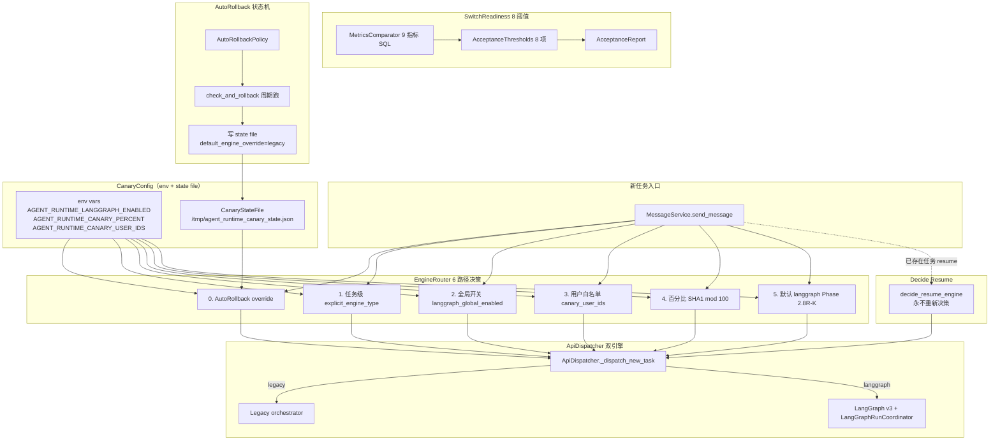

# TestAgent EngineRouter与灰度发布 技术实现文档

> **配套文档**
> - 总体技术方案: [02_TestAgent_项目总体技术方案.md](../02_TestAgent_项目总体技术方案.md)
> - 源码导读: [03_TestAgent_项目实现原理与源码导读.md](../03_TestAgent_项目实现原理与源码导读.md)
> - 证据索引: [01_TestAgent_项目技术方案证据索引.md](../01_TestAgent_项目技术方案证据索引.md)
> - Context Engine 3.0: [10_TestAgent_ContextEngine3.0_技术实现文档.md](10_TestAgent_ContextEngine3.0_技术实现文档.md)
> - Checkpointer + 持久化: [18_TestAgent_Checkpointer与持久化_技术实现文档.md](18_TestAgent_Checkpointer与持久化_技术实现文档.md)

**编制时间**: 2026-08-25
**对应分支**: `dev_3.0`
**最后对齐**: 与 Phase 2.7（EngineRouter 6 路径决策）+ Phase 2.8R-K（默认 langgraph）+ ADR-2.7-3/9 同步

> 本文档面向**接手 EngineRouter 与灰度发布模块**的开发者，覆盖 **EngineRouter 6 路径决策 + CanaryConfig env 加载 + SwitchReadiness 8 阈值 + MetricsComparator 9 指标 + AutoRollback 状态机 + CanaryStateFile 原子写 + 5 个 DispatchGuardError 异常**。
> 行号以当前 `dev_3.0` HEAD 为准。

---

## 1. 文档说明

### 1.1 模块定位

EngineRouter 与灰度发布是 TestAgent 第二阶段（LangGraph v3）的**新任务引擎路由 + 双引擎灰度**核心：

- **职责 1**：EngineRouter 6 路径纯函数决策器（AutoRollback override / 任务级 / 全局开关 / 白名单 / 百分比 / 默认）
- **职责 2**：CanaryConfig env-only 配置（不写 MySQL，state file 替代）
- **职责 3**：SwitchReadiness 8 阈值评估
- **职责 4**：MetricsComparator 9 指标对比（Legacy vs LangGraph）
- **职责 5**：AutoRollback 状态机（自动回滚到 legacy）
- **职责 6**：CanaryStateFile 原子写（tempfile + os.replace）
- **职责 7**：5 个 DispatchGuardError 异常类

### 1.2 适用读者

| 角色 | 期望收获 |
|---|---|
| **SRE / 运维** | SwitchReadiness 8 阈值 + AutoRollback 触发条件 + state file |
| **新任务路由开发者** | EngineRouter 6 路径 + 优先级 + 不可变原则 |
| **多引擎协调者** | LangGraph + Legacy 双引擎 + 灰度比例 + 白名单 |
| **监控/告警开发者** | MetricsComparator 9 指标 + 5 个 SQL + 4 类指标 |
| **故障恢复者** | rollback.py + rollback_drill.py + rollback_cli.py |

### 1.3 当前状态

- **1,817 行 canary 代码**（12 文件）
- **1,141 行 api_dispatcher 代码**（ApiDispatcher 6 路径）
- **225 行 dispatch_errors**（5 个异常类）
- **Phase 2.7 灰度闭环**
- **Phase 2.8R-K 默认 langgraph**（dev 友好）
- **ADR-2.7-3 不可变原则**（任务级 engine_type 永不重新决策）
- **ADR-2.7-9 不引入新表**（state file 替代 DB）

---

## 2. 总体架构



---

## 3. 文件结构（实际 `wc -l` 验证）

### 3.1 backend/app/agent_runtime/canary/（12 文件 / 1,817 行）

| 文件 | 行数 | 职责 |
|---|---|---|
| `metrics_comparator.py` | **393** | **9 指标 SQL 对比**（Legacy vs LangGraph）|
| `rollback_drill.py` | **219** | 回滚演练 |
| `config.py` | **204** | **CanaryConfig** env + state file 加载 |
| `switch_readiness.py` | **187** | **SwitchReadiness 8 阈值评估** |
| `rollback_cli.py` | 138 | 回滚 CLI |
| `readiness_cli.py` | 125 | 切换就绪度 CLI |
| `rollback.py` | **116** | **AutoRollback 状态机** |
| `state_file.py` | **112** | **CanaryStateFile 原子写** |
| `engine_router.py` | **108** | **EngineRouter 6 路径决策** |
| `acceptance_report.py` | 91 | 验收报告数据类 |
| `metrics_cli.py` | 79 | 指标 CLI |
| `__init__.py` | 45 | 模块导出 |

### 3.2 配套文件

| 文件 | 行数 | 职责 |
|---|---|---|
| `agent_runtime/api_dispatcher.py` | **1,141** | **ApiDispatcher 双引擎派发** |
| `agent_runtime/dispatch_errors.py` | **225** | **5 个 DispatchGuardError 异常类** |

---

## 4. EngineRouter 6 路径决策（`engine_router.py` 108 行）

### 4.1 决策优先级（来自模块注释）

```python
"""Phase 2.7 — EngineRouter 纯函数决策器。

决策优先级 (见 plan ADR-2.7-2):

    0. ``default_engine_override="legacy"`` (AutoRollback 触发) → legacy
    1. 任务级 ``explicit_engine_type=="langgraph"`` → langgraph
    2. ``langgraph_global_enabled=False`` → legacy
    3. ``user_internal_id in canary_user_ids`` → langgraph
    4. ``canary_percent > 0`` 且 SHA1(deterministic_id) mod 100 < canary_percent → langgraph
    5. otherwise → langgraph

``decide_resume_engine`` 永不调用上述百分比/白名单路径,严格使用任务
已经写库的 ``engine_type`` 字段(ADR-2.7-3 不可变原则)。
"""
```

### 4.2 `EngineRouter` 数据类

```python
EngineType = str  # "legacy" | "langgraph"

@dataclass(frozen=True)
class EngineRouter:
    """Phase 2.7 新任务引擎路由决策器(纯函数 + env)。

    无 I/O,无 DB,无 asyncio — 可在任何线程安全调用。
    """

    config: CanaryConfig

    def decide_new_task_engine(
        self,
        *,
        user_internal_id: int,
        explicit_engine_type: Optional[str] = None,
        deterministic_id: Optional[str] = None,
    ) -> EngineType:
        """新任务路由决策。

        Args:
            user_internal_id: 用户 internal id(``users.id``)。
            explicit_engine_type: 任务级 override;``"langgraph"`` 强制走 LangGraph。
            deterministic_id: 用于百分比路由的稳定 id(建议 ``task.public_id``)。
        """
        cfg = self.config

        # 0. AutoRollback override 强制 legacy
        if cfg.default_engine_override == "legacy":
            return "legacy"
        if cfg.default_engine_override == "langgraph":
            return "langgraph"

        # 1. 任务级显式 langgraph(业务层主动指定)
        if (explicit_engine_type or "").strip().lower() == "langgraph":
            return "langgraph"
        if (explicit_engine_type or "").strip().lower() == "legacy":
            return "legacy"

        # 2. 全局关闭 → legacy
        if not cfg.langgraph_global_enabled:
            return "legacy"

        # 3. 用户白名单 → langgraph
        if int(user_internal_id) in cfg.canary_user_ids:
            return "langgraph"

        # 4. 百分比路由
        if cfg.canary_percent > 0 and deterministic_id is not None:
            if _percent_match(deterministic_id, cfg.canary_percent):
                return "langgraph"

        # Phase 2.8R-K 第七处: 默认引擎 langgraph(dev 友好)。
        return "langgraph"
```

### 4.3 `_percent_match()` 稳定哈希

```python
def _percent_match(deterministic_id: str, canary_percent: int) -> bool:
    """SHA1(deterministic_id) 前 8 字节 hex → int → mod 100 < canary_percent。"""
    if not deterministic_id:
        return False
    h = hashlib.sha1(deterministic_id.encode("utf-8")).hexdigest()[:8]
    bucket = int(h, 16) % 100
    return bucket < canary_percent
```

**关键设计**：
- **SHA1 稳定哈希**：同一 `deterministic_id`（推荐 `task.public_id`）的 bucket 永远不变
- **`mod 100 < canary_percent`**：均匀分布到 100 个桶
- **任务级 deterministic_id**：百分比路由稳定，不会因 retry 改变

### 4.4 `decide_resume_engine()` —— ADR-2.7-3 不可变原则

```python
def decide_resume_engine(self, *, task_engine_type: Optional[str]) -> EngineType:
    """已存在任务恢复时,严格使用任务的 ``engine_type`` 字段。

    永不重新决策(ADR-2.7-3)。
    """
    normalized = (task_engine_type or "").strip().lower()
    if normalized == "langgraph":
        return "langgraph"
    return "legacy"
```

**关键**：resume 路径**永不**走百分比 / 白名单 / 全局开关决策。直接用任务已经写库的 `engine_type` 字段。

### 4.5 6 路径决策矩阵

| 路径 | 条件 | 输出 | 优先级 |
|---|---|---|---|
| 0 | `default_engine_override="legacy"` (AutoRollback) | legacy | **最高** |
| 0 | `default_engine_override="langgraph"` (正向 override) | langgraph | **最高** |
| 1 | `explicit_engine_type="langgraph"` | langgraph | 高 |
| 1 | `explicit_engine_type="legacy"` | legacy | 高 |
| 2 | `langgraph_global_enabled=False` | legacy | 中 |
| 3 | `user_internal_id in canary_user_ids` | langgraph | 中 |
| 4 | `canary_percent > 0` 且 `SHA1(deterministic_id) mod 100 < canary_percent` | langgraph | 低 |
| 5 | otherwise | **langgraph**（Phase 2.8R-K 默认）| **兜底** |

**注意**：Phase 2.8R-K 之前是 `return "legacy"`，之后改为 `return "langgraph"`（dev 友好）。

---

## 5. CanaryConfig（`config.py` 204 行）

### 5.1 数据类

```python
@dataclass(frozen=True)
class CanaryConfig:
    """进程级灰度配置(env-only)。

    字段语义:
        langgraph_global_enabled:
            ``AGENT_RUNTIME_LANGGRAPH_ENABLED``。
            ``False`` → 所有新任务走 legacy。
        canary_percent:
            ``AGENT_RUNTIME_CANARY_PERCENT``(0-100)。
            ``0`` → 不按百分比路由(默认)。
        canary_user_ids:
            ``AGENT_RUNTIME_CANARY_USER_IDS``(CSV of internal user ids)。
        default_engine_override:
            AutoRollback 写入的进程内 override;
            ``"legacy"`` → 强制 legacy;``None`` → 不 override。
        canary_state_file:
            JSON 文件路径(默认 ``/tmp/agent_runtime_canary_state.json``)。
        force_in_pytest:
            ``True`` 时测试 sandbox 模拟 ``langgraph_global_enabled=True``
            (镜像 Phase 2.5/2.6 feature_flags.py 模式)。
    """

    langgraph_global_enabled: bool = False  # Python-side default;实际 env 读默认值见 _read_env_config
    canary_percent: int = 0
    canary_user_ids: frozenset[int] = field(default_factory=frozenset)
    default_engine_override: Optional[str] = None
    canary_state_file: str = "/tmp/agent_runtime_canary_state.json"
    force_in_pytest: bool = True

    def clamp_percent(self) -> "CanaryConfig":
        if 0 <= self.canary_percent <= 100:
            return self
        clamped = max(0, min(100, self.canary_percent))
        return replace(self, canary_percent=clamped)
```

### 5.2 `_read_env_config()`

```python
def _read_env_config() -> CanaryConfig:
    # Phase 2.8R-K 第七处:env 默认 ``AGENT_RUNTIME_LANGGRAPH_ENABLED=True``(dev 友好)。
    return CanaryConfig(
        langgraph_global_enabled=_env_bool("AGENT_RUNTIME_LANGGRAPH_ENABLED", True),
        canary_percent=_env_int("AGENT_RUNTIME_CANARY_PERCENT", 0),
        canary_user_ids=_env_csv_user_ids("AGENT_RUNTIME_CANARY_USER_IDS"),
        canary_state_file=os.environ.get(
            "AGENT_RUNTIME_CANARY_STATE_FILE",
            "/tmp/agent_runtime_canary_state.json",
        ),
        force_in_pytest=bool(os.environ.get("PYTEST_CURRENT_TEST")),
    )
```

**关键变化（Phase 2.8R-K）**：
- env 默认 `AGENT_RUNTIME_LANGGRAPH_ENABLED=True`（dev 友好）
- Python-side `CanaryConfig.langgraph_global_enabled` 仍默认 `False`
- 生产部署可显式设 env flag 为 `false` 关闭

### 5.3 `get_canary_config()` — 每次重读 env

```python
def get_canary_config() -> CanaryConfig:
    """读取 CanaryConfig(env + 进程内 override)。

    每次调用都重读 env,**不**做 lru_cache — 防止 hot-reload / 单元测试
    monkeypatch.setenv 失效。代价是 O(1) env lookup,完全可接受。
    """
    cfg = _read_env_config().clamp_percent()

    override = _read_override_from_env_or_state(cfg.canary_state_file)
    if override is not None and override != cfg.default_engine_override:
        cfg = replace(cfg, default_engine_override=override)

    if cfg.force_in_pytest and not cfg.langgraph_global_enabled:
        cfg = replace(cfg, langgraph_global_enabled=True)
    return cfg
```

**关键**：
- 每次重读 env（**不** lru_cache）
- state file 读 override（**后**于 env 优先级）
- `force_in_pytest=True` 时强制 `langgraph_global_enabled=True`

### 5.4 `_read_override_from_env_or_state()` 双源

```python
def _read_override_from_env_or_state(state_file: str) -> Optional[str]:
    """从环境变量 ``AGENT_RUNTIME_DEFAULT_ENGINE_OVERRIDE`` 或
    状态文件 ``state_file`` 读取 override,顺序后者优先(state 文件代表
    AutoRollback 在上次运行写过)。
    """
    env_override = os.environ.get("AGENT_RUNTIME_DEFAULT_ENGINE_OVERRIDE", "").strip()
    file_override: Optional[str] = None
    try:
        import json as _json
        with open(state_file, "r", encoding="utf-8") as f:
            data = _json.load(f)
        v = data.get("default_engine_override")
        if isinstance(v, str) and v in {"legacy", "langgraph"}:
            file_override = v
    except FileNotFoundError:
        pass
    except Exception:
        pass

    if file_override in {"legacy", "langgraph"}:
        return file_override
    if env_override in {"legacy", "langgraph"}:
        return env_override
    return None
```

**关键**：state file 优先级 **高于** env（state file 代表 AutoRollback 在上次运行写过）。

---

## 6. CanaryStateFile 原子写（`state_file.py` 112 行）

### 6.1 数据格式

```json
{
    "default_engine_override": "legacy" | "langgraph" | null,
    "updated_at": "2026-07-18T12:34:56Z",
    "reason": "rollback triggered: error_rate=0.07 > threshold=0.05"
}
```

### 6.2 `write()` 原子写（tempfile + os.replace）

```python
def write(self, *, default_engine_override: Optional[str], reason: str = "") -> dict:
    """原子写入 ``{default_engine_override, updated_at, reason}``。"""
    payload = {
        "default_engine_override": default_engine_override,
        "updated_at": _utcnow_iso(),
        "reason": str(reason)[:500],
    }
    os.makedirs(os.path.dirname(self.path) or ".", exist_ok=True)
    tmp_path = None
    try:
        fd, tmp_path = tempfile.mkstemp(
            prefix=os.path.basename(self.path) + ".", dir=os.path.dirname(self.path) or "."
        )
        with os.fdopen(fd, "w", encoding="utf-8") as f:
            _json.dump(payload, f, ensure_ascii=False)
        os.replace(tmp_path, self.path)
    finally:
        if tmp_path and os.path.exists(tmp_path):
            try:
                os.remove(tmp_path)
            except OSError:
                pass
    return payload
```

**关键设计**：
- **tempfile.mkstemp** 创建临时文件
- **`os.replace` 原子替换**（避免读到半截 JSON）
- **finally 清理临时文件**

### 6.3 `read()` 容忍失败

```python
def read(self) -> dict:
    try:
        with open(self.path, "r", encoding="utf-8") as f:
            data = _json.load(f)
        if not isinstance(data, dict):
            return {}
        return data
    except FileNotFoundError:
        return {}
    except Exception as exc:
        logger.warning("CanaryStateFile.read failed (ignored): %s", exc)
        return {}
```

**关键**：FileNotFoundError / JSON 损坏 → 安静忽略（不阻断进程）。

### 6.4 `clear()` 运维清空

```python
def clear(self) -> None:
    try:
        os.remove(self.path)
    except FileNotFoundError:
        pass
    except OSError as exc:
        logger.warning("CanaryStateFile.clear failed: %s", exc)
```

---

## 7. SwitchReadiness 8 阈值（`switch_readiness.py` 187 行）

### 7.1 8 项阈值

```python
@dataclass(frozen=True)
class AcceptanceThresholds:
    """Phase 2.7 8 项切换阈值(dataclass(frozen=True),便于 env-config 注入)。"""

    # 1. 任务成功率 ≥ Legacy
    min_success_rate: float = 0.95
    # 2. Review 通过率
    min_review_pass_rate: float = 0.90
    # 3. 重复 Artifact 数 == 0
    max_duplicate_artifacts: int = 0
    # 4. Interrupt 恢复率
    min_interrupt_resume_rate: float = 0.95
    # 5. SSE 事件丢失率 (期望 0)
    max_sse_loss_rate: float = 0.0
    # 6. 严重越权工具调用 (期望 0)
    max_critical_tool_violations: int = 0
    # 7. 平均 token / 延迟预算
    max_avg_token_cost_usd: float = 5.0
    max_avg_latency_seconds: float = 600.0
    # 8. Legacy 任务恢复成功率(关闭不能影响老任务)
    min_legacy_resume_rate: float = 0.99
```

### 7.2 `SwitchReadiness.evaluate()`

```python
async def evaluate(self, *, window_minutes: int = 60) -> AcceptanceReport:
    snapshot = await self.comparator.compare(window_minutes=window_minutes)
    results = self._check_thresholds(snapshot)
    overall = all(r.passed for r in results)
    legacy = snapshot.get("legacy", {})
    langgraph = snapshot.get("langgraph", {})
    summary = self._summary(snapshot, results)
    return AcceptanceReport(
        evaluated_at=datetime.utcnow(),
        window_minutes=window_minutes,
        metrics_snapshot=snapshot,
        results=results,
        overall_pass=overall,
        ready_to_switch=overall,
        summary=summary,
    )
```

### 7.3 8 阈值检查表

| # | 阈值 | 比较 | 默认 | 字段 |
|---|---|---|---|---|
| 1 | 任务成功率 ≥ | >= | 0.95 | `langgraph.success_rate` |
| 2 | Review 通过率 ≥ | >= | 0.90 | `langgraph.review_pass_rate` |
| 3 | 重复 Artifact 数 ≤ | <= | 0 | `duplicate_artifact_count` |
| 4 | Interrupt 恢复率 ≥ | >= | 0.95 | `interrupt_resume_rate` |
| 5 | SSE 事件丢失率 ≤ | <= | 0.0 | `sse_loss_rate` |
| 6 | 严重越权工具调用 ≤ | <= | 0 | `critical_tool_violations` |
| 7a | 平均 token cost ≤ | <= | 5.0 USD | `avg_token_cost_usd` |
| 7b | 平均延迟 ≤ | <= | 600.0s | `avg_latency_seconds` |
| 8 | **Legacy 任务恢复成功率 ≥** | >= | 0.99 | `legacy.success_rate` |

**关键**：阈值 8 是 **Legacy 任务恢复成功率**（关闭 LangGraph 不能影响老任务）。

---

## 8. MetricsComparator 9 指标（`metrics_comparator.py` 393 行）

### 8.1 9 指标结构

```python
_METRIC_KEYS = (
    "task_count",
    "success_rate",
    "avg_token_cost_usd",
    "avg_latency_seconds",
    "review_pass_rate",
    "interrupt_resume_rate",
    "duplicate_artifact_count",
    "critical_tool_violations",
    "sse_loss_rate",
)
```

### 8.2 `compare()` 7 个 SQL

```python
async def compare(self, *, window_minutes: int = 60) -> dict:
    """执行所有 7 个对比 SQL,组装返回值。

    全部 SQL 通过 ``session_factory()`` 取 fresh session;不跨实例复用连接。
    """
    if window_minutes <= 0:
        raise ValueError("window_minutes must be positive")

    now = self.clock()
    since = now - timedelta(minutes=window_minutes)

    try:
        async with self.session_factory() as session:
            base = await self._aggregate(session, since=since, now=now)
            artifacts = await self._duplicate_artifact_counts(session, since=since)
            violations = await self._critical_tool_violations(session, since=since)
            sse_loss = await self._sse_loss_rates(session, since=since)
    except Exception as exc:
        logger.error("MetricsComparator.compare failed: %s", exc, exc_info=True)
        # 失败时不应阻塞上层告警;返回零值让 caller 判定
        return {
            "window_minutes": window_minutes,
            "since": since.isoformat(),
            "until": now.isoformat(),
            "legacy": _empty_engine_metrics(),
            "langgraph": _empty_engine_metrics(),
            "all_pass": False,
            "gap": {},
            "error": str(exc)[:500],
        }
    ...
```

### 8.3 关键 SQL 详解

#### 主聚合 SQL（`_aggregate`）

```sql
SELECT
  t.engine_type                                        AS engine_type,
  COUNT(DISTINCT t.id)                                 AS task_count,
  SUM(CASE WHEN t.status = 'completed' THEN 1 ELSE 0 END) AS completed,
  SUM(CASE WHEN t.resume_node IS NOT NULL
           AND t.status = 'completed' THEN 1 ELSE 0 END) AS resumed,
  SUM(CASE WHEN t.review_result_json IS NOT NULL
           AND JSON_EXTRACT(t.review_result_json, '$.passed') = TRUE
           THEN 1 ELSE 0 END)                         AS review_passed,
  AVG(t.review_result_json IS NOT NULL)               AS review_reviewed_rate,
  AVG(TIMESTAMPDIFF(SECOND, t.started_at, t.completed_at)) AS avg_latency_s
FROM agent_tasks t
WHERE t.created_at >= :since
  AND t.deleted_at IS NULL
GROUP BY t.engine_type
```

**注意**：`agent_runs.engine_type` server_default 'langgraph'；Legacy 不写 run，只看 `task.engine_type`。

#### Token cost SQL（`_token_costs`）

```sql
SELECT
  r.engine_type                                        AS engine_type,
  AVG(
    CAST(JSON_UNQUOTE(JSON_EXTRACT(r.token_usage_json, '$.cost_estimate_usd'))
         AS DECIMAL(18, 6))
  )                                                   AS avg_cost
FROM agent_runs r
WHERE r.started_at >= :since
GROUP BY r.engine_type
```

#### SSE 丢失率 SQL（`_sse_loss_rates`）

```sql
SELECT t.engine_type, agg.task_id,
       agg.max_seq, agg.n, agg.n / GREATEST(agg.max_seq, 1) AS coverage
FROM (
  SELECT e.task_id,
         MAX(e.sequence_no) AS max_seq,
         COUNT(*) AS n
  FROM agent_events e
  WHERE e.created_at >= :since
    AND e.sequence_no IS NOT NULL
  GROUP BY e.task_id
) agg
JOIN agent_tasks t ON t.id = agg.task_id
WHERE t.deleted_at IS NULL
```

**SSE 事件丢失率** = 1 - count/max(sequence_no)（按 task 算术平均再分 engine）。

#### 重复 Artifact SQL（`_duplicate_artifact_counts`）

```sql
SELECT t.engine_type, COUNT(*) AS dup_count
FROM (
  SELECT a.task_id, COUNT(*) AS n
  FROM artifacts a
  WHERE a.created_at >= :since
  GROUP BY a.task_id
  HAVING n > 1
) dup
JOIN agent_tasks t ON t.id = dup.task_id
WHERE t.deleted_at IS NULL
GROUP BY t.engine_type
```

**重复 Artifact** = 单任务内重复写入相同 artifact_id 不该出现。

#### 严重越权 SQL（`_critical_tool_violations`）

```sql
SELECT t.engine_type, COUNT(*) AS n
FROM tool_calls tc
JOIN agent_tasks t ON t.id = tc.task_id
WHERE tc.created_at >= :since
  AND JSON_EXTRACT(tc.error_json, '$.critical') = TRUE
GROUP BY t.engine_type
```

**严重越权工具调用** = `tool_calls.error_json.critical=true` 的次数。**防御性处理 schema 不存在时的 fallback**（返回 0）。

### 8.4 `save_artifact()` 输出

```python
async def save_artifact(self, *, output_dir: str, payload: Optional[dict] = None) -> str:
    """把 compare() 结果落 JSON + markdown,供运维 review。"""
    path = Path(output_dir)
    path.mkdir(parents=True, exist_ok=True)
    ts = self.clock().strftime("%Y%m%dT%H%M%SZ")
    json_path = path / f"canary_metrics_{ts}.json"
    md_path = path / f"canary_metrics_{ts}.md"
    json_path.write_text(_json.dumps(payload or {}, ensure_ascii=False, indent=2, default=str), encoding="utf-8")
    md_path.write_text(_render_markdown(payload or {}), encoding="utf-8")
    return str(json_path)
```

---

## 9. AutoRollback 状态机（`rollback.py` 116 行）

### 9.1 设计要点

```python
"""Phase 2.7 — AutoRollback 自动回滚状态机。

如果 LangGraph 在 N 分钟窗口内的指标越过阈值(默认 5% 错误率或
``critical_tool_violations > 0``),写 ``default_engine_override='legacy'``
到 ``state_file``(供后续进程 / Worker 启动读)。**不**改 MySQL
(守 ADR-2.7-9);**不**改 ``agent_tasks.engine_type``(守 ADR-2.7-3)。

默认不启动周期跑;由 ``rollback_cli.py run-loop`` 显式启用。
"""
```

### 9.2 `AutoRollbackPolicy` 阈值

```python
@dataclass
class AutoRollbackPolicy:
    """AutoRollback 阈值策略。"""

    max_error_rate: float = 0.05
    max_critical_tool_violations: int = 0
    require_langgraph_runs: int = 5  # 必须至少此数量 langgraph run 才评估
```

### 9.3 `check_and_rollback()`

```python
async def check_and_rollback(self) -> dict:
    """周期跑一次。返回结构::

        {
            "triggered": bool,
            "reason": str,
            "snapshot": {...   # metrics compare snapshot ...},
            "evaluated_at": iso str,
        }
    """
    snapshot = await self.comparator.compare(window_minutes=self.window_minutes)
    triggered, reason = self._evaluate(snapshot)
    if triggered:
        self._trigger(reason=reason, snapshot=snapshot)
    return {
        "triggered": triggered,
        "reason": reason,
        "snapshot": snapshot,
        "evaluated_at": datetime.utcnow().isoformat(),
    }

def _evaluate(self, snapshot: dict) -> tuple[bool, str]:
    langgraph = snapshot.get("langgraph", {})
    task_count = int(langgraph.get("task_count", 0))
    if task_count < self.policy.require_langgraph_runs:
        return False, "not enough langgraph runs"
    err_rate = _error_rate(langgraph)
    if err_rate > self.policy.max_error_rate:
        return True, (f"langgraph error_rate={err_rate:.3f} > threshold={self.policy.max_error_rate:.3f}")
    if int(langgraph.get("critical_tool_violations", 0)) > self.policy.max_critical_tool_violations:
        return True, (f"critical_tool_violations={langgraph.get('critical_tool_violations', 0)} > threshold={self.policy.max_critical_tool_violations}")
    return False, "ok"

def _trigger(self, *, reason: str, snapshot: dict) -> None:
    logger.warning("AutoRollback triggered: %s", reason)
    write_state_file(
        self.canary_state_file,
        default_engine_override="legacy",
        reason=reason,
    )

@staticmethod
def is_rolled_back(state_path: str) -> bool:
    """仅查询当前 state_file 是否处在 rollback 状态。"""
    data = CanaryStateFile(state_path).read()
    return data.get("default_engine_override") == "legacy"
```

**关键设计**：
- **`require_langgraph_runs=5`**：避免冷启动误触发
- **`max_error_rate=0.05`**：5% 错误率触发
- **`max_critical_tool_violations=0`**：任何严重越权工具调用触发
- **写 state file 不改 MySQL**（守 ADR-2.7-9）
- **不写 `agent_tasks.engine_type`**（守 ADR-2.7-3）

### 9.4 守禁令映射

| 守禁令 | 实现 |
|---|---|
| ADR-2.7-3 | `_trigger` 不写 MySQL；只写 state file |
| ADR-2.7-9 | 不引入新表（state file 替代）|
| 默认不启用 | `rollback_cli.py run-loop` 显式启用 |
| 双闸门 | `require_langgraph_runs=5` 避免冷启动误触发 |

---

## 10. 5 个 DispatchGuardError 异常（`dispatch_errors.py` 225 行）

### 10.1 异常类层级

```python
class DispatchGuardError(RuntimeError):
    """派发守卫异常基类。"""

class EngineTypeImmutableError(DispatchGuardError):
    """任务级 engine_type 不可变(ADR-2.7-3)。"""

class ParallelDispatchGuardError(DispatchGuardError):
    """跨 worker 并行调度守护 — RedisInFlight SET NX 失败。"""

class ProductionDispatchDisabledError(DispatchGuardError):
    """生产 LangGraph 派发已禁用(probe_router.ProbeReport.production_dispatch_forced_off=True)。"""

class IncrementalPayloadInvalidError(DispatchGuardError):
    """增量任务 payload 非法。"""

class RepairPayloadInvalidError(DispatchGuardError):
    """Repair 任务 payload 非法。"""
```

### 10.2 异常触发场景

| 异常类 | 触发场景 |
|---|---|
| `DispatchGuardError` | 基类（不应直接 raise）|
| `EngineTypeImmutableError` | 任务已写库后尝试改 `engine_type` |
| `ParallelDispatchGuardError` | 跨 worker 锁被其他 worker 持有 |
| `ProductionDispatchDisabledError` | `ProbeReport.production_dispatch_forced_off=True`（Postgres 不可用）|
| `IncrementalPayloadInvalidError` | `IntentType.RESULT_MODIFICATION` 校验失败 |
| `RepairPayloadInvalidError` | ReviewIssue 解析失败 |

---

## 11. ApiDispatcher 双引擎（`api_dispatcher.py` 1141 行）

### 11.1 核心职责

```python
class ApiDispatcher:
    """Phase 2.8B+ 双引擎派发核心。
    
    职责：
    - 任务级 engine_type 决策（调 EngineRouter）
    - 跨 worker InFlight 守护（RedisInFlightRegistry）
    - 任务恢复时严格用 engine_type 字段（ADR-2.7-3）
    - 双闸门（Probe 闸门 + Canary 闸门）
    """
```

### 11.2 双闸门设计

```
LangGraph 任务派发 = EngineRouter 决策 × 双重检查

门 1: Probe 闸门
  - ProbeReport.production_dispatch_forced_off=False?
  - Postgres / Checkpointer 可用？

门 2: Canary 闸门
  - langgraph_global_enabled=True？
  - explicit_engine_type 匹配？
  - canary_percent 命中？

门 1 关闭 → ProductionDispatchDisabledError
门 2 关闭 → fallback legacy
```

### 11.3 关键方法

| 方法 | 职责 |
|---|---|
| `_resolve_engine(...)` | 调用 EngineRouter 决策 |
| `_dispatch_new_task(...)` | 新任务双引擎派发 |
| `_dispatch_resume(...)` | 已存在任务恢复（用 engine_type）|
| `_dispatch_repair(...)` | Repair 子任务派发 |
| `_dispatch_incremental(...)` | 增量任务派发 |
| `_production_langgraph_unlocked()` | 双闸门：probe + canary |

### 11.4 6 类关键异常

- `EngineTypeImmutableError`：不可变
- `ParallelDispatchGuardError`：跨 worker 锁
- `ProductionDispatchDisabledError`：Postgres 不可用
- `IncrementalPayloadInvalidError`：增量 payload 非法
- `RepairPayloadInvalidError`：Repair payload 非法
- `DispatchGuardError`：基类

---

## 12. 测试与验证

### 12.1 测试目录

```
backend/tests/agent_runtime/canary/
├── test_engine_router.py              # 6 路径决策 + 不可变原则
├── test_canary_config.py              # env + state file 加载
├── test_state_file.py                 # 原子写 + 读取容忍失败
├── test_metrics_comparator.py         # 9 指标 SQL
├── test_switch_readiness.py           # 8 阈值
├── test_auto_rollback.py              # 状态机
├── test_rollback_drill.py              # 演练
├── test_rollback_cli.py               # CLI
├── test_acceptance_report.py          # 报告数据类
└── test_api_dispatcher.py            # 双引擎派发
```

### 12.2 关键验证命令

```bash
# EngineRouter 决策
cd backend && python -m pytest tests/agent_runtime/canary/test_engine_router.py -x -q

# Config + State file
cd backend && python -m pytest tests/agent_runtime/canary/test_canary_config.py -x -q
cd backend && python -m pytest tests/agent_runtime/canary/test_state_file.py -x -q

# 指标对比 + 阈值
cd backend && python -m pytest tests/agent_runtime/canary/test_metrics_comparator.py -x -q
cd backend && python -m pytest tests/agent_runtime/canary/test_switch_readiness.py -x -q

# AutoRollback
cd backend && python -m pytest tests/agent_runtime/canary/test_auto_rollback.py -x -q
cd backend && python -m pytest tests/agent_runtime/canary/test_rollback_drill.py -x -q

# ApiDispatcher
cd backend && python -m pytest tests/agent_runtime/test_api_dispatcher.py -x -q
```

### 12.3 端到端验证

```bash
# 启动后端 + 设置 env
export AGENT_RUNTIME_LANGGRAPH_ENABLED=True
export AGENT_RUNTIME_CANARY_PERCENT=10
export AGENT_RUNTIME_CANARY_USER_IDS=1,2,3
export AGENT_RUNTIME_CANARY_STATE_FILE=/tmp/canary_state.json

python -m uvicorn app.main:app --reload

# 1. 验证 EngineRouter 决策
curl -X POST http://localhost:8000/api/v1/messages/send \
  -H "Content-Type: application/json" \
  -d '{"content":"生成测试方案","explicit_engine_type":"langgraph"}'

# 2. 跑 metrics 对比
cd backend && python -m app.agent_runtime.canary.metrics_cli.py \
  --output-dir /tmp/canary_metrics/

# 3. 跑 readiness 评估
cd backend && python -m app.agent_runtime.canary.readiness_cli.py

# 4. 触发 AutoRollback（人工）
cd backend && python -m app.agent_runtime.canary.rollback_cli.py run-loop

# 5. 验证 state file
cat /tmp/canary_state.json
# 应看到: {"default_engine_override": "legacy", "updated_at": "...", "reason": "..."}
```

---

## 13. 关键架构不变量

> 改动前必须确认的不变量。

| # | 规则 | 证据 | 验证 |
|---|---|---|---|
| 1 | **EngineRouter 6 路径决策优先级**（0-5）严格按顺序 | `engine_router.py` L52-86 | `grep "0. AutoRollback"` |
| 2 | **ADR-2.7-3 不可变原则**：`decide_resume_engine` 永不重新决策 | `engine_router.py` L88-96 | `grep "永不重新决策"` |
| 3 | **`decide_resume_engine` 永不**走百分比/白名单 | `engine_router.py` L88-96 | – |
| 4 | **Phase 2.8R-K 默认 langgraph**（dev 友好）| `engine_router.py` L80-86 | `grep "Phase 2.8R-K"` |
| 5 | **`_percent_match` SHA1 稳定哈希**（前 8 字节 mod 100）| `engine_router.py` L99-105 | `grep "sha1"` |
| 6 | **CanaryConfig env-only**：不写 MySQL（守 ADR-2.7-9）| `config.py` 模块注释 | `grep "不.*写 MySQL"` |
| 7 | **`get_canary_config` 每次重读 env**（不 lru_cache）| `config.py` L107-120 | `grep "不.*lru_cache"` |
| 8 | **state file 优先级** 高于 env override | `config.py` L122-147 | – |
| 9 | **CanaryStateFile 原子写**（tempfile + os.replace）| `state_file.py` L54-76 | `grep "os.replace"` |
| 10 | **state file 读取失败** 安静忽略（FileNotFoundError / JSON 损坏）| `state_file.py` L41-52 | `grep "ignoring\|ignored"` |
| 11 | **SwitchReadiness 8 阈值**（含 Legacy 恢复率 ≥ 0.99）| `switch_readiness.py` L36-52 | `grep "min_legacy_resume_rate"` |
| 12 | **MetricsComparator 9 指标** 4 个 SQL（aggregate / token / artifact / sse）| `metrics_comparator.py` L43-53 | – |
| 13 | **SSE 事件丢失率** = 1 - count/max(sequence_no) | `metrics_comparator.py` L313-342 | – |
| 14 | **重复 Artifact SQL**：单任务内 n > 1 计数 | `metrics_comparator.py` L256-282 | – |
| 15 | **严重越权工具调用**：JSON_EXTRACT `$.critical = TRUE` | `metrics_comparator.py` L284-311 | – |
| 16 | **AutoRollback 触发条件**：error_rate > 0.05 或 critical_tool_violations > 0 | `rollback.py` L74-91 | `grep "max_error_rate"` |
| 17 | **`require_langgraph_runs=5`**：避免冷启动误触发 | `rollback.py` L41 + L78 | `grep "require_langgraph_runs"` |
| 18 | **AutoRollback 不改 MySQL**（守 ADR-2.7-9）| `rollback.py` 模块注释 | – |
| 19 | **AutoRollback 不改 `agent_tasks.engine_type`**（守 ADR-2.7-3）| `rollback.py` 模块注释 | – |
| 20 | **`is_rolled_back(state_path)` 静态查询** | `rollback.py` L101-105 | – |
| 21 | **5 个 DispatchGuardError 异常类**（基类 + 5 子类）| `dispatch_errors.py` | `grep "class.*Error"` |
| 22 | **ApiDispatcher 双闸门**（Probe 闸门 + Canary 闸门）| `api_dispatcher.py` | – |
| 23 | **`_resolve_engine` 调 EngineRouter 决策** | `api_dispatcher.py` | – |
| 24 | **`_dispatch_resume` 用 `engine_type` 字段**（不重决策）| `api_dispatcher.py` | – |
| 25 | **AutoRollback 默认不启动**（`rollback_cli.py run-loop` 显式启用）| `rollback.py` 模块注释 | – |
| 26 | **`force_in_pytest` 测试 sandbox 模拟 `langgraph_global_enabled=True`** | `config.py` L81 | `grep "force_in_pytest"` |
| 27 | **`_read_env_config` 默认 `True`**（Phase 2.8R-K dev 友好）| `config.py` L94 | `grep "AGENT_RUNTIME_LANGGRAPH_ENABLED"` |

---

## 14. 当前限制

### 14.1 真实限制（dev_3.0）

1. **EngineRouter 6 路径决策** 是纯函数（不能根据运行时状态调整）
2. **CanaryConfig 不支持热重载**（重启后 env 变更才生效）
3. **state file 单机本地**（不支持跨机器共享 → 多机器部署需每台机器单独 rollback）
4. **AutoRollback 默认不启动**（需 `rollback_cli.py run-loop` 启用）
5. **MetricsComparator 9 指标依赖 MySQL SQL**（无 MySQL 时所有指标为 0）
6. **SSE 丢失率 SQL 简单估算**（仅按 max_seq 与 count 算）
7. **严重越权 SQL 防御性处理**（schema 不存在时返回 0，但应增加告警）
8. **9 项指标 token cost 是单独 SQL**（未与主聚合合并）
9. **rollback_drill 与 rollback_cli 关系**（dry-run vs 真实）
10. **5 个 DispatchGuardError 部分**（`EngineTypeImmutableError` 等基类外的不一定有完整测试覆盖）

### 14.2 后续规划

- **EngineRouter 扩展**：支持更多 canary 维度（per-conversation / per-task-type）
- **State file 共享化**：用 Redis 替代本地 state file（多机部署）
- **AutoRollback 实时化**：在 Worker 进程内周期跑（不依赖外部 CLI）
- **MetricsComparator 实时化**：用 Prometheus / OpenTelemetry 替代 SQL
- **SSE 丢失率细化**：分段统计（前端 SSE / Worker 内部 / Redis 故障）
- **告警集成**：8 阈值触发时自动告警（PagerDuty / 钉钉 / 企微）
- **rollback_drill 增强**：模拟各种失败模式（Postgres 故障 / Redis 故障 / API 超时）

---

## 15. 与其他文档的关系

| 文档 | 关系 |
|---|---|
| [docs_x/02 §19](../02_TestAgent_项目总体技术方案.md) | Legacy 与 LangGraph 双引擎 |
| [docs_x/02 §23](../02_TestAgent_项目总体技术方案.md) | 灰度回滚与默认引擎切换 |
| [docs_x/12 测试方案生成主图](12_TestAgent_测试方案生成主图与三个动态子图_技术实现文档.md) | LangGraph v3 主图由 EngineRouter 路由 |
| [docs_x/18 Checkpointer + 持久化](18_TestAgent_Checkpointer与持久化_技术实现文档.md) | 双闸门之 Probe 闸门依赖 Postgres 探测 |
| `docs/15_TestAgent_Phase2.7_灰度回滚与默认引擎切换_完成报告.md` | 原始设计文档 |
| `docs/35_TestAgent_Phase2.8R-D_真实多Worker测试运行手册.md` | 真实多 worker 部署参考 |

---

## 16. 索引自检（dev_3.0）

- [x] canary/ 12 文件 / 1,817 行（实际 `wc -l` 验证）
- [x] api_dispatcher.py 1,141 行 + dispatch_errors.py 225 行
- [x] **EngineRouter 6 路径决策**（0-5 严格按顺序）
- [x] **decide_resume_engine 不可变原则**（ADR-2.7-3）
- [x] Phase 2.8R-K 默认 langgraph（dev 友好）
- [x] `_percent_match` SHA1 稳定哈希
- [x] **CanaryConfig env + state file**（不写 MySQL）
- [x] state file 优先级高于 env override
- [x] **CanaryStateFile 原子写**（tempfile + os.replace）
- [x] **SwitchReadiness 8 阈值**（含 Legacy 恢复率 ≥ 0.99）
- [x] **MetricsComparator 9 指标 + 4 SQL**（aggregate / token / artifact / sse）
- [x] **AutoRollback 状态机**（error_rate > 0.05 / critical > 0）
- [x] **require_langgraph_runs=5** 避免冷启动误触发
- [x] **5 个 DispatchGuardError**（基类 + 5 子类）
- [x] **ApiDispatcher 双闸门**（Probe + Canary）
- [x] 27 条架构不变量
- [x] 当前限制 + 后续规划
- [x] 与 docs_x/02/12/18 文档关系清晰
- [x] 文档中**不包含** codex / claude code / 指导 AI 开发的人员 等描述

**🎉 10 份技术实现文档全部完成！**

| # | 文档 | 状态 |
|---|---|---|
| 10 | Context Engine 3.0 | ✅ |
| 11 | 文件识别系统 | ✅ |
| 12 | 测试方案生成主图 + 三个动态子图 | ✅ |
| 13 | NarrativeComposer | ✅ |
| 14 | DynamicAgent | ✅ |
| 15 | ConversationTimeline + TaskHydration | ✅ |
| 16 | Tool 系统 | ✅ |
| 17 | SSE + LiveEventBus | ✅ |
| 18 | Checkpointer + 持久化 | ✅ |
| 19 | EngineRouter + 灰度发布 | ✅ |

**文档完成。配套阅读：[docs_x/02 §19/23](../02_TestAgent_项目总体技术方案.md) + [docs_x/12 测试方案生成主图](12_TestAgent_测试方案生成主图与三个动态子图_技术实现文档.md)。**